# 享学多线程与高并发

<<<<<<< HEAD
=======
### 1、线程基础、线程之间的共享和协作

 基础概念

 CPU核心数和线程数的关系   

核心数:线程数=1:1  ;使用了超线程技术后---> 1:2

 

 CPU时间片轮转机制   

又称RR调度，会导致上下文切换

 

 什么是进程和线程   

进程：程序运行资源分配的最小单位，进程内部有多个线程，会共享这个进程的资源

线程：CPU调度的最小单位，必须依赖进程而存在。

 

 澄清并行和并发   

并行：同一时刻，可以同时处理事情的能力

并发：与单位时间相关，在单位时间内可以处理事情的能力

 

 高并发编程的意义、好处和注意事项   

好处：充分利用cpu的资源、加快用户响应的时间，程序模块化，异步化

问题：

线程共享资源，存在冲突；

容易导致死锁；

启用太多的线程，就有搞垮机器的可能

#### 认识Java里的线程

 新启线程的方式   

三种

 怎么样才能让Java里的线程安全停止工作呢   

线程自然终止：自然执行完或抛出未处理异常

stop()，resume(),suspend()已不建议使用，stop()会导致线程不会正确释放资源，suspend()容易导致死锁。

java线程是协作式，而非抢占式

调用一个线程的interrupt() 方法中断一个线程，并不是强行关闭这个线程，只是跟这个线程打个招呼，将线程的中断标志位置为true，线程是否中断，由线程本身决定。

isInterrupted() 判定当前线程是否处于中断状态。

static方法interrupted() 判定当前线程是否处于中断状态，同时中断标志位改为false。

方法里如果抛出InterruptedException，线程的中断标志位会被复位成false，如果确实是需要中断线程，要求我们自己在catch语句块里再次调用interrupt()。

##  对Java里的线程再多一点点认识   

 线程常用方法和线程的状态   

线程只有5种状态。整个生命周期就是这几种状态的切换。

run()和start() ：run方法就是普通对象的普通方法，只有调用了start()后，Java才会将线程对象和操作系统中实际的线程进行映射，再来执行run方法。

yield() ：让出cpu的执行权，将线程从运行转到可运行状态，但是下个时间片，该线程依然有可能被再次选中运行。

 线程的优先级   

取值为1~10，缺省为5，但线程的优先级不可靠，不建议作为线程开发时候的手段

 守护线程   

和主线程共死，finally不能保证一定执行

##  线程间的共享   

####  synchronized内置锁   

对象锁，锁的是类的对象实例。

类锁 ，锁的是每个类的的Class对象，每个类的的Class对象在一个虚拟机中只有一个，所以类锁也只有一个。

####  volatile关键字   

适合于只有一个线程写，多个线程读的场景，因为它只能确保可见性。

####  ThreadLocal   

线程变量。可以理解为是个map，类型 Map<Thread,Integer>

##  线程间协作   

轮询：难以保证及时性，资源开销很大，

###  等待和通知   

wait()   对象上的方法

 

notify/notifyAll 对象上的方法

 

 等待和通知的标准范式   

等待方：

1、 获取对象的锁；

2、 循环里判断条件是否满足，不满足调用wait方法，

3、 条件满足执行业务逻辑

通知方来说

1、 获取对象的锁；

2、 改变条件

3、 通知所有等待在对象的线程

 

 

notify和notifyAll应该用谁？

应该尽量使用notifyAll，使用notify因为有可能发生信号丢失的的情况,例如生产者又通知了另一个生产者，然后另一个生产者判断条件不符合，又继续等待，就会使信号丢失了。

 等待超时模式实现一个连接池   

假设 等待时间时长为T，当前时间now+T以后超时

 

long  overtime = now+T;

long remain = T;//等待的持续时间

while(result不满足条件&& remain>0){

​	wait(remain);

​	remain = overtime – now;//等待剩下的持续时间

}

return result;

###  join()方法   

面试点

线程A，执行了线程B的join方法，线程A必须要等待B执行完成了以后，线程A才能继续自己的工作

###  调用    yield()     、    sleep()    、    wait()    、    notify()    等方法对锁有何影响？    

面试点

线程在执行yield()以后，持有的锁是不释放的

sleep()方法被调用以后，持有的锁是不释放的

调动方法之前，必须要持有锁。调用了wait()方法以后，锁就会被释放，当wait方法返回的时候，线程会重新持有锁

调动方法之前，必须要持有锁，调用notify()方法本身不会释放锁的

 

 


### 2.线程的并发工具类

#### Fork/join

- 体现了分治思想，将大任务拆分并把结果合并。子问题互相独立且形式与原问题相同。

- 工作密取，如果某个任务做完了，会帮助其他的做

- 常用类：RecursiveTask,重写compute,有返回值。RecursiveAction没有返回值，这两个都是抽象类，继承与ForkJoinTask()抽象类。

- 流程：

  ```java
  pool = new ForkJoinPool();
  MyTask mytask = new MyTask();
  pool.invoke(mytask);
  Result = mytask.join();
  ```

#### 常用的并发工具类

- CountDownLatch的作用、应用场景和实战

  - 作用：是一个线程等待其他的线程完成工作后再执行，加强版的Join
  - 用法，CountDownLatch初始化时传入一个int参数，作为扣除点，可以代表当前主线程需要等待几个线程完成，扣除点数量大于等于子线程数量。每个其他的子线程完成之后都调用一个countdown()方法，将int参数减一。主线程和业务线程需要调用await方法阻塞。等参数为0时，**主线程和业务线程就会继续执行了。**它的放行由第三者（主线程）决定。
  - 应用场景：需要若干线程去读取文件，只有所有文件都读取好了，再执行业务代码

- CyclicBarrier的作用、应用场景和实战

  - 作用：让一组线程到达一个屏障，被阻塞，直到所有的线程都到达之后，才会把屏障打开，**所有线程才会继续执行。**他们的放行由他们一起共同决定。
  - 应用场景：让若干线程去读取文件，当所有线程都读取好了，这些线程可以再接着执行，也可以指定另一个新的线程做一些汇总。

- CountDownLatch和CyclicBarrier辨析

  CountDownLatch是由第三者决定放行，每次减一，当到达零时就放行了。CyclicBarrier是一组线程自身决定放行，当所有线程都到达时就放行了。

- Semaphore的作用、应用场景和实战，['semə.fɔr]

  - 控制同时访问某个特定资源的线程数量。用在流量控制，各种连接等。
  - 使用：需要传入数量int许可，有获取许可的方法acquire(),tryAcquire(),相当于可用的数量减一，已用的数量加一。还有释放的方法release()。相当于可用的数量加一，已用的数量减一。

- Exchange的作用、应用场景和实战

  - 作用：两个线程间的数据交换。

- Callable和Runnable:Callable可以有返回值并且可以中断，Runnable则不可以。

- Future和FutureTask:作用是在做一项工作时，需要处理另外的比较耗时的子工作，而且在将来会需要子工作的结果。


### 3.原子操作

如何实现原子操作：

- sys基于阻塞的锁机制
- CAS ,指令级保证这是一个原子操作，CAS思路：如果地址V上的值等于期望值A，就给该地址赋值为B,在死循环（自旋）中不断进行CAS操作。


- 更新基本类型：AtomicInteger等；更新数组类型：AtomicIntegerArray等；更新引用类型：AtomicReference等；
- AtomicReference是将整个对象的引用地址改变了，并没有改变对象里的值。
- AtomicMarkableReference和AtomicStampedReference:用来处理ABA问题，加了版本戳。
- CAS和原子操作类都是线程安全的。


volatile保证线程可见性，但是不保证原子性，syn保证了原子性。

锁只有两种，syn关键字和显示锁。

ReentrantLock与Synchronized的区别

1.关键字，一个JUC

2.释放锁方面：Syn异常，同步块执行完毕。lock.unlock

3.灵活性

4.死锁的方案;tryLock

5.公平锁与非公平锁


lock.lock()在挂起等待的时候，如果遇到中断，会等到它被唤醒之后处理，而lock.Interruptibly会出现中断异常。


### 4.显示锁和AQS

syn关键字是内置锁，syn获取锁的时候不能中断，并且没有超时的说法，获取不到会一直等着。

显示锁Lock是一个接口，他的实现类为ReentrantLock

使用锁的基本范式：

```java
lock.lock();
try{
    业务代码
}finally{
    lock.unlock();
}
```

Lock接口和synchronized关键字的比较：

- 如果需求有获取锁可以被中断，可以尝试获取锁，获取锁有超时,读多写少的时候用读写锁。在这几种情况下需要使用显示锁，没有这种需求可以使用syn关键字

可重入锁：例如递归，可以多次获得同一个对象的锁。

公平锁和非公平锁：公平锁就是先到先得，非公平就是利用抢占机制。非公平锁的效率更高。

ReentrantLock和syn都是排他锁，还有读写锁ReadWriteLock,适用于读多写少的情况

Condition接口，用来实现等待通知机制，使用Lock和Condition实现等待通知

```java
private Lock lock = new ReentrantLock();
private Condition keCond = lock.newCondition();
private Condition siteCond = lock.newCondition();
```

每一个condition的signal方法会唤醒该condition的await方法，只会唤醒队列中的第一个，如果使用signalAll就会唤醒等待队列中所有的线程


LockSupport工具类：

作用：

- 阻塞一个线程
- 唤醒一个线程
- 构建同步组件的基础工具

park开头的方法进行阻塞

unpark开头的方法进行唤醒


AQS:  AbstractQueuedSynchronizer，是一个同步工具，1独占，2共享

AQS使用模板设计模式

- 独占式的获取锁模板方法：
  - accquire()
  - acquireInterruptibly()
  - tryAcquireNanos()：加入了超时
- 共享式获取锁：
  - acquireShared
  - acquireSharedInterruptibly
  - tryAcquireSharedNanos
- 独占式释放锁：
  - release()
- 共享式释放锁：
  - releaseShared

需要子类覆盖的流程方法：

- 独占式获取：tryAcquire
- 独占式释放：tryRelease
- 共享式获取：tryAcquireShared
- 共享式释放：tryReleaseShared
- 这个同步器是否属于独占模式：isHeldExclusively

同步状态state

- getState:获取当前的同步状态
- setState:设置同步状态
- compareAndSetState：使用CAS设置状态，保证状态设置的原子性


AQS中node的状态位

- CANCELLED：线程等待超时或被中断，需要从队列中移走
- SIGNAL：后续的节点等待状态，当前节点通知后面的节点去运行
- CONDITION：当前节点处于等待队列
- PROPAGATE：共享，表示状态要往后传播


AQS中的数据结构-节点和同步队列

- 节点是用来保存争夺锁失败的线程，然后把它们放到一个同步（等待）队列中，当锁被释放时，再从同步队列中依次取出线程获得锁。
- 流程：线程获取锁，如果获取成功，就执行并且退出返回了。如果获取不成功，就把它封装成一个节点，放到同步队列的队尾，这个时候是需要CAS设置的。然后进入同步队列之后，就开始自旋，判断前驱节点是不是头结点，如果是就再尝试获取一下锁，获取失败或者前驱不是头结点，线程就判断一下是否需要阻塞，如果前驱节点的state为singa,表示当使用锁的线程释放锁的时候会通知它来运行，那么node就可以进行阻塞了，因为它的前驱节点还在等待中。直到获取成功，然后当前节点设置为头节点。
- 当一个节点放到尾节点的时候，需要用CAS，因为有可能是多个节点同时往尾节点上加，而设置头节点时却不需要，因为每次只有一个。
- condition对应的是等待队列，一个condition对应一个等待队列。而wait和notify中同样维护了一个同步队列，但是它只有一个等待队列。在调用wait进入等待队列的时候，不能确保哪个线程处于该等待队列的头结点，所有唤醒的时候如果只是使用notify唤醒一个头结点，有可能会出现信号丢失，也就是唤醒了错误的线程（该线程唤醒后发现条件不满足，又继续进行等待。）。所以要使用notifyAll把所有线程都唤醒。然后这些线程根据条件判断是否运行还是继续等待。而在condition中只需要使用signal就可以，这是因为挂在某个condition队列中的节点都是满足被
- 唤醒的条件的，所以只需要唤醒一个头节点即可，唤醒多了也没有用。

节点在队列之间的移动：

当节点获取到锁之后，会调用await方法，等待CPU的执行，要把这个节点从双向链表的阻塞队列中移除，放入到condition队列中等待被唤醒。

await和signal都是Condition接口中的方法,AQS中的ConditionObject内部类实现了该接口。await会立即释放锁，signal不会立即释放，会等当前方法运行完。

await方法：

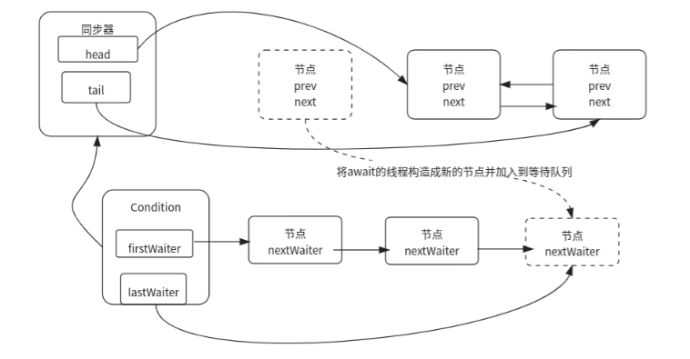

当一个线程获取锁后，调用了await方法，将调用await方法的节点从同步队列中移除，并把它放到等待队列的尾节点。调用await方法，说明当前不满足运行条件，所以要将它放到condition队列中进行等待，当有signal通知它时，说明满足了运行条件，这个时候需要尝试获取锁，如果获取不到，就加到双向队列中等待获取锁。

signal方法：

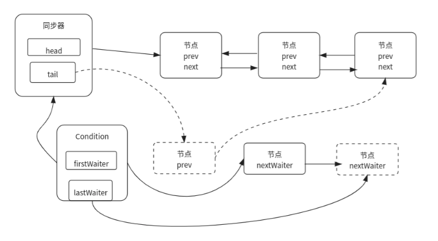

当一个节点被通知时，它会从等待队列中被移出，然后尝试去获取锁，如果获取不到，就会被加入同步队列中等待后续的获取。

ReentrantLock的公平锁的可重入实现原理

```java
 protected final boolean tryAcquire(int acquires) {
            final Thread current = Thread.currentThread();
            int c = getState();
            if (c == 0) {
                if (!hasQueuedPredecessors() &&
                    compareAndSetState(0, acquires)) {
                    setExclusiveOwnerThread(current);
                    return true;
                }
            }
            else if (current == getExclusiveOwnerThread()) {
                int nextc = c + acquires;
                if (nextc < 0)
                    throw new Error("Maximum lock count exceeded");
                setState(nextc);
                return true;
            }
            return false;
        }
```


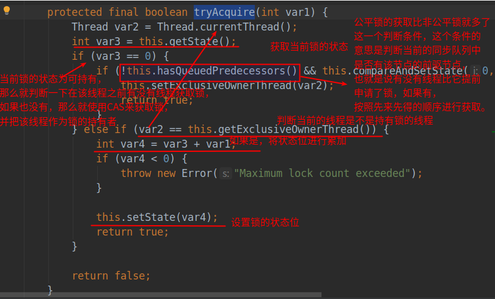

锁的可重入释放锁的实现原理

```java
 protected final boolean tryRelease(int releases) {
            int c = getState() - releases;
            if (Thread.currentThread() != getExclusiveOwnerThread())
                throw new IllegalMonitorStateException();
            boolean free = false;
            if (c == 0) {
                free = true;
                setExclusiveOwnerThread(null);
            }
            setState(c);
            return free;
        }
```


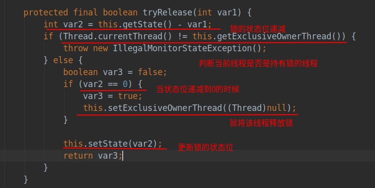

ReentrantReadWriteLock的可重入实现原理：

我们知道，ReentrantReadWriteLock是有两个锁，读锁和写锁，那么如何通过一个标志位state来同时表示读锁和写锁呢，int类型的在计算机中是有32位的，就使用高位的16位表示写锁状态，低16位表示写锁的状态。对于写锁来说，只能被一个线程获取到，写锁的重入也和上面ReentrantLock（重入锁，唯一实现Lock接口的类）的原理一致。但是读锁可以同时被很多个线程获取到，在高16位中可以表示被哪些线程获取了，那么每个线程重入了几次该如何表示呢，那么就需要每个读锁的线程维护一个自己的ThreadLock，在这里面保存每个线程的重入状态。


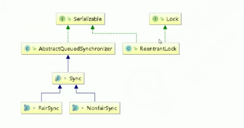


下面的是ReentrantLock的实现部分。


**获取锁的时序图：**

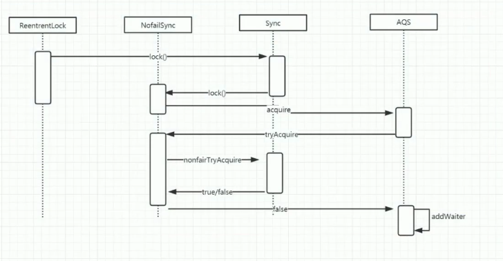

```java
final void lock() {//非公平锁
            if (compareAndSetState(0, 1))//乐观锁方式争抢锁
                setExclusiveOwnerThread(Thread.currentThread());
            else
                acquire(1);
        }

```

CAS(obj,offset,expect,update),obj指哪一个对象，offset是内存偏移量


**A线程获取锁：**

第一次A线程获取锁的时候，非公平锁调用AQS的acquire方法

```java
 
public final void acquire(int arg) {
        if (!tryAcquire(arg) &&
            acquireQueued(addWaiter(Node.EXCLUSIVE), arg))
            selfInterrupt();
    }
```

然后acquire内部调用ReentrantLock中的内部类NonfairSync中的tryAcquire方法，其实是调用了nonfairTryAcquire方法，

```java
final boolean nonfairTryAcquire(int acquires) {
            final Thread current = Thread.currentThread();
            int c = getState();
            if (c == 0) {
                if (compareAndSetState(0, acquires)) {
                    setExclusiveOwnerThread(current);
                    return true;
                }
            }
            else if (current == getExclusiveOwnerThread()) {//锁重入
                int nextc = c + acquires;
                if (nextc < 0) // overflow
                    throw new Error("Maximum lock count exceeded");
                setState(nextc);
                return true;
            }
            return false;
        }
```

如果当前锁的标准是0，代表可以获取锁，就通过CAS将标志位state改为1，并且将当前线程设置为独占锁的线程，返回true结束。这时A线程已经获取到了锁，并开始运行。

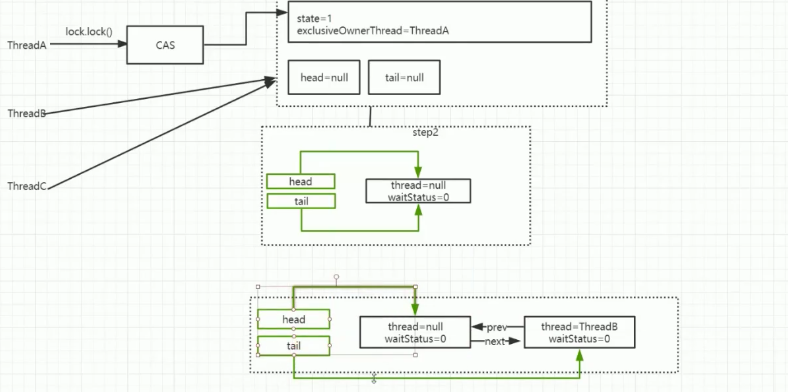


**B线程此时再来获取锁：**

```java
 public final void acquire(int arg) {
        if (!tryAcquire(arg) &&
            acquireQueued(addWaiter(Node.EXCLUSIVE), arg))
            selfInterrupt();
    }
```

这时尝试获取锁会失败tryAcquire为false，就会执行addWaiter(Node.EXCLUSIVE)，将该线程加入等待队列

```java
private Node addWaiter(Node mode) {
        Node node = new Node(Thread.currentThread(), mode);
        // Try the fast path of enq; backup to full enq on failure
        Node pred = tail;
        if (pred != null) {
            node.prev = pred;
            if (compareAndSetTail(pred, node)) {
                pred.next = node;
                return node;
            }
        }
        enq(node);
        return node;
    }
```

首先将当前线程封装成一个Node，一开始头结点head和尾节点tail都为空，所以直接进入enq()方法

```java
private Node enq(final Node node) {
        for (;;) {
            Node t = tail;
            if (t == null) { // Must initialize，初始化头尾节点
                if (compareAndSetHead(new Node()))
                    tail = head;
            } else {
                node.prev = t;
                if (compareAndSetTail(t, node)) {
                    t.next = node;
                    return t;
                }
            }
        }
    }
```

这个方法中是一个自旋，尾节点如果为空，就CAS创建一个头节点节点，并且head和tail都指向这个节点，如上图步骤2

第二次自旋，将当前线程的节点的前驱指针指向上一步创建的头结点，然后将tail指向当前线程节点，并把头节点的尾指针指向当前线程节点，这样就把当前线程节点加入到了同步队列中，如上图步骤3.

addWaiter方法执行完之后会返回一个Node,然后传入到acquireQueued(addWaiter(Node.EXCLUSIVE), arg))方法中，传入的Node再试图抢一下锁或者阻塞。

放到等待队列中之后呢，不能一直让它在那里自旋啊，给它两个选择，再抢一下锁，如果抢不到就要挂起了，进入阻塞队列。

```java
/**
     * Acquires in exclusive uninterruptible mode for thread already in
     * queue. Used by condition wait methods as well as acquire.
     *
     * @param node the node
     * @param arg the acquire argument
     * @return {@code true} if interrupted while waiting
     */
    final boolean acquireQueued(final Node node, int arg) {
        boolean failed = true;
        try {
            boolean interrupted = false;
            for (;;) {
                final Node p = node.predecessor();//拿到它的前驱节点
                if (p == head && tryAcquire(arg)) {//如果前驱节点是头节点，就再试一下拿锁。
                    setHead(node);
                    p.next = null; // help GC
                    failed = false;
                    return interrupted;
                }
                if (shouldParkAfterFailedAcquire(p, node) &&parkAndCheckInterrupt())//如果没有拿到锁，判断它是否需要挂起
                    interrupted = true;
            }
        } finally {
            if (failed)
                cancelAcquire(node);
        }
    }
```


对获取锁失败的节点，检查并且更新状态，判断是否需要阻塞

```java
/**
     * Checks and updates status for a node that failed to acquire.
     * Returns true if thread should block. This is the main signal
     * control in all acquire loops.  Requires that pred == node.prev.
     *
     * @param pred node's predecessor holding status
     * @param node the node
     * @return {@code true} if thread should block
     */
    private static boolean shouldParkAfterFailedAcquire(Node pred, Node node) {
        int ws = pred.waitStatus;
        if (ws == Node.SIGNAL)//如果前驱节点的等待状态为SIGNAL，表示当使用锁的线程释放锁的时候会通知它来运行，那么node就可以进行阻塞了，因为它的前驱节点还在等待中。
            /*
             * This node has already set status asking a release
             * to signal it, so it can safely park.
             */
            return true;
        if (ws > 0) {//如果前驱节点状态为cancelled，就把前驱节点从同步队列中移除掉
            /*
             * Predecessor was cancelled. Skip over predecessors and
             * indicate retry.
             */
            do {
                node.prev = pred = pred.prev;//pred = pred.prev;node.prev = pred;
            } while (pred.waitStatus > 0);
            pred.next = node;
        } else {
            /*
             * waitStatus must be 0 or PROPAGATE.  Indicate that we
             * need a signal, but don't park yet.  Caller will need to
             * retry to make sure it cannot acquire before parking.
             */
            compareAndSetWaitStatus(pred, ws, Node.SIGNAL);//把前驱节点的状态变为signal：-1，用来释放锁的时候唤醒下一个节点的线程
        }
        return false;
    }
```

如过前驱节点不是SIGNAL状态和CANCELED状态，就执行compareAndSetWaitStatus方法去改变前驱节点的状态

```java
/**
     * CAS waitStatus field of a node.
     */
    private static final boolean compareAndSetWaitStatus(Node node,
                                                         int expect,
                                                         int update) {
        return unsafe.compareAndSwapInt(node, waitStatusOffset,
                                        expect, update);
    }
```

unsafe.compareAndSwapInt这个方法会将前驱节点的状态改为SIGNAL。图中红色的为阻塞线程

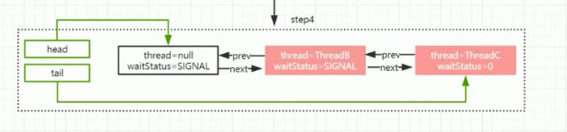

这是shouldParkAfterFailedAcquire的作用，将前驱节点的状态改为SIGNAL，并且返回true。然后判断parkAndCheckInterrupt，该方法将当前线程挂起。并且返回是否被中断过，如果有被中断过，这个线程被唤醒后，就会响应中断  interrupted = true;

```java
 /**
     * Convenience method to park and then check if interrupted
     *
     * @return {@code true} if interrupted
     */
    private final boolean parkAndCheckInterrupt() {
        LockSupport.park(this);
        return Thread.interrupted();
    }
```


**A线程释放锁的过程：**

```java
public void unlock() {
        sync.release(1);
    }
```

```java
public final boolean release(int arg) {
        if (tryRelease(arg)) {
            Node h = head;
            if (h != null && h.waitStatus != 0)
                unparkSuccessor(h);
            return true;
        }
        return false;
    }

```

release方法首先会调用tryRelease方法,主要有两个作用，将当前拥有锁的线程设为null,并将state赋值为0.

```java
protected final boolean tryRelease(int releases) {
            int c = getState() - releases;//重入的释放
            if (Thread.currentThread() != getExclusiveOwnerThread())
                throw new IllegalMonitorStateException();
            boolean free = false;
            if (c == 0) {
                free = true;
                setExclusiveOwnerThread(null);//获取锁的线程为null
            }
            setState(c);//state=0
            return free;
        }
```


**将B线程唤醒：**

接下来要唤醒处于等待队列中挂起的线程，release方法继续执行，判断  if (h != null && h.waitStatus != 0)head是否为空，并且waitStatus!=0.此时head不为空，并且waitStatus为SIGNAL就是-1.所有要执行unparkSuccessor(head)

```java
 /**
     * Wakes up node's successor, if one exists.
     *
     * @param node the node
     */
    private void unparkSuccessor(Node node) {//传进来的是head头节点
      
        int ws = node.waitStatus;
        if (ws < 0)//头节点的waitStatus为SIGNAL就是-1.改为0就是initialized
            compareAndSetWaitStatus(node, ws, 0);

        /*
         * Thread to unpark is held in successor, which is normally
         * just the next node.  But if cancelled or apparently null,
         * traverse backwards from tail to find the actual
         * non-cancelled successor.
         */
        Node s = node.next;
        if (s == null || s.waitStatus > 0) {//这里是当后继节点为空或者被取消了，就有将后继节点移除出去。
            s = null;
            for (Node t = tail; t != null && t != node; t = t.prev)//这里从尾部开始遍历，是为了防止断链。因为在将一个节点放入
                //到队列的时候，需要三步，1.将当前节点的pre指向前驱节点，2.将tail指向当前节点，3.将前驱节点的Next指向当前节点。由于这三步不是一个原子操作，有可能将	前驱节点取消的时候第三步还没有完成，这个时候就断链了。
                if (t.waitStatus <= 0)
                    s = t;
        }
        if (s != null)//s就是B节点
            LockSupport.unpark(s.thread);//将B节点的线程唤醒。
    }
```

将B线程唤醒之后，由于当初B线程是在方法acquireQueued中被阻塞的，所以唤醒之后继续在该方法内自旋：

```java
  final boolean acquireQueued(final Node node, int arg) {
        boolean failed = true;
        try {
            boolean interrupted = false;
            for (;;) {
                final Node p = node.predecessor();//拿到它的前驱节点
                if (p == head && tryAcquire(arg)) {//如果前驱节点是头节点，就再试一下拿锁。
                    setHead(node);
                    p.next = null; // help GC
                    failed = false;
                    return interrupted;
                }
                if (shouldParkAfterFailedAcquire(p, node) &&parkAndCheckInterrupt())//阻塞在这里了，现在唤醒了
                    interrupted = true;
            }
        } finally {
            if (failed)
                cancelAcquire(node);
        }
    }
```

自旋再次  if (p == head && tryAcquire(arg))，此时tryAcquire就可以拿到锁了。拿到锁之后，将当前节点设为头节点，并把之前的节点删除了。如图：

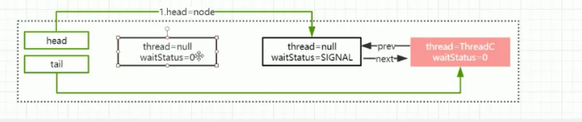

上面的是非公平锁，那么它和公平锁的差异是什么呢，首先非公平锁的lock方法上来就会尝试获取一下锁。其次在tryAcquire中，公平锁会判断一下阻塞队列有没有排队的线程，有的会不会再尝试获取锁。

### 5.并发容器

Hash:散列，把任意长度的输入通过一种固定的算法，把它映射为固定长度的输出，这个输出就是散列值。

容易产生哈希冲突：

- 开放寻址
- 再散列
- 链地址法

ConcurrentHashMap在发生hash冲突时采用了链地址法。

取模的操作 a % (Math.pow(2,n)) 等价于 a&( Math.pow(2,n)-1)

hashmap是线程不安全的,因为在hashmap中的put方法会引起死循环，hashmap里的Entry链表产生环形的数据结构。

hashtable是线程安全的，但是效率会很低，因为在hashtable中每个方法上都加上了synchronized关键字

ConcurrentHashMap:


### ConcurentHashMap原理分析

集合安全的两种方法，ConcurentHashMap和Collections.synchronizedMap()


jdk1.8的改进

- 取消了segment分段数组，锁的粒度就更小了。还可以扩容了，
- 增加了红黑树，如果链表的长度大于8，并且node数组的长度大于64，就会将当前链表转化为红黑树。如果链表的长度又小于8，就会将红黑树转化为链表。

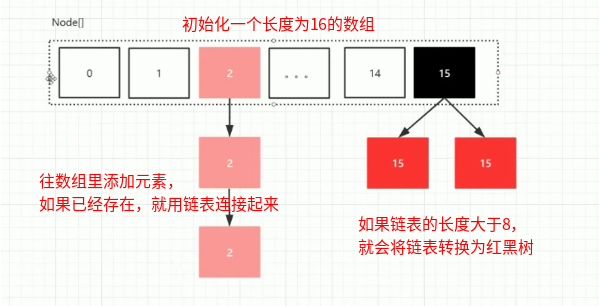


```java
public V put(K key, V value) {
        return putVal(key, value, false);
    }

    /** Implementation for put and putIfAbsent */
    final V putVal(K key, V value, boolean onlyIfAbsent) {
        if (key == null || value == null) throw new NullPointerException();
        int hash = spread(key.hashCode());//将key根据hash算法转换为hash值，
        int binCount = 0;
        for (Node<K,V>[] tab = table;;) {//table是一个Node[], transient volatile Node<K,V>[] table;
            Node<K,V> f; int n, i, fh;
            if (tab == null || (n = tab.length) == 0)
                tab = initTable();
            else if ((f = tabAt(tab, i = (n - 1) & hash)) == null) {
                if (casTabAt(tab, i, null,
                             new Node<K,V>(hash, key, value, null)))
                    break;                   // no lock when adding to empty bin
            }
           ....
        addCount(1L, binCount);
        return null;
    }
```

put方法往map中添加元素的时候，调用putVal方法，首先将key根据hash算法转换为hash值，然后开始自旋，一开始tab肯定是空的，所以就要初始化table,调用initTable方法

```java
private final Node<K,V>[] initTable() {
        Node<K,V>[] tab; int sc;
        while ((tab = table) == null || tab.length == 0) {
            if ((sc = sizeCtl) < 0)
                Thread.yield(); // lost initialization race; just spin
            else if (U.compareAndSwapInt(this, SIZECTL, sc, -1)) {
                try {
                    if ((tab = table) == null || tab.length == 0) {
                        int n = (sc > 0) ? sc : DEFAULT_CAPACITY;
                        @SuppressWarnings("unchecked")
                        Node<K,V>[] nt = (Node<K,V>[])new Node<?,?>[n];
                        table = tab = nt;
                        sc = n - (n >>> 2);
                    }
                } finally {
                    sizeCtl = sc;
                }
                break;
            }
        }
        return tab;
    }
```


sizeCtl开始为-1<0，表示初始化状态，之后代表扩容的大小，一开始n=16,sc=n-(n>>>2)=12;创建好tab节点数组后返回这个空数组。

第二次循环将运行下面的语句：

```java
else if ((f = tabAt(tab, i = (n - 1) & hash)) == null) {
                if (casTabAt(tab, i, null,
                             new Node<K,V>(hash, key, value, null)))
                    break;                   // no lock when adding to empty bin
            }


 addCount(1L, binCount);
```

tabAt是根据下标取值的方法，如果为空，也就是这个位置没有被占用，就创建一个新的节点，把value保存在这里面。

然后将元素放进去之后，肯定需要将元素的个数进行加一操作，但是要考虑并发的情况，那么怎么实现呢？采用CAS的话会降低效率，Atomic内部也是使用了CAS，如果并发多的化，就会一种自旋。使用锁的话效率就会更低。那么是怎么实现的呢？答案就是分段CAS。

首先，用来保存table中元素个数的是一个数组CounterCell，初始化这个数组的长度为2，然后每一个线程来的时候，都会生成一个0或1的随机数，这个随机数代表着去更改CounterCell数组的哪一个位置，在更改的时候也是使用CAS，这样效率就会提升一倍了，如果线程不断增多，那么就对CounterCell数组进行扩容，最后计算size的时候将数组中所有的元素加起来就是了。这样做的好处是，假如只使用一个变量来记录元素的个数，这样一个线程操作时，其他线程都要阻塞，而使用一个数组的话，每一个线程去对数组中的值操作，最后数组中的所有值取和就可以了，这样就减少了等待的线程。

元素个数增加的方法：

```java
 private final void addCount(long x, int check) {
        CounterCell[] as; long b, s;
        if ((as = counterCells) != null ||
            !U.compareAndSwapLong(this, BASECOUNT, b = baseCount, s = b + x)) {
            CounterCell a; long v; int m;
            boolean uncontended = true;
            if (as == null || (m = as.length - 1) < 0 ||
                (a = as[ThreadLocalRandom.getProbe() & m]) == null ||
                !(uncontended =
                  U.compareAndSwapLong(a, CELLVALUE, v = a.value, v + x))) {
                fullAddCount(x, uncontended);
                return;
            }
            if (check <= 1)
                return;
            s = sumCount();
        }
```

下面代码是初始化数组CounterCell的方法

```java
fullAddCount{
   ...
 h = ThreadLocalRandom.advanceProbe(h);
else if (cellsBusy == 0 && counterCells == as &&
                     U.compareAndSwapInt(this, CELLSBUSY, 0, 1)) {
                boolean init = false;
                try {                           // Initialize table
                    if (counterCells == as) {
                        CounterCell[] rs = new CounterCell[2];
                        rs[h & 1] = new CounterCell(x);
                        counterCells = rs;
                        init = true;
                    }
                } finally {
                    cellsBusy = 0;
                }
                if (init)
                    break;
            }
}
```

计算元素个数的方法：

```java
final long sumCount() {
        CounterCell[] as = counterCells; CounterCell a;
        long sum = baseCount;
        if (as != null) {
            for (int i = 0; i < as.length; ++i) {
                if ((a = as[i]) != null)
                    sum += a.value;
            }
        }
        return sum;
    }
```

addCount方法中还做了一件事情，就是对table数组进行扩容，并且允许多线程扩容。Adds to count, and if table is too small and not already* resizing, initiates transfer.

```java
if (check >= 0) {
            Node<K,V>[] tab, nt; int n, sc;
            while (s >= (long)(sc = sizeCtl) && (tab = table) != null &&
                   (n = tab.length) < MAXIMUM_CAPACITY) {
                int rs = resizeStamp(n);
                if (sc < 0) {
                    if ((sc >>> RESIZE_STAMP_SHIFT) != rs || sc == rs + 1 ||
                        sc == rs + MAX_RESIZERS || (nt = nextTable) == null ||
                        transferIndex <= 0)
                        break;
                    if (U.compareAndSwapInt(this, SIZECTL, sc, sc + 1))
                        transfer(tab, nt);
                }
                else if (U.compareAndSwapInt(this, SIZECTL, sc,
                                             (rs << RESIZE_STAMP_SHIFT) + 2))
                    transfer(tab, null);
                s = sumCount();
            }
        }
```

 transfer(tab, null)，表示转移数据：将table数组扩容之后，需要将数据进行转移，进入该方法中查看一下

```java
if ((stride = (NCPU > 1) ? (n >>> 3) / NCPU : n) < MIN_TRANSFER_STRIDE)
            stride = MIN_TRANSFER_STRIDE; // subdivide range
```

这段代码是让每一个CPU去执行一段数据的扩容，每一个CPU可以处理16个长度的数组。这样就可以并发扩容了。例如每个线程对数组中的长度16的数组进行扩容，扩容到32个，就是新建了一个长度为32的数组，然后将原来在长度为16的数组上的数据转移到新数组上。


如何转移数据呢，每个线程进来，首先要确定当前线程对应的table数组的边界，数据迁移的过程是从后往前，判断每一个位置是否有元素，没有元素就向前移动，如果不为空，就会转移数据

假设当前table数组如下所示，两个线程执行了扩容，创建了一个长度为64的数组，

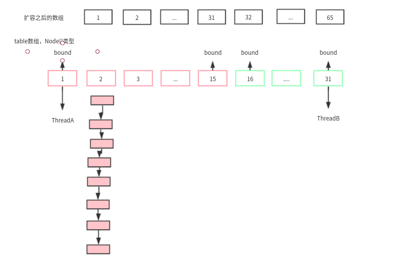

转移过程：

如果某个数组位置上连接的节点有了八个，就需要扩容来解决装不下的问题，首先需要对单向链表上的八个节点进行分类，根据某种分类算法把他们分成两类，一个高位链，一个低位链

```java
int runBit = fh & n;//分类标准
Node<K,V> lastRun = f;
for (Node<K,V> p = f.next; p != null; p = p.next) {//遍历元素
    int b = p.hash & n;
    if (b != runBit) {
        runBit = b;
        lastRun = p;
    }
}
if (runBit == 0) {//低位链
    ln = lastRun;
    hn = null;
}
else {//高位链
    hn = lastRun;
    ln = null;
}
```

```java
setTabAt(nextTab, i, ln);//低位链保持不动
setTabAt(nextTab, i + n, hn);//高位链需要增加n长度的位置
setTabAt(tab, i, fwd);
advance = true;
```

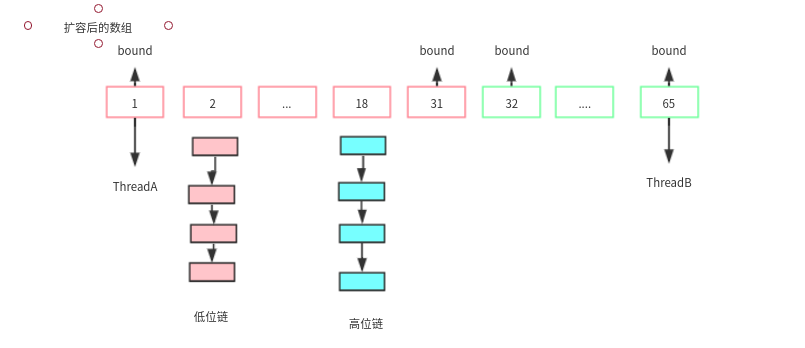


为什么这么做呢，为的是在新的数组中通过原来的计算还能够取到原来的值，不会使值丢失。扩容以后，同样的操作拿到的值是不会变的。原因如下：

取值的语句如下：

```java
f = tabAt(tab, i = (n - 1) & hash))    
```

下标位为(n - 1) & hash，假设原来的hash值为9，那么它在16位长度的table中表示如下：

0000 1111 & 0000 1001  = 9

在32位的table中呢

0001 1111 & 0000 1001 = 9，说明低位的是不会变的。

对于高位，假设hash为20

16位：0000 1111 & 0001 0100 = 0000 0100 = 4，原本会取4这个位置的元素值

32位：0001 1111 & 0001 0111 = 0001 0100 = 20，同样的计算方式，现在要去取20位置的值

所以对于高位的元素需要加上n，这里n=16。这样高低链来解决多次hash计算的问题，提升了效率。


再回到添加元素put方法上，我们知道第一次自旋是初始化Table数组，第二次就是创建节点添加进数组，然后再将数组的元素个数加一。那么这次添加元素就完成了，如果后面再执行put方法时，将执行下面的代码

```java
else {
                V oldVal = null;
                synchronized (f) {
                    if (tabAt(tab, i) == f) {
                        if (fh >= 0) {
                            binCount = 1;
                            for (Node<K,V> e = f;; ++binCount) {
                                K ek;
                                if (e.hash == hash &&
                                    ((ek = e.key) == key ||
                                     (ek != null && key.equals(ek)))) {
                                    oldVal = e.val;
                                    if (!onlyIfAbsent)
                                        e.val = value;
                                    break;
                                }
                                Node<K,V> pred = e;
                                if ((e = e.next) == null) {
                                    pred.next = new Node<K,V>(hash, key,
                                                              value, null);
                                    break;
                                }
                            }
                        }
                        else if (f instanceof TreeBin) {
                            Node<K,V> p;
                            binCount = 2;
                            if ((p = ((TreeBin<K,V>)f).putTreeVal(hash, key,
                                                           value)) != null) {
                                oldVal = p.val;
                                if (!onlyIfAbsent)
                                    p.val = value;
                            }
                        }
                    }
                }
                if (binCount != 0) {
                    if (binCount >= TREEIFY_THRESHOLD)
                        treeifyBin(tab, i);
                    if (oldVal != null)
                        return oldVal;
                    break;
                }
            }
```

#### HashMap

hashmap初始化容量为16，而hashtable初始化为11（一个不接近2的整数幂的素数）

1.7中hashmap参数，初始化容量16，最大2的30次方，扩容因子0.75

在new HashMap<>()的时候并没有申请内存空间，在第一次put的时候进行创建的。在hashmap中key可以为空，但只能有一个。

为什么初始化容量是2的n次幂，每次扩容也要乘以2

- 第一可以通过与运算（hash&(length-1)）进行取模操作，更快。
- 第二，在扩容的时候，新建一个数组是原来数组的二倍，在进行数据转移的时候，不需要对全部数据进行取模了。取模是用与运算，在同一个位置的链表上的所有节点元素，后四位肯定是相同的（假设原先长度是16，与运算与的是1111，得到的结相同才会被放到同一个位置，所有他们的hash的后四位肯定是相同的。）那么扩容之后呢，容量变为32了，再进行与运算就是hash&11111了，所以我们只需要判断hash的倒数第五位就可以了，如果为0，则和之前的位置不变，如果为1，则位置需要加上16.

在1.7中转移数据用的是头插法，在1.8转移数据用的是尾插法。1.7中会有死循环和数据丢失的问题，1.8会有数据覆盖的问题，都是在并发扩容时产生。


在1.8中，当链表长度大于8，由链表转为红黑树，当链表长度小于6的时候就要从红黑树转换为链表，当然，这都在元素个数大于64的前提下。

树->二叉树->（为了提高搜索的性能，让数据变的有序起来）->二叉搜索树->（为了避免会退化成链表，对左右子树，最高和最低之差不能大于1）->AVL树（平衡树，损失了插入的性能，提高了搜索的性能）->（让插入性能和搜索性能近视相等，最长子树不超过最短子树的两倍即可）->红黑树


三、为什么HashMap线程不安全

上面说到，HashMap会进行resize操作，在resize操作的时候会造成线程不安全。下面将举两个可能出现线程不安全的地方。

1、put的时候导致的多线程数据不一致。
 这个问题比较好想象，比如有两个线程A和B，首先A希望插入一个key-value对到HashMap中，首先计算记录所要落到的桶的索引坐标，然后获取到该桶里面的链表头结点，此时线程A的时间片用完了，而此时线程B被调度得以执行，和线程A一样执行，只不过线程B成功将记录插到了桶里面，假设线程A插入的记录计算出来的桶索引和线程B要插入的记录计算出来的桶索引是一样的，那么当线程B成功插入之后，线程A再次被调度运行时，它依然持有过期的链表头但是它对此一无所知，以至于它认为它应该这样做，如此一来就覆盖了线程B插入的记录，这样线程B插入的记录就凭空消失了，造成了数据不一致的行为。

2、另外一个比较明显的线程不安全的问题是HashMap的get操作可能因为resize而引起死循环（cpu100%），具体分析如下：

下面的代码是resize的核心内容：

```java
void transfer(Entry[] newTable, boolean rehash) {  
        int newCapacity = newTable.length;  
        for (Entry<K,V> e : table) {  
  
            while(null != e) {  
                Entry<K,V> next = e.next;           
                if (rehash) {  
                    e.hash = null == e.key ? 0 : hash(e.key);  
                }  
                int i = indexFor(e.hash, newCapacity);   
                e.next = newTable[i];  //newTable[i]; 是在数组第i个位置上的头节点
                newTable[i] = e;  
                e = next;  
            } 
        }  
    }  
```

这个方法的功能是将原来的记录重新计算在新桶的位置，然后迁移过去。


我们假设有两个线程同时需要执行resize操作，我们原来的桶数量为2，记录数为3，需要resize桶到4，原来的记录分别为：[3,A],[7,B],[5,C]，在原来的map里面，我们发现这三个entry都落到了第二个桶里面。
 假设线程thread1执行到了transfer方法的Entry next = e.next这一句，然后时间片用完了，此时的e = [3,A], next = [7,B]。线程thread2被调度执行并且顺利完成了resize操作，需要注意的是，此时的[7,B]的next为[3,A]。此时线程thread1重新被调度运行，此时的thread1持有的引用是已经被thread2 resize之后的结果。线程thread1首先将[3,A]迁移到新的数组上，然后再处理[7,B]，而[7,B]被链接到了[3,A]的后面，处理完[7,B]之后，就需要处理[7,B]的next了啊，而通过thread2的resize之后，[7,B]的next变为了[3,A]，此时，[3,A]和[7,B]形成了环形链表，在get的时候，如果get的key的桶索引和[3,A]和[7,B]一样，那么就会陷入死循环。

如果在取链表的时候从头开始取（现在是从尾部开始取）的话，则可以保证节点之间的顺序，那样就不存在这样的问题了。

综合上面两点，可以说明HashMap是线程不安全的。


#### concurrenthashmap结构变化图

###### 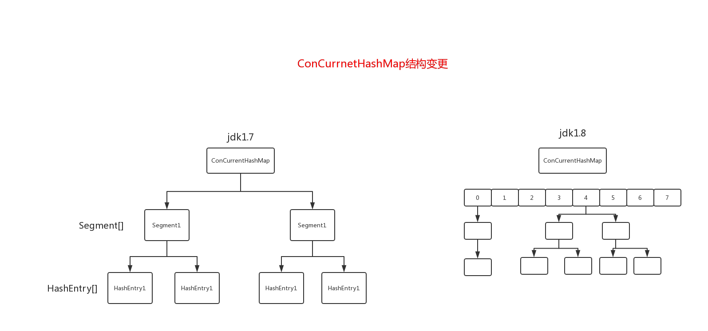

#### concurrenthashmap put流程

###### 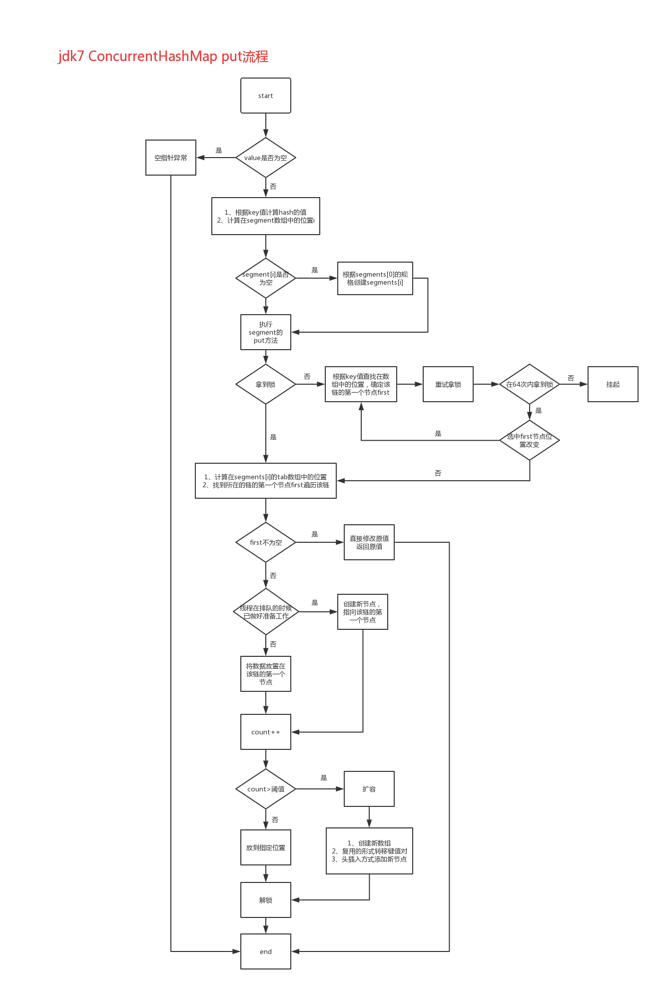

1。ConcurrentHashMap实现原理是怎么样的或者问ConcurrentHashMap如何在保证高并发下线程安全的同时实现了性能提升？

答：ConcurrentHashMap允许多个修改操作并发进行，其关键在于使用了 锁分离   技术。它使用了多个锁来控制对hash表的不同部分进行的修改。内部使用段(Segment)来表示这些不同的部分，每个段其实就是一个小的hash table，只要多个修改操作发生在不同的段上，它们就可以并发进行。

Segment 不扩容，扩容下面的table数组，每次都是将数组翻倍

get()操作如何保证取到最新值？value是volatile类型的


#### jdk7 hashmap的put流程图


#### jdk8 hashmap的put操作


#### 红黑树

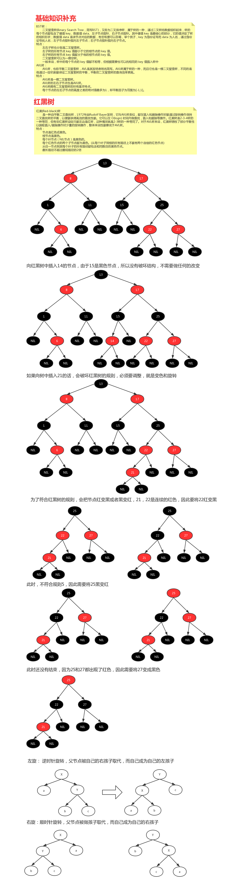

AVL树适合用于插入与删除次数比较少，但查找多的情况；相对于要求严格的AVL树来说，红黑树的旋转次数少，所以对于搜索、插入、删除操作较多的情况下，我们就用红黑树。

红黑树广泛应用于C++的STL中，e.g. set、multiset、map、multimap；另外，Java的TreeMap和TreeSet也是使用红黑树来实现的。

#### 死循环问题

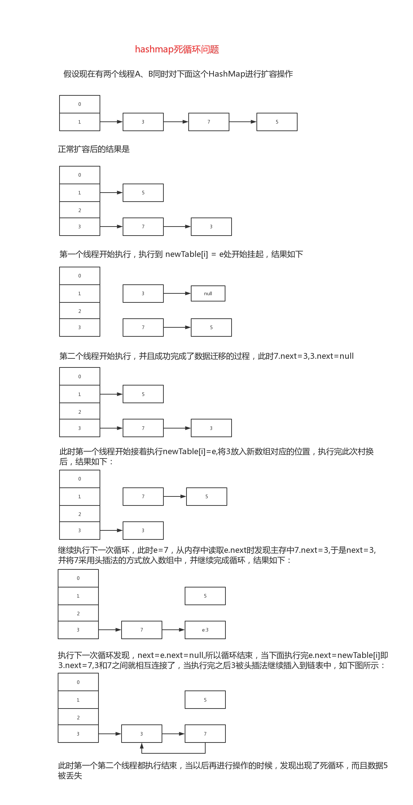


### 容器

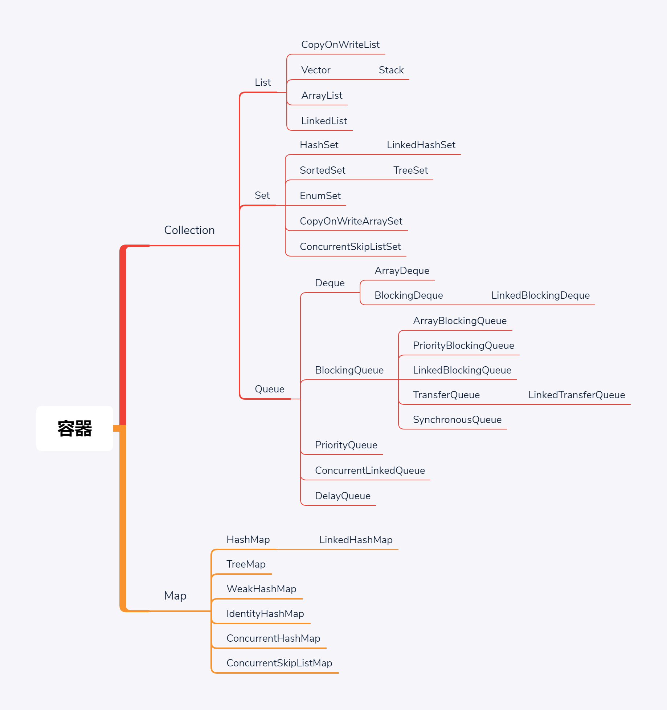

list可重复，set不可重复，Queue并发使用，在线程池中，Queue有阻塞方法也有非阻塞方法，LinkedList即实现了List接口，也实现了Queue接口。

Vector是线程安全的，它的所有方法都是synchronized的。

ArrayList和LinkedList都没有加锁，一个是数组实现，一个是列表实现。如果真的想要加锁，就使用Collections,这是Collection的工具类，（工具类都是使用复数命名，如Arrays）调用Collections.synchronizedList(list)，就可以返回一个上锁的list,

CapyOnWriteList:在写入少，读取多时使用。有CapyOnWriteArrayList和CapyOnWriteSetList这两个类。

有ConcurentHashMap为什么没有ConcurentTreeMap。因为对tree上锁非常麻烦，tree的查找都有重头开始。但是我又想排序，又想支持高并发，怎么做呢，用ConcurentSkipListMap和ConcurentSkipListSet。叫做跳表。

跳表，就是在一个链表A上面再维护一个链表B,B是跳着的，只有少量元素，如果还是多的话上面再维护C,元素是有顺序的，当查找的时候，从上面的链表开始查找，没有就跳转到下面的链表再查找，这样不需要遍历整个链表了。


Deque:双端队列，两边都能放和拿

BlockingQueue：阻塞队列，线程池中使用，重点。生产者消费者模型。

PriorityQueue:优先队列，底层实现是小根堆和大根堆。

ConcurrentLinkedQueue:使用CAS实现

syn有锁升级，CAS是自旋，哪种效率高？CAS线程并不是特别多，并且执行时间不是太长。syn是线程运行时间长，并且线程数量多。具体哪个效率高，要压力测试。


SynchronousQueue:手递手的，容器为空，生产者和消费者手递手传递

TransferQueue:也是手递手的，多人手递手，但是容器不为空，如果没有消费者取，生产者就等着阻塞在那

#### ConcurrentSkipListMap 和 ConcurrentSkipListSet

TreeMap和TreeSet有序的容器，这两种容器的并发版本。

SkipList，跳表，以空间换时间，在原链表的基础上形成多层索引，但是某个节点在插入时，是否成为索引，随机决定，所以跳表又称为概率数据结构。

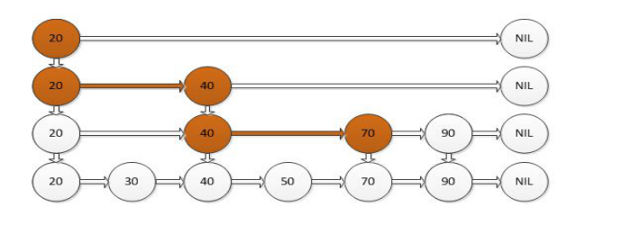

跳表的查找速度和红黑树中的差不多，那么hashmap为什么不使用红黑树呢？hashmap对空间的利用率本来就很低了。再使用跳表更不可能了。

#### ConcurrentLinkedQueue

无界非阻塞队列，底层是个链表，遵循先进先出原则。

add,offer将元素插入到尾部，peek（拿头部的数据，但是不移除）和poll（拿头部的数据，但是移除）

#### 写时复制容器

写时复制的容器。通俗的理解是当我们往一个容器添加元素的时候，不直接往当前容器添加，而是先将当前容器进行Copy，复制出一个新的容器，然后新的容器里添加元素，添加完元素之后，再将原容器的引用指向新的容器。这样做的好处是我们可以对容器进行并发的读，而不需要加锁，因为当前容器不会添加任何元素。所以写时复制容器也是一种读写分离的思想，读和写不同的容器。如果读的时候有多个线程正在向容器添加数据，读还是会读到旧的数据，因为写的时候不会锁住旧的，只能保证最终一致性。

适用读多写少的并发场景，常见应用：白名单/黑名单， 商品类目的访问和更新场景。

存在内存占用问题。

### 阻塞队列

#### 概念、生产者消费者模式

1)当队列满的时候，插入元素的线程被阻塞，直达队列不满。

2)队列为空的时候，获取元素的线程被阻塞，直到队列不空。

#### 生产者和消费者模式

生产者就是生产数据的线程，消费者就是消费数据的线程。在多线程开发中，如果生产者处理速度很快，而消费者处理速度很慢，那么生产者就必须等待消费者处理完，才能继续生产数据。同样的道理，如果消费者的处理能力大于生产者，那么消费者就必须等待生产者。为了解决这种生产消费能力不均衡的问题，便有了生产者和消费者模式。生产者和消费者模式是通过一个容器来解决生产者和消费者的强耦合问题。生产者和消费者彼此之间不直接通信，而是通过阻塞队列来进行通信，所以生产者生产完数据之后不用等待消费者处理，直接扔给阻塞队列，消费者不找生产者要数据，而是直接从阻塞队列里取，阻塞队列就相当于一个缓冲区，平衡了生产者和消费者的处理能力。

#### 常用方法

| 方法     | 抛出异常 | 返回值 | 一直阻塞 | 超时退出    |
| -------- | -------- | ------ | -------- | ----------- |
| 插入方法 | add      | offer  | put      | Offer(time) |
| 移除方法 | remove   | poll   | take     | Poll(time)  |
| 检查方法 | element  | peek   | N/A      | N/A         |


#### 常用阻塞队列

ArrayBlockingQueue：一个由数组结构组成的有界阻塞队列。

按照先进先出原则，要求设定初始大小

LinkedBlockingQueue：一个由链表结构组成的有界阻塞队列。

按照先进先出原则，可以不设定初始大小，Integer.Max_Value

ArrayBlockingQueue和LinkedBlockingQueue不同：

- 锁上面：ArrayBlockingQueue只有一个锁（生产者和消费者用了同一个锁），LinkedBlockingQueue用了两个锁（生成者和消费者用了不同的锁），

- 实现上：ArrayBlockingQueue直接插入元素，LinkedBlockingQueue需要转换。

PriorityBlockingQueue：一个支持优先级排序的无界阻塞队列。

默认情况下，按照自然顺序，要么实现compareTo()方法，指定构造参数Comparator


DelayQueue：一个使用优先级队列实现的无界阻塞队列。

支持延时获取的元素的阻塞队列，元素必须要实现Delayed接口。适用场景：实现自己的缓存系统，订单到期，限时支付等等。


SynchronousQueue：一个不存储元素的阻塞队列。

每一个put操作都要等待一个take操作

LinkedTransferQueue：一个由链表结构组成的无界阻塞队列。

transfer()，必须要消费者消费了以后方法才会返回，tryTransfer()无论消费者是否接收，方法都立即返回。

LinkedBlockingDeque：一个由链表结构组成的双向阻塞队列。

可以从队列的头和尾都可以插入和移除元素，实现工作密取，方法名带了First对头部操作，带了last从尾部操作，另外：add=addLast;	remove=removeFirst;	take=takeFirst

 

### 6.线程池

为什么使用线程池？

- 降低资源的消耗，降低线程创建和销毁的资源消耗
- 提高响应速度：线程的创建时间为T1，执行时间T2,销毁时间T3，线程池免去T1和T3的时间
- 提高线程的可管理性。

线程池的创建：ThreadPoolExecutor,jdk中所有线程池的父类

#### 参数：

- int corePoolSize ：线程池中核心线程数，一直开着不关闭，< corePoolSize ，就会创建新线程，= corePoolSize ，这个任务就会保存到BlockingQueue，如果调用prestartAllCoreThreads（）方法就会一次性的启动corePoolSize 个数的线程。jdk用HashSet保存运行的线程

- int maximumPoolSize, 允许的最大线程数，BlockingQueue也满了，< maximumPoolSize时候就会再次创建新的线程

- long  keepAliveTime, 线程空闲下来后，存活的时间，这个参数只在> corePoolSize才有用

- TimeUnit unit, 存活时间的单位值

- BlockingQueue<Runnable> workQueue, 保存任务的阻塞队列

- ThreadFactory threadFactory, 创建线程的工厂，给新建的线程赋予名字

- RejectedExecutionHandler handler ：饱和策略，就是最大线程数和阻塞队列都达到上限的时候

  - AbortPolicy ：直接抛出异常，默认；

  - CallerRunsPolicy：用调用者所在的线程来执行任务

  - DiscardOldestPolicy：丢弃阻塞队列里最老的任务，队列里最靠前的任务

  - DiscardPolicy ：当前任务直接丢弃

  实现自己的饱和策略，实现RejectedExecutionHandler接口即可

#### 提交任务：

- execute(Runnable command) 不需要返回。首先去看线程数是否小于corePoolSize，小于就启动线程执行任务，如果已经达到了corePoolSize，就将任务放到阻塞队列中，等待线程take拿，如果阻塞队列也满了，线程数小于maximumPoolSize，就会启动新的线程执行任务，如果maximumPoolSize也达到上限了，就会有饱和策略。
  - Future<T> submit(Callable<T> task) 需要返回


#### 关闭线程池

- shutdownNow():设置线程池的状态，还会尝试停止正在运行或者暂停任务的线程

- shutdown()设置线程池的状态，只会中断所有没有执行任务的线程

 工作机制


#### 合理配置线程池

根据任务的性质来：计算密集型（CPU），IO密集型，混合型

- 计算密集型：加密，大数分解，正则…….， 线程数适当小一点，最大推荐：机器的Cpu核心数+1，为什么+1，防止页缺失，(机器的Cpu核心=Runtime.**getRuntime**().availableProcessors();)

- IO密集型：读取文件，数据库连接，网络通讯, 线程数适当大一点，机器的Cpu核心数*2,

- 混合型：尽量拆分，IO密集型>>计算密集型，拆分意义不大，IO密集型~计算密集型

队列的选择上，应该使用有界，无界队列可能会导致内存溢出，OOM


#### 预定义的线程池

- FixedThreadPool:创建固定线程数量的，适用于负载较重的服务器，使用了无界队列。

- SingleThreadExecutor:创建单个线程，需要顺序保证执行任务，不会有多个线程活动，使用了无界队列

- CachedThreadPool:会根据需要来创建新线程，执行很多短期异步任务的程序，使用了SynchronousQueue

- WorkSealingPool:工作密取，基于ForkJoinPool实现

- ScheduledThreadPoolExecutor:需要定期执行周期任务，Timer不建议使用了。

  newSingleThreadScheduledExecutor：只包含一个线程，只需要单个线程执行周期任务，保证顺序的执行各个任务

  newScheduledThreadPool 可以包含多个线程的，线程执行周期任务，适度控制后台线程数量的时候

  方法说明：

  schedule：只执行一次，任务还可以延时执行

  scheduleAtFixedRate：提交固定时间间隔的任务

  scheduleWithFixedDelay：提交固定延时间隔执行的任务

  两者的区别：

   

   scheduleAtFixedRate任务超时：

  规定60s执行一次，有任务执行了80S，下个任务马上开始执行

  第一个任务 时长 80s，第二个任务20s，第三个任务 50s

  第一个任务第0秒开始，第80S结束；

  第二个任务第80s开始，在第100秒结束；

  第三个任务第120s秒开始，170秒结束

  第四个任务从180s开始

  参加代码：ScheduleWorkerTime类，执行效果如图：

   

   

  建议在提交给ScheduledThreadPoolExecutor的任务要住catch异常。


#### Executor框架


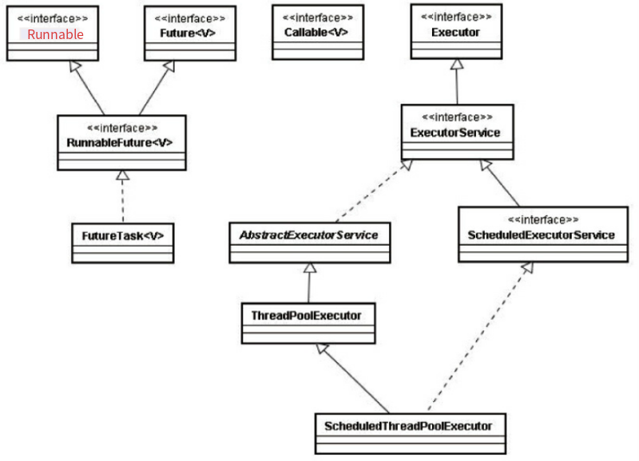

#### Executor框架基本使用流程

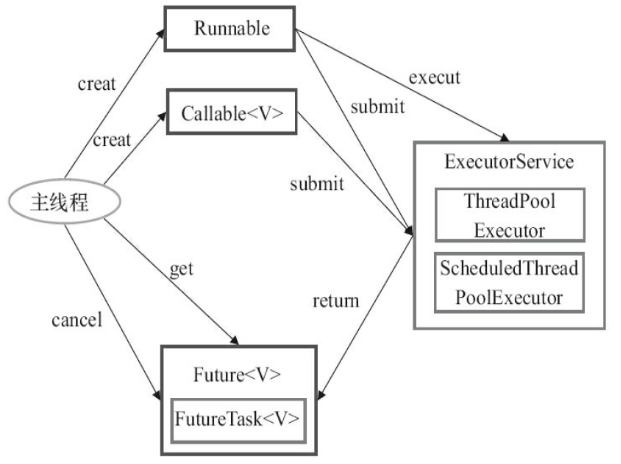

Callable和Runnable都只不过是一个可以被线程执行的接口，分别有call方法和run方法，实现类实现这两个方法，call有返回值，run没有返回值。

Future就是对于具体的Runnable或者Callable任务的执行结果进行取消、查询是否完成、获取结果。必要时可以通过get方法获取执行结果，该方法会阻塞直到任务返回结果。

- cancel方法用来取消任务，如果取消任务成功则返回true，如果取消任务失败则返回false。参数mayInterruptIfRunning表示是否允许取消正在执行却没有执行完毕的任务，如果设置true，则表示可以取消正在执行过程中的任务。如果任务已经完成，则无论mayInterruptIfRunning为true还是false，此方法肯定返回false，即如果取消已经完成的任务会返回false；如果任务正在执行，若mayInterruptIfRunning设置为true，则返回true，若mayInterruptIfRunning设置为false，则返回false；如果任务还没有执行，则无论mayInterruptIfRunning为true还是false，肯定返回true。
- isCancelled方法表示任务是否被取消成功，如果在任务正常完成前被取消成功，则返回 true。
- isDone方法表示任务是否已经完成，若任务完成，则返回true；
- get()方法用来获取执行结果，这个方法会产生阻塞，会一直等到任务执行完毕才返回；
- get(long timeout, TimeUnit unit)用来获取执行结果，如果在指定时间内，还没获取到结果，就直接返回null。

　我们先来看一下FutureTask的实现：

```java
`public` `class` `FutureTask ``implements` `RunnableFuture`
```

 　FutureTask类实现了RunnableFuture接口，我们看一下RunnableFuture接口的实现：

```java
`public` `interface` `RunnableFuture ``extends` `Runnable, Future {``  ``void` `run();``}`
```

 　可以看出RunnableFuture继承了Runnable接口和Future接口，而FutureTask实现了RunnableFuture接口。所以它既可以作为Runnable被线程执行，又可以作为Future得到Callable的返回值。

　　FutureTask提供了2个构造器：

```java
`public` `FutureTask(Callable callable) {``}``public` `FutureTask(Runnable runnable, V result) {``}`
```

　　事实上，FutureTask是Future接口的一个唯一实现类。

使用Callable+Future获取执行结果

```java
class Task implements Callable<Integer>{
    @Override
    public Integer call() throws Exception {
        System.out.println("子线程在进行计算");
        Thread.sleep(3000);
        int sum = 0;
        for(int i=0;i<100;i++)
            sum += i;
        return sum;
    }
}
public class Test {
    public static void main(String[] args) {
        ExecutorService executor = Executors.newCachedThreadPool();
        Task task = new Task();
        Future<Integer> result = executor.submit(task);
        executor.shutdown();
         
        try {
            Thread.sleep(1000);
        } catch (InterruptedException e1) {
            e1.printStackTrace();
        }
         
        System.out.println("主线程在执行任务");
         
        try {
            System.out.println("task运行结果"+result.get());
        } catch (InterruptedException e) {
            e.printStackTrace();
        } catch (ExecutionException e) {
            e.printStackTrace();
        }
         
        System.out.println("所有任务执行完毕");
    }
}
```


使用Callable+FutureTask获取执行结果

```java
class Task implements Callable<Integer>{
    @Override
    public Integer call() throws Exception {
        System.out.println("子线程在进行计算");
        Thread.sleep(3000);
        int sum = 0;
        for(int i=0;i<100;i++)
            sum += i;
        return sum;
    }
}
public class Test {
    public static void main(String[] args) {
        //第一种方式
        ExecutorService executor = Executors.newCachedThreadPool();
        Task task = new Task();
        FutureTask<Integer> futureTask = new FutureTask<Integer>(task);
        executor.submit(futureTask);
        executor.shutdown();
         
        //第二种方式，注意这种方式和第一种方式效果是类似的，只不过一个使用的是ExecutorService，一个使用的是Thread
        /*Task task = new Task();
        FutureTask<Integer> futureTask = new FutureTask<Integer>(task);
        Thread thread = new Thread(futureTask);
        thread.start();*/
         
        try {
            Thread.sleep(1000);
        } catch (InterruptedException e1) {
            e1.printStackTrace();
        }
         
        System.out.println("主线程在执行任务");
         
        try {
            System.out.println("task运行结果"+futureTask.get());
        } catch (InterruptedException e) {
            e.printStackTrace();
        } catch (ExecutionException e) {
            e.printStackTrace();
        }
         
        System.out.println("所有任务执行完毕");
    }
}

```


### 7.并发安全

原子操作和内存的可见性

#### 怎么做到类的线程安全

- 栈封闭：所有的变量都是在方法内部声明的，这些变量都处于栈封闭状态。

- 无状态：没有任何成员变量的类，就叫无状态类

- 让类不改变：让状态不可变，两种方式：

  1，加final关键字，对于一个类，所有的成员变量应该是私有的，同样的只要有可能，所有的成员变量应该加上final关键字，但是加上final，要注意如果成员变量又是一个对象时，这个对象所对应的类也要是不可变，才能保证整个类是不可变的。

  2、根本就不提供任何可供修改成员变量的地方，同时成员变量也不作为方法的返回值

- volatile:保证类的可见性，最适合一个线程写，多个线程读的情景，

- 加锁和CAS

- 安全的发布：类中持有的成员变量，特别是对象的引用，如果这个成员对象不是线程安全的，通过get等方法发布出去，会造成这个成员对象本身持有的数据在多线程下不正确的修改，从而造成整个类线程不安全的问题。

- ThreadLocal

Servlet:

不是线程安全的类，为什么我们平时没感觉到，：1、在需求上，很少有共享的需求，第二，接收到了请求，返回应答的时候，都是由一个线程来负责的。生命周期，在请求时创建，在响应后销毁。


#### 死锁：

资源一定是多于1个，同时小于等于竞争的线程数，资源只有一个，只会产生激烈的竞争。

死锁的根本成因：获取锁的顺序不一致导致。

怀疑发送死锁：

通过jps -m 查询应用的 id，

再通过jstack id 查看应用的锁的持有情况

解决办法：保证加锁的顺序性


动态死锁：

动态顺序死锁，在实现时按照某种顺序加锁了，但是因为外部调用的问题，导致无法保证加锁顺序而产生的。比如转账，需要锁住两方账户再执行，因为两个参数传入的顺序不确定。但如果多个线程进行转账的话会发生死锁，那么就确保每次先锁的账户是相同的就可以了。

解决：

1、 通过内在排序，保证加锁的顺序性，通过比较，确保加锁的顺序。

2、 通过尝试拿锁，用显示锁tryLock，也可以。


活锁：

使用tryLock可能会出现活锁，例如A和B两个线程，A获得1锁，B获得2锁，这个时候另一把锁获取不到，就把当前的锁释放掉了。第二次两个线程又是这样的情况，导致一直循环。解决方法是让线程拿不到锁的时候休眠一个随机数，避免第二次又同时抢锁。

线程饥饿

优先级低的线程，总是拿不到执行时间

性能和思考：

javaweb程序天生就是多线程的，开发时先不要考虑多线程的优化问题。

先保证程序的正确，确实达不到要求时再提高速度

一定以测试为基准

一个应用程序里，串行的部分永远都有

影响性能的因素：

- 上下文切换，

- 内存同步，

- 缩小锁的范围：对锁的持有，快进快出

- 减少锁的粒度（使用锁的时候，锁所保护的对象是多个，多个对象其实是独立变化的时候，不如用多个锁来一一保护这些对象，但是要注意发生死锁）

- 锁分段（ConcurentHashMap）

- 替换独占锁（使用读写锁，CAS，系统提供的并发容器），


### 8.实战-并发框架

<<<<<<< HEAD


=======


代码在vip-concurrent.ch8a中。
>>>>>>> e94e0470f821402dab0842cf8d468a7fb47df8bd


