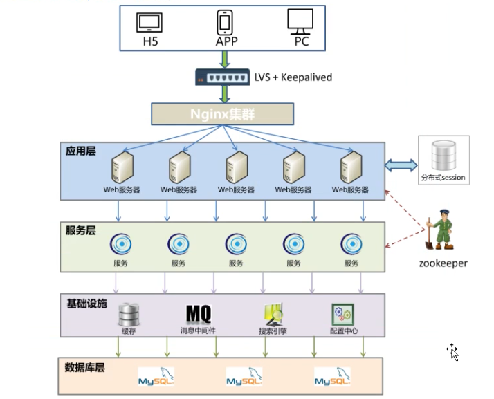

# **1.**  Zookeeper综述 

## **1.1.**  课程总体介绍 

 

如上图所示，整个ZK体系会从入门开始，到基础，进阶以及实战，最后把相关的理论给介绍一下。


ZK在后面讲dubbo和kafka都会用到，请务必重视起来。

 

另外对zk了解比较深入的同学可以课后通过视频的方式加快学习进度。

 

### **1.1.1.**  为什么学习ZK 

 应该重点掌握分布式环境的演进过程，从一个单节点开始，慢慢过渡到分布式，为什么单节点不行，传统一个tomcat打天下有什么有点，缺点又是什么，当一个tomcat搞不定的时候，分布式的架构图又是什么样的，

 

传统的单节点架构自然有问题，到了分布式的架构中，问题肯定也有不少，这些问题就是我们学习ZK要解决的，但学习这些解决方案之前，还是需要有点理论基础。

 

 接下来就要了解下什么是zk,为什么学习zk, Zk在分布式架构中扮演了什么样的角色。以及面试的时候经常会问到的问题，心里要有个大概的了解。

 

### **1.1.2.**  zookeeper基础 

了解zk是什么玩意后，接下来就把zk安装好，先来讲解的是zk单机部署，这个非常容易，而且后面课程绝大部的时间都是使用单节点来使用的，至于集群的配置放到后面来讲，正在在工作中，集群的维护应该是运维来做，哪怕没有运维，在后面通过详细的学习通过也能在20分钟内完全搭建起来，同学们不用着急。

 

Zk的特性：这块是重点之中的重点，后面学习的一切操作，包括实战，都是建立在这基础之上的。其中数据模型和watch机制又是最最重要的。

 

### **1.1.3.**  zk进阶 

安装好了zk,对zk基础有一定的了解后，接下来就学习怎么操作zk,首先了解基础zk客户端的使用。

 

客户端的简单使用能解决一些问题，方便查看信息，简单省事，但真正对于我们java架构师来说最重要的是java客户端，包括原生的，zkclient以及curotor，同学们最少要熟练使用其中的一种，另外的在工作中也要很快的百度得出来。

 

### **1.1.4.**  zk的实战 

 一般来说zk实战是放到最后来讲得，但这一块确是面试得时候经常会碰到的，所以先提前，这一块是整个课程的重点，我会带同学一行行的代码来学习，也请同学务必能够跟着deer老师一个个案例吃透。

 会讲到配置中心，负载均衡，分布式锁，集群选举，尤其是负载均衡，如果这块没听懂peter老师会找我麻烦的，后面他讲dubbo的核心就是这玩意，至于具体的请到后面课程中收听。

### **1.1.5.**  zk高级知识 

  这一块不需要同学完全听懂，掌握40%-50%就够了，工作中很少用到，但确实面试的时候的加分项，

 包括2pc,3pc提交协议，集群的安装等等

 

### **1.1.6.**  总结： 

 不管怎么样，其中的zk基础，zk进阶客户端的使用，以及zk项目实战请务必重视起来。

## **1.2.**  分布式系统基础知识 

  一个tomcat打天下的时代，不能说完全淘汰了，在一个管理系统，小型项目中还经常使用，这并不过分，出于成本的考虑，这反而值得提倡。

  但同学们最终是要成为架构师，架构师就必然要了解分布式系统：

  

### **1.2.1.**   分布式系统是什么 

分布式系统：一个硬件或软件组件分布在不同的网络计算机上，彼此之间仅仅通过消息传递进行通信和协调的系统

 

这是分布式系统，在不同的硬件，不同的软件，不同的网络，不同的计算机上，仅仅通过消息来进行通讯与协调

 

这是他的特点，更细致的看这些特点又可以有：分布性、对等性、并发性、缺乏全局时钟、

故障随时会发生。

 

#### **1.2.1.1.**  分布性 

既然是分布式系统，最显著的特点肯定就是分布性，从简单来看，如果我们做的是个电商项目，整个项目会分成不同的功能，专业点就不同的微服务，比如用户微服务，产品微服务，订单微服务，这些服务部署在不同的tomcat中，不同的服务器中，甚至不同的集群中，整个架构都是分布在不同的地方的，在空间上是随意的，而且随时会增加，删除服务器节点，这是第一个特性

#### **1.2.1.2.**  对等性 

对等性是分布式设计的一个目标，还是以电商网站为例，来说明下什么是对等性，要完成一个分布式的系统架构，肯定不是简单的把一个大的单一系统拆分成一个个微服务，然后部署在不同的服务器集群就够了，其中拆分完成的每一个微服务都有可能发现问题，而导致整个电商网站出现功能的丢失。

比如订单服务，为了防止订单服务出现问题，一般情况需要有一个备份，在订单服务出现问题的时候能顶替原来的订单服务。

这就要求这两个（或者2个以上）订单服务完全是对等的，功能完全是一致的，其实这就是一种服务副本的冗余。

还一种是数据副本的冗余，比如数据库，缓存等，都和上面说的订单服务一样，为了安全考虑需要有完全一样的备份存在，这就是对等性的意思。

#### **1.2.1.3.**  并发性 

并发性其实对我们来说并不模式，在学习多线程的时候已经或多或少学习过，多线程是并发的基础。

但现在我们要接触的不是多线程的角度，而是更高一层，从多进程，多JVM的角度，例如在一个分布式系统中的多个节点，可能会并发地操作一些共享资源，如何准确并高效的协调分布式并发操作。

后面实战部分的分布式锁其实就是解决这问题的。

#### **1.2.1.4.**  缺乏全局时钟 

在分布式系统中，节点是可能放置任意位置的，而每个位置，每个节点都有自己的时间系统，因此在分布式系统中，很难定义两个事务纠结谁先谁后，原因就是因为缺乏一个全局的时钟序列进行控制，当然，现在这已经不是什么大问题了，已经有大把的时间服务器给系统调用

#### **1.2.1.5.**  故障随时会发生 

任何一个节点都可能出现停电，死机等现象，服务器集群越多，出现故障的可能性就越大，随着集群数目的增加，出现故障甚至都会成为一种常态，怎么样保证在系统出现故障，而系统还是正常的访问者是作为系统架构师应该考虑的。

 

### **1.2.2.**  大型网站架构图回顾 

知道什么是分布式系统，接下来具体来看下大型网站架构图，这个图在前面分布式架构演进应该已经讲过，首先整个架构分成很多个层，应用层，服务层，基础设施层与数据服务层，每一层都由若干节点组成，这是典型的分布式架构，后面一大把的时间就是系统的学习里面的每一个部分



 

那么zookeeper在其中又是扮演什么角色呢，如果可以把zk扮演成交警的角色，而各个节点就是马路上的各种汽车（汽车，公交车），为了保证整个交通（系统）的可用性，zookeeper必须知道每一节点的健康状态（公交车是否出了问题，要派新的公交【服务注册与发现】），公路在上下班高峰是否拥堵，在某一条很窄的路上只允许单独一个方向的汽车通过【分布式锁】。

 

如果交通警察是交通系统的指挥官，而zookeeper就是各个节点组成分布式系统的指挥官。

 

#### **1.2.2.1.**  分布式系统协调“方法论” 

 

**1.2.2.1.1.**  分布式系统带来的问题 

如果把分布式系统和平时的交通系统进行对比，哪怕再稳健的交通系统也会有交通事故，分布式系统也有很多需要攻克的问题，比如：通讯异常，网络分区，三态，节点故障等。

 

**1.2.2.1.1.1.**  通信异常 

通讯异常其实就是网络异常，网络系统本身是不可靠的，由于分布式系统需要通过网络进行数据传输，网络光纤，路由器等硬件难免出现问题。只要网络出现问题，也就会影响消息的发送与接受过程，因此数据消息的丢失或者延长就会变得非常普遍。

**1.2.2.1.1.2.**  网络分区 

网络分区，其实就是脑裂现象，本来有一个交通警察，来管理整个片区的交通情况，一切井然有序，突然出现了停电，或者出现地震等自然灾难，某些道路接受不到交通警察的指令，可能在这种情况下，会出现一个零时工，片警零时来指挥交通。

 

但注意，原来的交通警察其实还在，只是通讯系统中断了，这时候就会出现问题了，在同一个片区的道路上有不同人在指挥，这样必然引擎交通的阻塞混乱。

 

这种由于种种问题导致同一个区域（分布式集群）有两个相互冲突的负责人的时候就会出现这种精神分裂的情况，在这里称为脑裂，也叫网络分区。

**1.2.2.1.1.3.**  三态 

三态是什么？三态其实就是成功，与失败以外的第三种状态，当然，肯定不叫变态，而叫超时态。

在一个jvm中，应用程序调用一个方法函数后会得到一个明确的相应，要么成功，要么失败，而在分布式系统中，虽然绝大多数情况下能够接受到成功或者失败的相应，但一旦网络出现异常，就非常有可能出现超时，当出现这样的超时现象，网络通讯的发起方，是无法确定请求是否成功处理的。

**1.2.2.1.1.4.**  节点故障 

这个其实前面已经说过了，节点故障在分布式系统下是比较常见的问题，指的是组成服务器集群的节点会出现的宕机或“僵死”的现象，这种现象经常会发生。

 

**1.2.2.1.2.**  CAP理论 

前面花费了很大的篇幅来了解分布式的特点以及会碰到很多会让人头疼的问题，这些问题肯定会有一定的理论思想来解决问题的。

接下来花点时间来谈谈这些理论，其中CAP和BASE理论是基础，也是面试的时候经常会问到的

 

首先看下CAP，CAP其实就是一致性，可用性，分区容错性这三个词的缩写

 

**1.2.2.1.2.1.**  一致性 

一致性是事务ACID的一个特性【原子性（Atomicity）、一致性（Consistency）、隔离性（Isolation）、持久性（Durability）】，学习数据库优化的时候deer老师讲过。

 

这里讲的一致性其实大同小异，只是现在考虑的是分布式环境中，还是不单一的数据库。

 

在分布式系统中，一致性是数据在多个副本之间是否能够保证一致的特性，这里说的一致性和前面说的对等性其实差不多。如果能够在分布式系统中针对某一个数据项的变更成功执行后，所有用户都可以马上读取到最新的值，那么这样的系统就被认为具有【强一致性】。

 

**1.2.2.1.2.2.**  可用性 

可用性指系统提供服务必须一直处于可用状态，对于用户的操作请求总是能够在有限的时间内访问结果。

这里的重点是【有限的时间】和【返回结果】

为了做到有限的时间需要用到缓存，需要用到负载，这个时候服务器增加的节点是为性能考虑；

为了返回结果，需要考虑服务器主备，当主节点出现问题的时候需要备份的节点能最快的顶替上来，千万不能出现OutOfMemory或者其他500，404错误，否则这样的系统我们会认为是不可用的。

**1.2.2.1.2.3.**  分区容错性 

分布式系统在遇到任何网络分区故障的时候，仍然需要能够对外提供满足一致性和可用性的服务，除非是整个网络环境都发生了故障。

不能出现脑裂的情况

  

1.2.2.1.2.4. 具体描述

来看下CAP理论具体描述：

 一个分布式系统不可能同时满足一致性、可用性和分区容错性这三个基本需求，最多只能同时满足其中的两项 

 

 

TIPS：不可能把所有应用全部放到一个节点上，因此架构师的精力往往就花在怎么样根据业务场景在A和C直接寻求平衡；

**1.2.2.1.3.**  BASE理论 

根据前面的CAP理论，架构师应该从一致性和可用性之间找平衡，系统短时间完全不可用肯定是不允许的，那么根据CAP理论，在分布式环境下必然也无法做到强一致性。

 

BASE理论：即使无法做到强一致性，但分布式系统可以根据自己的业务特点，采用适当的方式来使系统达到最终的一致性；

 

**1.2.2.1.3.1.**  Basically Avaliable  基本可用 

当分布式系统出现不可预见的故障时，允许损失部分可用性，保障系统的“基本可用”；体现在“时间上的损失”和“功能上的损失”；

e.g：部分用户双十一高峰期淘宝页面卡顿或降级处理；

服务雪崩：假如在订单服务中，有两个方法a和b,当十万个请求访问a时，使连接池用完了，导致了方法b也不能访问了。 如果物流服务中需要访问b，那么访问不了物流服务也不能用来，就导致整个系统不能用了，这就是服务雪崩。解决方法是a和b分别调用不同的tomcat连接池，或者a最多使用多少个连接数。

隔离：就是方法a和b应该是隔离的，不能相互影响，通过histrix来控制

熔断：异常处理，使a不能访问了

降级：调用替代的方法，功能性没有那么强的a1方法。

**1.2.2.1.3.2.**  Soft state 软状态 

其实就是前面讲到的三态,既允许系统中的数据存在中间状态，既系统的不同节点的数据副本之间的数据同步过程存在延时，并认为这种延时不会影响系统可用性；

e.g：12306网站卖火车票，请求会进入排队队列；

**1.2.2.1.3.3.**  Eventually consistent 最终一致性 

所有的数据在经过一段时间的数据同步后，最终能够达到一个一致的状态；

e.g：理财产品首页充值总金额短时不一致；

 

## **1.3.**  Zookeeper简介 

### **1.3.1.**  Zookeeper简介（what） 

ZooKeeper致力于提供一个高性能、高可用，且具备严格的顺序访问控制能力的分布式协调服务，是雅虎公司创建，是Google的Chubby一个开源的实现，也是Hadoop和Hbase的重要组件。

 

#### **1.3.1.1.**  设计目标 

简单的数据结构：共享的树形结构，类似文件系统，存储于内存；

可以构建集群：避免单点故障，3-5台机器就可以组成集群，超过半数正常工作就能对外提供服务；

顺序访问：对于每个写请求，zk会分配一个全局唯一的递增编号，利用这个特性可以实现高级协调服务；

高性能：基于内存操作，服务于非事务请求，适用于读操作为主的业务场景。3台zk集群能达到13w QPS；

 

### **1.3.2.**  哪些常见场景需要用到ZK（why） 

1.数据发布订阅

2.负载均衡-分为服务端负载和客户端负载，nginx是服务端负载，zk是客户端负载，都要使用。nginx不能动态增加服务器，需要改变配置文件并reload。例如，用户访问订单服务，订单服务又需要访问产品服务，在这里订单服务相对于用户来说是服务端，相对于产品服务来说是客户端。在订单服务上使用nginx让它决定访问哪个订单服务，这就是服务端负载。在每一个订单服务上用zk维护一个产品服务的列表，根据列表中的地址选择一个去访问，这里就是服务端负载。

3.命名服务

4.Master选举

5.集群管理-服务注册与发现

6.配置管理

7.分布式队列

8.分布式锁

 

### **1.3.3.**  为什么要学习zookeeper？（why） 

互联网架构师必备技能

高端岗位必考察的知识点

zk面试问题全解析

Zookeeper是什么框架

应用场景

Paxos算法& Zookeeper使用协议

选举算法和流程

Zookeeper有哪几种节点类型

Zookeeper对节点的watch监听通知是永久的吗？

部署方式？集群中的机器角色都有哪些？集群最少要几台机器

集群如果有3台机器，挂掉一台集群还能工作吗？挂掉两台呢？

集群支持动态添加机器吗？


# **1.**  Zookeeper基础 

## **1.1.**  单基部署 

先把ZK安装起来，后面的很多操作，都是的前提都是由ZK的操作环境，先来把ZK安装好，

### **1.1.1.**  Zookeeper windows环境  安装 

环境要求:必须要有jdk环境,本次讲课使用jdk1.8

 

1.安装jdk

2.安装Zookeeper. 在官网http://zookeeper.apache.org/下载zookeeper.我下载的是zookeeper-3.4.12版本。

解压zookeeper-3.4.6至D:\machine\zookeeper-3.4.12.

在D:\machine 新建data及log目录。

3.ZooKeeper的安装模式分为三种，分别为：单机模式（stand-alone）、集群模式和集群伪分布模式。ZooKeeper 单机模式的安装相对比较简单，如果第一次接触ZooKeeper的话，建议安装ZooKeeper单机模式或者集群伪分布模式。

安装单击模式。 至D:\machine\zookeeper-3.4.12\conf 复制 zoo_sample.cfg 并粘贴到当前目录下，命名zoo.cfg.

 

### **1.1.2.**  目录结构 

bin       存放系统脚本

conf       存放配置文件

contrib      zk附加功能支持

dist-maven    maven仓库文件

docs       zk文档

lib        依赖的第三方库

recipes      经典场景样例代码

src       zk源码

 

其中bin和conf是非常重要的两个目录，平时也是经常使用的。

 

#### **1.1.2.1.**  bin目录 

先看下bin目录

 

 

其中

zkServer为服务器，启动后默认端口为2181

zkCli为命令行客户端

 

#### **1.1.2.2.**  conf目录 

Conf目录为配置文件存放的目录，zoo.cfg为核心的配置文件

这里面的配置很多，这配置是运维的工作，目前没必要，也没办法全部掌握。

 

 

 

 

 

 

在这挑选几个讲解：

 

clientPort：参数无默认值，必须配置，用于配置当前服务器对外的服务端口，客户端必须使用这端口才能进行连接

dataDir：用于存放内存数据库快照的文件夹，同时用于集群的myid文件也存在这个文件夹里（注意：一个配置文件只能包含一个dataDir字样，即使它被注释掉了。）

dataLogDir：用于单独设置transaction log的目录，transaction log分离可以避免和普通log还有快照的竞争

 

dataDir：新安装zk这文件夹里面是没有文件的，可以通过snapCount参数配置产生快照的时机

 

以下配置集群中才会使用，后面再讨论

 

tickTime：心跳时间，为了确保连接存在的，以毫秒为单位，最小超时时间为两个心跳时间

initLimit：多少个心跳时间内，允许其他server连接并初始化数据，如果ZooKeeper管理的数据较大，则应相应增大这个值

syncLimit：多少个tickTime内，允许follower同步，如果follower落后太多，则会被丢弃。

## **1.2.**  ZK的特性 

Zk的特性会从会话、数据节点，版本，Watcher，ACL权限控制，集群角色这些部分来了解，其中重点需要掌握的数据节点与Watcher

### **1.2.1.**  会话 

客户端与服务端的一次会话连接，本质是TCP长连接，通过会话可以进行心跳检测和数据传输；

 

会话（session）是zookepper非常重要的概念，客户端和服务端之间的任何交互操作都与会话有关

 

 会话状态 

看下这图，Zk客户端和服务端成功连接后，就创建了一次会话，ZK会话在整个运行期间的生命周期中，会在不同的会话状态之间切换，这些状态包括：

CONNECTING、CONNECTED、RECONNECTING、RECONNECTED、CLOSE

 

一旦客户端开始创建Zookeeper对象，那么客户端状态就会变成CONNECTING状态，同时客户端开始尝试连接服务端，连接成功后，客户端状态变为CONNECTED，通常情况下，由于断网或其他原因，客户端与服务端之间会出现断开情况，一旦碰到这种情况，Zookeeper客户端会自动进行重连服务，同时客户端状态再次变成CONNCTING，直到重新连上服务端后，状态又变为CONNECTED，在通常情况下，客户端的状态总是介于CONNECTING和CONNECTED之间。但是，如果出现诸如会话超时、权限检查或是客户端主动退出程序等情况，客户端的状态就会直接变更为CLOSE状态

 

### **1.2.2.**  ZK数据模型 

ZooKeeper的视图结构和标准的Unix文件系统类似，其中每个节点称为“数据节点”或ZNode,每个znode可以存储数据，还可以挂载子节点，因此可以称之为“树”

 

第二点需要注意的是，每一个znode都必须有值，如果没有值，节点是不能创建成功的。

 

 

 

l 在Zookeeper中，znode是一个跟Unix文件系统路径相似的节点，可以往这个节点存储或获取数据

 

l 通过客户端可对znode进行增删改查的操作，还可以注册watcher监控znode的变化。

 

### **1.2.3.**  Zookeeper节点类型 

节点类型非常重要，是后面项目实战的基础。

 

a、Znode有两种类型：

短暂（ephemeral）（create -e /app1/test1 “test1” 客户端断开连接zk删除ephemeral类型节点） 
持久（persistent） （create -s /app1/test2 “test2” 客户端断开连接zk不删除persistent类型节点）

b、Znode有四种形式的目录节点（默认是persistent ）

PERSISTENT 
PERSISTENT_SEQUENTIAL（持久序列/test0000000019 ） 
EPHEMERAL 
EPHEMERAL_SEQUENTIAL

c、创建znode时设置顺序标识，znode名称后会附加一个值，顺序号是一个单调递增的计数器，由父节点维护 
    

d、在分布式系统中，顺序号可以被用于为所有的事件进行全局排序，这样客户端可以通过顺序号推断事件的顺序

 

### **1.2.4.**  Zookeeper节点状态属性 

 

 zk不要把它当做数据库用，只是用它来存储一些配置信息，如数据库的配置

### **1.2.5.**  ACL保障数据的安全 

ACL机制，表示为scheme id permissions，第一个字段表示采用哪一种机制，第二个id表示用户，permissions表示相关权限（如只读，读写，管理等）。

 

zookeeper提供了如下几种机制（scheme）：

 world:  它下面只有一个id, 叫anyone, world:anyone代表任何人，zookeeper中对所有人有权限的结点就是属于world:anyone的

 auth:  它不需要id, 只要是通过authentication的user都有权限（zookeeper支持通过kerberos来进行authencation, 也支持username/password形式的authentication)

 digest:  它对应的id为username:BASE64(SHA1(password))，它需要先通过username:password形式的authentication

 ip:  它对应的id为客户机的IP地址，设置的时候可以设置一个ip段，比如ip:192.168.1.0/16, 表示匹配前16个bit的IP段

 

现在看这可能懵懵懂懂，不过没有关系，等会在客户端操作的时候会有详细的操作

 

## **1.3.**  命令行 

### **1.3.1.**  服务端常用命令 

在准备好相应的配置之后，可以直接通过zkServer.sh 这个脚本进行服务的相关操作 

启动ZK服务:    sh bin/zkServer.sh start 

查看ZK服务状态: sh bin/zkServer.sh status

停止ZK服务:    sh bin/zkServer.sh stop

重启ZK服务:    sh bin/zkServer.sh restart 

### **1.3.2.**  客户端常用命令 

使用 zkCli.sh -server 127.0.0.1:2181 连接到 ZooKeeper 服务，连接成功后，系统会输出 ZooKeeper 的相关环境以及配置信息。./ zkCli.sh 默认连接本机的2181接口。 命令行工具的一些简单操作如下：

 

 显示根目录下、文件： ls / 使用 ls 命令来查看当前 ZooKeeper 中所包含的内容 

显示根目录下、文件： ls2 / 查看当前节点数据并能看到更新次数等数据 

创建文件，并设置初始内容： create /zk "test" 创建一个新的 znode节点“ zk ”以及与它关联的字符串 [-e] [-s] 【-e 零时节点】 【-s 顺序节点】创建顺序节点重名不会报错，其他的节点会。

获取节点内容： get /zk 确认 znode 是否包含我们所创建的字符串 [watch]【watch 监听】

修改节点内容： set /zk "zkbak" 对 zk 所关联的字符串进行设置 ·

删除节点： delete /zk 将刚才创建的 znode 删除，如果存在子节点删除失败 

递归删除：rmr  /zk将刚才创建的 znode 删除，子节点同时删除

退出客户端： quit 

帮助命令： help

 

### **1.3.3.**  ACL命令常用命令 

 

再回过头来看下ACL权限

 

Zookeeper的ACL(Access Control List)，分为三个维度：scheme、id、permission

通常表示为：`scheme:id:permission`

schema:代表授权策略

id:代表用户

permission:代表权限

 

#### **1.3.3.1.**  Scheme 

world：

​	默认方式，相当于全世界都能访问

auth：

​	代表已经认证通过的用户(可以通过addauth digest user:pwd 来添加授权用户)

digest：

​	即用户名:密码这种方式认证，这也是业务系统中最常用的

ip：

​	使用Ip地址认证

 

#### **1.3.3.2.**  id 

id是验证模式，不同的scheme，id的值也不一样。

 

scheme为auth时：

username:password

scheme为digest时:
	username:BASE64(SHA1(password))

scheme为ip时:
	客户端的ip地址。

scheme为world时
	anyone。

 

#### **1.3.3.3.**  Permission 

CREATE、READ、WRITE、DELETE、ADMIN 也就是 增、删、改、查、管理权限，这5种权限简写为crwda(即：每个单词的首字符缩写)

CREATE(c)：创建子节点的权限 

DELETE(d)：删除节点的权限 

READ(r)：读取节点数据的权限 

WRITE(w)：修改节点数据的权限 

ADMIN(a)：设置子节点权限的权限

#### **1.3.3.4.**  ACL  命令 

**1.3.3.4.1.**  getAcl 

获取指定节点的ACL信息

 

create /testDir/testAcl deer # 创建一个子节点

getAcl /testDir/testAcl    # 获取该节点的acl权限信息

 

**1.3.3.4.2.**  setAcl 

   设置指定节点的ACL信息

 

setAcl /testDir/testAcl world:anyone:crwa  # 设置该节点的acl权限

getAcl /testDir/testAcl  # 获取该节点的acl权限信息，成功后，该节点就少了d权限

 

create /testDir/testAcl/xyz xyz-data  # 创建子节点

delete /testDir/testAcl/xyz  # 由于没有d权限，所以提示无法删除

 

**1.3.3.4.3.**  addauth 

注册会话授权信息

**1.3.3.4.3.1.**  Auth 

addauth digest user1:123456        # 需要先添加一个用户

setAcl /testDir/testAcl auth:user1:123456:crwa  # 然后才可以拿着这个用户去设置权限

 

getAcl /testDir/testAcl  # 密码是以密文的形式存储的

 

create /testDir/testAcl/testa aaa  

delete /testDir/testAcl/testa  # 由于没有d权限，所以提示无法删除

 

退出客户端后：

ls /testDir/testAcl  #没有权限无法访问

create /testDir/testAcl/testb bbb #没有权限无法访问

 

addauth digest user1:123456 # 重新新增权限后可以访问了

**1.3.3.4.3.2.**  Digest 

auth与digest的区别就是，前者使用明文密码进行登录，后者使用密文密码进行登录

 

create /testDir/testDigest  data

addauth digest user1:123456

setAcl /testDir/testDigest digest:user1:HYGa7IZRm2PUBFiFFu8xY2pPP/s=:crwa  # 使用digest来设置权限

 

注意：这里如果使用明文，会导致该znode不可访问

 

 通过明文获得密文 

shell> 

java -Djava.ext.dirs=/soft/zookeeper-3.4.12/lib -cp /soft/zookeeper-3.4.12/zookeeper-3.4.12.jar org.apache.zookeeper.server.auth.DigestAuthenticationProvider deer:123456

 

deer:123456->deer:ACFm5rWnnKn9K9RN/Oc8qEYGYDs=

 

 

**1.3.3.4.4.**  acl命令行ip 

create  /testDir/testIp data

setAcl /testDir/testIp ip:192.168.30.10:cdrwa

 

getAcl  /testDir/testIp

 

 

### **1.3.4.**  常用四字命令 

ZooKeeper 支持某些特定的四字命令字母与其的交互。用来获取 ZooKeeper 服务的当前状态及相关信息。可通过 telnet 或 nc 向 ZooKeeper 提交相应的命令 ：

 

当然，前提是安装好了nc

 

echo stat|nc 127.0.0.1 2181 来查看哪个节点被选择作为follower或者leader ·

使用echo ruok|nc 127.0.0.1 2181 测试是否启动了该Server，若回复imok表示已经启动。 · 

echo dump| nc 127.0.0.1 2181 ,列出未经处理的会话和临时节点。 · 

echo kill | nc 127.0.0.1 2181 ,关掉server · 

echo conf | nc 127.0.0.1 2181 ,输出相关服务配置的详细信息。 · 

echo cons | nc 127.0.0.1 2181 ,列出所有连接到服务器的客户端的完全的连接 / 会话的详细信息 · 

echo envi |nc 127.0.0.1 2181 ,输出关于服务环境的详细信息（区别于 conf 命令）。 · 

echo reqs | nc 127.0.0.1 2181 ,列出未经处理的请求。 · 

echo wchs | nc 127.0.0.1 2181 ,列出服务器 watch 的详细信息。 · 

echo wchc | nc 127.0.0.1 2181 ,通过 session 列出服务器 watch 的详细信息，它的输出是一个与 watch 相关的会话的列表。 · 

echo wchp | nc 127.0.0.1 2181 ,通过路径列出服务器 watch 的详细信息。它输出一个与 session 相关的路径。

 

### **1.3.5.**  ZooKeeper 日志可视化 

前面以及讲了两个非常重要的配置一个是dataDir，存放的快照数据，一个是dataLogDir，存放的是事务日志文件

 

java -cp /soft/zookeeper-3.4.12/zookeeper-3.4.12.jar:/soft/zookeeper-3.4.12/lib/slf4j-api-1.7.25.jar org.apache.zookeeper.server.LogFormatter log.1

 

java -cp /soft/zookeeper-3.4.12/zookeeper-3.4.12.jar:/soft/zookeeper-3.4.12/lib/slf4j-api-1.7.25.jar org.apache.zookeeper.server.SnapshotFormatter log.1


临时节点的重要性：甚至比持久节点还要重要，比如分布式锁，服务注册与发现

 

## **1.4.**  Java客户端框架（\*重要） 

 

### **1.4.1.**  Zookeeper原生客户端 


```java
public class CreateSessionDemo  {
    private final static String CONNECTSTRING="192.168.30.10:2181";
    private static CountDownLatch countDownLatch=new CountDownLatch(1);
    public static void main(String[] args) throws IOException, InterruptedException {
        ZooKeeper zooKeeper=new ZooKeeper(CONNECTSTRING, 5000, new Watcher() {
            public void process(WatchedEvent watchedEvent) {
                //如果当前的连接状态是连接成功的，那么通过计数器去控制
                if(watchedEvent.getState()==Event.KeeperState.SyncConnected){
                    countDownLatch.countDown();
                    System.out.println(watchedEvent.getState());
                }
            }
        });
        countDownLatch.await();
        System.out.println(zooKeeper.getState());
    }
}

```

```java


public class AuthControlDemo implements Watcher{
    private final static String CONNECTSTRING="192.168.30.10:2181";
    private static CountDownLatch countDownLatch=new CountDownLatch(1);
    private static CountDownLatch countDownLatch2=new CountDownLatch(1);

    private static ZooKeeper zookeeper;
    private static Stat stat=new Stat();
    public static void main(String[] args) throws Exception {
        zookeeper=new ZooKeeper(CONNECTSTRING, 5000, new AuthControlDemo());
        countDownLatch.await();

        ACL acl=new ACL(ZooDefs.Perms.ALL, new Id("digest", DigestAuthenticationProvider.generateDigest("root:root")));
        ACL acl2=new ACL(ZooDefs.Perms.CREATE, new Id("ip","192.168.1.1"));

        List<ACL> acls=new ArrayList<>();
        acls.add(acl);
        acls.add(acl2);
        zookeeper.create("/auth1","123".getBytes(),acls,CreateMode.PERSISTENT);
        zookeeper.addAuthInfo("digest","root:root".getBytes());

        zookeeper.create("/auth1/auth1-1","123".getBytes(), ZooDefs.Ids.CREATOR_ALL_ACL,CreateMode.EPHEMERAL);


        ZooKeeper zooKeeper1=new ZooKeeper(CONNECTSTRING, 5000, new AuthControlDemo());
        countDownLatch.await();
        zooKeeper1.addAuthInfo("digest","root:root".getBytes());
        zooKeeper1.delete("/auth1/auth1-1",-1);


        // acl (create /delete /admin /read/write)
        //权限模式： ip/Digest（username:password）/world/super

    }
    public void process(WatchedEvent watchedEvent) {
        //如果当前的连接状态是连接成功的，那么通过计数器去控制
        if(watchedEvent.getState()==Event.KeeperState.SyncConnected){
            if(Event.EventType.None==watchedEvent.getType()&&null==watchedEvent.getPath()){
                countDownLatch.countDown();
                System.out.println(watchedEvent.getState()+"-->"+watchedEvent.getType());
            }
        }

    }
}

```


### **1.4.2.**  ZkClient 


### **1.4.3.**  Curator 

 


# **1.**  ACL权限补充 

 很多同学练习setAcl权限的时候由于失误，导致节点无法删除

 

 create /enjoy1/node1  enjoy

 setAcl /enjoy1  world:anyone:r

 

 这个时候无论是delete 还是rmr都没有权限删除

 

  解决方式:启用super权限 

  使用DigestAuthenticationProvider.generateDigest("super:admin"); 获得密码

**1.**  修改zkServer启动脚本增加 

"-Dzookeeper.DigestAuthenticationProvider.superDigest=super:xQJmxLMiHGwaqBvst5y6rkB6HQs="

**2.**  启动客户端用管理员登陆 

  addauth digest super:admin

# **2.**  Zookeeper高级 

## **2.1.**  一致性协议概述 

前面已经讨论过，在分布式环境下，有很多不确定性因素，故障随时都回发生，也讲了CAP理论，BASE理论

我们希望达到，在分布式环境下能搭建一个高可用的，且数据高一致性的服务，目标是这样，但CAP理论告诉我们要达到这样的理想环境是不可能的。这三者最多完全满足2个。

在这个前提下，P（分区容错性）是必然要满足的，因为毕竟是分布式，不能把所有的应用全放到一个服务器里面，这样服务器是吃不消的，而且也存在单点故障问题。

所以，只能从一致性和可用性中找平衡。

 

怎么个平衡法？在这种环境下出现了BASE理论：

即使无法做到强一致性，但分布式系统可以根据自己的业务特点，采用适当的方式来使系统达到最终的一致性；

 

BASE由Basically Avaliable  基本可用、Soft state 软状态、Eventually consistent 最终一致性组成，一句话概括就是：平时系统要求是基本可用，除开成功失败，运行有可容忍的延迟状态，但是，无论如何经过一段时间的延迟后系统最终必须达成数据是一致的。

 

 

其实可能发现不管是CAP理论，还是BASE理论，他们都是理论，这些理论是需要算法来实现的，今天讲的2PC、3PC、Paxos算法，ZAB算法就是干这事情。

 

所以今天要讲的这些的前提一定是分布式，解决的问题全部都是在分布式环境下，怎么让系统尽可能的高可用，而且数据能最终能达到一致。

### **2.1.1.**  两阶段提交 two-phase commit (2PC) 

首先来看下2PC，翻译过来叫两阶段提交算法，它本身是一致强一致性算法，所以很适合用作数据库的分布式事务。其实数据库的经常用到的TCC本身就是一种2PC.

 

回想下数据库的事务，数据库不管是MySQL还是MSSql，本身都提供的很完善的事务支持。

 

MySQL后面学分表分库的时候会讲到在innodb存储引擎，对数据库的修改都会写到undo和redo中，不只是数据库，很多需要事务支持的都会用到这个思路。

 

对一条数据的修改操作首先写undo日志，记录的数据原来的样子，接下来执行事务修改操作，把数据写到redo日志里面，万一捅娄子，事务失败了，可从undo里面回复数据。

 

不只是数据库，在很多企业里面，比如华为等提交数据库修改都回要求这样，你要新增一个字段，首先要把修改数据库的字段SQL提交给DBA（redo），这不够，还需要把删除你提交字段，把数据还原成你修改之前的语句也一并提交者叫（undo）

 

数据库通过undo与redo能保证数据的强一致性，要解决分布式事务的前提就是当个节点是支持事务的。

 

这在个前提下，2pc借鉴这失效，首先把整个分布式事务分两节点，首先第一阶段叫准备节点，事务的请求都发送给一个个的资源，这里的资源可以是数据库，也可以是其他支持事务的框架，他们会分别执行自己的事务，写日志到undo与redo，但是不提交事务。

 

当事务管理器收到了所以资源的反馈，事务都执行没报错后，事务管理器再发送commit指令让资源把事务提交，一旦发现任何一个资源在准备阶段没有执行成功，事务管理器会发送rollback，让所有的资源都回滚。这就是2pc，非常非常简单。

 

说他是强一致性的是他需要保证任何一个资源都成功，整个分布式事务才成功。

 

 

#### **2.1.1.1.**  优点： 

优点：原理简单，实现方便

#### **2.1.1.2.**  缺点： 

缺点：同步阻塞，单点问题，数据不一致，容错性不好

 

**2.1.1.2.1.**  同步阻塞 

在二阶段提交的过程中，所有的节点都在等待其他节点的响应，无法进行其他操作。这种同步阻塞极大的限制了分布式系统的性能。

**2.1.1.2.2.**  单点问题 

协调者在整个二阶段提交过程中很重要，如果协调者在提交阶段出现问题，那么整个流程将无法运转。更重要的是，其他参与者将会处于一直锁定事务资源的状态中，而无法继续完成事务操作。

**2.1.1.2.3.**  数据不一致 

假设当协调者向所有的参与者发送commit请求之后，发生了局部网络异常，或者是协调者在尚未发送完所有 commit请求之前自身发生了崩溃，导致最终只有部分参与者收到了commit请求。这将导致严重的数据不一致问题。

**2.1.1.2.4.**  容错性不好 

二阶段提交协议没有设计较为完善的容错机制，任意一个节点是失败都会导致整个事务的失败。

### **2.1.2.**  三阶段提交 three-phase commit (3PC) 

由于二阶段提交存在着诸如同步阻塞、单点问题，所以，研究者们在二阶段提交的基础上做了改进，提出了三阶段提交。

 

 

#### **2.1.2.1.**  第一阶段canCommit 

确认所有的资源是否都是健康、在线的，以约女孩举例，你会打个电话问下她是不是在家，而且可以约个会。

 

如果女孩有空，你在去约她。

 

就因为有了这一阶段，大大的减少了2段提交的阻塞时间，在2段提交，如果有3个数据库,恰恰第三个数据库出现问题，其他两个都会执行耗费时间的事务操作，到第三个却发现连接不上。3段优化了这种情况

#### **2.1.2.2.**  第二阶段 PreCommit

如果所有服务都ok，可以接收事务请求，这一阶段就可以执行事务了，这时候也是每个资源都回写redo与undo日志，事务执行成功，返回ack（yes）,否则返回no

 

#### **2.1.2.3.**  第三阶段doCommit 

这阶段和前面说的2阶段提交大同小异，这个时候协调者发现所有提交者事务提交者事务都正常执行后，给所有资源发送commit指令。

 

和二阶段提交有所不同的是，他要求所有事务协调者出现问题，没给资源发送commit指令的时候，三阶段提交算法要求资源在一段时间超时后回默认提交做commit操作。

 

这样的要求就减少了前面说的单点故障，万一事务管理器出现问题，事务也回提交。

 

但回顾整个过程，不管是2pc,还是3pc，同步阻塞，单点故障，容错机制不完善这些问题都没本质上得到解决，尤其是前面说得数据一致性问题，反而更糟糕了。

 

所有数据库的分布式事务一般都是二阶段提交，而者三阶段的思想更多的被借鉴扩散成其他的算法。

 

### **2.1.3.**  Paxos算法 

 

 

这个算法还是有点难度的，本身这算法的提出者莱斯利·兰伯特在前面几篇论文中都不是以严谨的数学公式进行的。

 

其实这个paxos算法也分成两阶段。首先这个图有2个角色，提议者与接收者

 

#### **2.1.3.1.**  第一阶段 

提议者对接收者吼了一嗓子，我有个事情要告诉你们，当然这里接受者不只一个，它也是个分布式集群

 

相当于星期一开早会，可耻的领导吼了句：“要开会了啊，我要公布一个编号为001的提案，收到请回复”。

 

这个时候领导就会等着，等员工回复1“好的”，如果回复的数目超过一半，就会进行下一步。

 

如果由于某些原因（接收者死机，网络问题，本身业务问题），导通过的协议未超过一半，

 

这个时候的领导又会再吼一嗓子，当然气势没那凶残：“好了，怕了你们了，我要公布一个新的编号未002的提案，收到请回复1”【就其实和老师讲课很像，老师经常问听懂了吗？听懂的回1，没懂的回2，只有回复1的占了大多数，才能讲下个知识点】

 

#### **2.1.3.2.**  第二阶段 

接下来到第二阶段，领导苦口婆心的把你们叫来开会了，今天编号002提案的内容是：“由于项目紧张，今天加班到12点，同意的请举手”这个时候如果绝大多少的接收者都同意，那么好，议案就这么决定了，如果员工反对或者直接夺门而去，那么领导又只能从第一个阶段开始：“大哥，大姐们，我有个新的提案003，快回会议室吧。。”

 

 

#### **2.1.3.3.**  详细说明： 

【注意：不懂没事，记住上面那简单情况就好，面试足够】

上面那个故事描绘的是个苦逼的领导和凶神恶煞的员工之间的斗争，通过这个故事你们起码要懂paxos协议的流程是什么样的（paxos的核心就是少数服从多数）。

 

上面的故事有两个问题：

 苦逼的领导（单点问题） ：有这一帮凶残的下属，这领导要不可能被气死，要不也会辞职，这是单点问题。

 凶神恶煞的下属（一致性问题） ：如果员工一种都拒绝，故意和领导抬杆，最终要产生一个一致性的解决方案是不可能的。

 

所以paxos协议肯定不会只有一个提议者，作为下属的员工也不会那么强势

协议要求：如果接收者没有收到过提案编号，他必须接受第一个提案编号

​     如果接收者没有收到过其他协议，他必须接受第一个协议。

 

举一个例子：

有2个Proposer(老板，老板之间是竞争关系)和3个Acceptor(政府官员)：

 

**2.1.3.3.1.**  阶段一 

1.现在需要对一项议题来进行paxos过程，议题是“A项目我要中标！”，这里的“我”指每个带着他的秘书Proposer的Client老板。

2.Proposer当然听老板的话了，赶紧带着议题和现金去找Acceptor政府官员。

3.作为政府官员，当然想谁给的钱多就把项目给谁。

4.Proposer-1小姐带着现金同时找到了Acceptor-1~Acceptor-3官员，1与2号官员分别收取了10比特币，找到第3号官员时，没想到遭到了3号官员的鄙视，3号官员告诉她，Proposer-2给了11比特币。不过没关系，Proposer-1已经得到了1,2两个官员的认可，形成了多数派(如果没有形成多数派，Proposer-1会去银行提款在来找官员们给每人20比特币，这个过程一直重复每次+10比特币，直到多数派的形成)，满意的找老板复命去了，但是此时Proposer-2保镖找到了1,2号官员，分别给了他们11比特币，1,2号官员的态度立刻转变，都说Proposer-2的老板懂事，这下子Proposer-2放心了，搞定了3个官员，找老板复命去了，当然这个过程是第一阶段提交，只是官员们初步接受贿赂而已。故事中的比特币是编号，议题是value。

 

这个过程保证了在某一时刻，某一个proposer的议题会形成一个多数派进行初步支持

 

**2.1.3.3.2.**  阶段二 

5.　现在进入第二阶段提交，现在proposer-1小姐使用分身术(多线程并发)分了3个自己分别去找3位官员，最先找到了1号官员签合同，遭到了1号官员的鄙视，1号官员告诉他proposer-2先生给了他11比特币，因为上一条规则的性质proposer-1小姐知道proposer-2第一阶段在她之后又形成了多数派(至少有2位官员的赃款被更新了);此时她赶紧去提款准备重新贿赂这3个官员(重新进入第一阶段)，每人20比特币。刚给1号官员20比特币， 1号官员很高兴初步接受了议题，还没来得及见到2,3号官员的时候

 

这时proposer-2先生也使用分身术分别找3位官员(注意这里是proposer-2的第二阶段)，被第1号官员拒绝了告诉他收到了20比特币，第2,3号官员顺利签了合同，这时2，3号官员记录client-2老板用了11比特币中标，因为形成了多数派，所以最终接受了Client2老板中标这个议题，对于proposer-2先生已经出色的完成了工作；

 

这时proposer-1小姐找到了2号官员，官员告诉她合同已经签了，将合同给她看，proposer-1小姐是一个没有什么职业操守的聪明人，觉得跟Client1老板混没什么前途，所以将自己的议题修改为“Client2老板中标”，并且给了2号官员20比特币，这样形成了一个多数派。顺利的再次进入第二阶段。由于此时没有人竞争了，顺利的找3位官员签合同，3位官员看到议题与上次一次的合同是一致的，所以最终接受了，形成了多数派，proposer-1小姐跳槽到Client2老板的公司去了。

 

总结：Paxos过程结束了，这样，一致性得到了保证，算法运行到最后所有的proposer都投“client2中标”所有的acceptor都接受这个议题，也就是说在最初的第二阶段，议题是先入为主的，谁先占了先机，后面的proposer在第一阶段就会学习到这个议题而修改自己本身的议题，因为这样没职业操守，才能让一致性得到保证，这就是paxos算法的一个过程。原来paxos算法里的角色都是这样的不靠谱，不过没关系，结果靠谱就可以了。该算法就是为了追求结果的一致性。

 

 

## **2.2.**  ZK集群解析 

### **2.2.1.**  Zookeeper集群特点 

 

 

前面一种研究的单节点，现在来研究下zk集群，首先来看下zk集群的特点。

 

l 顺序一致性
客户端的更新顺序与它们被发送的顺序相一致。

l 原子性
更新操作要么成功要么失败，没有第三种结果。

l 单一视图
无论客户端连接到哪一个服务器，客户端将看到相同的 ZooKeeper 视图。

l 可靠性
一旦一个更新操作被应用，那么在客户端再次更新它之前，它的值将不会改变。

l 实时性
连接上一个服务端数据修改，所以其他的服务端都会实时的跟新，不算完全的实时，有一点延时的

l 角色轮换避免单点故障
当leader出现问题的时候，会选举从follower中选举一个新的leader

 

### **2.2.2.**  集群中的角色 


l Leader  集群工作机制中的核心

事务请求的唯一调度和处理者，保证集群事务处理（增删改）的顺序性

集群内部个服务器的调度者(管理follower,数据同步)

l Follower  集群工作机制中的跟随者

  处理非事务请求(读请求)，转发事务请求给Leader

参与事务请求proposal投票

参与leader选举投票

l Observer 观察者  

3.30以上版本提供，和follower功能相同，但不参与任何形式投票

处理非事务请求，转发事务请求给Leader

提高集群非事务处理能力

### **2.2.3.**  Zookeeper集群配置 

1.安装jdk运行jdk环境

 上传jdk1.8安装包

 

2.安装jdk1.8环境变量

vi /etc/profile export JAVA_HOME=/usr/local/jdk1.8.0_181export ZOOKEEPER_HOME=/usr/local/zookeeperexport CLASSPATH=.:$JAVA_HOME/lib/dt.jar:$JAVA_HOME/lib/tools.jarexport PATH=$JAVA_HOME/bin:$ZOOKEEPER_HOME/bin:$PATH  刷新profile文件source /etc/profile 关闭防火墙

 

3.下载zookeeper安装包

wget https://mirrors.tuna.tsinghua.edu.cn/apache/zookeeper/zookeeper-3.4.10/zookeeper-3.4.10.tar.gz

 

4.解压Zookeeper安装包

tar -zxvf zookeeper-3.4.10.tar.gz 

 

5.修改Zookeeper文件夹名称

重命名： mv zookeeper-3.4.10 zookeeper

 

\6. 修改zoo_sample.cfg文件

cd /usr/local/zookeeper/conf mv zoo_sample.cfg zoo.cfg 修改conf: vi zoo.cfg 修改两处 （1） dataDir=/usr/local/zookeeper/data（注意同时在zookeeper创建data目录） （2）最后面添加 server.0=192.168.212.154:2888:3888 

server.1=192.168.212.156:2888:3888 

server.2=192.168.212.157:2888:3888

 

7.创建服务器标识
服务器标识配置：
创建文件夹： mkdir data
创建文件myid并填写内容为0： vi
myid (内容为服务器标识 ： 0)

8.复制zookeeper

进行复制zookeeper目录到node1和node2
还有/etc/profile文件
把node1、 node2中的myid文件里的值修改为1和2
路径(vi /usr/local/zookeeper/data/myid)

9启动zookeeper
启动zookeeper：
路径： /usr/local/zookeeper/bin
执行： zkServer.sh start
(注意这里3台机器都要进行启动)
状态： zkServer.sh 
status(在三个节点上检验zk的mode,一个leader和俩个follower)

 

 

### **2.2.4.**  Zookeeper集群一致性协议ZAB解析 

#### **2.2.4.1.**  总览 

懂了paxos算法，其实zab就很好理解了。很多论文和资料都证明zab其实就是paxos的一种简化实现，但Apache 自己的立场说zab不是paxos算法的实现，这个不需要去计较。

 

zab协议解决的问题和paxos一样，是解决分布式系统的数据一致性问题

 

zookeeper就是根据zab协议建立了主备模型完成集群的数据同步（保证数据的一致性），前面介绍了集群的各种角色，这说所说的主备架构模型指的是，在zookeeper集群中，只有一台leader（主节点）负责处理外部客户端的事务请求（写操作），leader节点负责将客户端的写操作数据同步到所有的follower节点中。

 

 

 

 

zab协议核心是在整个zookeeper集群中只有一个节点既leader将所有客户端的写操作转化为事务（提议proposal）.leader节点再数据写完之后，将向所有的follower节点发送数据广播请求（数据复制），等所有的follower节点的反馈，在zab协议中，只要超过半数follower节点反馈ok,leader节点会向所有follower服务器发送commit消息，既将leader节点上的数据同步到follower节点之上。

 

 

发现，整个流程其实和paxos协议其实大同小异。说zab是paxos的一种实现方式其实并不过分。

Zab再细看可以分成两部分。第一的消息广播模式，第二是崩溃恢复模式。

 

 

正常情况下当客户端对zk有写的数据请求时，leader节点会把数据同步到follower节点，这个过程其实就是消息的广播模式

在新启动的时候，或者leader节点奔溃的时候会要选举新的leader，选好新的leader之后会进行一次数据同步操作，整个过程就是奔溃恢复。

 

 

#### **2.2.4.2.**  消息广播模式 

为了保证分区容错性，zookeeper是要让每个节点副本必须是一致的

 

\1. 在zookeeper集群中数据副本的传递策略就是采用的广播模式

\2. Zab协议中的leader等待follower的ack反馈，只要半数以上的follower成功反馈就好，不需要收到全部的follower反馈。

 

 

 

zookeeper中消息广播的具体步骤如下： 

\1. 客户端发起一个写操作请求 

\2. Leader服务器将客户端的request请求转化为事务proposql提案，同时为每个proposal分配一个全局唯一的ID，即ZXID。 

\3. leader服务器与每个follower之间都有一个队列，leader将消息发送到该队列 

\4. follower机器从队列中取出消息处理完(写入本地事物日志中)毕后，向leader服务器发送ACK确认。 

\5. leader服务器收到半数以上的follower的ACK后，即认为可以发送commit 

\6. leader向所有的follower服务器发送commit消息。

 

zookeeper采用ZAB协议的核心就是只要有一台服务器提交了proposal，就要确保所有的服务器最终都能正确提交proposal。这也是CAP/BASE最终实现一致性的一个体现。

 

回顾一下：前面还讲了2pc协议，也就是两阶段提交，发现流程2pc和zab还是挺像的，

zookeeper中数据副本的同步方式与二阶段提交相似但是却又不同。二阶段提交的要求协调者必须等到所有的参与者全部反馈ACK确认消息后，再发送commit消息。要求所有的参与者要么全部成功要么全部失败。二阶段提交会产生严重阻塞问题，但paxos和zab没有这要求。

 

为了进一步防止阻塞，leader服务器与每个follower之间都有一个单独的队列进行收发消息，使用队列消息可以做到异步解耦。leader和follower之间只要往队列中发送了消息即可。如果使用同步方式容易引起阻塞。性能上要下降很多

 

#### **2.2.4.3.**  崩溃恢复 

 

 

 

**2.2.4.3.1.**  背景（什么情况下会崩溃恢复） 

zookeeper集群中为保证任何所有进程能够有序的顺序执行，只能是leader服务器接受写请求，即使是follower服务器接受到客户端的请求，也会转发到leader服务器进行处理。

 

如果leader服务器发生崩溃(重启是一种特殊的奔溃，这时候也没leader)，则zab协议要求zookeeper集群进行崩溃恢复和leader服务器选举。

 

**2.2.4.3.2.**  最终目的（恢复成什么样） 

ZAB协议崩溃恢复要求满足如下2个要求： 
确保已经被leader提交的proposal必须最终被所有的follower服务器提交。 
确保丢弃已经被leader出的但是没有被提交的proposal。

 

新选举出来的leader不能包含未提交的proposal，即新选举的leader必须都是已经提交了的proposal的follower服务器节点。同时，新选举的leader节点中含有最高的ZXID。这样做的好处就是可以避免了leader服务器检查proposal的提交和丢弃工作。

 

l 每个Server会发出一个投票,第一次都是投自己。投票信息：（myid，ZXID）ZIXD是事务ID

l 收集来自各个服务器的投票

l 处理投票并重新投票，处理逻辑：优先比较ZXID,然后比较myid

l 统计投票，只要超过半数的机器接收到同样的投票信息，就可以确定leader

l 改变服务器状态

 

问题：为什么优先选大的zxid

 

### **2.2.5.**  Java客户端连接集群 

 

 

ZK连接集群很简单，只需要把连接地址用逗号分隔就好。

 

 

 

 

 

## **2.3.**  典型应用场景 

### **2.3.1.**  数据发布与订阅（配置中心） 

 

 

### **2.3.2.**  集群管理（服务注册于发现） 

 

 

 


### **2.3.3.**  分布式锁 


分布式环境中是多进程的，跨jvm

 


#### **2.3.3.1.**  基于同名节点的分布式锁 

zk的实现


 


#### **2.3.3.2.**  高性能分布式锁 

 

 


### **2.3.4.**  Master选举 


 

 


### 2.3.5.**  命名服务 

## **2.4.**  ZK使用注意事项 

 

 

 

### **2.4.1.**  Zk数据与日志清理 

  dataDir目录、dataLogDir两个目录会随着时间推移变得庞大，容易造成硬盘满了，清理办法：

自己编写shell脚本，保留最新的n个文件

使用zk自带的zkClient.sh保留最新的n个文件，zkClient.sh –n 15

配置autopurge.snapRetainCount和autopurge.purgeInterval两个参数配合使用；

### **2.4.2.**  Too many connections 

   配置maxClientCnxns参数，配置单个客户端机器创建的最大连接数；默认是60

### **2.4.3.**  磁盘管理 

   磁盘的I/O性能直接制约zookeeper更新操作速度，为了提高zk的写性能建议：

使用单独的磁盘

Jvm堆内存设置要小心

### **2.4.4.**  磁盘管理集群数量 

  集群中机器的数量并不是越多越好，一个写操作需要半数以上的节点ack，所以集群节点数越多，整个集群可以抗挂点的节点数越多(越可靠)，但是吞吐量越差。集群的数量必须为奇数；

### **2.4.5.**  磁盘管理集群数量 

  zk是基于内存进行读写操作的，有时候会进行消息广播，因此不建议在节点存取容量比较大的数据；

  