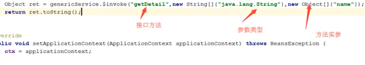
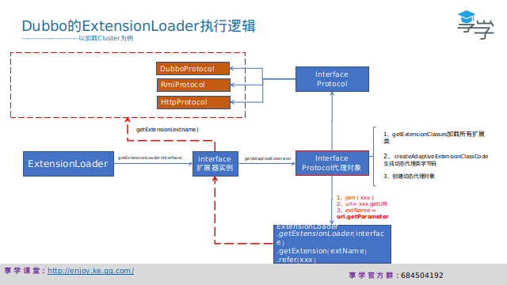
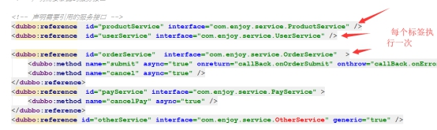
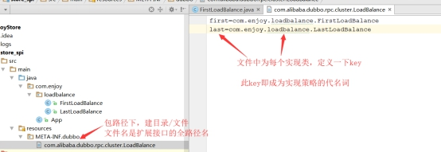
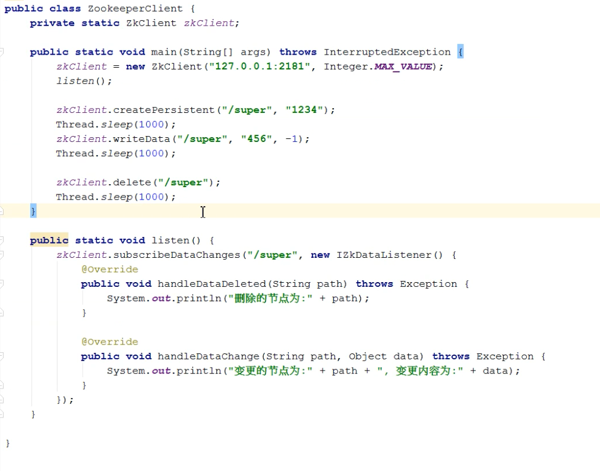

服务端dubbo.xml配置


把服务交给IOC容器管理，然后dubbo把容器中的三个service开放成rpc服务。

消费端dubbo.xml配置


服务方步骤：

1.引入依赖


2.把serviceImpl配置进入spring容器，管理服务，（dubbo）只能支持spring管理的服务

```java
  <!--和本地bean一样实现服务 -->
    <bean id="orderService" class="com.enjoy.service.impl.OrderServiceImpl"/>
    <bean id="userService" class="com.enjoy.service.impl.UserServiceImpl"/>
    <bean id="vipUserService" class="com.enjoy.service.impl.VipUserServiceImpl"/>
```


3.把spring管理的服务转换成rpc服务对外开放

```java
 <!-- 声明需要暴露的服务接口 -->
    <dubbo:service interface="com.enjoy.service.OrderService" ref="orderService" protocol="dubbo">
        <dubbo:method name="getDetail" cache="lru" />
    </dubbo:service>

    <dubbo:service interface="com.enjoy.service.UserService" ref="userService" protocol="rmi"/>
    <dubbo:service interface="com.enjoy.service.VipUserService" ref="vipUserService" />
```


4.启动spring服务容器

```java
public static void main(String[] args) throws IOException {
        /**
         * dubbo.xml
         * dubbo_annotation.xml
         */
        ClassPathXmlApplicationContext context =
                new ClassPathXmlApplicationContext("classpath:dubbo_annotation.xml");
        context.start();

        System.out.println("-----dubbo开启-----");

```


消费者xml方式：

1.引入依赖

2.在spring中配置引用的远程服务

```java
 <!-- 生成远程服务代理，可以和本地bean一样使用demoService -->
    <dubbo:reference id="orderService" interface="com.enjoy.service.OrderService" >
        <dubbo:method name="getDetail" cache="lru" />
    </dubbo:reference>

    <dubbo:reference id="userService" interface="com.enjoy.service.UserService"  />
    <dubbo:reference id="vipUserService" interface="com.enjoy.service.VipUserService"  />
```

3.启动spring容器

4.


这里就是同步转异步，用到Future模式


服务拆分可以分为微服务拆分，就是按照业务将每个服务分离，还是用http调用。

分布式拆分是根据性能的需要，如某个代码文件被访问的比较多，可以将它分离出去，如果用dubbo实现的，就只能够使用dubbo的rpc调用。




常规的项目中不要使用泛化，这只是一个应急措施。


2.引入：建立一个动态代理对象，专门来发送本接口请求信息。

中转对象，跟着代理对象做同样的动作

dubbo代理对象与中转对象（目标）建立的关系，通过URL来传递，URL是整个dubbo里总信息描述符


消费方包装代理对象，在invoker中，做负载路由容错等策略。





## SPI


上堂课回顾

 

1、异步调用 ---- future模式

2、事件机制 --- 异步回调

3、回声测试 --- 服务就绪清单

4、泛化调用 -- 不通过接口类：----- 救急

5、dubbo的rpc过程分析：

 

服务端-- 中转对象 ：protocel网络： 消费端--代理对象

 

本堂课内容：

dubbo初始化过程：

1、标签入口 ---- DubboNamespaceHandler

 

 

2、下面每个配置标签 ---- 对应一个ReferenceBean实例

 

2.1、把dubbo：referencce （dubbo：***\*service同理\****）标签配置的属性，全读出来 ---- set进入ReferenceBean对象，对象实例由IOC容器管理

2.2、ReferenceBean（ServiceBean同理）实现了，initializingBean接口，因此初始化完成时，会调用其afterPropertiesSet方法

 

2.3、afterPropertiesSet方法内，进行dubbo服务配置（创建消费端的代理对象/服务端的中转对象/向zk注册信息/订阅信息等）

 

这里会对标签中设置的每个协议，进行一行处理

 

2.4、协议创建中转对象和消费代理

 

 

2.5、dubbo的初始化结构图：主线是ServiceBean和ReferenceBean的初始化

 

3、spi机制概念

​	-------------本质是解决同一个接口，有多种实现时，使用者如何能够方便选择实现的问题

3.1、同一个接口，多个实现（类似设计模式--策略模式）

 

3.2、看jdk的spi如何配置使用的

 

​	jdk中，选择SpiService的实现，方法是在jar中放置一个META-INF/services目录，目录中存放一个文本文件（文件名----是SpiService接口的全路径名），文本中列入你选择的实现类（一行放一个------是实现类的全路径名）

​	有了上述配置，在java程序中，使用ServiceLoader.load(SpiService.class)，即可将配置中选择的实现类，实例化并放入一个集合中，供我们使用，如下图：

 

 

 

3.3、dubbo的spi  ------ 比jdk的选择方案，要牛叉一点

 

​	与jdk相比，dubbo将选择权下放到了配置文件中（你配置谁，它使为你实例化谁）

这样扩展性就非常强，只需要加上实现类就可以了，然后再在配置文件中使用。

​	dubbo的目标，以上图cluster为例，failsafe/failover/failfast都是cluster的一种实现，现在我	们可以在标签配置时，方便地进行选择

 

4、dubbo中的api的使用流程

4.1、凡是dubbo中， 接口上有 @SPI标注的，都表明此接口支持扩展，如下图

 

4.2、单独建立jar工程，引入dubbo依赖（注意依赖scope设为provided）

 

4.3、在工程中，为要扩展的接口，编写实现类


 

4.4、在资源文件中，为每个实现类，定义分配一个key

 

4.5、在消费端，便可使用上面步骤中定的实现策略（以key指代）

 

5、dubbo的Spi实现原理---解读其核心ExtensionLoader 

5.1、看源码疑云：

 

 

疑问：dubbo中reference 使用的protocol --- 是静态类变量

​	而ReferenceConfig（ReferenceBean的父级）是每个标签一个实例对象（每个对象配置的protocol是不同的）

 

此时protocol的对应一定出问题

这就是使用了ExtensionLoader类加载器实现的 

结论：上面步骤中，得到的protocol是个代理类，不是真实的协议实现


 

5.2、ExtensionLoader的加载步骤


得到的refprotocol是 一个代理类，在后面使用的时候根据代理类的参数不同来决定使用哪个实际的protocol对象。

5.2.1、**getExtensionLoader**(Protocol.***\*class\****)为protocol接口生成一个加载器

5.2.2、getAdaptiveExtension()，使用加载器生成一个代理对象---- protocol接口对象

5.2.3、代理对象执行时，根据参数（扩展名extName）选择实际对象 ------

 

5.2.4、最后的效果：每个接口扩展点----- 对应一个ExtensionLoader加载器，如：

protocol  -------------- ExtensionLoader实例< protocol>

filter  -------------- ExtensionLoader实例< filter  >

loadbalance  -------------- ExtensionLoader实例< loadbalance  >

5.2.5、代理类的逻辑

 

代理类的创建，是通过动态代码，生成一个类源码，然后经过编译得到代理类的class，如上图

 

 

代理类生成源码的逻辑，只生接口中，标注了@Adaptive的方法，如下：

 

5.2.6、dubbo的spi整体执行逻辑

 

a、dubbo启动加载实现类时，以  key-实例 方式map缓存各个实现类

b、实际调用时，通过key --取出需要那个实现

c、调用的发生，由生成的代理对象的来发起，最终是从URL总线中，找出extName值，

  extName做为别说，在缓存map中取出正确的实现实现类


## 发布订阅





