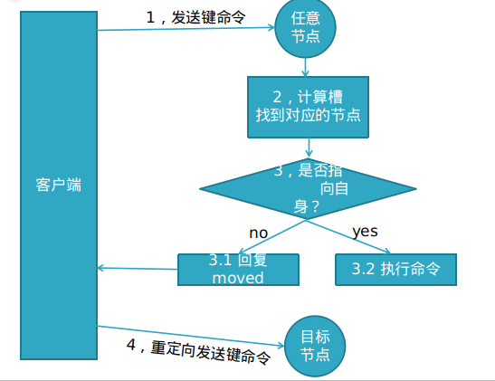

# Redis

redis是一种基于键值对（key-value）数据库，其中value可以为string、hash、list、set、zset（有序集合）等多种数据结构，可以满足很多应用场景。还提供了键过期，发布订阅，事务，流水线等附加功能

特性：
1〉速度快
2〉键值对的数据结构服务器
3〉丰富的功能：
4〉简单稳定
5〉持久化
6〉主从复制
8〉高可用和分布式转移
9〉客户端语言多

redis为什么快：

- c语言实现
- 数据在内存
- 单线程，用于分布式锁，session共享

使用场景：

1，缓存数据库：
2，排行榜
3，计数器应用
4，社交网络
5，消息队列

执行过程：发送指令－〉执行命令－〉返回结果
执行命令：单线程执行，所有命令进入队列，按顺序执行
单线程快原因：纯内存访问， 单线程避免线程切换和竞争产生资源消耗，RESP协议简单
问题：如果某个命令执行慢，会造成其它命令的阻塞

## 字符串：

设值命令：
           set age 23 ex 10  //10秒后过期  px 10000 毫秒过期，用til查看时间
           setnx name test  //不存在键name时，返回1设置成功；存在的话失败0，flashdb：清空 当前的表
           set age 25 xx      //存在键age时，返回1成功

获值命令：get age //存在则返回value, 不存在返回nil

批量设值：mset country china city beijing
批量获取：mget country city address //返回china  beigjin, address为nil

incr age //必须为整数自加1，非整数返回错误，无age键从0自增返回1
decr age //整数age减1
incrby age 2 //整数age+2
decrby age 2//整数age -2
incrbyfloat score 1.1 //浮点型score+1.1

append追加指令：
    set name hello; append name world //追加后成helloworld
字符串长度：
   set hello “世界”；strlen hello//结果6，每个中文占3个字节
截取字符串：
   set name helloworld ; getrange name 2 4//返回 llo

## Hash:

哈希hash是一个string类型的field和value的映射表，hash特适合用于存储对象,key是主键

 命令  hset key field value
   设值：hset user:1 name james         //成功返回1，失败返回0
   取值：hget user:1 name              //返回james
   删值：hdel user:1 age               //返回删除的个数
   计算个数：hset user:1 name james; hset user:1 age 23; 
             hlen user:1               //返回2，user:1有两个属性值
   批量设值：hmset user:2 name james age 23 sex boy //返回OK
   批量取值：hmget user:2 name age sex   //返回三行：james 23 boy  ；hgetall取出所有字段
   判断field是否存在：hexists user:2 name //若存在返回1，不存在返回0
   获取所有field: hkeys user:2            // 返回name age sex三个field
   获取user:2所有value：hvals user:2     // 返回james 23 boy
   获取user:2所有field与value：hgetall user:2 //name age sex james 23 boy值
   增加1：hincrby user:2 age 1      //age+1
          hincrbyfloat user:2 age 2   //浮点型加2

三种方案实现用户信息存储优缺点

1，原生：set user:1:name james;
          set user:1:age  23;
          set user:1:sex boy;
      优点：简单直观，每个键对应一个值
      缺点：键数过多，占用内存多，用户信息过于分散，不用于生产环境

2，将对象序列化存入redis
      set user:1 serialize(userInfo);
      优点：编程简单，若使用序列化合理内存使用率高
      缺点：序列化与反序列化有一定开销，更新属性时需要把userInfo全取出来进行反序列化，更新后再序列化到redis

3，使用hash类型：
        hmset user:1 name james age 23 sex boy
   优点：简单直观，使用合理可减少内存空间消耗
   缺点：要控制ziplist与hashtable两种编码转换，且hashtable会消耗更多内存erialize(userInfo);

## 列表：

用来存储多个有序的字符串，一个列表最多可存2的32次方减1个元素，因为有序，可以通过索引下标获取元素或某个范围内元素列表，列表元素可以重复。

添加命令：
 rpush james c b a //从右向左插入cba, 返回值3
          lrange james 0 -1 //从左到右获取列表所有元素 返回 c b a
          lpush key c b a //从左向右插入cba
          linsert james before b teacher //在b之前插入teacher, after为之后，使用lrange james 0 -1 查看：c teacher b a

查找命令：
 lrange key start end //索引下标特点：从左到右为0到N-1
          lindex james -1 //返回最右末尾a，-2返回b
          llen james        //返回当前列表长度
          lpop james       //把最左边的第一个元素c删除
          rpop james      //把最右边的元素a删除

## 集合：

保存多元素，与列表不一样的是不允许有重复元素，且集合是无序，一个集合最多可存2的32次方减1个元素，除了支持增删改查，还支持集合交集、并集、差集；

 exists user    //检查user键值是否存在
 sadd user a b c//向user插入3个元素，返回3
 sadd user a b  //若再加入相同的元素，则重复无效，返回0
 smembers user //获取user的所有元素,返回结果无序 ，返回a b c 

 srem user a   //返回1，删除a元素

 scard user    //返回2，计算元素个数

标签，社交，查询有共同兴趣爱好的人,智能推荐
  使用方式：
  给用户添加标签：
  sadd user:1:fav basball fball pq
  sadd user:2:fav basball fball   
  ............

  或给标签添加用户
  sadd basball:users user:1 user:2
  sadd fball:users user:1 user:2
  ........

  计算出共同感兴趣的人：
  sinter user:1:fav user2:fav

## ZSET

常用于排行榜，如视频网站需要对用户上传视频做排行榜，或点赞数与集合有联系，不能有重复的成员

指令：   
   zadd key score member [score member......]
   zadd user:zan 200 james //james的点赞数200, 返回操作成功的条数1
   zadd user:zan 200 james 120 mike 100 lee// 返回3

   zadd test:1 nx 100 james   //键test:1必须不存在，主用于添加
   zadd test:1 xx incr 200 james   //键test:1必须存在，主用于修改,此时为300
   zadd test:1 xx ch incr -299 james //返回操作结果1，300-299=1

   zrange test:1 0 -1 withscores  //查看点赞（分数）与成员名

   zcard test:1     //计算成员个数， 返回1

排名场景：
   zadd user:3 200 james 120 mike 100 lee//先插入数据
   zrange user:3 0 -1 withscores //查看分数与成员

  zrank user:3 james  //返回名次：第3名返回2，从0开始到2，共3名
  zrevrank user:3 james //返回0， 反排序，点赞数越高，排名越前

 排行榜系统，如视频网站需要对用户上传的视频做排行榜
   点赞数：
           zadd user:1:20180106 3 mike  //mike获得3个赞
   再获一赞：
           zincrby user:1:20180106 1 mike  //在3的基础上加1
   用户作弊，将用户从排行榜删掉：
           zrem user:1:20180106 mike
   展示赞数最多的5个用户：
           zrevrangebyrank user:1:20180106  0  4 
   查看用户赞数与排名：
           zscore user:1:20180106 mike   zrank user:1:20180106 mike

## Redis全局命令：

   1，查看所有键：
             keys *  

​			 set school enjoy 
   2，键总数 ：
​             dbsize       //2个键，如果存在大量键，线上禁止使用此指令
   3，检查键是否存在：
​             exists key  //存在返回1，不存在返回0
   4，删除键：
​             del key      //del hello school, 返回删除键个数，删除不存在键返回0
   5，键过期：
​             expire key seconds        //

set name test  

expire name 10,表示10秒过期
​               ttl key                            // 查看剩余的过期时间
   6，键的数据结构类型：
​             type key //type hello     //返回string,键不存在返回none

## Redis慢查询

与mysql一样:当执行时间超过阀值，会将发生时间 耗时 命令记录

redis命令生命周期：发送 排队 执行 返回，慢查询只统计第3个执行步骤的时间

### 阈值：

1，动态设置:> config set slowlog-log-slower-than 10000  //10毫秒
   使用config set完后,若想将配置持久化保存到redis.conf，要执行config rewrite 

2，redis.conf修改：找到slowlog-log-slower-than 10000 ，修改保存即可
    注意：slowlog-log-slower-than =0记录所有命令； -1命令都不记录

慢查询记录也是存在队列里的，slow-max-len 存放的记录最大条数，比如设置的slow-max-len＝10，当有第11条慢查询命令插入时，队列的第一条命令就会出列，第11条入列到慢查询队列中， 可以config set动态设置，也可以修改redis.conf完成配置。

### 慢查询命令：

获取队列里慢查询的命令：slowlog get
获取慢查询列表当前的长度：slowlog len  //以上只有1条慢查询，返回1；
          1，对慢查询列表清理（重置）：slowlog reset //再查slowlog len 此时返回0 清空；
         2，对于线上slow-max-len配置的建议：线上可加大slow-max-len的值，记录慢查询存长命令时redis会做截断，不会占用大量内存，线上可设置1000以上
          3，对于线上slowlog-log-slower-than配置的建议：默认为10毫秒，根据redis并发量来调整，对于高并发比建议为1毫秒
          4，慢查询是先进先出的队列，访问日志记录出列丢失，需定期执行slow get,将结果存储到其它设备中（如mysql）

order.sql:

### redis-cli:

./redis-cli -r 3 -a 12345678 ping //返回pong表示127.0.0.1:6379能通，正常
./redis-cli -r 100 -i 1 info |grep used_memory_human //每秒输出内存使用量,输100次
./redis-cli -p 6379 -a 12345678
对于我们来说，这些常用指令以上可满足，但如果要了解更多
执行redis-cli --help, 可百度

### redisserver:

./redis-server ./redis.conf &  //指定配置文件启动 &指在后台运行
 ./redis-server --test-memory 1024 //检测操作系统能否提供1G内存给redis, 常用于测试，想快速占满机器内存做极端条件的测试，可使用这个指令

### redis-benchmark:

测试性能

redis-benchmark -c 100 -n 10000
测试命令事例：
1、redis-benchmark -h 192.168.42.111 -p 6379 -c 100 -n 100000 
100个并发连接，100000个请求，检测host为localhost 端口为6379的redis服务器性能 
2、redis-benchmark -h 192.168.42.111 -p 6379 -q -d 100  
测试存取大小为100字节的数据包的性能

3、redis-benchmark -t set,lpush -n 100000 -q
只测试 set,lpush操作的性能

4、redis-benchmark -n 100000 -q script load "redis.call('set','foo','bar')"
只测试某些数值存取的性能

### pipeline:

pipeline出现的背景：
redis客户端执行一条命令分4个过程：
      发送命令－〉命令排队－〉命令执行－〉返回结果
这个过程称为Round trip time(简称RTT, 往返时间)，mget mset有效节约了RTT，但大部分命令（如hgetall，并没有mhgetall）不支持批量操作，需要消耗N次RTT ，这个时候需要pipeline来解决这个问题

### 原生批命令(mset, mget)与Pipeline对比：

one,原生批命令是原子性，pipeline是非原子性， 
 (原子性概念:一个事务是一个不可分割的最小工作单位,要么都成功要么都失败。
原子操作是指你的一个业务逻辑必须是不可拆分的. 处理一件事情要么都成功
要么都失败，其实也引用了生物里概念，分子－〉原子，原子不可拆分)

two,原生批命令一命令多个key, 但pipeline支持多命令（存在事务），非原子性

three: 原生批命令是服务端实现，而pipeline需要服务端与客户端共同完成

使用pipeline组装的命令个数不能太多，不然数据量过大，增加客户端的等待时间，还可能造成网络阻塞，
可以将大量命令的拆分多个小的pipeline命令完成

### redis事务

pipeline是多条命令的组合，为了保证它的原子性，redis提供了简单的事务，。
redis的简单事务，将一组需要一起执行的命令放到multi和exec两个命令之间，其中multi代表事务开始，exec代表事务提交 ，discard是事务停止
watch命令：使用watch后， multi失效，事务失效

总结：redis提供了简单的事务，不支持事务回滚

### 发布订阅

redis主要提供发布消息、订阅频道、取消订阅以及按照模式订阅和取消订阅，和很多专业的消息队列（kafka rabbitmq）,redis的发布订阅显得很lower, 比如无法实现消息规程和回溯， 但就是简单，如果能满足应用场景，用这个也可以

1，发布消息：
   publish channel:test "hello world"

2，订阅消息
   subscrible channel:test

3，查看订阅数
   pubsub numsub channel:test

4，取消订阅
   unsubscribe channel:test

5，按模式订阅和取消订阅
   psubscribe ch* 

   punsubscribe ch*

## 持久化

### RDB

redis是一个支持持久化的内存数据库,也就是说redis需要经常将内存中的数据同步到磁盘来保证持久化，持久化可以避免因进程退出而造成数据丢失；

RDB持久化把当前进程数据生成快照（.rdb）文件（二进制的数据文件）保存到硬盘的过程，有手动触发和自动触发
   手动触发有save和bgsave两命令 
   save命令：阻塞当前Redis，直到RDB持久化过程完成为止，若内存实例比较大会造成长时间阻塞，线上环境不建议用它
   bgsave命令：redis进程执行fork操作创建子线程，由子线程完成持久化，阻塞时间很短（微秒级），是save的优化,在执行redis-cli shutdown关闭redis服务时，如果没有开启AOF持久化，自动执行bgsave;

  命令：config set dir /usr/local  //设置rdb文件保存路径
   备份：bgsave  //将dump.rdb保存到usr/local下
   恢复：将dump.rdb放到redis安装目录与redis.conf同级目录，重启redis即可
   优点：1，压缩后的二进制文，适用于备份、全量复制，用于灾难恢复
         2，加载RDB恢复数据远快于AOF方式
   缺点：1，无法做到实时持久化，每次都要创建子进程，频繁操作成本过高
         2，保存后的二进制文件，存在老版本不兼容新版本rdb文件的问题

### AOF

  针对RDB不适合实时持久化，redis提供了AOF持久化方式来解决
  开启：redis.conf设置：appendonly yes  (默认不开启，为no)
  默认文件名：appendfilename "appendonly.aof"  ,appendonly.aof这个文件中保存的是redis命令通过RESP协议转换后的语句。

 AOF持久化流程说明：
         1，所有的写入命令(set hset)会append追加到aof_buf缓冲区中
         2，AOF缓冲区向硬盘做sync同步
         3，随着AOF文件越来越大，需定期对AOF文件rewrite重写，达到压缩
         4，当redis服务重启，可load加载AOF文件进行恢复

AOF配置详解：

appendonly yes           //启用aof持久化方式
appendfsync always //每收到写命令就立即强制写入磁盘，最慢的，但是保证完全的持久化，不推荐使用
appendfsync everysec //每秒强制写入磁盘一次，性能和持久化方面做了折中，推荐
appendfsync no         //完全依赖os，性能最好,持久化没保证（操作系统自身的同步）
no-appendfsync-on-rewrite  yes  //正在导出rdb快照的过程中,要不要停止同步aof
auto-aof-rewrite-percentage 100  //aof文件大小比起上次重写时的大小,增长率100%时,重写
auto-aof-rewrite-min-size 64mb   //aof文件,至少超过64M时,重写(压缩)

恢复：

1. 设置appendonly yes；
2. 将appendonly.aof放到dir参数指定的目录；
3. 启动Redis，Redis会自动加载appendonly.aof文件。

redis重启时加载AOF与RDB的顺序

### Redis主从复制

a,方式一、新增redis6380.conf, 加入  slaveof 192.168.42.111 6379,  在6379启动完后再启6380，完成配置；
   b,方式二、redis-server --slaveof 192.168.42.111 6379
   c,查看状态：info replication
   d,断开主从复制：在slave节点，执行6380:>slaveof no one
   e,断开后再变成主从复制：6380:> slaveof 192.168.42.111 6379
   f,数据较重要的节点，主从复制时使用密码验证： requirepass
   e,从节点建议用只读模式slave-read-only=yes, 若从节点修改数据，主从数据不一致       

### 数据同步

redis 2.8版本以上使用psync命令完成同步，过程分“全量”与“部分”复制
全量复制：
     一般用于初次复制场景（第一次建立SLAVE后全量）
部分复制：
    网络出现问题，从节点再次连主时，主节点补发缺少的数据，每次数据增加同步
心跳：
     主从有长连接心跳，主节点默认每10S向从节点发ping命令，repl-ping-slave-period控制发送频率

## 哨兵

哨兵的介绍

sentinel，中文名是哨兵。哨兵是 redis 集群机构中非常重要的一个组件，主要有以下功能：

集群监控：负责监控 redis master 和 slave 进程是否正常工作。
消息通知：如果某个 redis 实例有故障，那么哨兵负责发送消息作为报警通知给管理员。
故障转移：如果 master node 挂掉了，会自动转移到 slave node 上。
配置中心：如果故障转移发生了，通知 client 客户端新的 master 地址。
哨兵用于实现 redis 集群的高可用，本身也是分布式的，作为一个哨兵集群去运行，互相协同工作。

故障转移时，判断一个 master node 是否宕机了，需要大部分的哨兵都同意才行，涉及到了分布式选举的问题。
即使部分哨兵节点挂掉了，哨兵集群还是能正常工作的，因为如果一个作为高可用机制重要组成部分的故障转移系统本身是单点的，那就很坑爹了。
哨兵的核心知识

哨兵至少需要 3 个实例，来保证自己的健壮性。
哨兵 + redis 主从的部署架构，是不保证数据零丢失的，只能保证 redis 集群的高可用性。
对于哨兵 + redis 主从这种复杂的部署架构，尽量在测试环境和生产环境，都进行充足的测试和演练。

### 高可用

解释1：它与被认为是不间断操作的容错技术有所不同。是目前企业防止核心系统因故障而无法工作的最有效保护手段

解释2：高可用一般指服务的冗余，一个服务挂了，可以自动切换到另外一个服务上，不影响客户体验。

1，主从复制，若主节点出现问题，则不能提供服务，需要人工修改配置将从变主
2，主从复制主节点的写能力单机，能力有限
3，单机节点的存储能力也有限

### 主从故障如何故障转移

   A，主节点(master)故障，从节点slave-1端执行 slaveof no one后变成新主节点；
    B，其它的节点成为新主节点的从节点，并从新节点复制数据；
    C，需要人工干预，无法实现高可用。

### 哨兵机制(sentinel)的高可用

原理：当主节点出现故障时，由Redis Sentinel自动完成故障发现和转移，并通知应用方，实现高可用性。

Sentinel必须是奇数个，因为有投票机制。Sentinel不停的向节点发送消息，检查节点的心跳，如果两个Sentinel认为这个节点反应慢，它就不会成为主节点。

主观下线：一个哨兵认为这个节点不行了

客观下线：超过一半的哨兵认为这个节点不行了

### 领导者哨兵选举流程

### 故障转移流程

1.发现主节点不行了，需要下线

2.选出哨兵中的领导者，负载处理主节点的故障转移

3.由领导者节点执行故障转移，过程和主从复制一样，但是自动执行

## 分布式

分布式数据库把整个数据按分区规则映射到多个节点，即把数据划分到多个节点上，每个节点负责整体数据的一个子集。
比如我们库有900条用户数据，有3个redis节点，将900条分成3份，分别存入到3个redis节点

### 分区规则

常见的分区规则哈希分区和顺序分区，redis集群使用了哈希分区，顺序分区暂用不到，不做具体说明；
 RedisCluster采用了哈希分区的“虚拟槽分区”方式（哈希分区分节点取余、一致性哈希分区和虚拟槽分区）。

https://www.jianshu.com/p/4163916a2a8a 虚拟槽和一致性hash的对比

#### 虚拟槽分区

槽：slot
RedisCluster采用此分区，所有的键根据哈希函数(CRC16[key]&16383)映射到0－16383槽内，共16384个槽位，每个节点维护部分槽及槽所映射的键值数据

槽、键、数据关系

### RedisCluster的缺陷

a，键的批量操作支持有限，比如mset, mget，如果多个键映射在不同的槽，就不支持了   mset name james age 19
b，键事务支持有限，当多个键分布在不同节点时无法使用事务，同一节点是支持事务
c，键是数据分区的最小粒度，不能将一个很大的键值对映射到不同的节点
d，不支持多数据库，只有0，select 0
e，复制结构只支持单层结构，不支持树型结构。

### 集群节点之间的通信

节点之间采用Gossip协议进行通信，Gossip协议就是指节点彼此之间不断通信交换信息

#### Gossip协议

Gossip协议的主要职责就是信息交换，信息交换的载体就是节点之间彼此发送的Gossip消息，常用的Gossip消息有ping消息、pong消息、meet消息、fail消息
meet消息：用于通知新节点加入，消息发送者通知接收者加入到当前集群，meet消息通信完后，接收节点会加入到集群中，并进行周期性ping pong交换
ping消息：集群内交换最频繁的消息，集群内每个节点每秒向其它节点发ping消息，用于检测节点是在在线和状态信息，ping消息发送封装自身节点和其他节点的状态数据；
pong消息，当接收到ping meet消息时，作为响应消息返回给发送方，用来确认正常通信，pong消息也封闭了自身状态数据；
fail消息：当节点判定集群内的另一节点下线时，会向集群内广播一个fail消息

以上的所有消息格式为：消息头、消息体，消息头包含发送节点自身状态数据（比如节点ID、槽映射、节点角色、是否下线等），接收节点根据消息头可以获取到发送节点的相关数据。

### 路由重定向

### 故障转移主观下线

### 故障转移客观下线

