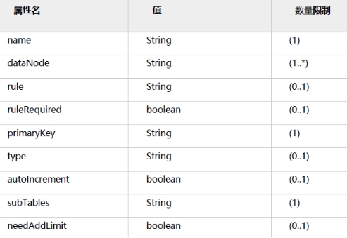
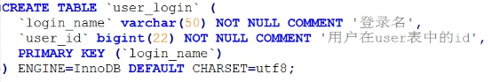
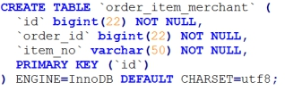

#  Mycat 概述  

Mycat 是什么？从定义和分类来看，它是一个开源的分布式数据库系统，是一个实现了MySQL 协议的的Server，前端用户可以把它看作是一个数据库代理，用MySQL 客户端工具和命令行访问，而其后端可以用MySQL 原生（Native）协议与多个MySQL 服务器通信，也可以用JDBC 协议与大多数主流数据库服务器通信，其核心功能是分表分库，即将一个大表水平分割为N 个小表，存储在后端MySQL 服务器里或者其他数据库里。

Mycat 发展到目前的版本，已经不是一个单纯的MySQL 代理了，它的后端可以支持MySQL、SQLServer、Oracle、DB2、PostgreSQL 等主流数据库，也支持MongoDB 这种新型NoSQL 方式的存储，未来还会支持更多类型的存储。而在最终用户看来，无论是那种存储方式，在Mycat 里，都是一个传统的数据库表，支持标准的SQL 语句进行数据的操作，这样一来，对前端业务系统来说，可以大幅降低开发难度，提升开发速度。

对于DBA 来说，可以这么理解Mycat：

Mycat 就是MySQL Server，而Mycat 后面连接的MySQL Server，就好象是MySQL 的存储引擎,如InnoDB，MyISAM 等，因此，Mycat 本身并不存储数据，数据是在后端的MySQL 上存储的，因此数据可靠性以及事务等都是MySQL 保证的。

对于软件工程师来说，可以这么理解Mycat：

Mycat 就是一个近似等于MySQL 的数据库服务器，可以用连接MySQL 的方式去连接Mycat（除了端口不同，默认的Mycat 端口是8066 而非MySQL 的3306，因此需要在连接字符串上增加端口信息），大多数情况下，可以用你熟悉的对象映射框架使用Mycat。

对于架构师来说，可以这么理解Mycat：

Mycat 是一个强大的数据库中间件，不仅仅可以用作读写分离、以及分表分库、容灾备份，而且可以用于多租户应用开发、云平台基础设施、让你的架构具备很强的适应性和灵活性。

#  Mycat 原理  

Mycat 的原理中最重要的一个动词是“拦截”，它拦截了用户发送过来的SQL 语句，首先对SQL 语句做了一些特定的分析：如分片分析、路由分析、读写分离分析、缓存分析等，然后将此SQL 发往后端的真实数据库，

并将返回的结果做适当的处理，最终再返回给用户。

 

Orders 表被分为三个分片datanode（简称dn)，这三个分片是分布在两台MySQL Server 上(DataHost)，即datanode=database@datahost 方式，因此你可以用一台到N 台服务器来分片，分片规则为（sharding rule)典型的字符串枚举分片规则，一个规则的定义是分片字段（sharding column)+分片函数(rulefunction)，这里的分片字段为prov 而分片函数为字符串枚举方式。

当Mycat 收到一个SQL 时，会先解析这个SQL，查找涉及到的表，然后看此表的定义，如果有分片规则，则获取到SQL 里分片字段的值，并匹配分片函数，得到该SQL 对应的分片列表，然后将SQL 发往这些分片去执行，最后收集和处理所有分片返回的结果数据，并输出到客户端。以select * from Orders where prov=?语句为例，查到prov=wuhan，按照分片函数，wuhan 返回dn1，于是SQL 就发给了MySQL1，去取DB1 上的查询结果，并返回给用户。

如果上述SQL 改为select * from Orders where prov in (‘wuhan’,‘beijing’)，那么，SQL 就会发给MySQL1 与MySQL2 去执行，然后结果集合并后输出给用户。但通常业务中我们的SQL 会有Order By 以及Limit 翻页语法，此时就涉及到结果集在Mycat 端的二次处理。

#  常见概念 

##  逻辑库  (schema) 

通常对实际应用来说，并不需要知道中间件的存在，业务开发人员只需要知道数据库的概念，所以数据库中间件可以被看做是一个或多个数据库集群构成的逻辑库。

##  逻辑表（  table    ） 

既然有逻辑库，那么就会有逻辑表，分布式数据库中，对应用来说，读写数据的表就是逻辑表。逻辑表，可以是数据切分后，分布在一个或多个分片库中，也可以不做数据切分，不分片，只有一个表构成。

###  分片表 

分片表，是指那些原有的很大数据的表，需要切分到多个数据库的表，这样，每个分片都有一部分数据，所有分片构成了完整的数据。

###  非分片表 

一个数据库中并不是所有的表都很大，某些表是可以不用进行切分的，非分片是相对分片表来说的，就是那些不需要进行数据切分的表。

###  ER     表 

关系型数据库是基于实体关系模型（Entity-Relationship Model)之上，通过其描述了真实世界中事物与关系，Mycat 中的ER 表即是来源于此。根据这一思路，提出了基于E-R 关系的数据分片策略，子表的记录与所关联的父表记录存放在同一个数据分片上，即子表依赖于父表，通过表分组（Table Group）保证数据Join 不会跨库操作。

表分组（Table Group）是解决跨分片数据join 的一种很好的思路，也是数据切分规划的重要一条规则。

###  全局表 

一个真实的业务系统中，往往存在大量的类似字典表的表，这些表基本上很少变动，字典表具有以下几个特性：

• 变动不频繁；

• 数据量总体变化不大；

• 数据规模不大，很少有超过数十万条记录。

对于这类的表，在分片的情况下，当业务表因为规模而进行分片以后，业务表与这些附属的字典表之间的关联，就成了比较棘手的问题，所以Mycat 中通过数据冗余来解决这类表的join，即所有的分片都有一份数据的拷贝，所有将字典表或者符合字典表特性的一些表定义为全局表。

数据冗余是解决跨分片数据join 的一种很好的思路，也是数据切分规划的另外一条重要规则。

##  分片节点  (dataNode) 

数据切分后，一个大表被分到不同的分片数据库上面，每个表分片所在的数据库就是分片节点（dataNode）。

##  节点主机  (dataHost) 

数据切分后，每个分片节点（dataNode）不一定都会独占一台机器，同一机器上面可以有多个分片数据库，这样一个或多个分片节点（dataNode）所在的机器就是节点主机（dataHost）,为了规避单节点主机并发数限制，尽量将读写压力高的分片节点（dataNode）均衡的放在不同的节点主机（dataHost）。

##  分片规则  (rule) 

前面讲了数据切分，一个大表被分成若干个分片表，就需要一定的规则，这样按照某种业务规则把数据分到某个分片的规则就是分片规则，数据切分选择合适的分片规则非常重要，将极大的避免后续数据处理的难度。

##  全局序列号  (sequence) 

数据切分后，原有的关系数据库中的主键约束在分布式条件下将无法使用，因此需要引入外部机制保证数据唯一性标识，这种保证全局性的数据唯一标识的机制就是全局序列号（sequence）雪花算法。

用数据库实现的思路：单独使用一个表，专门用来生成id,其他的表插入时向这个表中拿id,一次拿一千个放在缓存中。多个线程竞争时使用乐观锁CAS.

#  Mycat安装与部署  

MyCAT 是使用JAVA 语言进行编写开发，使用前需要先安装JAVA 运行环境(JRE),由于MyCAT 中使用了JDK7 中的一些特性，所以要求必须在JDK7 以上的版本上运行。同时Mysql建议使用5.5以上版本，5.6为宜。

进入https://github.com/MyCATApache/Mycat-download或http://dl.mycat.io/，在列表中选择一个合适自己操作系统的包下载，然后解压在某个目录下。

Mycat是个标准的Java程序，解压后即可运行。Linux下执行 mycat ，windows下执行 startup_nowrap.bat

在Mycat的目录中：

 

bin 程序目录，存放了启动脚本，除了提供封装成服务的版本之外，也提供了nowrap 的脚本命令。

注：mycat 支持的命令{ console | start | stop | restart | status | dump }

conf 目录下存放配置文件，server.xml 是Mycat 服务器参数调整和用户授权的配置文件，schema.xml 是逻辑库定义和表以及分片定义的配置文件，rule.xml 是分片规则的配置文件，分片规则的具体一些参数信息单独存放为文件，也在这个目录下，配置文件修改，需要重启Mycat 或者通过9066 端口reload.

lib 目录下主要存放mycat 依赖的一些jar 文件.

日志存放在logs/mycat.log 中，每天一个文件，日志的配置是在conf/log4j.xml 中，根据自己的需要，可以调整输出级别为debug，debug 级别下，会输出更多的信息，方便排查问题。

##  管理命令 

MyCAT 自身有类似其他数据库的管理监控方式，可以通过Mysql 命令行，登录管理端口（9066）执行相应的SQL 进行管理，也可以通过jdbc 的方式进行远程连接管理。

登录：目前mycat 有两个端口，8066 数据端口，9066 管理端口，命令行的登陆是通过9066 管理端口来操作，登录方式类似于mysql 的服务端登陆。

mysql -h127.0.0.1 -utest -ptest -P9066 [-dmycat]

-h 后面是主机，即当前mycat 按照的主机地址，本地可用127.0.0.1 远程需要远程ip

-u Mycat server.xml 中配置的逻辑库用户

-p Mycat server.xml 中配置的逻辑库密码

-P 后面是端口默认9066，注意P 是大写

-d Mycat server.xml 中配置的逻辑库

 show @@help;    可以查看所有的命令

 reload @@config;   该命令用于更新配置文件，例如更新schema.xml 文件后在命令行窗口输入该命令，可不用重启即进行配置文件更新。

 show @@database;   该命令用于显示MyCAT 的数据库的列表，对应schema.xml 配置文件的schema 子节点

 show @@datanode;   该命令用于显示MyCAT 的数据节点的列表，对应schema.xml 配置文件的dataNode 节点，其中，“NAME”表示dataNode 的名称；“dataHost”表示对应dataHost 属性的值，即数据主机；“ACTIVE”表示活跃连接数；“IDLE”表示闲置连接数；“SIZE”对应总连接数量。

运行如下命令，可查找对应的schema 下面的dataNode 列表：

show @@datanode where schema = ?

 show @@version   该命令用于获取MyCAT 的版本

 show @@connection   该命令用于获取Mycat 的前端连接状态，即应用与mycat 的连接

 kill @@connection id,id,id   用于杀掉连接。

 show @@backend   查看后端连接状态。

 show @@sql ;    用来记录用户通过本地8066 端口向Mycat-Server 发送的SQL 请求执行

信息

 show @@sql.slow ;    请求执行SQL 语句中超过慢SQL 时间阈值的（reload @@sqlslow=0 ; # 是的这条命令就是刚才提到的'如何设定慢SQL' 时间阈值的命令）

 show @@sql.sum ;    执行的SQL 命令的统计信息数据

#  Mycat配置详解  

##  schema.xml   

Schema.xml 作为MyCat 中重要的配置文件之一，管理着MyCat 的逻辑库、表、分片规则、DataNode 以及DataSource。弄懂这些配置，是正确使用MyCat 的前提。

###  schema     标签 

<schema name="TESTDB" checkSQLschema="false" sqlMaxLimit="100"></schema>

schema 标签用于定义MyCat 实例中的逻辑库，MyCat 可以有多个逻辑库，每个逻辑库都有自己的相关配置。可以使用schema 标签来划分这些不同的逻辑库。

如果不配置schema 标签，所有的表配置，会属于同一个默认的逻辑库。

 

如上所示的配置就配置了两个不同的逻辑库，逻辑库的概念和MYSQL 数据库中Database 的概念相同，我们在查询这两个不同的逻辑库中表的时候需要切换到该逻辑库下才可以查询到所需要的表。

 schema     标签的相关属性： 

 

 dataNode   

该属性用于绑定逻辑库到某个具体的database 上，具体如下配置:

<schema name="USERDB" checkSQLschema="false" sqlMaxLimit="100" dataNode="dn2">

<!—配置需要分片的表-->

<table name=“tuser” dataNode=”dn1”/>

</schema>

那么现在tuser 就绑定到dn1 所配置的具体database 上，可以直接访问这个database,没有配置的表则会走默认节点dn2，这里注意没有配置在分片里面的表工具查看无法显示，但是可以正常使用。

 checkSQLschema   

当该值设置为true 时，如果我们执行语句select * from TESTDB.travelrecord;则MyCat 会把语句修改为select * from travelrecord;。即把表示schema 的字符去掉，避免发送到后端数据库执行时报错。

不过，即使设置该值为true ，如果语句所带的是并非是schema 指定的名字，例如：**select * from db1.travelrecord;** 那么MyCat 并不会删除db1 这个字段，如果没有定义该库的话则会报错，所以在提供SQL语句的最好是不带这个字段。

 sqlMaxLimit   

当该值设置为某个数值时。每条执行的SQL 语句，如果没有加上limit 语句，MyCat 也会自动的加上所对应的值。例如设置值为100，执行**select * from TESTDB.travelrecord;**的效果为和执行**select * from TESTDB.travelrecord limit 100;**相同。

不设置该值的话，MyCat 默认会把查询到的信息全部都展示出来，造成过多的输出。所以，在正常使用中，还是建议加上一个值，用于减少过多的数据返回。

当然SQL 语句中也显式的指定limit 的大小，不受该属性的约束。

###  table     标签 

 Table    标签定义了MyCat 中的逻辑表，所有需要拆分的表都需要在这个标签中定义。

 table     标签的相关属性： 

 

 name     属性 

定义逻辑表的表名，这个名字就如同我们在数据库中执行create table 命令指定的名字一样，同个schema 标签中定义的名字必须唯一。

 dataNode     属性 

定义这个逻辑表所属的dataNode, 该属性的值需要和dataNode 标签中name 属性的值相互对应。如果需要定义的dn 过多可以使用如下的方法减少配置：

 

 rule     属性 

该属性用于指定逻辑表要使用的规则名字，规则名字在rule.xml 中定义，必须与tableRule 标签中name 属性属性值一一对应。

 ruleRequired     属性 

该属性用于指定表是否绑定分片规则，如果配置为true，但没有配置具体rule 的话，程序会报错。

 primaryKey     属性 

该逻辑表对应真实表的主键，例如：分片的规则是使用非主键进行分片的，那么在使用主键查询的时候，就会发送查询语句到所有配置的DN 上，如果使用该属性配置真实表的主键。难么MyCat 会缓存主键与具体DN 的信息，那么再次使用非主键进行查询的时候就不会进行广播式的查询，就会直接发送语句给具体的DN，但是尽管配置该属性，如果缓存并没有命中的话，还是会发送语句给具体的DN，来获得数据。

 type     属性 

该属性定义了逻辑表的类型，目前逻辑表只有“全局表”和”普通表”两种类型。对应的配置：

· 全局表：global。

· 普通表：不指定该值为globla 的所有表。

 autoIncrement     属性 

mysql 对非自增长主键，使用last_insert_id()是不会返回结果的，只会返回0。所以，只有定义了自增长主键的表才可以用last_insert_id()返回主键值。

mycat 目前提供了自增长主键功能，但是如果对应的mysql 节点上数据表，没有定义auto_increment，那么在mycat 层调用last_insert_id()也是不会返回结果的。

由于insert 操作的时候没有带入分片键，mycat 会先取下这个表对应的全局序列，然后赋值给分片键。这样才能正常的插入到数据库中，最后使用last_insert_id()才会返回插入的分片键值。如果要使用这个功能最好配合使用数据库模式的全局序列。

使用autoIncrement=“true” 指定这个表有使用自增长主键，这样mycat 才会不抛出分片键找不到的异常。

使用autoIncrement=“false” 来禁用这个功能，当然你也可以直接删除掉这个属性。默认就是禁用的。

 subTables   

使用方式添加subTables="t_order$1-2,t_order3"。

目前分表1.6 以后开始支持并且dataNode 在分表条件下只能配置一个，分表条件下不支持各种条件的join 语句。

 needAddLimit     属性 

指定表是否需要自动的在每个语句后面加上limit 限制。由于使用了分库分表，数据量有时会特别巨大。这时候执行查询语句，如果恰巧又忘记了加上数量限制的话。那么查询所有的数据出来，也够等上一小会儿的。

所以，mycat 就自动的为我们加上LIMIT 100。当然，如果语句中有limit，就不会在次添加了。这个属性默认为true,你也可以设置成false禁用掉默认行为。

###  childTable     标签 

childTable 标签用于定义E-R 分片的子表。通过标签上的属性与父表进行关联。

 childTable     标签的相关属性： 

 

 name     属性 

定义子表的表名。

 joinKey     属性 

插入子表的时候会使用这个列的值查找父表存储的数据节点。

 parentKey     属性 

属性指定的值一般为与父表建立关联关系的列名。程序首先获取joinkey 的值，再通过 parentKey    属性指定的列名产生查询语句，通过执行该语句得到父表存储在哪个分片上。从而确定子表存储的位置。

 primaryKey     属性 

同table 标签所描述的。

 needAddLimit     属性 

同table 标签所描述的。

###  dataNode     标签 

<dataNode name="dn1" dataHost="lch3307" database="db1" ></dataNode>

 dataNode    标签定义了MyCat 中的数据节点，也就是我们通常说所的数据分片。一个 dataNode    标签就是一个独立的数据分片。

例子中所表述的意思为：使用名字为lch3307 数据库实例上的db1 物理数据库，这就组成一个数据分片，最后，我们使用名字dn1 标识这个分片。

 dataNode     标签的相关属性： 

 

 name     属性 

定义数据节点的名字，这个名字需要是唯一的，我们需要在table 标签上应用这个名字，来建立表与分片对应的关系。

 dataHost     属性 

该属性用于定义该分片属于哪个数据库实例的，属性值是引用dataHost 标签上定义的name 属性。

 database     属性 

该属性用于定义该分片属性哪个具体数据库实例上的具体库，因为这里使用两个纬度来定义分片，就是：实例+具体的库。因为每个库上建立的表和表结构是一样的。所以这样做就可以轻松的对表进行水平拆分。

###  dataHost     标签 

作为Schema.xml 中最后的一个标签，该标签在mycat 逻辑库中也是作为最底层的标签存在，直接定义了具体的数据库实例、读写分离配置和心跳语句。

 dataHost     标签的相关属性： 

 

 name     属性 

唯一标识dataHost 标签，供上层的标签使用。

 maxCon     属性 

指定每个读写实例连接池的最大连接。也就是说，标签内嵌套的writeHost、readHost 标签都会使用这个属性的值来实例化出连接池的最大连接数。

 minCon     属性 

指定每个读写实例连接池的最小连接，初始化连接池的大小。

 balance     属性 

负载均衡类型，目前的取值有：

\1. balance="0", 不开启读写分离机制，所有读操作都发送到当前可用的writeHost 上。

\2. balance="1"，全部的readHost 与stand by writeHost 参与select 语句的负载均衡，简单的说，当双

主双从模式(M1->S1，M2->S2，并且M1 与M2 互为主备)，正常情况下，M2,S1,S2 都参与select 语句的负载均衡。

\3. balance="2"，所有读操作都随机的在writeHost、readhost 上分发。

\4. balance="3"，所有读请求随机的分发到wiriterHost 对应的readhost 执行，writerHost 不负担读压力，注意balance=3 只在1.4 及其以后版本有。

 writeType     属性 

负载均衡类型，目前的取值有2种：

\1. writeType="0", 所有写操作发送到配置的第一个writeHost，第一个挂了切到还生存的第二个writeHost，重新启动后已切换后的为准，切换记录在配置文件中:dnindex.properties .

\2. writeType="1"，所有写操作都随机的发送到配置的writeHost，1.5 以后废弃不推荐。

 dbType     属性 

指定后端连接的数据库类型，目前支持二进制的mysql 协议，还有其他使用JDBC 连接的数据库。例如：mongodb、oracle、spark 等。

 dbDriver     属性 

指定连接后端数据库使用的Driver，目前可选的值有native 和JDBC。使用native 的话，因为这个值执行的是二进制的mysql 协议，所以可以使用mysql 和maridb。其他类型的数据库则需要使用JDBC 驱动来支持。

从1.6 版本开始支持postgresql 的native 原始协议。

如果使用JDBC 的话需要将符合JDBC 4 标准的驱动JAR 包放到MYCAT\lib 目录下，并检查驱动JAR 包中包括如下目录结构的文件：META-INF\services\java.sql.Driver。在这个文件内写上具体的Driver 类名，例如：

com.mysql.jdbc.Driver。

 switchType     属性 

-1 表示不自动切换

1 默认值，自动切换

2 基于MySQL 主从同步的状态决定是否切换

心跳语句为show slave status

3 基于MySQL galary cluster 的切换机制（适合集群）（1.4.1）

心跳语句为show status like ‘wsrep%’

 slaveThreshold    属性 

Mycat 心跳机制通过检测show slave status 中的"Seconds_Behind_Master", "Slave_IO_Running","Slave_SQL_Running" 三个字段来确定当前主从同步的状态以及Seconds_Behind_Master 主从复制时延，当Seconds_Behind_Master>slaveThreshold 时，读写分离筛选器会过滤掉此Slave 机器，防止读到很久之前的旧数据。

####  *heartbeat\**\***  *标签\**\***

这个标签内指明用于和后端数据库进行心跳检查的语句。例如,MYSQL 可以使用select user()，Oracle 可以使用select 1 from dual 等。

这个标签还有一个connectionInitSql 属性，主要是当使用Oracla 数据库时，需要执行的初始化SQL 语句就这个放到这里面来。例如：alter session set nls_date_format='yyyy-mm-dd hh24:mi:ss'

####  *7.7.1 writeHost\**\***  *标签、\**\*** *readHost\**\***  *标签\**\***

这两个标签都指定后端数据库的相关配置给mycat，用于实例化后端连接池。唯一不同的是，writeHost 指定写实例、readHost 指定读实例，组着这些读写实例来满足系统的要求。

在一个dataHost 内可以定义多个writeHost 和readHost。但是，如果writeHost 指定的后端数据库宕机，那么这个writeHost 绑定的所有readHost 都将不可用。另一方面，由于这个writeHost 宕机系统会自动的检测到，并切换到备用的writeHost 上去。

这两个标签的属性相同

 

 host     属性 

用于标识不同实例，一般writeHost 我们使用*M1，readHost 我们用*S1。

 url     属性 

后端实例连接地址，如果是使用native 的dbDriver，则一般为address:port 这种形式。用JDBC 或其他的

dbDriver，则需要特殊指定。当使用JDBC 时则可以这么写：jdbc:mysql://localhost:3306/。

 user     属性 

后端存储实例需要的用户名字。

 password     属性 

后端存储实例需要的密码。

 weight     属性 

权重配置在readhost 中作为读节点的权重（1.4 以后）。

 usingDecrypt     属性 

是否对密码加密默认0 否如需要开启配置1，同时使用加密程序对密码加密，加密命令为：

执行mycat jar 程序（1.4.1 以后）：

java -cp Mycat-server-1.4.1-dev.jar io.mycat.util.DecryptUtil 1:host:user:password

Mycat-server-1.4.1-dev.jar 为mycat download 下载目录的jar

1:host:user:password 中1 为db 端加密标志，host 为dataHost 的host 名称

##  server.xml   

server.xml 几乎保存了所有mycat 需要的系统配置信息

###  user     标签 

<user name="test">

<property name="password">test</property>

<property name="schemas">TESTDB</property>

<property name="readOnly">true</property>

<property name="benchmark">11111</property>

<privileges check="false">

<schema name="TESTDB" dml="0010" showTables="custome/mysql">

<table name="tbl_user" dml="0110"></table>

<table name="tbl_dynamic" dml="1111"></table>

</schema>

</privileges>

</user>

主要用于定义登录mycat 的用户和权限。例如上面的例子中，我定义了一个用户，用户名为test、密码也为test，可访问的schema 也只有TESTDB 一个。

如果我在schema.xml 中定义了多个schema，那么这个用户是无法访问其他的schema。

嵌套的property 标签则是具体声明的属性值

 Benchmark     属性 

Benchmark:mycat 连接服务降级处理：

benchmark 基准, 当前端的整体connection 数达到基准值时, 对来自该账户的请求开始拒绝连接，0 或不设表示不限制例如<property name="benchmark">1000</property>

####  *privileges\**\***  *子节点\**\***

对用户的schema 及下级的table 进行精细化的DML 权限控制，privileges 节点中的check 属性是用于标识是否开启DML 权限检查， 默认false 标识不检查，当然privileges 节点不配置，等同check=false,

由于Mycat 一个用户的schemas 属性可配置多个schema ，所以privileges 的下级节点schema 节点同样可配置多个，对多库多表进行细粒度的DML 权限控制

 

##  system     标签 

 charset     属性 

字符集设置。

 processors     属性 

这个属性主要用于指定系统可用的线程数，默认值为机器CPU 核心线程数。

 processorBufferChunk     属性 

这个属性指定每次分配Socket Direct Buffer 的大小，默认是4096 个字节。这个属性也影响buffer pool 的长度。如果一次性获取的数过大buffer 不够用经常出现警告，则可以适当调大。

 processorExecutor     属性 

这个属性主要用于指定NIOProcessor 上共享的businessExecutor 固定线程池大小。mycat 在需要处理一些异步逻辑的时候会把任务提交到这个线程池中。新版本中这个连接池的使用频率不是很大了，可以设置一个较小的值。

 sequnceHandlerType     属性 

指定使用Mycat 全局序列的类型。0 为本地文件方式，1 为数据库方式，2 为时间戳序列方式，3 为分布式ZK ID 生成器，4 为zk 递增id 生成。

从1.6 增加两种ZK 的全局ID 生成算法。

 Mysql     连接相关属性 

初始化mysql 前后端连接所涉及到的一些属性：

idleTimeout : 指定连接的空闲超时时间。某连接在发起空闲检查下，发现距离上次使用超过了空闲时间，那么这个连接会被回收，就是被直接的关闭掉。默认30 分钟，单位毫秒。

 服务相关属性 

这里介绍一个与服务相关的属性，主要会影响外部系统对mycat 的感知。

bindIp : mycat 服务监听的IP 地址，默认值为0.0.0.0。

serverPort : 定义mycat 的使用端口，默认值为8066。

managerPort : 定义mycat 的管理端口，默认值为9066。

 fakeMySQLVersion   

mycat 模拟的mysql 版本号，默认值为5.6 版本，如非特需，不要修改这个值，目前支持设置5.5,5.6 版本，其他版本可能会有问题。

此特性从1.6 版本开始支持。

 全局表一致性检测 

< property name="useGlobleTableCheck" >0</ property   > <!-- 1 为开启全加班一致性检测、0 为关闭-->

原理通过在全局表增加_MYCAT_OP_TIME 字段来进行一致性检测，类型为bigint，create 语句通过mycat执行会自动加上这个字段，其他情况请自己手工添加。

此特性从1.6 版本开始支持。

 分布式事务开关 

<!--分布式事务开关，0 为不过滤分布式事务，1 为过滤分布式事务（如果分布式事务内只涉及全局表，则不过滤），2 为不过滤分布式事务,但是记录分布式事务日志-->

<property name="handleDistributedTransactions">0</property>

主要应用场景，主要为了控制是否允许跨库事务。

此特性从1.6 版本开始支持。

 Off Heap for Mycat   

此特性从1.6 版本开始支持。

<property name="useOffHeapForMerge">1</property>

1.使用非堆内存(Direct Memory)处理跨分片结果集的Merge/order by/group by/limit。

2.通过server.xml 中的useOffHeapForMerge 参数配置是否启用非堆内存处理跨分片结果集

3.Mycat 内存分层管理:

a.结果集处理内存；

b.系统预留内存；

c.网络处理内存共三块。

其中网络处理内存部分全部为Direct Memory，结果集内存分为Direct Memory 和HeapMemory。但目前仅使用Direct Memory。系统预留内存为On Heap Memory。

##  rule.xml   

rule.xml 里面就定义了我们对表进行拆分所涉及到的规则定义。我们可以灵活的对表使用不同的分片算法，或者对表使用相同的算法但具体的参数不同。这个文件里面主要有tableRule 和function 这两个标签。在具体使用过程中可以按照需求添加tableRule 和function。

 tableRule     标签 

这个标签定义表规则。

定义的表规则，在schema.xml：

<tableRule name="rule1">

<rule>

<columns>id</columns>

<algorithm>func1</algorithm>

</rule>

</tableRule>

name 属性指定唯一的名字，用于标识不同的表规则。

内嵌的rule 标签则指定对物理表中的哪一列进行拆分和使用什么路由算法。

columns 内指定要拆分的列名字。

algorithm 使用function 标签中的name 属性。连接表规则和具体路由算法。当然，多个表规则可以连接到同一个路由算法上。table 标签内使用。让逻辑表使用这个规则进行分片。

 function     标签 

<function name="hash-int" class="io.mycat.route.function.PartitionByFileMap">

<property name="mapFile">partition-hash-int.txt</property>

</function>

name 指定算法的名字。

class 制定路由算法具体的类名字。

property 为具体算法需要用到的一些属性。

#  Mycat分片规则  

在数据切分处理中，特别是水平切分中，中间件最终要的两个处理过程就是数据的切分、数据的聚合。选择合适的切分规则，至关重要，因为它决定了后续数据聚合的难易程度，甚至可以避免跨库的数据聚合处理。

前面讲了数据切分中重要的几条原则，其中有几条是数据冗余，表分组（Table Group），这都是业务上规避跨库join 的很好的方式，但不是所有的业务场景都适合这样的规则，

##  主键分片  vs     非主键分片 

当没有任何字段可以作为分片字段的时候，主键分片就是唯一选择，其优点是按照主键的查询最快。

若有某个合适的业务字段比较合适作为分片字段，则建议采用此业务字段分片，选择分片字段的条件如下：

Ÿ 尽可能的比较均匀分布数据到各个节点上；

Ÿ 该业务字段是最频繁的或者最重要的查询条件。

常见的除了主键之外的其他可能分片字段有“订单创建时间”、“店铺类别”或“所在省”等。

选择合适分片的规则，尽量规避跨库Join 是一条最重要的原则，每种规则都有特定的场景，分析每种规则去选择合适的应用到项目中。

##  分片枚举 

通过在配置文件中配置可能的枚举id，自己配置分片，本规则适用于特定的场景，比如有些业务需要按照省份或区县来做保存，而全国省份区县固定的，这类业务使用本条规则，配置如下：

<function name="hash-int" class="io.mycat.route.function.PartitionByFileMap">

<property name="mapFile">partition-hash-int.txt</property>

<property name="type">0</property>

<property name="defaultNode">0</property>

</function>

partition-hash-int.txt 配置：

10000=0

10010=1

DEFAULT_NODE=1

上面columns 标识将要分片的表字段，algorithm 分片函数，

其中分片函数配置中，mapFile 标识配置文件名称，type 默认值为0，0 表示Integer，非零表示String，

所有的节点配置都是从0 开始，及0 代表节点1

 defaultNode 默认节点:小于0 表示不设置默认节点，大于等于0 表示设置默认节点 默认节点的作用：枚举分片时，如果碰到不识别的枚举值，就让它路由到默认节点， 如果不配置默认节点（defaultNode 值小于0 表示不配置默认节点），碰到 不识别的枚举值就会报错， can’t find datanode for sharding column:column_name val:ffffffff

##  固定分片  hash     算法 

本条规则类似于十进制的求模运算，区别在于是二进制的操作,是取id 的二进制低10 位，即id 二进制&1111111111。

<function name="func1" class="io.mycat.route.function.PartitionByLong">

<property name="partitionCount">2,1</property>

<property name="partitionLength">256,512</property>

</function>

配置说明：

上面columns 标识将要分片的表字段，algorithm 分片函数，partitionCount 分片个数列表，partitionLength 分片范围列表

分区长度:最大支持1024个 分区

约束:

count,length 两个数组的长度必须是一致的。

1024 = sum((count[i]*length[i])). count 和length 两个向量的点积恒等于1024

用法例子：

本例的分区策略：希望将数据水平分成3 份，前两份各占25%，第三份占50%。（故本例非均匀分区）

 |<———————1024———————————>|

 |<—-256—>|<—-256—>|<———-512————->|

 | partition0 | partition1 | partition2 |

 0 -------255,256------511,512----1023

如果需要平均分配设置：平均分为4 分片，partitionCount*partitionLength=1024

<function name="func1" class="io.mycat.route.function.PartitionByLong">

<property name="partitionCount">4</property>

<property name="partitionLength">256</property>

</function>

##  范围约定 

此分片适用于，提前规划好分片字段某个范围属于哪个分片，

start <= range <= end.

range start-end ,data node index

K=1000,M=10000.

<function name="rang-long" class="io.mycat.route.function.AutoPartitionByLong">

<property name="mapFile">autopartition-long.txt</property>

<property name="defaultNode">0</property>

</function>

配置说明：

上面columns 标识将要分片的表字段，algorithm 分片函数，

rang-long 函数中mapFile 代表配置文件路径

defaultNode 超过范围后的默认节点。

所有的节点配置都是从0 开始，及0 代表节点1，此配置非常简单，即预先制定可能的id 范围到某个分片

0-500M=0

500M-1000M=1

1000M-1500M=2

或

0-10000000=0

10000001-20000000=1

##  取模 

此规则为对分片字段求摸运算。

<function name="mod-long" class="io.mycat.route.function.PartitionByMod">

<property name="count">3</property>

</function>

配置说明：

此种配置非常明确即根据id 进行十进制求模运算。

##  按日期（天）分片 

此规则为按天分片。

<function name="sharding-by-date" class="io.mycat.route.function.PartitionByDate">

<property name="dateFormat">yyyy-MM-dd</property>

<property name="sBeginDate">2014-01-01</property>

<property name="sEndDate">2014-01-02</property>

<property name="sPartionDay">10</property>

</function>

配置说明：

dateFormat ：日期格式

sBeginDate ：开始日期

sEndDate：结束日期

sPartionDay ：分区天数，即默认从开始日期算起，分隔10 天一个分区

如果配置了sEndDate 则代表数据达到了这个日期的分片后后循环从开始分片插入。

##  取模范围约束 

此种规则是取模运算与范围约束的结合。

<function name="sharding-by-pattern" class="io.mycat.route.function.PartitionByPattern">

<property name="patternValue">256</property>

<property name="defaultNode">2</property>

<property name="mapFile">partition-pattern.txt</property>

</function>

partition-pattern.txt

\# id partition range start-end ,data node index

1-32=0

33-64=1

65-96=2

97-128=3

129-160=4

161-192=5

193-224=6

225-256=7

0-0=7

配置说明：

上面columns 标识将要分片的表字段，algorithm 分片函数，patternValue 即求模基数，defaoultNode默认节点，默认节点，小于0表示不设置默认节点，大于等于0表示设置默认节点，如果超出配置的范围，则使用默认节点，mapFile 配置文件路径。

配置文件中，1-32 即代表id%256 后分布的范围，如果在1-32 则在分区1，其他类推，如果id 非数据，则会分配在defaoultNode 默认节点。

##  截取数字做  hash     求模范围约束 

此种规则类似于取模范围约束，此规则支持数据符号字母取模。

<function name="sharding-by-pattern"

class="io.mycat.route.function.PartitionByPrefixPattern">

<property name="patternValue">256</property>

<property name="prefixLength">5</property>

<property name="mapFile">partition-pattern.txt</property>

</function>

partition-pattern.txt

1-4=0

5-8=1

9-12=2

13-16=3

17-20=4

21-24=5

25-28=6

29-32=7

0-0=7

配置说明：

patternValue 即求模基数，prefixLength截取的位数

mapFile 配置文件路径

配置文件中，1-32 即代表id%256 后分布的范围，如果在1-32 则在分区1，其他类推

此种方式类似方式6 只不过采取的是将列种获取前prefixLength 位列所有ASCII 码的和进行求模。

##  截取数字  hash     解析 

此规则是截取字符串中的int 数值hash 分片。

<function name="sharding-by-stringhash"class="io.mycat.route.function.PartitionByString">

<property name="partitionLength">512</property><!-- zero-based -->

<property name="partitionCount">2</property>

<property name="hashSlice">0:2</property>

</function>

配置说明：

函数中partitionLength 代表字符串hash 求模基数，

partitionCount 分区数，

hashSlice hash 预算位，即根据子字符串中int 值hash 运算

##  一致性  hash   

一致性hash 预算有效解决了分布式数据的扩容问题。

<function name="murmur" class="io.mycat.route.function.PartitionByMurmurHash">

<property name="seed">0</property><!-- 默认是0-->

<property name="count">2</property><!-- 要分片的数据库节点数量，必须指定，否则没法分片-->

<property name="virtualBucketTimes">160</property><!-- 一个实际的数据库节点被映射为这么多虚拟节点，默认是160 倍，也就是虚拟节点数是物理节点数的160 倍-->

<!--

<property name="weightMapFile">weightMapFile</property>

节点的权重，没有指定权重的节点默认是1。以properties 文件的格式填写，以从0 开始到count-1 的整数值也就是节点索引为key，以节点权重值为值。所有权重值必须是正整数，否则以1 代替-->

<!--

<property name="bucketMapPath">/etc/mycat/bucketMapPath</property>

用于测试时观察各物理节点与虚拟节点的分布情况，如果指定了这个属性，会把虚拟节点的murmur hash 值与物理节点的映射按行输出到这个文件，没有默认值，如果不指定，就不会输出任何东西-->

</function>

###  一致性哈希和虚拟一致性哈希 

一致性哈希：

1.	首先求出服务器（节点）的哈希值，并将其配置到0～2的32次方的圆上。

2.	然后采用同样的方法求出存储数据的键的哈希值，并映射到相同的圆上。

3.	然后从数据映射到的位置开始顺时针查找，将数据保存到找到的第一个服务器上。如果超过2的32次方仍然找不到服务器，就会保存到第一台服务器上。

一致性哈希算法对于节点的增减都只需重定位环空间中的一小部分数据，具有较好的容错性和可扩展性。

一致性哈希算法在服务节点太少时，容易因为节点分部不均匀而造成数据倾斜问题，此时必然造成大量数据集中到Node A上，而只有极少量会定位到Node B上。

为了解决这种数据倾斜问题，一致性哈希算法引入了虚拟节点机制，即对每一个服务节点计算多个哈希，每个计算结果位置都放置一个此服务节点，称为虚拟节点。具体做法可以在服务器ip或主机名的后面增加编号来实现。

例如，可以为每台服务器计算三个虚拟节点，于是可以分别计算 “Node A#1”、“Node A#2”、“Node A#3”、“Node B#1”、“Node B#2”、“Node B#3”的哈希值，于是形成六个虚拟节点：同时数据定位算法不变，只是多了一步虚拟节点到实际节点的映射，例如定位到“Node A#1”、“Node A#2”、“Node A#3”三个虚拟节点的数据均定位到Node A上。

这样就解决了服务节点少时数据倾斜的问题。在实际应用中，通常将虚拟节点数设置为32甚至更大，因此即使很少的服务节点也能做到相对均匀的数据分布。

 

##  按单月小时拆分 

此规则是单月内按照小时拆分，最小粒度是小时，可以一天最多24 个分片，最少1 个分片，一个月完后下月从头开始循环。

每个月月尾，需要手工清理数据。

<function name="sharding-by-hour" class="io.mycat.route.function.LatestMonthPartion">

<property name="splitOneDay">24</property>

</function>

配置说明：

columns： 拆分字段，字符串类型（yyyymmddHH）

splitOneDay ： 一天切分的分片数

##  范围求模分片 

先进行范围分片计算出归属分片组，组内再根据组内分片数量求模。

<function name="rang-mod"

class="io.mycat.route.function.PartitionByRangeMod">

<property name="mapFile">partition-range-mod.txt</property>

<property name="defaultNode">21</property>

</function>

配置说明：

rang-mod 函数中mapFile 代表配置文件路径

defaultNode 超过范围后的默认节点顺序号，节点从0 开始。

partition-range-mod.txt

range start-end ,data node group size

以下配置一个范围代表一个分片组，=号后面的数字代表该分片组所拥有的分片的数量。

0-200M=5 //代表有5 个分片节点

200M1-400M=1

400M1-600M=4

600M1-800M=4

800M1-1000M=6

##  日期范围  hash     分片 

思想与范围求模一致，当由于日期在取模会有数据集中问题，所以改成hash 方法。

先根据日期分组，再根据时间hash 使得短期内数据分布的更均匀。

<function name="range-date-hash"

class="io.mycat.route.function.PartitionByRangeDateHash">

<property name="sBeginDate">2014-01-01 00:00:00</property>

<property name="sPartionDay">3</property>

<property name="dateFormat">yyyy-MM-dd HH:mm:ss</property>

<property name="groupPartionSize">6</property>

</function>

sPartionDay 代表多少天分一个分片

groupPartionSize 代表分片组的大小，在上述的例子中分片组共包含天数为6*3=18天

##  自然月分片 

按月份列分区，每个自然月一个分片，格式between 操作解析的范例。

<function name="sharding-by-month" class="io.mycat.route.function.PartitionByMonth">

<property name="dateFormat">yyyy-MM-dd</property>

<property name="sBeginDate">2014-01-01</property>

</function>

配置说明：

dateFormat ： 日期字符串格式,默认为yyyy-MM-dd

sBeginDate ： 开始日期，无默认值

sEndDate：结束日期，无默认值

节点从0 开始分片

##  应用指定 

此规则是在运行阶段有应用自主决定路由到那个分片。

<function name="sharding-by-substring"

class="io.mycat.route.function.PartitionDirectBySubString">

<property name="startIndex">0</property><!-- zero-based -->

<property name="size">2</property>

<property name="partitionCount">8</property>

<property name="defaultPartition">0</property>

</function>

配置说明：

此方法为直接根据字符子串（必须是数字）计算分区号（由应用传递参数，显式指定分区号）。

例如id=05-100000002在此配置中代表根据id 中从startIndex=0，开始，截取siz=2 位数字即05，05 就是获取的分区，如果没传

默认分配到defaultPartition

#  Mycat实战  

 

我们用一个mini电商系统数据库表来实战一下。我们的现在mysql的架构是，两个服务器，A服务器上准备承载3个用户信息库，B服务器准备承载2个订单信息库，同时B服务器上启用了主从复制。

原始的库表说明如下：

 区域表： 

 

 邮编表： 

 

 用户信息表： 

 

 订单表： 

 

注，通过观察阿里等电商网站，可以发现，这些电商网站会把一个订单编号下只有一个商家的产品，所以我们也照此设计。

 订单明细表： 

 

现在业务发展，用户信息和订单信息都已经很庞大，我们需要进行分库分表了，怎么做呢？

我们已经确定了，我们要把用户信息和订单信息进行业务拆分，这样就进行了一次业务上的垂直拆分的分库。

业务拆库后，对用户信息和订单信息进入分库分表，其中最重要的一步，即分片字段（sharding column）的选取，分片字段选择的好坏将直接决定整个分库分表方案最终是否成功。而分片字段的选取跟业务强相关，选择分片字段的方法最主要分析你的API流量，优先考虑流量大的API，将流量比较大的API对应的SQL提取出来，将这些SQL共同的条件作为分片字段。

我们考察业务和用户信息表中的字段，用户登录属于高频和必须操作，表中牵涉到登录的字段有nicky_name和phone_name，那这两个字段我们考虑作为分片字段，而用户的id也是我们业务上经常要用的字段，也应该作为分片字段。现在有三个字段需要成为分区字段了，那么这种情况下应该怎么办呢？我们其实可以考虑将用户信息表进行拆表，nicky_name和phone_name统称为登录字段，用户登录后通过登录字段找到用户的id。所以用户信息表变为：

 

 

订单业务从业务角度来说，有三个column作为三个独立的sharding column，即：order本身的id，buyer_user_id，merchant_user_id。因为订单业务中买家和卖家的查询流量都比较大。而根据order_id进行分库分表，应该是根据order_id的查询也比较多。本次实战中，这个order_id我们不予处理，因为方法和buyer_user_id，merchant_user_id是一样的。

这里还有一点需要提及，多个sharding-column的分库分表是全量冗余还是只冗余关系索引表。

冗余全量的情况如下--每个sharding列对应的表的数据都是全量的，这样做的优点是不需要二次查询，性能更好，缺点是比较浪费存储空间。我们本次采用这种方式，那么表会变为：

 

注：采用冗余关系索引表分区，表结构可以这样设计，订单表保持不变，分区字段为order本身的id，新建两张表，分区字段分别为buyer_user_id，merchant_user_id，即

分区字段为merchant_user_id:

| merchant_user_id | order_id |
| ---------------- | -------- |
|                  |          |

sharding column为buyer_user_id:

| buyer_user_id | order_id |
| ------------- | -------- |
|               |          |

这样做的优点是节省空间，缺点是除了第一个sharding column的查询，其他sharding column的查询都需要二次查询：

而订单明细表和订单表是个典型的主从明细表，从Mycat的提供的表类型来说，属于ER表类型，为了分片后，让明细记录和订单记录落在同一个节点上，所以这个表也要有两个，但是表结构一样。

 

 

表结构确定后，那就是分区算法的选择了，对用户信息表因为是id分片，所以我们直接用id取模就行，而登录表的分区字段是字符串，所以我们选择截取一部分字符串做hash求模。订单表，我们选择算法“取模范围约束”。

至于post，因为用的很少，所以我们把它只放在一个节点上，而区域表完美的符合mycat中全局表的定义，所以区域表我们把它定义为全局表，那么mycat中配置文件就应该是这个样子：

 

 

 

 

#  Mycat架构剖析和实现分析 

##  主体架构 

 

Mycat在逻率持上由几个模块组成:通信协议、路由解析、结果集处理、数据库连接、监控等模块。

1.通信协议模块

通信协议模块承担底层的收发数据、线程回调处理工作,主要采用 Reactor、 proactor模式来提高效率。目前, Mycat通信模块默认釆用 Reactor模式,在协议层采用 MySQL协议。

2.路由解析模块

路由解析模块负责对传入的SL语句进行语法解析,解析从 MySQL协议中解析出来并进入该模块的SQL语句的条件、语句类型、携带的关键字等,对符合要求的SQL语句进行相关优化,最后根据这些路由计算单元进行路由计算。

3.结果集处理模块

结果集处理模块负责对跨分片的结果进行汇聚、排序、截取等。由于数据存储在不同的数据库中,所以对跨分片的数据需要进行汇聚。

4.数据库连接模块

数据库连接模块负责创建、管理、维护后端的连接池。为了诚少每次建立数据库连接的开销,数据库使用连接池机制对连接生命周期进行管理

5.监控管理模块

监控管理模块负责对 Mycat中的连接、内存等资源进行监控和管理。监控主要是通过管理命令实时地展现一些监控数据,例如连接数、缓存命中数等;管理则主要通过轮询事件来检测和释放不使用的资源。

6.SQL执行模块

SQL执行模块负责从连接池中获取相应的目标连接,对目标连接进行信息同步后,再根据路由解析的结果,把SQL语句分发到相应的节点执行。

##  总体执行流程 

主要流程：由通信协议模块的读写事件通知发起。读写事件通知具体的回调代码进行这次读写事件的处理。管理模块的执行流程由定时器事件进行资源检查和资源释放时发起

由客户端发送过来的数据通过协议解析、路由解析等流程进入执行组件。通过执行组件把数据发送到通信协议模块,最终数据被写入目标数据库。

由后端数据库返回数据,通过协议解析后发送至回调模块。如果是涉及多节点的数据,则执行流程将会先进入结果集汇聚、排序等模块中,然后将处理后的数据通过通信协议模块返回到客户端。

##  路由 

从原理上来看，可以把mycat 看成一个sql 转发器。mycat 接收到前端发来的sql，然后转发到后台的mysql 服务器上去执行。但是后面有很多台mysql 节点（如dn1，dn2，dn3），该转发到哪些节点呢？这就是路由解析该做的事情了。

路由能保证sql 转发到正确的节点。转发的范围是刚刚好，不多发也不少发。在选型上，mycat使用的是druidparser。

##  跨库join的实现 

###  全局表 

任何一个企业级的系统都会有很多基础信息表,它们的数据结构相对比较简单,类似于字典表,它们和业务表之间有关系,但是这种关系肯定不会是主从关系,大多数是一种属性关系,相当于配置信息,比如省份、城市、区域等。

当业务的数据量达到一定的规模,我们需要对业务表进行分片时,业务表和相关的基础信息之间的关系就变得非常麻烦,而这些基础信息表有如下一些特点

l 数据的变化不频繁

l 数据量的规模也比较小,在一般情况下为几万条记录,很少超过几十万条记录

鉴于这些特点, Mycat定义了一种特殊的表,叫作全局表。在全局表中进行插入操作时,每个节点同时并发插入和更新数据,而在读取数据的时候,因为任意节点的数据都是相同的,所以任意节点都可以读,这样在提升读性能的同时解决了跨节点Join的效率。

全局表的重要特性如下。

l 全局表的插入、更新、删除操作会实时地在所有节点同步执行,保持各个分片的数据的一致性

l 全局表的查询操作会从任意节点执行,因为所有节点的数据都一致全局表可以和任意表进行Join操作

将基础信息表和字典表定义成全局表,从业务上来看,业务表分片后,不会影响它们之间的Join操作,这是解决跨库Join的一种实现,通过全局表再加上ER关系的分片规则, Mycat可以满足大部分企业级的应用系统。

###  ER分片 

数据库的ER关系模型是目前应用系统中经常使用到的, Mycat参考了 NewSQL领域的新秀 Foundation dB的设计思路。 Foundation DB创新性地提出了 Table Group的概念,子表的存储位置依赖于主表,并且在物理上紧邻存放,因此彻底解决了 Join的效率和性能问题,并根据这一思路,提出了基于E-R关系的数据分片策略,子表的记录与所关联的父表记录存放在同个数据分片上。

存在关联关系的父、子表在数据插入的过程中,子表会被 Mycat路由到与其相关的父表记录的节点上,从而使父、子表的Join査询可以下推到各个数据库节点完成,这是最高效的跨节点Join处理技术,也是 Mycat的首创,如图7-12所示。

 

Customer表采用了按范围分片的策略,每个范围内的 Customer在一个分片上, Customer和 Customer100分片在 host 1、host2上。从图7-12可以知道, Customer1的 Orderl和 Order2订单在host分片上, Customer100的Oder3和 Order100订单在host2分片上,所以 orders表的记录依赖父表进行分片,两个表的关联关系为 orders customer id= customer id。

按照这样的分片规则,host1分片上的 customer与 orders就可以进行局部的Join操作,在host2分片上也一样,就是在各自的分片上先做Join,然后在 Mycat内部合并两个节点的数据,这样就完成了跨分片的Join。试想一下,每个分片上 orders表有100万条,所以10个分片就有1亿条,基于ER映射的数据分片模式基本上解决了比较多的应用所面临的问题。

但是有很多业务存在多层ER关系,对于这种情况,其实有种非常简单的方法,就是用空间换时间的概念,简单地说就是多层E-R关系如第二、三层的E-R关系,通过增加冗余字段来解决这个问题。比如,在上面的例子中还有个 Orders的子表 Order items,只要这个表新增一个字段customer id就可以了,也就是把第二、三层的ER关系转化为第一层的ER关系进行分片。

ShareJoin 是Catlet 的一个实现，把解析出的SQL 分次执行，并存结果集，合并结果集。

##  汇聚和排序 

把解析出的SQL 分次执行，并存结果集，合并结果集，如果有排序则是用的将结果集在mycat中进行了堆排序。