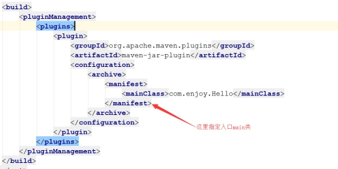
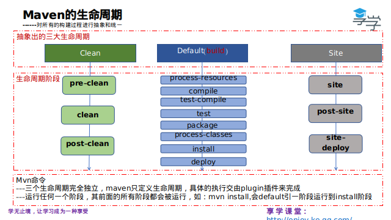
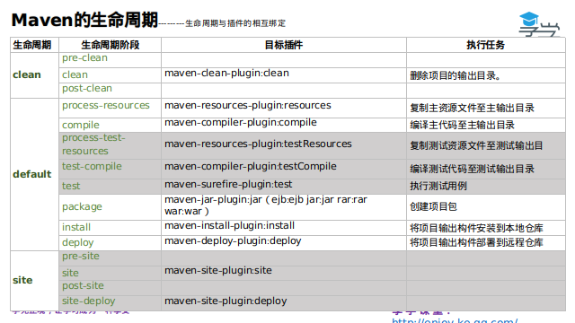
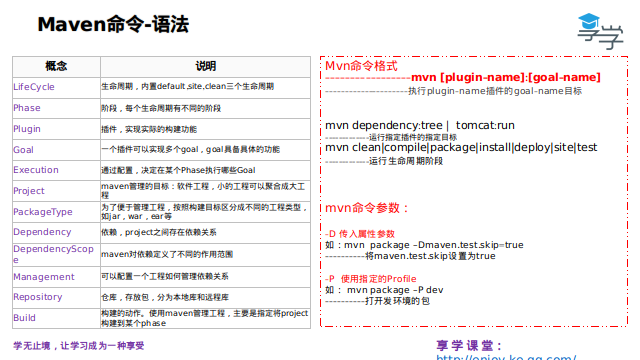
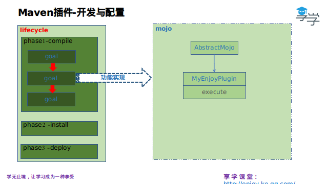
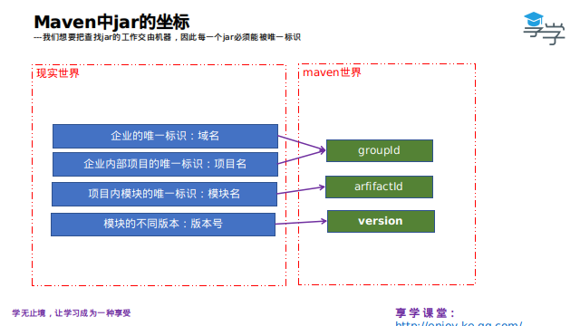
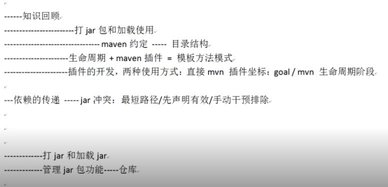
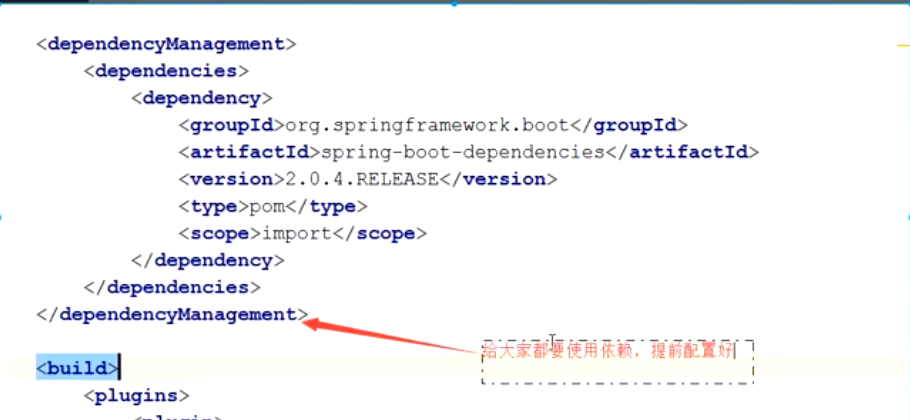
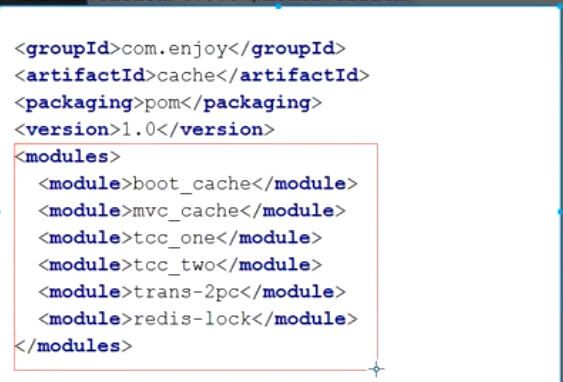

#  maven概念 

Maven 是一个项目管理和整合工具。Maven 为开发者提供了一套完整的构建生命周期框架。开发团队几乎不用花多少时间就能够自动完成工程的基础构建配置，因为 Maven 使用了一个标准的目录结构和一个默认的构建生命周期。

在有多个开发团队环境的情况下，Maven 能够在很短的时间内使得每项工作都按照标准进行。因为大部分的工程配置操作都非常简单并且可复用，在创建报告、检查、构建和测试自动配置时，Maven 可以让开发者的工作变得更简单。

Maven 的主要目的是为开发者提供

· 一个可复用、可维护、更易理解的工程综合模型

· 与这个模型交互的插件或者工具

Maven 工程结构和内容被定义在一个 xml 文件中 － pom.xml


#  安装配置 

##  jdk安装 

Maven 是一个基于 Java 的工具，所以要做的第一件事情就是安装 JDK

##  windows安装， 

下载后解压，添加环境变量即ok

maven下载地址：[ http://maven.apache.org/download.html ](http://maven.apache.org/download.html)

 

##  linux安装 

 1、配置yum源  

 # sudo yum install -y yum-utils  

 # yum-config-manager --add-repo http://repos.fedorapeople.org/repos/dchen/apache-maven/epel-apache-maven.repo  

 2、 安装maven  

 # yum install -y apache-maven  

 

#  maven初体验 

maven主要是做什么的？---打jar、war包和管理jar包

##  原始的javac打包 

假如我们有一个Hello.java文件，想要将它打成可执行jar包，一般这样做。

 

使用javac命令和jar命令打包

 

生成的jar包文件，由两部分组成，class文件和META-INF目录，如下：

 

此时的jar包，是不可直接运行的，需要指定入口main类

进入META-INF目录，编辑MANIFEST.MF文件，如下：

 

运行此jar包，得到运行结果

 

 

##  maven打包 

在pom文件内配置入口类

 

执行maven打包命令

mvn package

 

运行生成的jar，结果与原始方式无区别

 

##  POM结构 

 

#  maven流程 

##  maven的理想 

理想：像一种什么设计模式？---模板方法模式

---------------自动走完标准的构建流程：清理à编译à測试à报告à打包à部署

---------------统一入口，所有配置在一个pom里搞定

##  maven的约定 

 

约定的目录（ 不可改 ）：

| src/main/java –存放项目的.java文件                           |
| ------------------------------------------------------------ |
| src/main/resources –存放项目资源文件。比方spring,hibernate配置文件 |
| src/test/java –存放全部測试.java文件，比方JUnit測试类        |
| src/test/resources ---測试资源文件                           |
| target ---项目输出位置,编译完毕后的东西放到这里面            |
| pom.xml                                                      |

##  maven的生命周期 

maven的构建生命周期，只是一个抽象规范流程。周期内的每个阶段的具体执行，是在插件里来实现。

 

 

 

各个生命周期预设的定义如下：

| 阶段          | 处理     | 描述                                                     |
| ------------- | -------- | -------------------------------------------------------- |
| 验证 validate | 验证项目 | 验证项目是否正确且所有必须信息是可用的                   |
| 编译 compile  | 执行编译 | 源代码编译在此阶段完成                                   |
| 测试 Test     | 测试     | 使用适当的单元测试框架（例如JUnit）运行测试。            |
| 包装 package  | 打包     | 创建JAR/WAR包如在 pom.xml 中定义提及的包                 |
| 检查 verify   | 检查     | 对集成测试的结果进行检查，以保证质量达标                 |
| 安装 install  | 安装     | 安装打包的项目到本地仓库，以供其他项目使用               |
| 部署 deploy   | 部署     | 拷贝最终的工程包到远程仓库中，以共享给其他开发人员和工程 |

 

运行任何一个阶段，都会从其所在生命周期的第一个阶段开始，顺序执行到指定的阶段，如：

mvn package  --- 本义：执行default周期的package阶段，maven会自动从process-resources阶段开始运行到package阶段结束

##  maven的插件 

插件plugin是绑定到生命周期，承担实际功能的组件。mvn运行时，自动关联插件来运行

下图是maven默认的各阶段对应的插件列表：



| 生命周期 | 生命周期阶段           | 插件目标                                                | 执行任务                     |
| -------- | ---------------------- | ------------------------------------------------------- | ---------------------------- |
| clean    | pre-clean              |                                                         |                              |
|          | clean                  | maven-clean-plugin:clean                                | 删除项目的输出目录。         |
|          | post-clean             |                                                         |                              |
| site     | pre-site               |                                                         |                              |
|          | site                   | maven-site-plugin:site                                  |                              |
|          | post-site              |                                                         |                              |
|          | site-deploy            | maven-site-plugin:deploy                                |                              |
| default  | process-resources      | maven-resources-plugin:resources                        | 复制主资源文件至主输出目录   |
|          | compile                | maven-compiler-plugin:compile                           | 编译主代码至主输出目录       |
|          | process-test-resources | maven-resources-plugin:testResources                    | 复制测试资源文件至测试输出目 |
|          | test-compile           | maven-compiler-plugin:testCompile                       | 编译测试代码至测试输出目录   |
|          | test                   | maven-surefire-plugin:test                              | 执行测试用例                 |
|          | package                | maven-jar-plugin:jar（ejb:ejb jar:jar rar:rar war:war） | 创建项目jar包                |
|          | install                | maven-install-plugin:install                            | 将项目输出构件安装到本地仓库 |
|          | deploy                 | maven-deploy-plugin:deploy                              | 将项目输出构件部署到远程仓库 |

##  常用Maven命令： 

mvn clean 清理

mvn compile 编译主程序

mvn package 打包

mvn install 安装jar到本地库

 

使用maven命令生成项目（idea和eclipse生成项目最终也是依赖maven插件生成的）

mvn archetype:generate -DgroupId=enjoy -DartifactId=simple -DarchetypeArtifactId=maven-archetype-quickstart -Dversion=1.0 

mvn archetype:generate -DgroupId=enjoy -DartifactId=simple-web -DarchetypeArtifactId=maven-archetype-webapp -Dversion=1.0  

 

 

##  maven插件开发 

可以自定义插件，来扩展maven的功能。插件的开发步骤如下：

###  1、引入maven api的依赖 

 

###  2、编写简单Mojo类---继承  AbstractMojo 

 


###  3、执行插件 

mvn com.enjoy:enjoy-plugin:1.0:log


###  4、关联插件到生命周期来执行 

 

构建项目对应的生命周期





#  maven坐标与依赖 

##  坐标 



--------在数学中, 任何一个坐标可以唯一确定一个 “点” 

Maven 中坐标是Jar包的唯一标识

坐标元素包括groupId、artifactId、version、packaging:

| 元素       | 描述                            | 说明                                                         |
| ---------- | ------------------------------- | ------------------------------------------------------------ |
| groupId    | 定义当前模块隶属的实际Maven项目 | 中小企业常常直接对应公司/组织                                |
| artifactId | 定义实际项目中的一个Maven模块   | 唯一标识一个模块                                             |
| version    | 定义当前项目所处版本            | SNAPSHOT 表示不稳定的版本。 LATEST 指最新发布的版本，可能是个发布版，也可能是一个snapshot版。 RELEASE 指最后一个发布版。 |
| packaging  | 定义Maven项目打包方式           | 有jar(默认)、war、pom、maven-plugin等.                       |
| classifier | 附属构件(如javadoc、sources)    | 须有附加插件的帮助                                           |

##  依赖 

依赖即：A --》B，B--》C，C--》D这种项目间的依存关系。

在java的jvm内，依赖的最终表现是，项目A启动时，其依赖的jar包必须都对应放入其classpath路径内


##  依赖传递： 


上述过程中，项目Mall归结起来，依赖的fastjson会有三个版本。

而我们的jvm最终肯定只能接受一个版本的jar，所以必须有所取舍

maven默认的取舍规则是：

1、路径最短原则：product和customer里的fastjson引用路径较短，路径为两步 ;pay项目里的fastjson引用路径较长，路径为三步。因此pay中的fastjson被淘汰

2、同路径长度下，谁先声明谁优先： product和customer中的fastjson路径相同，那么就看在pom中是先声明product还是先声明customer，谁先用谁的 

 

##  依赖冲突及解决 

在依赖传递里，我们看到，maven根据自己的规则为我们取舍出了一个版本的jar，但此jar版本选择可能会与我们的项目预期不符，

如：我们最终想的版本是fastjson:1.2.30版本-----但它在第一步即被淘汰掉了

当出现此类情况时，我们项目运行可能会出错（项目中使用到了1.2.30版本的特性）--------------- 此问题即是我们常遇到的jar包冲突问题

补救方式 ----- 使用exclusions将product和customer中的fastjson包排除掉，用法如下图：

 

当发生jar冲突程序报错时，可以使用mvn命令查出项目最终依赖的jar包树，看版本是否是我们预期的：

命令：   mvn dependency:tree

 

 

##  依赖范围scope 

mvn在运行时，生命周期的不同阶段，会有不同的依赖范围，一般有以下依赖范围scope

\- compile ：默认范围，用于编译 ------- 依赖的jar在打包时会包含进去    
\- provided：类似于编译，但支持你期待jdk或者容器提供，类似于classpath  -------- 依赖的jar在打包时不会包含进去 
\- runtime: 在执行时需要使用    -------依赖的jar在打包时会包含进去
\- test:   用于test任务时使用    -------依赖的jar在打包时不会包含进去
\- system: 需要外在提供相应的元素。通过systemPath来取得    ----- 一般禁止使用

 

每个scope实际上是配置了一个不同的classpath，jvm根据选择不同的classpath来达到依赖不同

 

#  环境激活---profiles的使用 

在springmvc项目中，开发/测试/线上三个不同环境，配置文件往往也不同。

打包时需要对配置文件做出选择---maven提供了profiles机制供我们使用

##  profiles的场景 

 

这个选择，实际发生在default生命周期的resource阶段---maven-resources-plugin执行过程里

##  定义profiles 

为了指导插件将对应的resource文件打入classpath里，先定出profiles

 

此定义即指，当mvn命令执行时，我们需要通过 -P dev或者-P test方式传入我们的意图：

dev/test选择，会导致properties里的变量值含义不同，我们主要关注package.environment变量

##  资源插件的配置指定 

 

配置maven-resources-plugin插件执行时，要复制的目录资源

 

##  mvn约定的资源中需要过滤掉环境目录 

 

需要将mvn约定的资源目录里，过滤掉环境目录

##  小属性更轻便的用法 

对于简单的属性，我们可以选择更轻便的用法

###  直接在环境中定义属性值 

 

###  项目属性文件配置 

 

###  约定的资源启用替换过滤 

 

 

 

 本节课的核心内容总结： 

 

记住每个命令做啥的

 

子项目和父项目

父项目中指定是springboot项目，子项目就不需要指定了，在子项目中的parent中引入父项目的坐标



父项目中也要把子项目包含进来。打包是各打各的。父项目打包会引发子项目打包。父项目没有built,packaging是pom形式。




```xml
<project xmlns="http://maven.apache.org/POM/4.0.0"
         xmlns:xsi="http://www.w3.org/2001/XMLSchema-instance"
         xsi:schemaLocation="http://maven.apache.org/POM/4.0.0 http://maven.apache.org/maven-v4_0_0.xsd ">

    <!-- 父项目的坐标。如果项目中没有规定某个元素的值，那么父项目中的对应值即为项目的默认值。
         坐标包括group ID，artifact ID和 version。 -->
    <parent>
        <!-- 被继承的父项目的构件标识符 -->
        <artifactId>xxx</artifactId>

        <!-- 被继承的父项目的全球唯一标识符 -->
        <groupId>xxx</groupId>

        <!-- 被继承的父项目的版本 -->
        <version>xxx</version>

        <!-- 父项目的pom.xml文件的相对路径。相对路径允许你选择一个不同的路径。默认值是../pom.xml。
             Maven首先在构建当前项目的地方寻找父项目的pom，其次在文件系统的这个位置（relativePath位置），
             然后在本地仓库，最后在远程仓库寻找父项目的pom。 -->
        <relativePath>xxx</relativePath>
    </parent>

    <!-- 声明项目描述符遵循哪一个POM模型版本。模型本身的版本很少改变，虽然如此，但它仍然是必不可少的，
         这是为了当Maven引入了新的特性或者其他模型变更的时候，确保稳定性。 -->
    <modelVersion> 4.0.0 </modelVersion>

    <!-- 项目的全球唯一标识符，通常使用全限定的包名区分该项目和其他项目。并且构建时生成的路径也是由此生成，
         如com.mycompany.app生成的相对路径为：/com/mycompany/app -->
    <groupId>xxx</groupId>

    <!-- 构件的标识符，它和group ID一起唯一标识一个构件。换句话说，你不能有两个不同的项目拥有同样的artifact ID
         和groupID；在某个特定的group ID下，artifact ID也必须是唯一的。构件是项目产生的或使用的一个东西，Maven
         为项目产生的构件包括：JARs，源码，二进制发布和WARs等。 -->
    <artifactId>xxx</artifactId>

    <!-- 项目产生的构件类型，例如jar、war、ear、pom。插件可以创建他们自己的构件类型，所以前面列的不是全部构件类型 -->
    <packaging> jar </packaging>

    <!-- 项目当前版本，格式为:主版本.次版本.增量版本-限定版本号 -->
    <version> 1.0-SNAPSHOT </version>

    <!-- 项目的名称, Maven产生的文档用 -->
    <name> xxx-maven </name>

    <!-- 项目主页的URL, Maven产生的文档用 -->
    <url> http://maven.apache.org </url>

    <!-- 项目的详细描述, Maven 产生的文档用。 当这个元素能够用HTML格式描述时（例如，CDATA中的文本会被解析器忽略，
         就可以包含HTML标签）， 不鼓励使用纯文本描述。如果你需要修改产生的web站点的索引页面，你应该修改你自己的
         索引页文件，而不是调整这里的文档。 -->
    <description> A maven project to study maven. </description>

    <!-- 描述了这个项目构建环境中的前提条件。 -->
    <prerequisites>
        <!-- 构建该项目或使用该插件所需要的Maven的最低版本 -->
        <maven></maven>
    </prerequisites>

    <!-- 项目的问题管理系统(Bugzilla, Jira, Scarab,或任何你喜欢的问题管理系统)的名称和URL，本例为 jira -->
    <issueManagement>
        <!-- 问题管理系统（例如jira）的名字， -->
        <system> jira </system>

        <!-- 该项目使用的问题管理系统的URL -->
        <url> http://jira.baidu.com/banseon </url>
    </issueManagement>

    <!-- 项目持续集成信息 -->
    <ciManagement>
        <!-- 持续集成系统的名字，例如continuum -->
        <system></system>

        <!-- 该项目使用的持续集成系统的URL（如果持续集成系统有web接口的话）。 -->
        <url></url>

        <!-- 构建完成时，需要通知的开发者/用户的配置项。包括被通知者信息和通知条件（错误，失败，成功，警告） -->
        <notifiers>
            <!-- 配置一种方式，当构建中断时，以该方式通知用户/开发者 -->
            <notifier>
                <!-- 传送通知的途径 -->
                <type></type>

                <!-- 发生错误时是否通知 -->
                <sendOnError></sendOnError>

                <!-- 构建失败时是否通知 -->
                <sendOnFailure></sendOnFailure>

                <!-- 构建成功时是否通知 -->
                <sendOnSuccess></sendOnSuccess>

                <!-- 发生警告时是否通知 -->
                <sendOnWarning></sendOnWarning>

                <!-- 不赞成使用。通知发送到哪里 -->
                <address></address>

                <!-- 扩展配置项 -->
                <configuration></configuration>
            </notifier>
        </notifiers>
    </ciManagement>

    <!-- 项目创建年份，4位数字。当产生版权信息时需要使用这个值。 -->
    <inceptionYear />

    <!-- 项目相关邮件列表信息 -->
    <mailingLists>
        <!-- 该元素描述了项目相关的所有邮件列表。自动产生的网站引用这些信息。 -->
        <mailingList>
            <!-- 邮件的名称 -->
            <name> Demo </name>

            <!-- 发送邮件的地址或链接，如果是邮件地址，创建文档时，mailto: 链接会被自动创建 -->
            <post> banseon@126.com </post>

            <!-- 订阅邮件的地址或链接，如果是邮件地址，创建文档时，mailto: 链接会被自动创建 -->
            <subscribe> banseon@126.com </subscribe>

            <!-- 取消订阅邮件的地址或链接，如果是邮件地址，创建文档时，mailto: 链接会被自动创建 -->
            <unsubscribe> banseon@126.com </unsubscribe>

            <!-- 你可以浏览邮件信息的URL -->
            <archive> http:/hi.baidu.com/banseon/demo/dev/ </archive>
        </mailingList>
    </mailingLists>

    <!-- 项目开发者列表 -->
    <developers>
        <!-- 某个项目开发者的信息 -->
        <developer>
            <!-- SCM里项目开发者的唯一标识符 -->
            <id> HELLO WORLD </id>

            <!-- 项目开发者的全名 -->
            <name> banseon </name>

            <!-- 项目开发者的email -->
            <email> banseon@126.com </email>

            <!-- 项目开发者的主页的URL -->
            <url></url>

            <!-- 项目开发者在项目中扮演的角色，角色元素描述了各种角色 -->
            <roles>
                <role> Project Manager </role>
                <role> Architect </role>
            </roles>

            <!-- 项目开发者所属组织 -->
            <organization> demo </organization>

            <!-- 项目开发者所属组织的URL -->
            <organizationUrl> http://hi.baidu.com/xxx </organizationUrl>

            <!-- 项目开发者属性，如即时消息如何处理等 -->
            <properties>
                <dept> No </dept>
            </properties>

            <!-- 项目开发者所在时区， -11到12范围内的整数。 -->
            <timezone> -5 </timezone>
        </developer>
    </developers>

    <!-- 项目的其他贡献者列表 -->
    <contributors>
        <!-- 项目的其他贡献者。参见developers/developer元素 -->
        <contributor>
            <!-- 项目贡献者的全名 -->
            <name></name>

            <!-- 项目贡献者的email -->
            <email></email>

            <!-- 项目贡献者的主页的URL -->
            <url></url>

            <!-- 项目贡献者所属组织 -->
            <organization></organization>

            <!-- 项目贡献者所属组织的URL -->
            <organizationUrl></organizationUrl>

            <!-- 项目贡献者在项目中扮演的角色，角色元素描述了各种角色 -->
            <roles>
                <role> Project Manager </role>
                <role> Architect </role>
            </roles>

            <!-- 项目贡献者所在时区， -11到12范围内的整数。 -->
            <timezone></timezone>

            <!-- 项目贡献者属性，如即时消息如何处理等 -->
            <properties>
                <dept> No </dept>
            </properties>
        </contributor>
    </contributors>

    <!-- 该元素描述了项目所有License列表。 应该只列出该项目的license列表，不要列出依赖项目的 license列表。
         如果列出多个license，用户可以选择它们中的一个而不是接受所有license。 -->
    <licenses>
        <!-- 描述了项目的license，用于生成项目的web站点的license页面，其他一些报表和validation也会用到该元素。 -->
        <license>
            <!-- license用于法律上的名称 -->
            <name> Apache 2 </name>

            <!-- 官方的license正文页面的URL -->
            <url> http://www.baidu.com/banseon/LICENSE-2.0.txt </url>

            <!-- 项目分发的主要方式：
                    repo，可以从Maven库下载
                    manual， 用户必须手动下载和安装依赖 -->
            <distribution> repo </distribution>

            <!-- 关于license的补充信息 -->
            <comments> A business-friendly OSS license </comments>
        </license>
    </licenses>

    <!-- SCM(Source Control Management)标签允许你配置你的代码库，供Maven web站点和其它插件使用。 -->
    <scm>
        <!-- SCM的URL,该URL描述了版本库和如何连接到版本库。欲知详情，请看SCMs提供的URL格式和列表。该连接只读。 -->
        <connection>
            scm:svn:http://svn.baidu.com/banseon/maven/banseon/banseon-maven2-trunk(dao-trunk)
        </connection>

        <!-- 给开发者使用的，类似connection元素。即该连接不仅仅只读 -->
        <developerConnection>
            scm:svn:http://svn.baidu.com/banseon/maven/banseon/dao-trunk
        </developerConnection>

        <!-- 当前代码的标签，在开发阶段默认为HEAD -->
        <tag></tag>

        <!-- 指向项目的可浏览SCM库（例如ViewVC或者Fisheye）的URL。 -->
        <url> http://svn.baidu.com/banseon </url>
    </scm>

    <!-- 描述项目所属组织的各种属性。Maven产生的文档用 -->
    <organization>
        <!-- 组织的全名 -->
        <name> demo </name>

        <!-- 组织主页的URL -->
        <url> http://www.baidu.com/banseon </url>
    </organization>

    <!-- 构建项目需要的信息 -->
    <build>
        <!-- 该元素设置了项目源码目录，当构建项目的时候，构建系统会编译目录里的源码。该路径是相对
             于pom.xml的相对路径。 -->
        <sourceDirectory></sourceDirectory>

        <!-- 该元素设置了项目脚本源码目录，该目录和源码目录不同：绝大多数情况下，该目录下的内容会
             被拷贝到输出目录(因为脚本是被解释的，而不是被编译的)。 -->
        <scriptSourceDirectory></scriptSourceDirectory>

        <!-- 该元素设置了项目单元测试使用的源码目录，当测试项目的时候，构建系统会编译目录里的源码。
             该路径是相对于pom.xml的相对路径。 -->
        <testSourceDirectory></testSourceDirectory>

        <!-- 被编译过的应用程序class文件存放的目录。 -->
        <outputDirectory></outputDirectory>

        <!-- 被编译过的测试class文件存放的目录。 -->
        <testOutputDirectory></testOutputDirectory>

        <!-- 使用来自该项目的一系列构建扩展 -->
        <extensions>
            <!-- 描述使用到的构建扩展。 -->
            <extension>
                <!-- 构建扩展的groupId -->
                <groupId></groupId>

                <!-- 构建扩展的artifactId -->
                <artifactId></artifactId>

                <!-- 构建扩展的版本 -->
                <version></version>
            </extension>
        </extensions>

        <!-- 当项目没有规定目标（Maven2 叫做阶段）时的默认值 -->
        <defaultGoal></defaultGoal>

        <!-- 这个元素描述了项目相关的所有资源路径列表，例如和项目相关的属性文件，这些资源被包含在
             最终的打包文件里。 -->
        <resources>
            <!-- 这个元素描述了项目相关或测试相关的所有资源路径 -->
            <resource>
                <!-- 描述了资源的目标路径。该路径相对target/classes目录（例如${project.build.outputDirectory}）。
                     举个例子，如果你想资源在特定的包里(org.apache.maven.messages)，你就必须该元素设置为
                    org/apache/maven/messages。然而，如果你只是想把资源放到源码目录结构里，就不需要该配置。 -->
                <targetPath></targetPath>

                <!-- 是否使用参数值代替参数名。参数值取自properties元素或者文件里配置的属性，文件在filters元素
                     里列出。 -->
                <filtering></filtering>

                <!-- 描述存放资源的目录，该路径相对POM路径 -->
                <directory></directory>

                <!-- 包含的模式列表，例如**/*.xml. -->
                <includes>
                    <include></include>
                </includes>

                <!-- 排除的模式列表，例如**/*.xml -->
                <excludes>
                    <exclude></exclude>
                </excludes>
            </resource>
        </resources>

        <!-- 这个元素描述了单元测试相关的所有资源路径，例如和单元测试相关的属性文件。 -->
        <testResources>
            <!-- 这个元素描述了测试相关的所有资源路径，参见build/resources/resource元素的说明 -->
            <testResource>
                <!-- 描述了测试相关的资源的目标路径。该路径相对target/classes目录（例如${project.build.outputDirectory}）。
                     举个例子，如果你想资源在特定的包里(org.apache.maven.messages)，你就必须该元素设置为
                    org/apache/maven/messages。然而，如果你只是想把资源放到源码目录结构里，就不需要该配置。 -->
                <targetPath></targetPath>

                <!-- 是否使用参数值代替参数名。参数值取自properties元素或者文件里配置的属性，文件在filters元素
                     里列出。 -->
                <filtering></filtering>

                <!-- 描述存放测试相关的资源的目录，该路径相对POM路径 -->
                <directory></directory>

                <!-- 包含的模式列表，例如**/*.xml. -->
                <includes>
                    <include></include>
                </includes>

                <!-- 排除的模式列表，例如**/*.xml -->
                <excludes>
                    <exclude></exclude>
                </excludes>
            </testResource>
        </testResources>

        <!-- 构建产生的所有文件存放的目录 -->
        <directory></directory>

        <!-- 产生的构件的文件名，默认值是${artifactId}-${version}。 -->
        <finalName></finalName>

        <!-- 当filtering开关打开时，使用到的过滤器属性文件列表 -->
        <filters></filters>

        <!-- 子项目可以引用的默认插件信息。该插件配置项直到被引用时才会被解析或绑定到生命周期。给定插件的任何本
             地配置都会覆盖这里的配置 -->
        <pluginManagement>
            <!-- 使用的插件列表 。 -->
            <plugins>
                <!-- plugin元素包含描述插件所需要的信息。 -->
                <plugin>
                    <!-- 插件在仓库里的group ID -->
                    <groupId></groupId>

                    <!-- 插件在仓库里的artifact ID -->
                    <artifactId></artifactId>

                    <!-- 被使用的插件的版本（或版本范围） -->
                    <version></version>

                    <!-- 是否从该插件下载Maven扩展（例如打包和类型处理器），由于性能原因，只有在真需要下载时，该
                         元素才被设置成enabled。 -->
                    <extensions>true/false</extensions>

                    <!-- 在构建生命周期中执行一组目标的配置。每个目标可能有不同的配置。 -->
                    <executions>
                        <!-- execution元素包含了插件执行需要的信息 -->
                        <execution>
                            <!-- 执行目标的标识符，用于标识构建过程中的目标，或者匹配继承过程中需要合并的执行目标 -->
                            <id></id>

                            <!-- 绑定了目标的构建生命周期阶段，如果省略，目标会被绑定到源数据里配置的默认阶段 -->
                            <phase></phase>

                            <!-- 配置的执行目标 -->
                            <goals></goals>

                            <!-- 配置是否被传播到子POM -->
                            <inherited>true/false</inherited>

                            <!-- 作为DOM对象的配置 -->
                            <configuration></configuration>
                        </execution>
                    </executions>

                    <!-- 项目引入插件所需要的额外依赖 -->
                    <dependencies>
                        <!-- 参见dependencies/dependency元素 -->
                        <dependency>
                        </dependency>
                    </dependencies>

                    <!-- 任何配置是否被传播到子项目 -->
                    <inherited>true/false</inherited>

                    <!-- 作为DOM对象的配置 -->
                    <configuration></configuration>
                </plugin>
            </plugins>
        </pluginManagement>

        <!-- 该项目使用的插件列表 。 -->
        <plugins>
            <!-- plugin元素包含描述插件所需要的信息。 -->
            <plugin>
                <!-- 插件在仓库里的group ID -->
                <groupId></groupId>

                <!-- 插件在仓库里的artifact ID -->
                <artifactId></artifactId>

                <!-- 被使用的插件的版本（或版本范围） -->
                <version></version>

                <!-- 是否从该插件下载Maven扩展（例如打包和类型处理器），由于性能原因，只有在真需要下载时，该
                     元素才被设置成enabled。 -->
                <extensions>true/false</extensions>

                <!-- 在构建生命周期中执行一组目标的配置。每个目标可能有不同的配置。 -->
                <executions>
                    <!-- execution元素包含了插件执行需要的信息 -->
                    <execution>
                        <!-- 执行目标的标识符，用于标识构建过程中的目标，或者匹配继承过程中需要合并的执行目标 -->
                        <id></id>

                        <!-- 绑定了目标的构建生命周期阶段，如果省略，目标会被绑定到源数据里配置的默认阶段 -->
                        <phase></phase>

                        <!-- 配置的执行目标 -->
                        <goals></goals>

                        <!-- 配置是否被传播到子POM -->
                        <inherited>true/false</inherited>

                        <!-- 作为DOM对象的配置 -->
                        <configuration></configuration>
                    </execution>
                </executions>

                <!-- 项目引入插件所需要的额外依赖 -->
                <dependencies>
                    <!-- 参见dependencies/dependency元素 -->
                    <dependency>
                    </dependency>
                </dependencies>

                <!-- 任何配置是否被传播到子项目 -->
                <inherited>true/false</inherited>

                <!-- 作为DOM对象的配置 -->
                <configuration></configuration>
            </plugin>
        </plugins>
    </build>

    <!-- 在列的项目构建profile，如果被激活，会修改构建处理 -->
    <profiles>
        <!-- 根据环境参数或命令行参数激活某个构建处理 -->
        <profile>
            <!-- 构建配置的唯一标识符。即用于命令行激活，也用于在继承时合并具有相同标识符的profile。 -->
            <id></id>

            <!-- 自动触发profile的条件逻辑。Activation是profile的开启钥匙。profile的力量来自于它能够
                 在某些特定的环境中自动使用某些特定的值；这些环境通过activation元素指定。activation元
                 素并不是激活profile的唯一方式。 -->
            <activation>
                <!-- profile默认是否激活的标志 -->
                <activeByDefault>true/false</activeByDefault>

                <!-- 当匹配的jdk被检测到，profile被激活。例如，1.4激活JDK1.4，1.4.0_2，而!1.4激活所有版本
                     不是以1.4开头的JDK。 -->
                <jdk>jdk版本，如:1.7</jdk>

                <!-- 当匹配的操作系统属性被检测到，profile被激活。os元素可以定义一些操作系统相关的属性。 -->
                <os>
                    <!-- 激活profile的操作系统的名字 -->
                    <name> Windows XP </name>

                    <!-- 激活profile的操作系统所属家族(如 'windows') -->
                    <family> Windows </family>

                    <!-- 激活profile的操作系统体系结构 -->
                    <arch> x86 </arch>

                    <!-- 激活profile的操作系统版本 -->
                    <version> 5.1.2600 </version>
                </os>

                <!-- 如果Maven检测到某一个属性（其值可以在POM中通过${名称}引用），其拥有对应的名称和值，Profile
                     就会被激活。如果值字段是空的，那么存在属性名称字段就会激活profile，否则按区分大小写方式匹
                     配属性值字段 -->
                <property>
                    <!-- 激活profile的属性的名称 -->
                    <name> mavenVersion </name>

                    <!-- 激活profile的属性的值 -->
                    <value> 2.0.3 </value>
                </property>

                <!-- 提供一个文件名，通过检测该文件的存在或不存在来激活profile。missing检查文件是否存在，如果不存在则激活
                     profile。另一方面，exists则会检查文件是否存在，如果存在则激活profile。 -->
                <file>
                    <!-- 如果指定的文件存在，则激活profile。 -->
                    <exists> /usr/local/hudson/hudson-home/jobs/maven-guide-zh-to-production/workspace/ </exists>

                    <!-- 如果指定的文件不存在，则激活profile。 -->
                    <missing> /usr/local/hudson/hudson-home/jobs/maven-guide-zh-to-production/workspace/ </missing>
                </file>
            </activation>

            <!-- 构建项目所需要的信息。参见build元素 -->
            <build>
                <defaultGoal />
                <resources>
                    <resource>
                        <targetPath></targetPath>
                        <filtering></filtering>
                        <directory></directory>
                        <includes>
                            <include></include>
                        </includes>
                        <excludes>
                            <exclude></exclude>
                        </excludes>
                    </resource>
                </resources>
                <testResources>
                    <testResource>
                        <targetPath></targetPath>
                        <filtering></filtering>
                        <directory></directory>
                        <includes>
                            <include></include>
                        </includes>
                        <excludes>
                            <exclude></exclude>
                        </excludes>
                    </testResource>
                </testResources>
                <directory></directory>
                <finalName></finalName>
                <filters></filters>
                <pluginManagement>
                    <plugins>
                        <!-- 参见build/pluginManagement/plugins/plugin元素 -->
                        <plugin>
                            <groupId></groupId>
                            <artifactId></artifactId>
                            <version></version>
                            <extensions>true/false</extensions>
                            <executions>
                                <execution>
                                    <id></id>
                                    <phase></phase>
                                    <goals></goals>
                                    <inherited>true/false</inherited>
                                    <configuration></configuration>
                                </execution>
                            </executions>
                            <dependencies>
                                <!-- 参见dependencies/dependency元素 -->
                                <dependency>
                                </dependency>
                            </dependencies>
                            <goals></goals>
                            <inherited>true/false</inherited>
                            <configuration></configuration>
                        </plugin>
                    </plugins>
                </pluginManagement>
                <plugins>
                    <!-- 参见build/pluginManagement/plugins/plugin元素 -->
                    <plugin>
                        <groupId></groupId>
                        <artifactId></artifactId>
                        <version></version>
                        <extensions>true/false</extensions>
                        <executions>
                            <execution>
                                <id></id>
                                <phase></phase>
                                <goals></goals>
                                <inherited>true/false</inherited>
                                <configuration></configuration>
                            </execution>
                        </executions>
                        <dependencies>
                            <!-- 参见dependencies/dependency元素 -->
                            <dependency>
                            </dependency>
                        </dependencies>
                        <goals></goals>
                        <inherited>true/false</inherited>
                        <configuration></configuration>
                    </plugin>
                </plugins>
            </build>

            <!-- 模块（有时称作子项目） 被构建成项目的一部分。列出的每个模块元素是指向该模块的目录的
                 相对路径 -->
            <modules>
                <!--子项目相对路径-->
                <module></module>
            </modules>

            <!-- 发现依赖和扩展的远程仓库列表。 -->
            <repositories>
                <!-- 参见repositories/repository元素 -->
                <repository>
                    <releases>
                        <enabled><enabled>
                        <updatePolicy></updatePolicy>
                        <checksumPolicy></checksumPolicy>
                    </releases>
                    <snapshots>
                        <enabled><enabled>
                        <updatePolicy></updatePolicy>
                        <checksumPolicy></checksumPolicy>
                    </snapshots>
                    <id></id>
                    <name></name>
                    <url></url>
                    <layout></layout>
                </repository>
            </repositories>

            <!-- 发现插件的远程仓库列表，这些插件用于构建和报表 -->
            <pluginRepositories>
                <!-- 包含需要连接到远程插件仓库的信息.参见repositories/repository元素 -->
                <pluginRepository>
                    <releases>
                        <enabled><enabled>
                        <updatePolicy></updatePolicy>
                        <checksumPolicy></checksumPolicy>
                    </releases>
                    <snapshots>
                        <enabled><enabled>
                        <updatePolicy></updatePolicy>
                        <checksumPolicy></checksumPolicy>
                    </snapshots>
                    <id></id>
                    <name></name>
                    <url></url>
                    <layout></layout>
                </pluginRepository>
            </pluginRepositories>

            <!-- 该元素描述了项目相关的所有依赖。 这些依赖组成了项目构建过程中的一个个环节。它们自动从项目定义的
                 仓库中下载。要获取更多信息，请看项目依赖机制。 -->
            <dependencies>
                <!-- 参见dependencies/dependency元素 -->
                <dependency>
                </dependency>
            </dependencies>

            <!-- 不赞成使用. 现在Maven忽略该元素. -->
            <reports></reports>

            <!-- 该元素包括使用报表插件产生报表的规范。当用户执行“mvn site”，这些报表就会运行。 在页面导航栏能看
                 到所有报表的链接。参见reporting元素 -->
            <reporting></reporting>

            <!-- 参见dependencyManagement元素 -->
            <dependencyManagement>
                <dependencies>
                    <!-- 参见dependencies/dependency元素 -->
                    <dependency>
                    </dependency>
                </dependencies>
            </dependencyManagement>

            <!-- 参见distributionManagement元素 -->
            <distributionManagement>
            </distributionManagement>

            <!-- 参见properties元素 -->
            <properties />
        </profile>
    </profiles>

    <!-- 模块（有时称作子项目） 被构建成项目的一部分。列出的每个模块元素是指向该模块的目录的相对路径 -->
    <modules>
        <!--子项目相对路径-->
        <module></module>
    </modules>

    <!-- 发现依赖和扩展的远程仓库列表。 -->
    <repositories>
        <!-- 包含需要连接到远程仓库的信息 -->
        <repository>
            <!-- 如何处理远程仓库里发布版本的下载 -->
            <releases>
                <!-- true或者false表示该仓库是否为下载某种类型构件（发布版，快照版）开启。 -->
                <enabled><enabled>

                <!-- 该元素指定更新发生的频率。Maven会比较本地POM和远程POM的时间戳。这里的选项是：always（一直），
                     daily（默认，每日），interval：X（这里X是以分钟为单位的时间间隔），或者never（从不）。 -->
                <updatePolicy></updatePolicy>

                <!-- 当Maven验证构件校验文件失败时该怎么做：ignore（忽略），fail（失败），或者warn（警告）。 -->
                <checksumPolicy></checksumPolicy>
            </releases>

            <!-- 如何处理远程仓库里快照版本的下载。有了releases和snapshots这两组配置，POM就可以在每个单独的仓库中，
                 为每种类型的构件采取不同的策略。例如，可能有人会决定只为开发目的开启对快照版本下载的支持。参见repositories/repository/releases元素 -->
            <snapshots>
                <enabled><enabled>
                <updatePolicy></updatePolicy>
                <checksumPolicy></checksumPolicy>
            </snapshots>

            <!-- 远程仓库唯一标识符。可以用来匹配在settings.xml文件里配置的远程仓库 -->
            <id> banseon-repository-proxy </id>

            <!-- 远程仓库名称 -->
            <name> banseon-repository-proxy </name>

            <!-- 远程仓库URL，按protocol://hostname/path形式 -->
            <url> http://192.168.1.169:9999/repository/ </url>

            <!-- 用于定位和排序构件的仓库布局类型-可以是default（默认）或者legacy（遗留）。Maven 2为其仓库提供了一个默认
                 的布局；然而，Maven 1.x有一种不同的布局。我们可以使用该元素指定布局是default（默认）还是legacy（遗留）。 -->
            <layout> default </layout>
        </repository>
    </repositories>

    <!-- 发现插件的远程仓库列表，这些插件用于构建和报表 -->
    <pluginRepositories>
        <!-- 包含需要连接到远程插件仓库的信息.参见repositories/repository元素 -->
        <pluginRepository>
        </pluginRepository>
    </pluginRepositories>

    <!-- 该元素描述了项目相关的所有依赖。 这些依赖组成了项目构建过程中的一个个环节。它们自动从项目定义的仓库中下载。
         要获取更多信息，请看项目依赖机制。 -->
    <dependencies>
        <dependency>
            <!-- 依赖的group ID -->
            <groupId> org.apache.maven </groupId>

            <!-- 依赖的artifact ID -->
            <artifactId> maven-artifact </artifactId>

            <!-- 依赖的版本号。 在Maven 2里, 也可以配置成版本号的范围。 -->
            <version> 3.8.1 </version>

            <!-- 依赖类型，默认类型是jar。它通常表示依赖的文件的扩展名，但也有例外。一个类型可以被映射成另外一个扩展
                 名或分类器。类型经常和使用的打包方式对应，尽管这也有例外。一些类型的例子：jar，war，ejb-client和test-jar。
                 如果设置extensions为 true，就可以在plugin里定义新的类型。所以前面的类型的例子不完整。 -->
            <type> jar </type>

            <!-- 依赖的分类器。分类器可以区分属于同一个POM，但不同构建方式的构件。分类器名被附加到文件名的版本号后面。例如，
                 如果你想要构建两个单独的构件成JAR，一个使用Java 1.4编译器，另一个使用Java 6编译器，你就可以使用分类器来生
                 成两个单独的JAR构件。 -->
            <classifier></classifier>

            <!-- 依赖范围。在项目发布过程中，帮助决定哪些构件被包括进来。欲知详情请参考依赖机制。
                - compile ：默认范围，用于编译
                - provided：类似于编译，但支持你期待jdk或者容器提供，类似于classpath
                - runtime: 在执行时需要使用
                - test: 用于test任务时使用
                - system: 需要外在提供相应的元素。通过systemPath来取得
                - systemPath: 仅用于范围为system。提供相应的路径
                - optional: 当项目自身被依赖时，标注依赖是否传递。用于连续依赖时使用 -->
            <scope> test </scope>

            <!-- 仅供system范围使用。注意，不鼓励使用这个元素，并且在新的版本中该元素可能被覆盖掉。该元素为依赖规定了文件
                 系统上的路径。需要绝对路径而不是相对路径。推荐使用属性匹配绝对路径，例如${java.home}。 -->
            <systemPath></systemPath>

            <!-- 当计算传递依赖时， 从依赖构件列表里，列出被排除的依赖构件集。即告诉maven你只依赖指定的项目，不依赖项目的
                 依赖。此元素主要用于解决版本冲突问题 -->
            <exclusions>
                <exclusion>
                    <artifactId> spring-core </artifactId>
                    <groupId> org.springframework </groupId>
                </exclusion>
            </exclusions>

            <!-- 可选依赖，如果你在项目B中把C依赖声明为可选，你就需要在依赖于B的项目（例如项目A）中显式的引用对C的依赖。
                 可选依赖阻断依赖的传递性。 -->
            <optional> true </optional>
        </dependency>
    </dependencies>

    <!-- 不赞成使用. 现在Maven忽略该元素. -->
    <reports></reports>

    <!-- 该元素描述使用报表插件产生报表的规范。当用户执行“mvn site”，这些报表就会运行。 在页面导航栏能看到所有报表的链接。 -->
    <reporting>
        <!-- true，则，网站不包括默认的报表。这包括“项目信息”菜单中的报表。 -->
        <excludeDefaults />

        <!-- 所有产生的报表存放到哪里。默认值是${project.build.directory}/site。 -->
        <outputDirectory />

        <!-- 使用的报表插件和他们的配置。 -->
        <plugins>
            <!-- plugin元素包含描述报表插件需要的信息 -->
            <plugin>
                <!-- 报表插件在仓库里的group ID -->
                <groupId></groupId>
                <!-- 报表插件在仓库里的artifact ID -->
                <artifactId></artifactId>

                <!-- 被使用的报表插件的版本（或版本范围） -->
                <version></version>

                <!-- 任何配置是否被传播到子项目 -->
                <inherited>true/false</inherited>

                <!-- 报表插件的配置 -->
                <configuration></configuration>

                <!-- 一组报表的多重规范，每个规范可能有不同的配置。一个规范（报表集）对应一个执行目标 。例如，
                     有1，2，3，4，5，6，7，8，9个报表。1，2，5构成A报表集，对应一个执行目标。2，5，8构成B报
                     表集，对应另一个执行目标 -->
                <reportSets>
                    <!-- 表示报表的一个集合，以及产生该集合的配置 -->
                    <reportSet>
                        <!-- 报表集合的唯一标识符，POM继承时用到 -->
                        <id></id>

                        <!-- 产生报表集合时，被使用的报表的配置 -->
                        <configuration></configuration>

                        <!-- 配置是否被继承到子POMs -->
                        <inherited>true/false</inherited>

                        <!-- 这个集合里使用到哪些报表 -->
                        <reports></reports>
                    </reportSet>
                </reportSets>
            </plugin>
        </plugins>
    </reporting>

    <!-- 继承自该项目的所有子项目的默认依赖信息。这部分的依赖信息不会被立即解析,而是当子项目声明一个依赖
        （必须描述group ID和artifact ID信息），如果group ID和artifact ID以外的一些信息没有描述，则通过
            group ID和artifact ID匹配到这里的依赖，并使用这里的依赖信息。 -->
    <dependencyManagement>
        <dependencies>
            <!-- 参见dependencies/dependency元素 -->
            <dependency>
            </dependency>
        </dependencies>
    </dependencyManagement>

    <!-- 项目分发信息，在执行mvn deploy后表示要发布的位置。有了这些信息就可以把网站部署到远程服务器或者
         把构件部署到远程仓库。 -->
    <distributionManagement>
        <!-- 部署项目产生的构件到远程仓库需要的信息 -->
        <repository>
            <!-- 是分配给快照一个唯一的版本号（由时间戳和构建流水号）？还是每次都使用相同的版本号？参见
                 repositories/repository元素 -->
            <uniqueVersion />
            <id> banseon-maven2 </id>
            <name> banseon maven2 </name>
            <url> file://${basedir}/target/deploy </url>
            <layout></layout>
        </repository>

        <!-- 构件的快照部署到哪里？如果没有配置该元素，默认部署到repository元素配置的仓库，参见
             distributionManagement/repository元素 -->
        <snapshotRepository>
            <uniqueVersion />
            <id> banseon-maven2 </id>
            <name> Banseon-maven2 Snapshot Repository </name>
            <url> scp://svn.baidu.com/banseon:/usr/local/maven-snapshot </url>
            <layout></layout>
        </snapshotRepository>

        <!-- 部署项目的网站需要的信息 -->
        <site>
            <!-- 部署位置的唯一标识符，用来匹配站点和settings.xml文件里的配置 -->
            <id> banseon-site </id>

            <!-- 部署位置的名称 -->
            <name> business api website </name>

            <!-- 部署位置的URL，按protocol://hostname/path形式 -->
            <url>
                scp://svn.baidu.com/banseon:/var/www/localhost/banseon-web
            </url>
        </site>

        <!-- 项目下载页面的URL。如果没有该元素，用户应该参考主页。使用该元素的原因是：帮助定位
             那些不在仓库里的构件（由于license限制）。 -->
        <downloadUrl />

        <!-- 如果构件有了新的group ID和artifact ID（构件移到了新的位置），这里列出构件的重定位信息。 -->
        <relocation>
            <!-- 构件新的group ID -->
            <groupId></groupId>

            <!-- 构件新的artifact ID -->
            <artifactId></artifactId>

            <!-- 构件新的版本号 -->
            <version></version>

            <!-- 显示给用户的，关于移动的额外信息，例如原因。 -->
            <message></message>
        </relocation>

        <!-- 给出该构件在远程仓库的状态。不得在本地项目中设置该元素，因为这是工具自动更新的。有效的值
             有：none（默认），converted（仓库管理员从Maven 1 POM转换过来），partner（直接从伙伴Maven
             2仓库同步过来），deployed（从Maven 2实例部署），verified（被核实时正确的和最终的）。 -->
        <status></status>
    </distributionManagement>

    <!-- 以值替代名称，Properties可以在整个POM中使用，也可以作为触发条件（见settings.xml配置文件里
         activation元素的说明）。格式是<name>value</name>。 -->
    <properties>
        <name>value</name>
    </properties>
</project>
```

