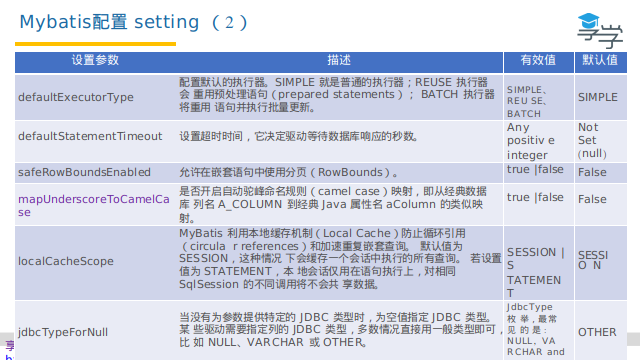
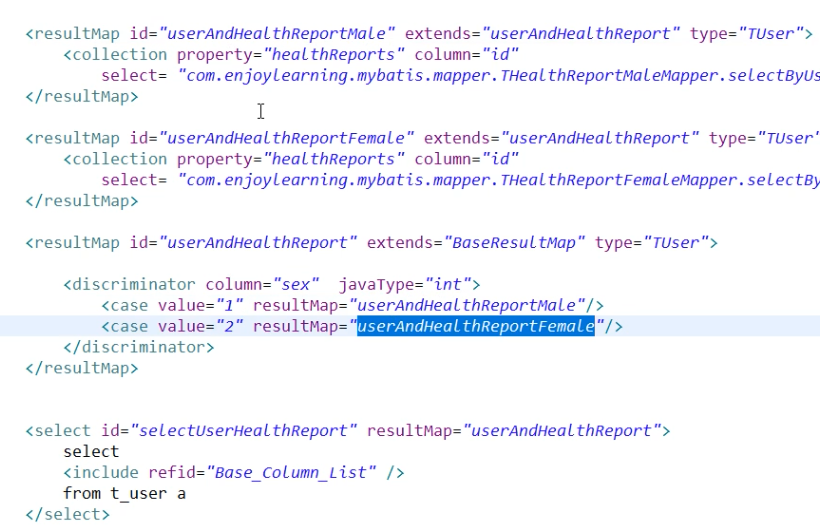
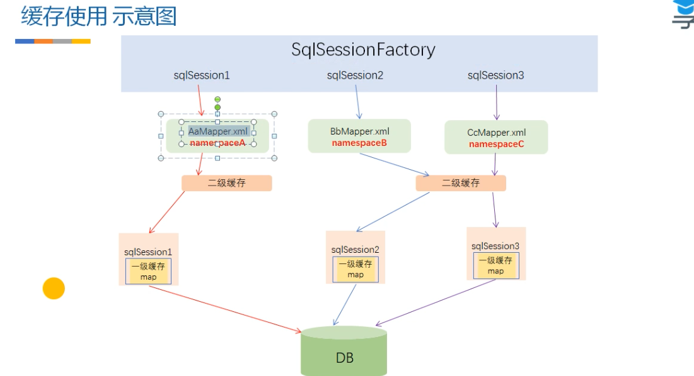
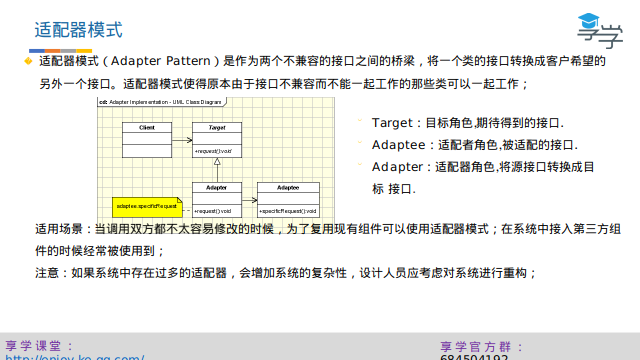
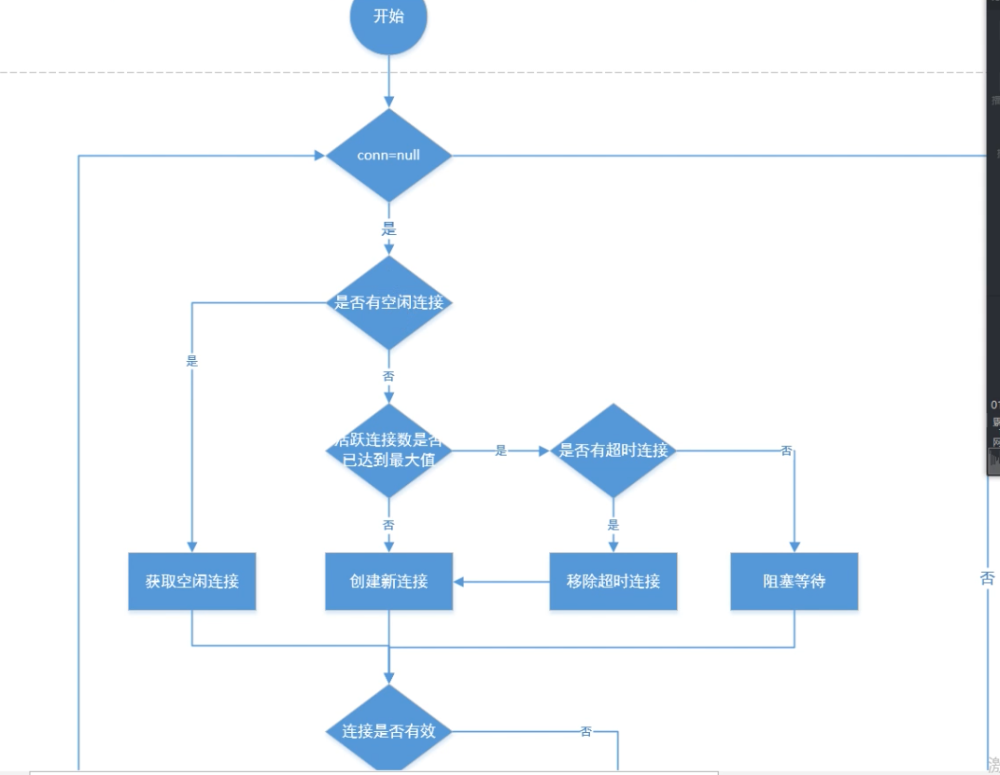
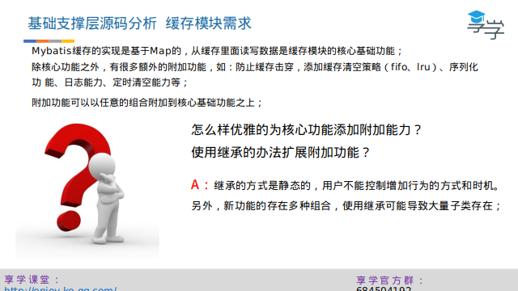
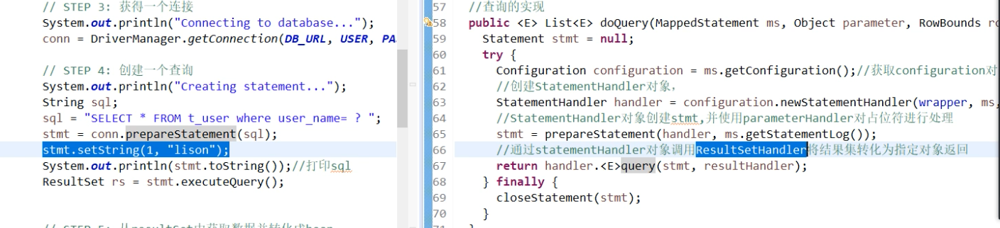
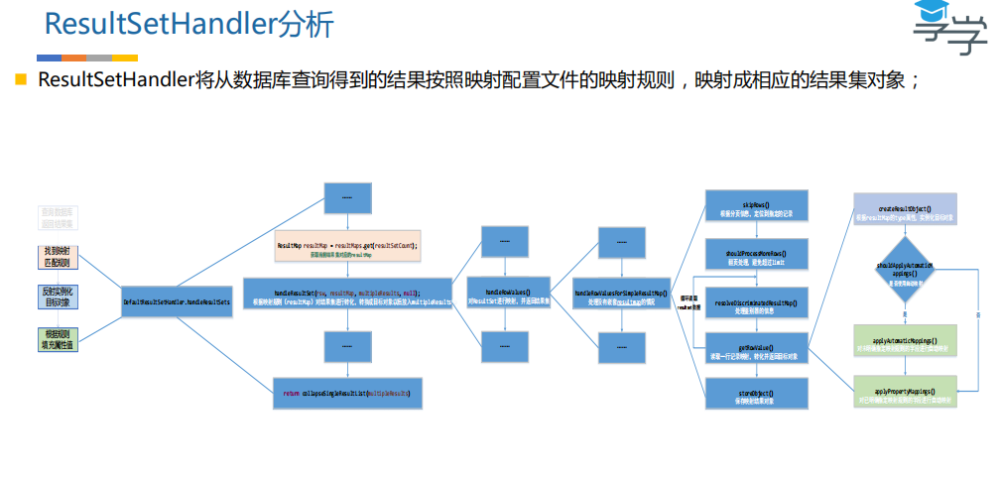

# ORM


1.导入驱动包

2.注册mysql驱动

3.获得一个链接

4.创建一个查询

5.从结果集中获取数据

6.关闭链接

Statement和PreparedStatement,推荐使用PreparedStatement,会使用预编译,查询计划,缓存,第一次才会有,第一次会很慢,后面的会很快.还会防止sql注入.在 mybatis里就是#{}和${}的区别

\#传入的参数在SQL中显示为字符串（当成一个字符串），会对自动传入的数据加一个双引号。

$传入的参数在SqL中直接显示为传入的值

\#可以防止SQL注入的风险（语句的拼接）；但$无法防止Sql注入。

$方式一般用于传入数据库对象，例如传入表名。

大多数情况下还是经常使用#，一般能用#的就别用$；但有些情况下必须使用$，例：MyBatis排序时使用order by 动态参数时需要注意，用$而不是#。

Statement 和 PreparedStatement之间的关系和区别.
    关系：PreparedStatement继承自Statement,都是接口
    区别：PreparedStatement可以使用占位符，是预编译的，批处理比Statement效率高   
详解：
1、PreparedStatement：表示预编译的 SQL 语句的对象。
   接口：public interface PreparedStatement extends Statement之间的继承关系
   SQL 语句被预编译并存储在 PreparedStatement 对象中。然后可以使用此对象多次高效地执行该语句。

 如果需要任意参数类型转换，使用 setObject 方法时应该将目标 SQL 类型作为其参数。
   在以下设置参数的示例中，con 表示一个活动连接：
              PreparedStatement pstmt = con.prepareStatement("UPDATE EMPLOYEES SALARY = ? WHERE ID = ?");
              pstmt.setBigDecimal(1, 1533.00)
              pstmt.setInt(2, 1102)
              pstmt.execute()//注意提交时这里不能再有sql语句,不同于Statment


2、Statement:用于执行静态 SQL 语句并返回它所生成结果的对象。
   接口：public interface Statement extends Wrapper
在默认情况下，同一时间每个 Statement 对象只能打开一个 ResultSet 对象。因此，如果读取一个 ResultSet 对象与另一个交叉，则这两个对象必须是由不同的 Statement 对象生成的。如果存在某个语句的打开的当前 ResultSet 对象，则 Statement 接口中的所有执行方法都会隐式关闭它。  
   如以下操作：创建statement对象
          Statement stat=conn.createStatement();
          String sql="insert into lover values(6,'suxingxing',to_date('21-9-2016','dd-mm-yyyy'))";
          stat.execute(sql);//这里提交时应该有sql语句，不同于PreparedStatment


# mybatis入门


# mybaits配置





# mapper配置


resultType是自动映射，resultMap是自定义指定的数据库字段和类属性一一对应


建议使用resultMap.因为这样可以解耦数据库字段和代码。


用#{}是使用的占位符，在sql中显示的是？，并且在字段两边加上了单引号，这样就防止了sql注入，${}是直接将值传入了sql。


# 动态Sql


<where>会自动去掉and或者where


<set>会将最后一个逗号去掉


foreach用在in中，传入的是array数组


foreach用在批量插入中，传入的是list


jdbc中的批量操作


mybaits批量操作


# 与Spring集成


# 代码生成器


# 关联查询


resultMap的继承





# 缓存




一级缓存是线程独有的，二级缓存是线程共享的，二级缓存空间可以共享，但是二级缓存容易出现脏读，因为另一个二级缓存更新了数据。一级缓存很少出现脏读，因为一级有事务控制，生命周期比较短。

mybatis的一级缓存是基于sqlsession为生命周期的

当你这个session没有了，缓存就没有了

mybatis的二级缓存是基于application为生命周期的

但是解决多表操作避免脏数据还是有法解决的。解决思路就是通过拦截器判断执行的sql涉及到那些表（可以用jsqlparser解析），然后把相关表的缓存自动清空。但是这种方式对缓存的使用效率是很低的。

# 源码分析


# 日志模块分析


第一个问题通过适配器解决，



第二个问题通过LogFactory来实现自动扫描优先加载


选中了哪个日志实现就把该日志的构造方法加载进来，getLog时通过反射获取实现类。


第三个问题使用代理模式实现


# 数据源模块分析


poolState


获取连接





```java
 private PooledConnection popConnection(String username, String password) throws SQLException {
    boolean countedWait = false;
    PooledConnection conn = null;
    long t = System.currentTimeMillis();//记录尝试获取连接的起始时间戳
    int localBadConnectionCount = 0;//初始化获取到无效连接的次数

    while (conn == null) {
      synchronized (state) {//获取连接必须是同步的
        if (!state.idleConnections.isEmpty()) {//检测是否有空闲连接
          // Pool has available connection
          //有空闲连接直接使用
          conn = state.idleConnections.remove(0);
          if (log.isDebugEnabled()) {
            log.debug("Checked out connection " + conn.getRealHashCode() + " from pool.");
          }
        } else {// 没有空闲连接
          if (state.activeConnections.size() < poolMaximumActiveConnections) {//判断活跃连接池中的数量是否大于最大连接数
            // 没有则可创建新的连接
            conn = new PooledConnection(dataSource.getConnection(), this);
            if (log.isDebugEnabled()) {
              log.debug("Created connection " + conn.getRealHashCode() + ".");
            }
          } else {// 如果已经等于最大连接数，则不能创建新连接
            //获取最早创建的连接
            PooledConnection oldestActiveConnection = state.activeConnections.get(0);
            long longestCheckoutTime = oldestActiveConnection.getCheckoutTime();
            if (longestCheckoutTime > poolMaximumCheckoutTime) {//检测是否已经以及超过最长使用时间
              // 如果超时，对超时连接的信息进行统计
              state.claimedOverdueConnectionCount++;//超时连接次数+1
              state.accumulatedCheckoutTimeOfOverdueConnections += longestCheckoutTime;//累计超时时间增加
              state.accumulatedCheckoutTime += longestCheckoutTime;//累计的使用连接的时间增加
              state.activeConnections.remove(oldestActiveConnection);//从活跃队列中删除
              if (!oldestActiveConnection.getRealConnection().getAutoCommit()) {//如果超时连接未提交，则手动回滚
                try {
                  oldestActiveConnection.getRealConnection().rollback();
                } catch (SQLException e) {//发生异常仅仅记录日志
                  /*
                     Just log a message for debug and continue to execute the following
                     statement like nothing happend.
                     Wrap the bad connection with a new PooledConnection, this will help
                     to not intterupt current executing thread and give current thread a
                     chance to join the next competion for another valid/good database
                     connection. At the end of this loop, bad {@link @conn} will be set as null.
                   */
                  log.debug("Bad connection. Could not roll back");
                }  
              }
              //在连接池中创建新的连接，注意对于数据库来说，并没有创建新连接；
              conn = new PooledConnection(oldestActiveConnection.getRealConnection(), this);
              conn.setCreatedTimestamp(oldestActiveConnection.getCreatedTimestamp());
              conn.setLastUsedTimestamp(oldestActiveConnection.getLastUsedTimestamp());
              //让老连接失效
              oldestActiveConnection.invalidate();
              if (log.isDebugEnabled()) {
                log.debug("Claimed overdue connection " + conn.getRealHashCode() + ".");
              }
            } else {
              // 无空闲连接，最早创建的连接没有失效，无法创建新连接，只能阻塞
              try {
                if (!countedWait) {
                  state.hadToWaitCount++;//连接池累计等待次数加1
                  countedWait = true;
                }
                if (log.isDebugEnabled()) {
                  log.debug("Waiting as long as " + poolTimeToWait + " milliseconds for connection.");
                }
                long wt = System.currentTimeMillis();
                state.wait(poolTimeToWait);//阻塞等待指定时间
                state.accumulatedWaitTime += System.currentTimeMillis() - wt;//累计等待时间增加
              } catch (InterruptedException e) {
                break;
              }
            }
          }
        }
        if (conn != null) {//获取连接成功的，要测试连接是否有效，同时更新统计数据
          // ping to server and check the connection is valid or not
          if (conn.isValid()) {//检测连接是否有效
            if (!conn.getRealConnection().getAutoCommit()) {
              conn.getRealConnection().rollback();//如果遗留历史的事务，回滚
            }
            //连接池相关统计信息更新
            conn.setConnectionTypeCode(assembleConnectionTypeCode(dataSource.getUrl(), username, password));
            conn.setCheckoutTimestamp(System.currentTimeMillis());
            conn.setLastUsedTimestamp(System.currentTimeMillis());
            state.activeConnections.add(conn);
            state.requestCount++;
            state.accumulatedRequestTime += System.currentTimeMillis() - t;
          } else {//如果连接无效
            if (log.isDebugEnabled()) {
              log.debug("A bad connection (" + conn.getRealHashCode() + ") was returned from the pool, getting another connection.");
            }
            state.badConnectionCount++;//累计的获取无效连接次数+1
            localBadConnectionCount++;//当前获取无效连接次数+1
            conn = null;
            //拿到无效连接，但如果没有超过重试的次数，允许再次尝试获取连接，否则抛出异常
            if (localBadConnectionCount > (poolMaximumIdleConnections + poolMaximumLocalBadConnectionTolerance)) {
              if (log.isDebugEnabled()) {
                log.debug("PooledDataSource: Could not get a good connection to the database.");
              }
              throw new SQLException("PooledDataSource: Could not get a good connection to the database.");
            }
          }
        }
      }

    }

    if (conn == null) {
      if (log.isDebugEnabled()) {
        log.debug("PooledDataSource: Unknown severe error condition.  The connection pool returned a null connection.");
      }
      throw new SQLException("PooledDataSource: Unknown severe error condition.  The connection pool returned a null connection.");
    }

    return conn;
  }

```


归还连接

空闲连接指的是已经连接到数据源了，可以直接拿来使用的连接。

```java
 //回收连接资源
  protected void pushConnection(PooledConnection conn) throws SQLException {

    synchronized (state) {//回收连接必须是同步的
      state.activeConnections.remove(conn);//从活跃连接池中删除此连接
      if (conn.isValid()) {
    	  //判断闲置连接池资源是否已经达到上限
        if (state.idleConnections.size() < poolMaximumIdleConnections && conn.getConnectionTypeCode() == expectedConnectionTypeCode) {
        	//没有达到上限，进行回收，使其变为空闲连接
          state.accumulatedCheckoutTime += conn.getCheckoutTime();
          if (!conn.getRealConnection().getAutoCommit()) {
            conn.getRealConnection().rollback();//如果还有事务没有提交，进行回滚操作
          }
          //基于该连接，创建一个新的连接资源，并刷新连接状态
          PooledConnection newConn = new PooledConnection(conn.getRealConnection(), this);
          state.idleConnections.add(newConn);
          newConn.setCreatedTimestamp(conn.getCreatedTimestamp());
          newConn.setLastUsedTimestamp(conn.getLastUsedTimestamp());
          //老连接失效
          conn.invalidate();
          if (log.isDebugEnabled()) {
            log.debug("Returned connection " + newConn.getRealHashCode() + " to pool.");
          }
          //唤醒其他被阻塞的线程
          state.notifyAll();
        } else {//如果闲置连接池已经达到上限了，将连接真实关闭
          state.accumulatedCheckoutTime += conn.getCheckoutTime();
          if (!conn.getRealConnection().getAutoCommit()) {
            conn.getRealConnection().rollback();
          }
          //关闭真的数据库连接
          conn.getRealConnection().close();
          if (log.isDebugEnabled()) {
            log.debug("Closed connection " + conn.getRealHashCode() + ".");
          }
          //将连接对象设置为无效
          conn.invalidate();
        }
      } else {
        if (log.isDebugEnabled()) {
          log.debug("A bad connection (" + conn.getRealHashCode() + ") attempted to return to the pool, discarding connection.");
        }
        state.badConnectionCount++;
      }
    }
  }

```

# 缓存模块分析





凡是在代码中看到已Wrapper结尾的类，一律是使用了装饰器模式，其实装饰器模式就相当于递归调用。


java中的连接池中的线程数一定要小于数据库中线程池的连接数。缓存就是数据库的一道防火墙，第一，减小硬盘的IO，第二，防止请求太多数据库挂掉。

有这么一个问题，假如当服务器刚启动或者是缓存中的数据到了有效时间都失效了，这个时候缓存中是空的，恰巧这时来了大量的请求访问数据，就会全部去了数据库查询，缓存就失去作用了，引发缓存雪崩。解决方法就是在缓存中加上锁，先让一个线程去数据库中查询数据，并将查询的结果保存到缓存中，接下来的请求就先看缓存中有没有，避免了所有请求都向数据库中查询数据。但是只让一个请求去访问，会带来用户体验的问题，可以设置多把锁，为每个地区或者某些数据单独一把锁。


带锁的获取缓存的过程

```java
 @Override
  public Object getObject(Object key) {
    acquireLock(key);//根据key获得锁对象，获取锁成功加锁，获取锁失败阻塞一段时间重试
    Object value = delegate.getObject(key);
    if (value != null) {//获取数据成功的，要释放锁
      releaseLock(key);
    }        
    return value;
  }
```

```java
//根据key获得锁对象，获取锁成功加锁，获取锁失败阻塞一段时间重试
  private void acquireLock(Object key) {
	//获得锁对象
    Lock lock = getLockForKey(key);
    if (timeout > 0) {//使用带超时时间的锁
      try {
        boolean acquired = lock.tryLock(timeout, TimeUnit.MILLISECONDS);
        if (!acquired) {//如果超时抛出异常
          throw new CacheException("Couldn't get a lock in " + timeout + " for the key " +  key + " at the cache " + delegate.getId());  
        }
      } catch (InterruptedException e) {
        throw new CacheException("Got interrupted while trying to acquire lock for key " + key, e);
      }
    } else {//使用不带超时时间的锁
      lock.lock();
    }
  }
```

```java
private ReentrantLock getLockForKey(Object key) {
    ReentrantLock lock = new ReentrantLock();//创建锁
    ReentrantLock previous = locks.putIfAbsent(key, lock);//把新锁添加到locks集合中，如果添加成功使用新锁，如果添加失败则使用locks集合中的锁
    return previous == null ? lock : previous;
  }
```

```java
 //被装饰的底层对象，一般是PerpetualCache
  private final Cache delegate;
//锁对象集，粒度到key值
  private final ConcurrentHashMap<Object, ReentrantLock> locks;
```


mappedStatment的id指xml文件中的resultMap中的id和命名空间namespace

```java
public class CacheKey implements Cloneable, Serializable {

  private static final long serialVersionUID = 1146682552656046210L;

  public static final CacheKey NULL_CACHE_KEY = new NullCacheKey();

  private static final int DEFAULT_MULTIPLYER = 37;
  private static final int DEFAULT_HASHCODE = 17;
// 下面四个对象加入到Cachekey
  private final int multiplier;//参与hash计算的乘数
  private int hashcode;//CacheKey的hash值，在update函数中实时运算出来的
  private long checksum;//校验和，hash值的和
  private int count;//updateList的中元素个数
  // 8/21/2017 - Sonarlint flags this as needing to be marked transient.  While true if content is not serializable, this is not always true and thus should not be marked transient.
  //该集合中的元素觉得两个CacheKey是否相等
  private List<Object> updateList;

  public CacheKey() {
    this.hashcode = DEFAULT_HASHCODE;
    this.multiplier = DEFAULT_MULTIPLYER;
    this.count = 0;
    this.updateList = new ArrayList<>();
  }

  public CacheKey(Object[] objects) {
    this();
    updateAll(objects);
  }

  public int getUpdateCount() {
    return updateList.size();
  }

  public void update(Object object) {
	//获取object的hash值
    int baseHashCode = object == null ? 1 : ArrayUtil.hashCode(object); 
    //更新count、checksum以及hashcode的值
    count++;
    checksum += baseHashCode;
    baseHashCode *= count;
    hashcode = multiplier * hashcode + baseHashCode;
    //将对象添加到updateList中
    updateList.add(object);
  }

  public void updateAll(Object[] objects) {
    for (Object o : objects) {
      update(o);
    }
  }

  @Override
  public boolean equals(Object object) {
    if (this == object) {//比较是不是同一个对象
      return true;
    }
    if (!(object instanceof CacheKey)) {//是否类型相同
      return false;
    }

    final CacheKey cacheKey = (CacheKey) object;

    if (hashcode != cacheKey.hashcode) {//hashcode是否相同
      return false;
    }
    if (checksum != cacheKey.checksum) {//checksum是否相同
      return false;
    }
    if (count != cacheKey.count) {//count是否相同
      return false;
    }

    //以上都相同，才按顺序比较updateList中元素的hash值是否一致
    for (int i = 0; i < updateList.size(); i++) {
      Object thisObject = updateList.get(i);
      Object thatObject = cacheKey.updateList.get(i);
      if (!ArrayUtil.equals(thisObject, thatObject)) {
        return false;
      }
    }
    return true;
  }

  @Override
  public int hashCode() {
    return hashcode;
  }

  @Override
  public String toString() {
    StringBuilder returnValue = new StringBuilder().append(hashcode).append(':').append(checksum);
    for (Object object : updateList) {
      returnValue.append(':').append(ArrayUtil.toString(object));
    }
    return returnValue.toString();
  }

  @Override
  public CacheKey clone() throws CloneNotSupportedException {
    CacheKey clonedCacheKey = (CacheKey) super.clone();
    clonedCacheKey.updateList = new ArrayList<>(updateList);
    return clonedCacheKey;
  }

}

```

```java
public class PerpetualCache implements Cache {

  private final String id;

  private Map<Object, Object> cache = new HashMap<>();

  public PerpetualCache(String id) {
    this.id = id;
  }

  @Override
  public String getId() {
    return id;
  }
```


# 反射模块分析


通过ObjectFactory解决了实例化目标对象的问题

```java
/**
 * MyBatis uses an ObjectFactory to create all needed new Objects.
 * 
 * @author Clinton Begin
 */
public interface ObjectFactory {

  /**
   * Sets configuration properties.
   * @param properties configuration properties
   */
  void setProperties(Properties properties);

  /**
   * Creates a new object with default constructor. 
   * @param type Object type
   * @return
   */
  <T> T create(Class<T> type);
    
     /**
   * Creates a new object with the specified constructor and params.
   * @param type Object type
   * @param constructorArgTypes Constructor argument types
   * @param constructorArgs Constructor argument values
   * @return
   */
  <T> T create(Class<T> type, List<Class<?>> constructorArgTypes, List<Object> constructorArgs);
  

```

```java
public class DefaultObjectFactory implements ObjectFactory, Serializable {

  private static final long serialVersionUID = -8855120656740914948L;

  @Override
  public <T> T create(Class<T> type) {
    return create(type, null, null);
  }

  @SuppressWarnings("unchecked")
  @Override
  public <T> T create(Class<T> type, List<Class<?>> constructorArgTypes, List<Object> constructorArgs) {
	//判断类是不是集合类，如果是集合类指定具体的实现类
    Class<?> classToCreate = resolveInterface(type);
    // we know types are assignable
    return (T) instantiateClass(classToCreate, constructorArgTypes, constructorArgs);
  }
    
    
    private  <T> T instantiateClass(Class<T> type, List<Class<?>> constructorArgTypes, List<Object> constructorArgs) {
    try {
      Constructor<T> constructor;
      //通过无参构造函数创建对象
      if (constructorArgTypes == null || constructorArgs == null) {
        constructor = type.getDeclaredConstructor();
        if (!constructor.isAccessible()) {
          constructor.setAccessible(true);
        }
        return constructor.newInstance();
      }
      //根据指定的参数列表查找构造函数，并实例化对象
      constructor = type.getDeclaredConstructor(constructorArgTypes.toArray(new Class[constructorArgTypes.size()]));
      if (!constructor.isAccessible()) {
        constructor.setAccessible(true);
      }
      return constructor.newInstance(constructorArgs.toArray(new Object[constructorArgs.size()]));
    } catch (Exception e) {
      StringBuilder argTypes = new StringBuilder();
      if (constructorArgTypes != null && !constructorArgTypes.isEmpty()) {
        for (Class<?> argType : constructorArgTypes) {
          argTypes.append(argType.getSimpleName());
          argTypes.append(",");
        }
        argTypes.deleteCharAt(argTypes.length() - 1); // remove trailing ,
      }
      StringBuilder argValues = new StringBuilder();
      if (constructorArgs != null && !constructorArgs.isEmpty()) {
        for (Object argValue : constructorArgs) {
          argValues.append(String.valueOf(argValue));
          argValues.append(",");
        }
        argValues.deleteCharAt(argValues.length() - 1); // remove trailing ,
      }
      throw new ReflectionException("Error instantiating " + type + " with invalid types (" + argTypes + ") or values (" + argValues + "). Cause: " + e, e);
    }
  }

```

Reflector类封装了类的信息,并缓存起来。mybaits使用的是暴力反射，不管你的实体类的属性是private还是public，有没有get和set方法，都会给你生成get和set方法，并把值设置进去。这个和字节码增强的是有区别的，这种方法生成的get和set方法在class对象中是没有的，而字节码增强的class中是有的。

```java
/**
 * This class represents a cached set of class definition information that
 * allows for easy mapping between property names and getter/setter methods.
 *
 * @author Clinton Begin
 */
public class Reflector {

  private final Class<?> type;//对应的class
  private final String[] readablePropertyNames;//可读属性的名称集合，存在get方法即可读
  private final String[] writeablePropertyNames;//可写属性的名称集合，存在set方法即可写
  private final Map<String, Invoker> setMethods = new HashMap<>();//保存属性相关的set方法
  private final Map<String, Invoker> getMethods = new HashMap<>();//保存属性相关的get方法
  private final Map<String, Class<?>> setTypes = new HashMap<>();//保存属性相关的set方法入参类型
  private final Map<String, Class<?>> getTypes = new HashMap<>();//保存属性相关的get方法返回类型
  private Constructor<?> defaultConstructor;//class默认的构造函数

  //记录所有属性的名称集合
  private Map<String, String> caseInsensitivePropertyMap = new HashMap<>();

  public Reflector(Class<?> clazz) {
    type = clazz;
    addDefaultConstructor(clazz);//获取clazz的默认构造函数
    addGetMethods(clazz);//处理clazz中的get方法信息，填充getMethods、getTypes
    addSetMethods(clazz);//处理clazz中的set方法信息，填充setMethods、setTypes
    addFields(clazz);//处理没有get、set方法的属性
    //根据get、set方法初始化可读属性集合和可写属性集合
    readablePropertyNames = getMethods.keySet().toArray(new String[getMethods.keySet().size()]);
    writeablePropertyNames = setMethods.keySet().toArray(new String[setMethods.keySet().size()]);
    //初始化caseInsensitivePropertyMap
    for (String propName : readablePropertyNames) {
      caseInsensitivePropertyMap.put(propName.toUpperCase(Locale.ENGLISH), propName);
    }
    for (String propName : writeablePropertyNames) {
      caseInsensitivePropertyMap.put(propName.toUpperCase(Locale.ENGLISH), propName);
    }
  }

```


ObjectWrapper封装对象的信息

```java
public interface ObjectWrapper {

  //获取对象指定属性的值
  Object get(PropertyTokenizer prop);

  //设置对象指定属性的值
  void set(PropertyTokenizer prop, Object value);
```

```java
		
		//使用Reflector读取类元信息
		Reflector findForClass = reflectorFactory.findForClass(TUser.class);
		Constructor<?> defaultConstructor = findForClass.getDefaultConstructor();
		String[] getablePropertyNames = findForClass.getGetablePropertyNames();
		String[] setablePropertyNames = findForClass.getSetablePropertyNames();
		System.out.println(defaultConstructor.getName());
		System.out.println(Arrays.toString(getablePropertyNames));
		System.out.println(Arrays.toString(setablePropertyNames));


	    //使用ObjectWrapper读取对象信息，并对对象属性进行赋值操作
		TUser userTemp = new TUser();
		ObjectWrapper wrapperForUser = new BeanWrapper(metaObject, userTemp);
		String[] getterNames = wrapperForUser.getGetterNames();
		String[] setterNames = wrapperForUser.getSetterNames();
		System.out.println(Arrays.toString(getterNames));
		System.out.println(Arrays.toString(setterNames));
// 通过反射给属性赋值
		PropertyTokenizer prop = new PropertyTokenizer("userName");
		wrapperForUser.set(prop, "lison");
		System.out.println(userTemp);


//反射工具类初始化
		ObjectFactory objectFactory = new DefaultObjectFactory();
		TUser user = objectFactory.create(TUser.class);
		ObjectWrapperFactory objectWrapperFactory = new DefaultObjectWrapperFactory();
		ReflectorFactory reflectorFactory = new DefaultReflectorFactory();
		MetaObject metaObject = MetaObject.forObject(user, objectFactory, objectWrapperFactory, reflectorFactory);

		

		//模拟数据库行数据转化成对象
		//1.模拟从数据库读取数据
		Map<String, Object> dbResult = new HashMap<>();
		dbResult.put("id", 1);
		dbResult.put("user_name", "lison");
		dbResult.put("real_name", "李晓宇");
		TPosition tp = new TPosition();
		tp.setId(1);
		dbResult.put("position_id", tp);
		//2.模拟映射关系
		Map<String, String> mapper = new HashMap<String, String>();
		mapper.put("id", "id");
		mapper.put("userName", "user_name");
		mapper.put("realName", "real_name");
		mapper.put("position", "position_id");
		
		//3.使用反射工具类将行数据转换成pojo
		BeanWrapper objectWrapper = (BeanWrapper) metaObject.getObjectWrapper();
		
		Set<Entry<String, String>> entrySet = mapper.entrySet();
		for (Entry<String, String> colInfo : entrySet) {
			String propName = colInfo.getKey();
			Object propValue = dbResult.get(colInfo.getValue());
			PropertyTokenizer proTokenizer = new PropertyTokenizer(propName);
			objectWrapper.set(proTokenizer, propValue);
		}
		System.out.println(metaObject.getOriginalObject());
```


# Mybaits核心流程分析


# 配置加载阶段


代码演示：

产品类-红包，有以下属性：

```java
package com.enjoylearning.mybatis.build;

import java.math.BigDecimal;
import java.util.Date;

public class RedPacket {
	
	private String publisherName; //发包人

    private String acceptName; //手包人

    private BigDecimal packetAmount; //红包金额

    private int packetType; //红包类型

    private Date pulishPacketTime; //发包时间

    private Date openPacketTime; //抢包时间

    public RedPacket(String publisherName, String acceptName, BigDecimal packetAmount, int packetType, Date pulishPacketTime, Date openPacketTime) {
        this.publisherName = publisherName;
        this.acceptName = acceptName;
        this.packetAmount = packetAmount;
        this.packetType = packetType;
        this.pulishPacketTime = pulishPacketTime;
        this.openPacketTime = openPacketTime;
    }

	public String getPublisherName() {
		return publisherName;
	}

	public void setPublisherName(String publisherName) {
		this.publisherName = publisherName;
	}

	public String getAcceptName() {
		return acceptName;
	}

	public void setAcceptName(String acceptName) {
		this.acceptName = acceptName;
	}

	public BigDecimal getPacketAmount() {
		return packetAmount;
	}

	public void setPacketAmount(BigDecimal packetAmount) {
		this.packetAmount = packetAmount;
	}

	public int getPacketType() {
		return packetType;
	}

	public void setPacketType(int packetType) {
		this.packetType = packetType;
	}

	public Date getPulishPacketTime() {
		return pulishPacketTime;
	}

	public void setPulishPacketTime(Date pulishPacketTime) {
		this.pulishPacketTime = pulishPacketTime;
	}

	public Date getOpenPacketTime() {
		return openPacketTime;
	}

	public void setOpenPacketTime(Date openPacketTime) {
		this.openPacketTime = openPacketTime;
	}

	@Override
	public String toString() {
		return "RedPacket [publisherName=" + publisherName + ", acceptName="
				+ acceptName + ", packetAmount=" + packetAmount
				+ ", packetType=" + packetType + ", pulishPacketTime="
				+ pulishPacketTime + ", openPacketTime=" + openPacketTime + "]";
	}
    
    
    

}

```

建造器接口，主要是对产品的属性进行设置

```java
package com.enjoylearning.mybatis.build;

import java.math.BigDecimal;
import java.util.Date;

public interface RedPacketBuilder {
	
	RedPacketBuilder setPublisherName(String publishName);

	RedPacketBuilder setAcceptName(String acceptName);

	RedPacketBuilder setPacketAmount(BigDecimal packetAmount);

	RedPacketBuilder setPacketType(int packetType);

	RedPacketBuilder setPulishPacketTime(Date pushlishPacketTime);

	RedPacketBuilder setOpenPacketTime(Date openPacketTime);

    RedPacket build();
}

```

建造器接口的实现

```java
package com.enjoylearning.mybatis.build;

import java.math.BigDecimal;
import java.util.Date;

public class RedPacketBuilderImpl implements RedPacketBuilder {
	
	private String publisherName;

    private String acceptName;

    private BigDecimal packetAmount;
    
    private int packetType;

    private Date pulishPacketTime;

    private Date openPacketTime;

    public static RedPacketBuilderImpl getBulider(){
        return new RedPacketBuilderImpl();
    }


    @Override
    public RedPacketBuilder setPublisherName(String publishName) {
        this.publisherName = publishName;
        return this;
    }

    @Override
    public RedPacketBuilder setAcceptName(String acceptName) {
       this.acceptName = acceptName;
       return this;
    }

    @Override
    public RedPacketBuilder setPacketAmount(BigDecimal packetAmount) {
       this.packetAmount = packetAmount;
       return this;
    }

    @Override
    public RedPacketBuilder setPacketType(int packetType) {
        this.packetType = packetType;
        return this;
    }

    @Override
    public RedPacketBuilder setPulishPacketTime(Date pushlishPacketTime) {
       this.pulishPacketTime = pushlishPacketTime;
        return this;
    }

    @Override
    public RedPacketBuilder setOpenPacketTime(Date openPacketTime) {
      this.openPacketTime = openPacketTime;
        return this;
    }


    public RedPacket build() {
        return new RedPacket(publisherName,acceptName,packetAmount,packetType,pulishPacketTime,openPacketTime);
    }
}

```

调用者：

```java
package com.enjoylearning.mybatis.build;

import java.math.BigDecimal;
import java.util.Date;

//Fluent编程风格 ，比如：zookeeper的Curator


/*
 * 
 * Random random = new Random();
random.ints().limit(10).forEach(System.out::println);

*/
public class Director {
	
	public static void main(String[] args) {
		RedPacket redPacket = RedPacketBuilderImpl.getBulider().setPublisherName("lison")
				                                               .setAcceptName("vip群")
                                                               .setPacketAmount(new BigDecimal("888"))
                                                               .setPacketType(1)
                                                               .setOpenPacketTime(new Date())
                                                               .setPulishPacketTime(new Date()).build();

		System.out.println(redPacket);
	}

}

```


Configuration源码，源码中的每一个属性都是和mybaits配置文件中的参数一一对应的。

```java
public class Configuration {

  protected Environment environment;

  /* 是否启用行内嵌套语句**/
  protected boolean safeRowBoundsEnabled;
  protected boolean safeResultHandlerEnabled = true;
  /* 是否启用数据组A_column自动映射到Java类中的驼峰命名的属性**/
  protected boolean mapUnderscoreToCamelCase;
  
  /*当对象使用延迟加载时 属性的加载取决于能被引用到的那些延迟属性,否则,按需加载(需要的是时候才去加载)**/
  protected boolean aggressiveLazyLoading;
  
  /*是否允许单条sql 返回多个数据集  (取决于驱动的兼容性) default:true **/
  protected boolean multipleResultSetsEnabled = true;
  
  /*-允许JDBC 生成主键。需要驱动器支持。如果设为了true，这个设置将强制使用被生成的主键，有一些驱动器不兼容不过仍然可以执行。  default:false**/
  protected boolean useGeneratedKeys;
  
  /* 使用列标签代替列名。不同的驱动在这方面会有不同的表现， 具体可参考相关驱动文档或通过测试这两种不同的模式来观察所用驱动的结果。**/
  protected boolean useColumnLabel = true;
  
  /*配置全局性的cache开关，默认为true**/
  protected boolean cacheEnabled = true;
  protected boolean callSettersOnNulls;
  protected boolean useActualParamName = true;
  protected boolean returnInstanceForEmptyRow;

  /* 日志打印所有的前缀 **/
  protected String logPrefix;
  
  /* 指定 MyBatis 所用日志的具体实现，未指定时将自动查找**/
  protected Class <? extends Log> logImpl;
  protected Class <? extends VFS> vfsImpl;
  /* 设置本地缓存范围，session：就会有数据的共享，statement：语句范围，这样不会有数据的共享**/
  protected LocalCacheScope localCacheScope = LocalCacheScope.SESSION;
  /* 设置但JDBC类型为空时,某些驱动程序 要指定值**/
  protected JdbcType jdbcTypeForNull = JdbcType.OTHER;
  
  /* 设置触发延迟加载的方法**/
  protected Set<String> lazyLoadTriggerMethods = new HashSet<>(Arrays.asList("equals", "clone", "hashCode", "toString"));
  
  /* 设置驱动等待数据响应超时数**/
  protected Integer defaultStatementTimeout;
  
  /* 设置驱动返回结果数的大小**/
  protected Integer defaultFetchSize;
  
  /* 执行类型，有simple、resue及batch**/
  protected ExecutorType defaultExecutorType = ExecutorType.SIMPLE;
  
  /*指定 MyBatis 应如何自动映射列到字段或属性*/
  protected AutoMappingBehavior autoMappingBehavior = AutoMappingBehavior.PARTIAL;
  protected AutoMappingUnknownColumnBehavior autoMappingUnknownColumnBehavior = AutoMappingUnknownColumnBehavior.NONE;

  protected Properties variables = new Properties();
  
  protected ReflectorFactory reflectorFactory = new DefaultReflectorFactory();
  
  /*MyBatis每次创建结果对象的新实例时，它都会使用对象工厂（ObjectFactory）去构建POJO*/
  protected ObjectFactory objectFactory = new DefaultObjectFactory();
  protected ObjectWrapperFactory objectWrapperFactory = new DefaultObjectWrapperFactory();

  /*延迟加载的全局开关*/
  protected boolean lazyLoadingEnabled = false;
  
  /*指定 Mybatis 创建具有延迟加载能力的对象所用到的代理工具*/
  protected ProxyFactory proxyFactory = new JavassistProxyFactory(); // #224 Using internal Javassist instead of OGNL

  protected String databaseId;
  /**
   * Configuration factory class.
   * Used to create Configuration for loading deserialized unread properties.
   *
   * @see <a href='https://code.google.com/p/mybatis/issues/detail?id=300'>Issue 300 (google code)</a>
   */
  protected Class<?> configurationFactory;
  
  /*插件集合*/
  protected final InterceptorChain interceptorChain = new InterceptorChain();
  
  /*TypeHandler注册中心*/
  protected final TypeHandlerRegistry typeHandlerRegistry = new TypeHandlerRegistry();
  
  /*TypeAlias注册中心*/
  protected final TypeAliasRegistry typeAliasRegistry = new TypeAliasRegistry();
  protected final LanguageDriverRegistry languageRegistry = new LanguageDriverRegistry();
  //-------------------------------------------------------------

  /*mapper接口的动态代理注册中心*/
  protected final MapperRegistry mapperRegistry = new MapperRegistry(this);

  /*mapper文件中增删改查操作的注册中心*/
  protected final Map<String, MappedStatement> mappedStatements = new StrictMap<>("Mapped Statements collection");
  
  /*mapper文件中配置cache节点的 二级缓存*/
  protected final Map<String, Cache> caches = new StrictMap<>("Caches collection");
  
  /*mapper文件中配置的所有resultMap对象  key为命名空间+ID*/
  protected final Map<String, ResultMap> resultMaps = new StrictMap<>("Result Maps collection");
  protected final Map<String, ParameterMap> parameterMaps = new StrictMap<>("Parameter Maps collection");
  
  /*mapper文件中配置KeyGenerator的insert和update节点，key为命名空间+ID*/
  protected final Map<String, KeyGenerator> keyGenerators = new StrictMap<>("Key Generators collection");

  /*加载到的所有*mapper.xml文件*/
  protected final Set<String> loadedResources = new HashSet<>();
  
  /*mapper文件中配置的sql元素，key为命名空间+ID*/
  protected final Map<String, XNode> sqlFragments = new StrictMap<>("XML fragments parsed from previous mappers");

  protected final Collection<XMLStatementBuilder> incompleteStatements = new LinkedList<>();
  protected final Collection<CacheRefResolver> incompleteCacheRefs = new LinkedList<>();
  protected final Collection<ResultMapResolver> incompleteResultMaps = new LinkedList<>();
  protected final Collection<MethodResolver> incompleteMethods = new LinkedList<>();

  /*
   * A map holds cache-ref relationship. The key is the namespace that
   * references a cache bound to another namespace and the value is the
   * namespace which the actual cache is bound to.
   */
  protected final Map<String, String> cacheRefMap = new HashMap<>();

  public Configuration(Environment environment) {
    this();
    this.environment = environment;
  }
```

mybaits的配置文件是通过XMLConfigBuilder加载并解析成Configuration对象的

```java
public class XMLConfigBuilder extends BaseBuilder {
  //是否解析过mybatis-config.xml文件
  private boolean parsed;
  //xml文件的解析器
  private final XPathParser parser;
  //读取默认的environment
  private String environment;
  //负责创建和缓存reflect对象
  private final ReflectorFactory localReflectorFactory = new DefaultReflectorFactory();

  public XMLConfigBuilder(Reader reader) {
    this(reader, null, null);
  }

  public XMLConfigBuilder(Reader reader, String environment) {
    this(reader, environment, null);
  }

  public XMLConfigBuilder(Reader reader, String environment, Properties props) {
    this(new XPathParser(reader, true, props, new XMLMapperEntityResolver()), environment, props);
  }

  public XMLConfigBuilder(InputStream inputStream) {
    this(inputStream, null, null);
  }

  public XMLConfigBuilder(InputStream inputStream, String environment) {
    this(inputStream, environment, null);
  }

  public XMLConfigBuilder(InputStream inputStream, String environment, Properties props) {
    this(new XPathParser(inputStream, true, props, new XMLMapperEntityResolver()), environment, props);
  }

  private XMLConfigBuilder(XPathParser parser, String environment, Properties props) {
    super(new Configuration());
    ErrorContext.instance().resource("SQL Mapper Configuration");
    this.configuration.setVariables(props);
    this.parsed = false;
    this.environment = environment;
    this.parser = parser;
  }

  public Configuration parse() {
    if (parsed) {
      throw new BuilderException("Each XMLConfigBuilder can only be used once.");
    }
    parsed = true;
    parseConfiguration(parser.evalNode("/configuration"));
    return configuration;
  }

  private void parseConfiguration(XNode root) {
    try {
      //issue #117 read properties first
     //解析<properties>节点
      propertiesElement(root.evalNode("properties"));
      //解析<settings>节点
      Properties settings = settingsAsProperties(root.evalNode("settings"));
      loadCustomVfs(settings);
      //解析<typeAliases>节点
      typeAliasesElement(root.evalNode("typeAliases"));
      //解析<plugins>节点
      pluginElement(root.evalNode("plugins"));
      //解析<objectFactory>节点
      objectFactoryElement(root.evalNode("objectFactory"));
      //解析<objectWrapperFactory>节点
      objectWrapperFactoryElement(root.evalNode("objectWrapperFactory"));
      //解析<reflectorFactory>节点
      reflectorFactoryElement(root.evalNode("reflectorFactory"));
      settingsElement(settings);//将settings填充到configuration
      // read it after objectFactory and objectWrapperFactory issue #631
      //解析<environments>节点
      environmentsElement(root.evalNode("environments"));
      //解析<databaseIdProvider>节点
      databaseIdProviderElement(root.evalNode("databaseIdProvider"));
      //解析<typeHandlers>节点
      typeHandlerElement(root.evalNode("typeHandlers"));
      //解析<mappers>节点
      mapperElement(root.evalNode("mappers"));
    } catch (Exception e) {
      throw new BuilderException("Error parsing SQL Mapper Configuration. Cause: " + e, e);
    }
  }


  private void pluginElement(XNode parent) throws Exception {
    if (parent != null) {
      //遍历所有的插件配置
      for (XNode child : parent.getChildren()) {
    	//获取插件的类名
        String interceptor = child.getStringAttribute("interceptor");
        //获取插件的配置
        Properties properties = child.getChildrenAsProperties();
        //实例化插件对象
        Interceptor interceptorInstance = (Interceptor) resolveClass(interceptor).newInstance();
        //设置插件属性
        interceptorInstance.setProperties(properties);
        //将插件添加到configuration对象，底层使用list保存所有的插件并记录顺序
        configuration.addInterceptor(interceptorInstance);
      }
    }
  }


  private void propertiesElement(XNode context) throws Exception {
    if (context != null) {
      //解析<properties>的子节点（<property>）,读取name和value属性，并记录到Properties中
      Properties defaults = context.getChildrenAsProperties();
      //解析resource属性
      String resource = context.getStringAttribute("resource");
      //解析url属性
      String url = context.getStringAttribute("url");
      //两者不能同时为空
      if (resource != null && url != null) {
        throw new BuilderException("The properties element cannot specify both a URL and a resource based property file reference.  Please specify one or the other.");
      }
      
      
      if (resource != null) {//根据resource加载配置文件
        defaults.putAll(Resources.getResourceAsProperties(resource));
      } else if (url != null) {//根据url加载配置文件
        defaults.putAll(Resources.getUrlAsProperties(url));
      }
      
      //将配置文件的信息与configuration中的Variables合并
      Properties vars = configuration.getVariables();
      if (vars != null) {
        defaults.putAll(vars);
      }
    //更新解析器parser和configuration中的Variables
      parser.setVariables(defaults);
      configuration.setVariables(defaults);
    }
  }


  private void mapperElement(XNode parent) throws Exception {
    if (parent != null) {
      for (XNode child : parent.getChildren()) {//处理mapper子节点
        if ("package".equals(child.getName())) {//package子节点
          String mapperPackage = child.getStringAttribute("name");
          configuration.addMappers(mapperPackage);
        } else {//获取<mapper>节点的resource、url或mClass属性这三个属性互斥
          String resource = child.getStringAttribute("resource");
          String url = child.getStringAttribute("url");
          String mapperClass = child.getStringAttribute("class");
          if (resource != null && url == null && mapperClass == null) {//如果resource不为空
            ErrorContext.instance().resource(resource);
            InputStream inputStream = Resources.getResourceAsStream(resource);//加载mapper文件
            //实例化XMLMapperBuilder解析mapper映射文件
            XMLMapperBuilder mapperParser = new XMLMapperBuilder(inputStream, configuration, resource, configuration.getSqlFragments());
            mapperParser.parse();
          } else if (resource == null && url != null && mapperClass == null) {//如果url不为空
            ErrorContext.instance().resource(url);
            InputStream inputStream = Resources.getUrlAsStream(url);//加载mapper文件
            //实例化XMLMapperBuilder解析mapper映射文件
            XMLMapperBuilder mapperParser = new XMLMapperBuilder(inputStream, configuration, url, configuration.getSqlFragments());
            mapperParser.parse();
          } else if (resource == null && url == null && mapperClass != null) {//如果class不为空
            Class<?> mapperInterface = Resources.classForName(mapperClass);//加载class对象
            configuration.addMapper(mapperInterface);//向代理中心注册mapper
          } else {
            throw new BuilderException("A mapper element may only specify a url, resource or class, but not more than one.");
          }
        }
      }
    }
  }


}
```

   //实例化XMLMapperBuilder解析mapper映射文件

```java
/**
 * @author Clinton Begin
 */
public class XMLMapperBuilder extends BaseBuilder {

  private final XPathParser parser;
  private final MapperBuilderAssistant builderAssistant;
  private final Map<String, XNode> sqlFragments;
  private final String resource;


  public void parse() {
	//判断是否已经加载该配置文件
    if (!configuration.isResourceLoaded(resource)) {
      configurationElement(parser.evalNode("/mapper"));//处理mapper节点
      configuration.addLoadedResource(resource);//将mapper文件添加到configuration.loadedResources中
      bindMapperForNamespace();//注册mapper接口
    }
    //处理解析失败的ResultMap节点
    parsePendingResultMaps();
    //处理解析失败的CacheRef节点
    parsePendingCacheRefs();
    //处理解析失败的Sql语句节点
    parsePendingStatements();
  }

  public XNode getSqlFragment(String refid) {
    return sqlFragments.get(refid);
  }

  private void configurationElement(XNode context) {
    try {
    	//获取mapper节点的namespace属性
      String namespace = context.getStringAttribute("namespace");
      if (namespace == null || namespace.equals("")) {
        throw new BuilderException("Mapper's namespace cannot be empty");
      }
      //设置builderAssistant的namespace属性
      builderAssistant.setCurrentNamespace(namespace);
      //解析cache-ref节点
      cacheRefElement(context.evalNode("cache-ref"));
      //重点分析 ：解析cache节点----------------1-------------------
      cacheElement(context.evalNode("cache"));
      //解析parameterMap节点（已废弃）
      parameterMapElement(context.evalNodes("/mapper/parameterMap"));
      //重点分析 ：解析resultMap节点（基于数据结果去理解）----------------2-------------------
      resultMapElements(context.evalNodes("/mapper/resultMap"));
      //解析sql节点
      sqlElement(context.evalNodes("/mapper/sql"));
      //重点分析 ：解析select、insert、update、delete节点 ----------------3-------------------
      buildStatementFromContext(context.evalNodes("select|insert|update|delete"));
    } catch (Exception e) {
      throw new BuilderException("Error parsing Mapper XML. The XML location is '" + resource + "'. Cause: " + e, e);
    }
  }
  //解析select、insert、update、delete节点
  private void buildStatementFromContext(List<XNode> list) {
    if (configuration.getDatabaseId() != null) {
      buildStatementFromContext(list, configuration.getDatabaseId());
    }
    buildStatementFromContext(list, null);
  }

  //处理所有的sql语句节点并注册至configuration对象
  private void buildStatementFromContext(List<XNode> list, String requiredDatabaseId) {
    for (XNode context : list) {
      //创建XMLStatementBuilder 专门用于解析sql语句节点
      final XMLStatementBuilder statementParser = new XMLStatementBuilder(configuration, builderAssistant, context, requiredDatabaseId);
      try {
    	//解析sql语句节点
        statementParser.parseStatementNode();
      } catch (IncompleteElementException e) {
        configuration.addIncompleteStatement(statementParser);
      }
    }
  }

 

  private void cacheElement(XNode context) throws Exception {
    if (context != null) {
      //获取cache节点的type属性，默认为PERPETUAL
      String type = context.getStringAttribute("type", "PERPETUAL");
      //找到type对应的cache接口的实现
      Class<? extends Cache> typeClass = typeAliasRegistry.resolveAlias(type);
      //读取eviction属性，既缓存的淘汰策略，默认LRU
      String eviction = context.getStringAttribute("eviction", "LRU");
      //根据eviction属性，找到装饰器
      Class<? extends Cache> evictionClass = typeAliasRegistry.resolveAlias(eviction);
      //读取flushInterval属性，既缓存的刷新周期
      Long flushInterval = context.getLongAttribute("flushInterval");
      //读取size属性，既缓存的容量大小
      Integer size = context.getIntAttribute("size");
     //读取readOnly属性，既缓存的是否只读
      boolean readWrite = !context.getBooleanAttribute("readOnly", false);
      //读取blocking属性，既缓存的是否阻塞
      boolean blocking = context.getBooleanAttribute("blocking", false);
      Properties props = context.getChildrenAsProperties();
      //通过builderAssistant创建缓存对象，并添加至configuration
      builderAssistant.useNewCache(typeClass, evictionClass, flushInterval, size, readWrite, blocking, props);
    }
  }

  //解析resultMap节点,实际就是解析sql查询的字段与pojo属性之间的转化规则
  private void resultMapElements(List<XNode> list) throws Exception {
	//遍历所有的resultmap节点
    for (XNode resultMapNode : list) {
      try {
    	 //解析具体某一个resultMap节点
        resultMapElement(resultMapNode);
      } catch (IncompleteElementException e) {
        // ignore, it will be retried
      }
    }
  }


  private ResultMap resultMapElement(XNode resultMapNode, List<ResultMapping> additionalResultMappings) throws Exception {
    ErrorContext.instance().activity("processing " + resultMapNode.getValueBasedIdentifier());
    //获取resultmap节点的id属性
    String id = resultMapNode.getStringAttribute("id",
        resultMapNode.getValueBasedIdentifier());
    //获取resultmap节点的type属性
    String type = resultMapNode.getStringAttribute("type",
        resultMapNode.getStringAttribute("ofType",
            resultMapNode.getStringAttribute("resultType",
                resultMapNode.getStringAttribute("javaType"))));
    //获取resultmap节点的extends属性，描述继承关系
    String extend = resultMapNode.getStringAttribute("extends");
    //获取resultmap节点的autoMapping属性，是否开启自动映射
    Boolean autoMapping = resultMapNode.getBooleanAttribute("autoMapping");
    //从别名注册中心获取entity的class对象
    Class<?> typeClass = resolveClass(type);
    Discriminator discriminator = null;
    //记录子节点中的映射结果集合
    List<ResultMapping> resultMappings = new ArrayList<>();
    resultMappings.addAll(additionalResultMappings);
    //从xml文件中获取当前resultmap中的所有子节点，并开始遍历
    List<XNode> resultChildren = resultMapNode.getChildren();
    for (XNode resultChild : resultChildren) {
      if ("constructor".equals(resultChild.getName())) {//处理<constructor>节点
        processConstructorElement(resultChild, typeClass, resultMappings);
      } else if ("discriminator".equals(resultChild.getName())) {//处理<discriminator>节点
        discriminator = processDiscriminatorElement(resultChild, typeClass, resultMappings);
      } else {//处理<id> <result> <association> <collection>节点
        List<ResultFlag> flags = new ArrayList<>();
        if ("id".equals(resultChild.getName())) {
          flags.add(ResultFlag.ID);//如果是id节点，向flags中添加元素
        }
        //创建ResultMapping对象并加入resultMappings集合中
        resultMappings.add(buildResultMappingFromContext(resultChild, typeClass, flags));
      }
    }
    //实例化resultMap解析器
    ResultMapResolver resultMapResolver = new ResultMapResolver(builderAssistant, id, typeClass, extend, discriminator, resultMappings, autoMapping);
    try {
      //通过resultMap解析器实例化resultMap并将其注册到configuration对象
      return resultMapResolver.resolve();
    } catch (IncompleteElementException  e) {
      configuration.addIncompleteResultMap(resultMapResolver);
      throw e;
    }
  }


  //根据resultmap中的子节点信息，创建resultMapping对象
  private ResultMapping buildResultMappingFromContext(XNode context, Class<?> resultType, List<ResultFlag> flags) throws Exception {
    String property;
    if (flags.contains(ResultFlag.CONSTRUCTOR)) {
      property = context.getStringAttribute("name");
    } else {
      property = context.getStringAttribute("property");
    }
    String column = context.getStringAttribute("column");
    String javaType = context.getStringAttribute("javaType");
    String jdbcType = context.getStringAttribute("jdbcType");
    String nestedSelect = context.getStringAttribute("select");
    String nestedResultMap = context.getStringAttribute("resultMap",
        processNestedResultMappings(context, Collections.<ResultMapping> emptyList()));
    String notNullColumn = context.getStringAttribute("notNullColumn");
    String columnPrefix = context.getStringAttribute("columnPrefix");
    String typeHandler = context.getStringAttribute("typeHandler");
    String resultSet = context.getStringAttribute("resultSet");
    String foreignColumn = context.getStringAttribute("foreignColumn");
    boolean lazy = "lazy".equals(context.getStringAttribute("fetchType", configuration.isLazyLoadingEnabled() ? "lazy" : "eager"));
    Class<?> javaTypeClass = resolveClass(javaType);
    @SuppressWarnings("unchecked")
    Class<? extends TypeHandler<?>> typeHandlerClass = (Class<? extends TypeHandler<?>>) resolveClass(typeHandler);
    JdbcType jdbcTypeEnum = resolveJdbcType(jdbcType);
    //使用建造者模式创建resultMapping对象
    return builderAssistant.buildResultMapping(resultType, property, column, javaTypeClass, jdbcTypeEnum, nestedSelect, nestedResultMap, notNullColumn, columnPrefix, typeHandlerClass, flags, resultSet, foreignColumn, lazy);
  }
  

//注册mapper接口
  private void bindMapperForNamespace() {
	//获取命名空间
    String namespace = builderAssistant.getCurrentNamespace();
    if (namespace != null) {
      Class<?> boundType = null;
      try {
    	//通过命名空间获取mapper接口的class对象
        boundType = Resources.classForName(namespace);
      } catch (ClassNotFoundException e) {
        //ignore, bound type is not required
      }
      if (boundType != null) {
        if (!configuration.hasMapper(boundType)) {//是否已经注册过该mapper接口？
          // Spring may not know the real resource name so we set a flag
          // to prevent loading again this resource from the mapper interface
          // look at MapperAnnotationBuilder#loadXmlResource
          //将命名空间添加至configuration.loadedResource集合中
          configuration.addLoadedResource("namespace:" + namespace);
          //将mapper接口添加到mapper注册中心
          configuration.addMapper(boundType);
        }
      }
    }
  }

}

```


```java
/**
 * 辅助XMLMapperBuilder解析mapper.xml文件，完善属性信息，并注册到configuration对象
 * @author Clinton Begin
 */
public class MapperBuilderAssistant extends BaseBuilder {

  private String currentNamespace;
  private final String resource;
  private Cache currentCache;
  private boolean unresolvedCacheRef; // issue #676
    
    
     //通过builderAssistant创建缓存对象，并添加至configuration
  public Cache useNewCache(Class<? extends Cache> typeClass,
      Class<? extends Cache> evictionClass,
      Long flushInterval,
      Integer size,
      boolean readWrite,
      boolean blocking,
      Properties props) {
	//经典的建造起模式，创建一个cache对象
    Cache cache = new CacheBuilder(currentNamespace)
        .implementation(valueOrDefault(typeClass, PerpetualCache.class))
        .addDecorator(valueOrDefault(evictionClass, LruCache.class))
        .clearInterval(flushInterval)
        .size(size)
        .readWrite(readWrite)
        .blocking(blocking)
        .properties(props)
        .build();
    //将缓存添加至configuration，注意二级缓存以命名空间为单位进行划分
    configuration.addCache(cache);
    currentCache = cache;
    return cache;
  }
    
    
     //实例化resultMap并将其注册到configuration对象
  public ResultMap addResultMap(
      String id,
      Class<?> type,
      String extend,
      Discriminator discriminator,
      List<ResultMapping> resultMappings,
      Boolean autoMapping) {
	 //完善id，id的完整格式是"namespace.id"
    id = applyCurrentNamespace(id, false);
    //获得父类resultMap的完整id
    extend = applyCurrentNamespace(extend, true);

    //针对extend属性的处理
    if (extend != null) {
      if (!configuration.hasResultMap(extend)) {
        throw new IncompleteElementException("Could not find a parent resultmap with id '" + extend + "'");
      }
      ResultMap resultMap = configuration.getResultMap(extend);
      List<ResultMapping> extendedResultMappings = new ArrayList<>(resultMap.getResultMappings());
      extendedResultMappings.removeAll(resultMappings);
      // Remove parent constructor if this resultMap declares a constructor.
      boolean declaresConstructor = false;
      for (ResultMapping resultMapping : resultMappings) {
        if (resultMapping.getFlags().contains(ResultFlag.CONSTRUCTOR)) {
          declaresConstructor = true;
          break;
        }
      }
      if (declaresConstructor) {
        Iterator<ResultMapping> extendedResultMappingsIter = extendedResultMappings.iterator();
        while (extendedResultMappingsIter.hasNext()) {
          if (extendedResultMappingsIter.next().getFlags().contains(ResultFlag.CONSTRUCTOR)) {
            extendedResultMappingsIter.remove();
          }
        }
      }
      //添加需要被继承下来的resultMapping对象结合
      resultMappings.addAll(extendedResultMappings);
    }
    //通过建造者模式实例化resultMap,并注册到configuration.resultMaps中
    ResultMap resultMap = new ResultMap.Builder(configuration, id, type, resultMappings, autoMapping)
        .discriminator(discriminator)
        .build();
    configuration.addResultMap(resultMap);
    return resultMap;
  }

```


# Binding模块分析


1是配置加载阶段。2是sqlSession接口，3是binding阶段动态代理生成对象

# Mybaits接口层


sqlSession的查询方法其实是万箭穿心的，所有的方法最后都是执行了Executor.query()方法。

sqlSession策略模式的体现，在配置文件中，数据源有三种方式，每一种对应着一个创建数据源的方法。


# 核心组件Excutor


先查二级缓存，再查一级缓存，最后才会去数据库中查。








