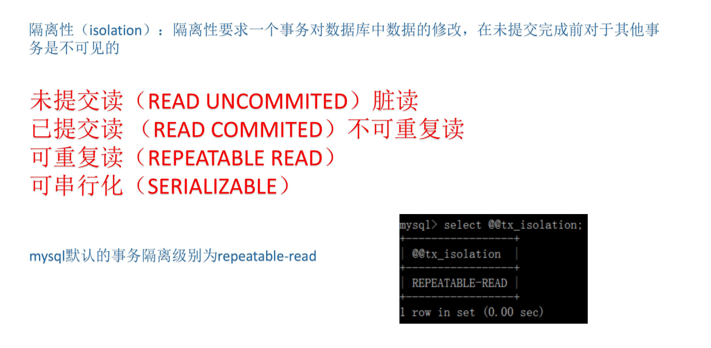

# MySql

衡量指标：

TPS:每秒传输的事务处理个数，这是指服务器每秒处理的事务数，支持事务的存储引擎如InnoDB等特有的一个性能指标，计算公式TPS=(事务提交数+事务回滚数)/时间

QPS:每秒查询处理量，同时适用InnoDB和MyISAM引擎。

MySqlSlap:官方提供的压力测试工具

- 创建schema,table,test data;
- 运行负载测试，可以使用多个并发客户端连接
- 测试环境清理

| 参数                 | 作用                                |
| -------------------- | ----------------------------------- |
| --create-schema=name | 指定测试的数据库名，默认是mysqlslap |
| --engine=name | 创建测试表所使用的存储引擎，可指定多个|
|--concurrency=N  |模拟N个客户端并发执行。可指定多个值，以逗号或者|
|--number-of-queries=N  |总的测试查询次数(并发客户数×每客户查询次数)，比如并发是10，总次数是100，那么10个客户端各执行10个|
|--iterations=N  | 迭代执行的次数，即重复的次数（相同的测试进行N次，求一个平均值），指的是整个步骤的重复次数，包括准备数据、测试load、清理|
|--commit=N  |执行N条DML后提交|

连接层，服务层，引擎层，存储层

开启缓存有两个步骤，第一是开启缓存，第二是设置缓存的大小。

show variables like '%query_cache_type%'：查看是否开启缓存

SET GLOBAL query_cache_size = 4000;

SET GLOBAL query_cache_size = 13421772

## 存储引擎：

查看提供的存储引擎：show engines;

查看当前的存储引擎：show variables like '%storage_engine%';

MyISAM存储引擎由MYD和MYI组成，frm是存储表结构的，是任何存储引擎都具备的。MYD是数据文件，MYI是索引文件。也叫非聚集索引。

MyISAM特性：mysql5.5之前默认

- 并发性和锁级别-表级锁
- 支持全文检索
- 支持数据压缩

适用场景：

- 非事务应用（数据仓库，报表，日志）
- 只读类应用
- 空间类应用（空间函数，坐标）

Innodb:mysql5.5之后默认

ibd文件是存储的数据加索引，在独立表空间中，系统表空间没有这个文件。

- 系统表空间无法简单的收缩文件大小
- 独立表空间通过optimize table收缩系统文件
- 系统表空间会产生IO瓶颈
- 独立表空间可以同时向多个文件刷新数据

特性：

- Innodb是一种事务性存储引擎
- 完全支持事务的ACID特性
- 支持行级锁（并发程度高）

| 对比项 | MyISAM | InnoDB |
|---|---|---|
| 主外键 | 不支持 | 支持|
|事务 |不支持| 支持|
|行表锁 |表锁，即使操作一条记录，也会锁住整个表，不适合高并发的操作|行锁,操作时只锁某行，不对其它行有影响，适合高并发的操作|
|缓存|只缓存索引，不缓存真实数据|不仅缓存索引还要缓存真实数据，对内存要求较高，而且内存大小对性能有决定性的影响|
|表空间 |小 |大|
|关注点 |性能 |事务|
|默认安装| Y| Y|

存储引擎Memory

- 所有数据存到内存

- 支持hash索引和B-tree索引
- 所有字段固定长度
- 不支持Blog和text大字段
- 使用表级锁
- 

临时表只存在于一次会话中。

使用场景

- hash索引用于查找或者映射表
- 用于保存数据分析中产生的中间表
- 用于缓存周期性聚合数据的结果表

## 锁

表级锁

- 共享读锁
- 独占写锁

### MyISAM：

- 给表加读锁，lock table 表名 read

查看 show status LIKE 'table_locks_waited' 表被锁过几次

- 给表加写锁： lock table 表名 write

  

### InnoDb

行级锁：

- 上读锁： select * from 表 where 条件 lock in share mode
- 上写锁(排他锁)：select * from 表 where 条件 for updata
- commit释放锁
- 两个事务不能锁同一个索引
- insert delete,update在事务中都会自动默认加上排他锁
- 行锁必须有索引才能实现，否则会自动锁全表。

表级锁

- 开启一个新事务时会释放表锁

面试题：系统运行一段时间，数据量已经很大，这时候系统升级，有张表A需要增加个字段，并发量白天晚上都很大，请问怎么修改表表结构。

修改表结构会导致表锁，数据量很大修改数据也不现实，导致大量用户阻塞。所以要新建一个表B，然后在A上建立触发器，当有数据更新或插入时，也同样插入到B表中，然后将A表的数据移到B表中。

共享锁（S）：SELECT * FROM table_name WHERE ... LOCK IN SHARE MODE。
 排他锁（X)：SELECT * FROM table_name WHERE ... FOR UPDATE。

(间隙锁)

当我们用范围条件而不是相等条件检索数据，并请求共享或排他锁时，InnoDB 会给符合条
件的已有数据记录的索引项加锁；对于键值在条件范围内但并不存在的记录，叫做“间隙
（GAP)”，InnoDB 也会对这个“间隙”加锁，这种锁机制就是所谓的间隙锁（Next-Key 锁）。

InnoDB 除了通过范围条件加锁时使用间隙锁外，如果使用相等条件请求给一个不存在的记录加锁，InnoDB 也会使用间隙锁！

13.5 next-key 锁对并发插入的影响
在行级锁定中，InnoDB 使用一个名为 next-key locking 的算法。InnoDB 以这
样一种方式执行行级锁定：当它搜索或扫描表的索引之时，它对遇到的索引记录设置
共享或独占锁定。因此，行级锁定事实上是索引记录锁定。
InnoDB 对索引记录设置的锁定也映像索引记录之前的“间隙”。如果一个用户对
一个索引上的记录 R 有共享或独占的锁定，另一个用户 不能紧接在 R 之前以索引的
顺序插入一个新索引记录。这个间隙的锁定被执行来防止所谓的“幽灵问题”。
可以用 next-key 锁定在你的应用程序上实现一个唯一性检查：如果你以共享模
式读数据，并且没有看到你将要插入的行的重复，则你可以安全地插入你的行，并且
知道在读过程中对你的行的继承者设置的 next-key 锁定与此同时阻止任何人对你的
行插入一个重复。因此，the next-key 锁定允许你锁住在你的表中并不存在的一些
东西。因此，在实际应用开发中，尤其是并发插入比较多的应用，我们要尽量优化业务逻辑，尽量使用相等条件来访问更新数据，避免使用范围条件。

13.7 如何减少锁冲突

1. 对 Myisam 类型的表：
1) Myisam 类型的表可以考虑通过改成 Innodb 类型的表来减少锁冲突。
2) 根据应用的情况，尝试横向拆分成多个表或者改成 Myisam 分区对减少锁冲突也会
有一定的帮助。
2. 对 Innodb 类型的表：
1) 首先要确认，在对表获取行锁的时候，要尽量的使用索引检索纪录，如果没有使用
索引访问，那么即便你只是要更新其中的一行纪录，也是全表锁定的。要确保 sql
是使用索引来访问纪录的，必要的时候，请使用 explain 检查 sql 的执行计划，判
断是否按照预期使用了索引。
2) 由于 mysql 的行锁是针对索引加的锁，不是针对纪录加的锁，所以虽然是访问不同
行的纪录，但是如果是相同的索引键，是会被加锁的。应用设计的时候也要注意，
这里和 Oracle 有比较大的不同。
3) 当表有多个索引的时候，不同的事务可以使用不同的索引锁定不同的行，当表有主
键或者唯一索引的时候，不是必须使用主键或者唯一索引锁定纪录，其他普通索引
同样可以用来检索纪录，并只锁定符合条件的行。
4) 用 SHOW INNODB STATUS 来确定最后一个死锁的原因。查询的结果中，包括死锁的
事务的详细信息，包括执行的 SQL 语句的内容，每个线程已经获得了什么锁，在等
待什么锁，以及最后是哪个线程被回滚。详细的分析死锁产生的原因，可以通过改
进程序有效的避免死锁的产生。
5) 如果应用并不介意死锁的出现，那么可以在应用中对发现的死锁进行处理。
6) 确定更合理的事务大小，小事务更少地倾向于冲突。
7) 如果你正使用锁定读，（SELECT ... FOR UPDATE 或 ... LOCK IN SHARE MODE），
试着用更低的隔离级别，比如 READ COMMITTED。
8) 以固定的顺序访问你的表和行。则事务形成良好定义的查询并且没有死

避免死锁的方法：

MySiam是表级锁，不会出现死锁，当进行多表操作时候，mysaim会一次性获取到所有表的锁。

（1）在应用中，如果不同的程序会并发存取多个表，应尽量约定以相同的顺序来访问
表，这样可以大大降低产生死锁的机会。

（2）在程序以批量方式处理数据的时候，如果事先对数据排序，保证每个线程按固定
的顺序来处理记录，也可以大大降低出现死锁的可能。

（3）在事务中，如果要更新记录，应该直接申请足够级别的锁，即排他锁，而不应先申请
共享锁，更新时再申请排他锁，因为当用户申请排他锁时，其他事务可能又已经获得了相同
记录的共享锁，从而造成锁冲突，甚至死锁。

InnoDB 行锁是通过给索引上的索引项加锁来实现的，这一点 MySQL 与 Oracle 不同，后者是
通过在数据块中对相应数据行加锁来实现的。InnoDB 这种行锁实现特点意味着：只有通
索引条件检索数据，InnoDB 才使用行级锁，否则，InnoDB 将使用表锁！

（1）在不通过索引条件查询的时候，InnoDB 确实使用的是表锁，而不是原因就是在没有索引的情况下，InnoDB 只能使用表锁。当我们给其增加一个索引后，InnoDB 就只锁定了符合条件的行，

(2)由于 MySQL 的行锁是针对索引加的锁，不是针对记录加的锁，所以虽然是访问不同行
的记录，但是如果是使用相同的索引键，是会出现锁冲突的。

（3）当表有多个索引的时候，不同的事务可以使用不同的索引锁定不同的行，另外，不论
是使用主键索引、唯一索引或普通索引，InnoDB 都会使用行锁来对数据加锁。

（4）即便在条件中使用了索引字段，但是否使用索引来检索数据是由 MySQL 通过判断不同
执行计划的代价来决定的，如果 MySQL 认为全表扫᧿效率更高，比如对一些很小的表，它
就不会使用索引，这种情况下 InnoDB 将使用表锁，而不是行锁。

## 事务

存储引擎中只有InnoDb支持事务

一致性指事务结束之后和之前的总量应该不变

并不是数据库角度完全能够解决。

隔离性要求一个事务对数据库中数据的修改，在未提交完成前对于其他事务是不可见的

### 事务隔离级别

##### 

mysql默认的事务隔离级别为repeatable-read（可重复读）

 

show variables like '%tx_isolation%';

 

 

1、未提交读（READ UNCOMMITED）（会出现脏读）

set SESSION TRANSACTION ISOLATION LEVEL READ UNCOMMITTED;

 在一个事务中还有没有提交，另一个事务就能读到更改了。

测试：

启动两个session

 一个session中

 start TRANSACTION

 update account set balance = balance -50 where id = 1

 

另外一个session中查询

select * from account

 

回到第一个session中 回滚事务

ROLLBACK

  

在第二个session中

update account set balance = balance -50 where id = 1

查询结果还是 400

 

第二个session以为结果是350，但前面的400数据为脏读数据，导致最后的结果和意料中的结果并不一致。

2、已提交读 （READ COMMITED）（会出现不可重复读）

测试

show variables like '%tx_isolation%';

set SESSION TRANSACTION ISOLATION LEVEL read committed;

 

一个session中

 start TRANSACTION

 update account set balance = balance -50 where id = 1

 

另外一个session中查询 (数据并没改变)

select * from account

 

回到第一个session中 提交事务

commit

 

在第二个session种

select * from account (数据已经改变)

 

3、可重复读（REPEATABLE READ）(会出现幻读的情况)

测试

show variables like '%tx_isolation%';

set SESSION TRANSACTION ISOLATION LEVEL repeatable read;

 

一个session中

 start TRANSACTION

 update account set balance = balance -50 where id = 1

 

另外一个session中查询 (数据并没改变)

select * from account

 

回到第一个session中 提交事务

commit

 

在第二个session种

select * from account (数据并未改变)，在第二个session中提交才能看到改变

 

已提交读：只要提交，其他的session中能看到改变

可重复读：提交后，其他session没有改变

4、可串行化（SERIALIZABLE）

set SESSION TRANSACTION ISOLATION LEVEL serializable

account 表有3条记录，业务规定，最多允许4条记录。

1.开启一个事务

begin

select * from account  发现3条记录

 

2.开启另外一个事务

begin

select * from account  发现3条记录 也是3条记录

insert into account VALUES(4,'deer',500) 

查询  4条记录

select * from account

 

3.回到第一个session

insert into account VALUES(5,'james',500)

select * from account  4条记录

 

 4.session1 与 session2 都提交事务

如果不是串行化，会出现五条数据

  

**5.** set SESSION TRANSACTION ISOLATION LEVEL serializable; 重新上面的测试发现插入报错

事务语法

 1、开启事务

- 1、begin 

- 2、START TRANSACTION（推荐）

- 3、begin work  

2、事务回滚

rollback

 3、事务提交

 commit

 4、还原点

savepoint 

show variables like '%autocommit%';  自动提交事务是开启的

 

set autocommit=0;

 

insert into testdemo values(5,5,5);

savepoint s1;

insert into testdemo values(6,6,6);

savepoint s2;

insert into testdemo values(7,7,7);

savepoint s3;

 

select * from testdemo

rollback to savepoint s2

 

rollback

 

## 逻辑设计

### 范式设计

数据库设计的第一大范式：确保每一列的原子性

- 数据库表中的所有字段都只具有单一属性
- 单一属性的列是由基本数据类型所构成的
- 设计出来的表都是简单的二维表

数据库设计的第二大范式：非键字段必须完全依赖于键字段

- 要求表中只具有一个业务主键，也就是说符合第二范式的表不能存在非主键列只对部分主键的依赖关系

数据库设计的第三大范式：在2NF基础上消除传递依赖

- 指每一个非主属性既不部分依赖于也不传递依赖于业务主键，也就是在第二范式的基础上删除了非主键对主键的传递依赖

第一范式：不存在可以分割的属性（比如电话可分为工作电话和个人电话）
第二范式：非主属性要完全依赖于主属性，不能存在主属性其中的一个就能决定非主属性的情况
第三范式：消除传递依赖（不允许出现 学生学号+课程号->课程号->老师号）
BCNF范式：主属性不依赖于主属性
第四范式：要求把同一表内的多对多关系删除。
第五范式：从最终结构重新建立原始结构。

### 反范式设计

完全符合范式化的设计有时并不能得到良好得SQL查询性能，因为有大量的表关联在一起

所谓得反范式化就是为了性能和读取效率得考虑而适当得对数据库设计范式得要求进行违反允许存在少量得冗余，换句话来说反范式化就是使用空间来换取时间。

范式化设计优缺点
优点：可以尽量得减少数据冗余，范式化的更新操作比反范式化更快，范式化的表通常比反范式化的表更小
缺点： 对于查询需要对多个表进行关联，更难进行索引优化 

反范式化设计优缺点
优点：可以减少表的关联，可以更好的进行索引优化
缺点：存在数据冗余及数据维护异常，对数据的修改需要更多的成本

当一个列可以选择多种数据类型时

- 优先考虑数字类型
- 其次是日期、时间类型
- 最后是字符类型
- 对于相同级别的数据类型，应该优先选择占用空间小的数据类型

timestamp（占4字节） 和时区有关，而datetime无关（8字节）

## 慢查询

慢查询日志，顾名思义，就是查询慢的日志，是指mysql记录所有执行超过long_query_time参数设定的时间阈值的SQL语句的日志。该日志能为SQL语句的优化带来很好的帮助。默认情况下，慢查询日志是关闭的，要使用慢查询日志功能，首先要开启慢查询日志功能。

### 1.慢查询配置

#### 1.1慢查询基本配置

- slow_query_log 启动停止技术慢查询日志

- slow_query_log_file 指定慢查询日志得存储路径及文件（默认和数据文件放一起）

- long_query_time 指定记录慢查询日志SQL执行时间得伐值（单位：秒，默认10秒）

- log_queries_not_using_indexes  是否记录未使用索引的SQL

- log_output 日志存放的地方【TABLE】【FILE】【FILE,TABLE】

实操：

 通过下面命令查看下上面的配置：

show VARIABLES like '%slow_query_log%'

show VARIABLES like '%slow_query_log_file%'

show VARIABLES like '%long_query_time%' 

show VARIABLES like '%log_queries_not_using_indexes%'

show VARIABLES like 'log_output'

 

 set global long_query_time=0;  ---默认10秒，这里为了演示方便设置为0 

set GLOBAL  slow_query_log = 1; --开启慢查询日志

set global log_output='FILE'  --项目开发中日志只能记录在日志文件中，不能记表中 

设置完成后，查询一些列表可以发现慢查询的日志文件里面有数据了。

慢查询格式显示：

### 慢查询分析：

Mysqldumpslow：

常用的慢查询日志分析工具，汇总除查询条件外其他完全相同的SQL，并将分析结果按照参数中所指定的顺序输出

语法：

mysqldumpslow -s r -t 10 slow-mysql.log

​	-s order (c,t,l,r,at,al,ar) 

​     c:总次数

​     t:总时间

​     l:锁的时间

​     r:总数据行

​     at,al,ar  :t,l,r平均数  【例如：at = 总时间/总次数】

​	 -t  top  指定取前面几条作为结果输出

mysqldumpslow.pl -s t -t 10 D:\DESKTOP-2EKGEE5-slow.log

pt_query_digest：

 perl .\pt-query-digest  --explain h=127.0.0.1,u=root,p=root1234% D:\DESKTOP-2EKGEE5-slow.log

汇总的信息【总的查询时间】、【总的锁定时间】、【总的获取数据量】、【扫描的数据量】、【查询大小】

Response: 总的响应时间。

time: 该查询在本次分析中总的时间占比。

calls: 执行次数，即本次分析总共有多少条这种类型的查询语句。

R/Call: 平均每次执行的响应时间。

Item : 查询对象

## 索引

mysql中的innodb只显式支持b-tree,但从技术上来说是b+tree索引

什么时候建立索引

- 某一列相对来说唯一
- 经常用来查询显示的列
- 经常用来关联的列，where条件中用到的列，以及join on用到的列

### 索引分类：

普通索引：即一个索引只包含单个列，一个表可以有多个单列索引

唯一索引：索引列的值必须唯一，但允许有空值

复合索引：即一个索引包含多个列

聚簇索引(聚集索引)：并不是一种单独的索引类型，而是一种数据存储方式。具体细节取决于不同的实现，InnoDB的聚簇索引其实就是在同一个结构中保存了B-Tree索引(技术上来说是B+Tree)和数据行。

非聚簇索引：不是聚簇索引，就是非聚簇索引，如MySIAM

### 查看索引:

SHOW INDEX FROM table_name\G

###  创建索引:

CREATE  [UNIQUE ] INDEX indexName ON mytable(columnname(length));

ALTER TABLE 表名 ADD  [UNIQUE ]  INDEX [indexName] ON (columnname(length)) 

###  删除索引:

DROP INDEX [indexName] ON mytable;

## 执行计划

 使用EXPLAIN关键字可以模拟优化器执行SQL查询语句，从而知道MySQL是如何处理你的SQL语句的。分析你的查询语句或是表结构的性能瓶颈.

### 执行计划的作用：

- 表的读取顺序

- 数据读取操作的操作类型

- 哪些索引可以使用

- 哪些索引被实际使用

- 表之间的引用

- 每张表有多少行被优化器查询

执行计划的语法其实非常简单： 在SQL查询的前面加上EXPLAIN关键字就行。

### ID列：

描述select查询的序列号,包含一组数字，表示查询中执行select子句或操作表的顺序

根据ID的数值结果可以分成一下三种情况

- id相同：执行顺序由上至下
- 

- id不同：如果是子查询，id的序号会递增，id值越大优先级越高，越先被执行
- 

- id相同不同：同时存在，id如果相同，可以认为是一组，从上往下顺序执行，在所有组中，id值越大，优先级越高，越先执行
- 

Select_type:查询的类型，要是用于区别:普通查询、联合查询、子查询等的复杂查询

#### SIMPLE

EXPLAIN select * from t1

 简单的 select 查询,查询中不包含子查询或者UNION

 

**1.1.1.1.1.** PRIMARY与SUBQUERY

PRIMARY：查询中若包含任何复杂的子部分，最外层查询则被标记为

SUBQUERY：在SELECT或WHERE列表中包含了子查询

 

#### EXPLAIN

select t1.*,(select t2.id from t2 where t2.id = 1 ) from t1 

 

 

#### DERIVED

在FROM列表中包含的子查询被标记为DERIVED(衍生)

MySQL会递归执行这些子查询, 把结果放在临时表里。

select t1.* from t1 ,(select t2.* from t2 where t2.id = 1 ) s2  where t1.id = s2.id

 

####  UNION RESULT 与UNION

UNION：若第二个SELECT出现在UNION之后，则被标记为UNION；

UNION RESULT：从UNION表获取结果的SELECT

\#UNION RESULT ,UNION

EXPLAIN

select * from t1

UNION 

select * from t2

 

### table列：

显示这一行的数据是关于哪张表的

 

 

 

### Type列

type显示的是访问类型，是较为重要的一个指标，结果值从最好到最坏依次是：

 system > const > eq_ref > ref > fulltext > ref_or_null > index_merge > unique_subquery > index_subquery > range > index > ALL 

需要记忆的

system>const>eq_ref>ref>range>index>ALL

 All是全表扫描，一般来说，得保证查询至少达到range级别，最好能达到ref。

#### System与const

System：表只有一行记录（等于系统表），这是const类型的特列，平时不会出现，这个也可以忽略不计

Const：表示通过索引一次就找到了

const用于比较primary key或者unique索引。因为只匹配一行数据，所以很快

如将主键置于where列表中，MySQL就能将该查询转换为一个常量

 

 

 

#### eq_ref

 唯一性索引扫描，对于每个索引键，表中只有一条记录与之匹配。常见于主键或唯一索引扫描

 

 

 

####  Ref

 非唯一性索引扫描，返回匹配某个单独值的所有行.

本质上也是一种索引访问，它返回所有匹配某个单独值的行，然而，它可能会找到多个符合条件的行，所以他应该属于查找和扫描的混合体

 

 

#### EXPLAIN

select count(DISTINCT col1) from t1 where col1 = 'ac'

 

 

或者

EXPLAIN

select col1 from t1 where col1 = 'ac'

#### Range

只检索给定范围的行,使用一个索引来选择行。key 列显示使用了哪个索引

一般就是在你的where语句中出现了between、<、>、in等的查询

这种范围扫描索引扫描比全表扫描要好，因为它只需要开始于索引的某一点，而结束语另一点，不用扫描全部索引。

 

 

 

 

 

EXPLAIN select * from t1 where id BETWEEN 30 and 60

 

EXPLAIN select * from t1 where id in(1,2)

 

#### Index

当查询的结果全为索引列的时候，虽然也是全部扫描，但是只查询的索引库，而没有去查询

数据。

 

 

 

 

 

 

#### EXPLAIN

select c2 from testdemo

**1.1.1.1.2.** ***\*All\****

Full Table Scan，将遍历全表以找到匹配的行

 

### possible_keys 与Key

 possible_keys:可能使用的key

Key:实际使用的索引。如果为NULL，则没有使用索引

查询中若使用了***\*覆盖索引\****，则该索引和查询的select字段重叠

这里的覆盖索引非常重要，后面会单独的来讲

 

 

 

 

 

EXPLAIN select col1,col2 from t1 

其中key和possible_keys都可以出现null的情况

### key_len：

 

 

desc

select * from ta where col1 ='ab';

 

desc

select * from ta where col1 ='ab' and col2 = 'ac'

 

Key_len表示索引中使用的字节数，可通过该列计算查询中使用的索引的长度。在不损失精确性的情况下，长度越短越好

key_len显示的值为索引字段的最大可能长度，并非实际使用长度，即key_len是根据表定义计算而得，不是通过表内检索出的

 

 

 

- key_len表示索引使用的字节数，

- 根据这个值，就可以判断索引使用情况，特别是在组合索引的时候，判断所有的索引字段是否都被查询用到。

- char和varchar跟字符编码也有密切的联系,

- latin1占用1个字节，gbk占用2个字节，utf8占用3个字节。（不同字符编码占用的存储空间不同）

#### 字符类型

name这一列为char(10),字符集为utf-8占用3个字节,Keylen=10*3

name这一列为char(10),字符集为utf-8占用3个字节,外加需要存入一个null值

Keylen=10*3+1(null) 结果为31

Keylen=varchar(n)变长字段+不允许Null=n*(utf8=3,gbk=2,latin1=1)+2

Keylen=varchar(n)变长字段+允许Null=n*(utf8=3,gbk=2,latin1=1)+1(NULL)+2

变长字段需要额外的2个字节（VARCHAR值保存时只保存需要的字符数，另加一个字节来记录长度(如果列声明的长度超过255，则使用两个字节)，所以VARCAHR索引长度计算时候要加2），固定长度字段不需要额外的字节。

而NULL都需要1个字节的额外空间,所以索引字段最好不要为NULL，因为NULL让统计更加复杂并且需要额外的存储空间。 

复合索引有最左前缀的特性，如果复合索引能全部使用上，则是复合索引字段的索引长度之和，这也可以用来判定复合索引是否部分使用，还是全部使用。key_len可以判断复合索引是否使用了。

#### 数字类型

#### 日期

### ref

显示索引的哪一列被使用了，如果可能的话，是一个常数。哪些列或常量被用于查找索引列上的值

 

 

 

EXPLAIN

select * from s1 ,s2 where s1.id = s2.id and s1.name = 'enjoy'

 

由key_len可知t1表的idx_col1_col2被充分使用，col1匹配t2表的col1，col2匹配了一个常量，即 'ac' 

其中 【shared.t2.col1】 为 【数据库.表.列】

### Extra

包含不适合在其他列中显示但十分重要的额外信息。

 

覆盖索引：

理解方式一:就是select的数据列只用从索引中就能够取得，不必读取数据行，MySQL可以利用索引返回select列表中的字段，而不必根据索引再次读取数据文件,换句话说查询列要被所建的索引覆盖。

理解方式二:索引是高效找到行的一个方法，但是一般数据库也能使用索引找到一个列的数据，因此它不必读取整个行。毕竟索引叶子节点存储了它们索引的数据;当能通过读取索引就可以得到想要的数据，那就不需要读取行了。一个索引包含了(或覆盖了)满足查询结果的数据就叫做覆盖索引

## SQL优化

### 优化实战

#### 1、尽量全值匹配

 

 

CREATE TABLE `staffs`(

​	id int primary key auto_increment,

​	name varchar(24) not null default "" comment'姓名',

​	age int not null default 0 comment '年龄',

​	pos varchar(20) not null default ""  comment'职位',

​	add_time timestamp not null default current_timestamp comment '入职时间'

​	)charset utf8 comment '员工记录表';

 

​	

insert into staffs(name,age,pos,add_time) values('z3',22,'manage',now());

insert into staffs(name,age,pos,add_time) values('july',23,'dev',now());

insert into staffs(name,age,pos,add_time) values('2000',23,'dev',now());

 

alter table staffs add index idx_staffs_nameAgePos(name,age,pos);

 

EXPLAIN SELECT * FROM staffs WHERE NAME = 'July';

EXPLAIN SELECT * FROM staffs WHERE NAME = 'July' AND age = 25;

EXPLAIN SELECT * FROM staffs WHERE NAME = 'July' AND age = 25 AND pos = 'dev'

 

当建立了索引列后，能在where条件中使用索引的尽量所用。

#### 2、最佳左前缀原则

如果索引了多列，要遵守最左前缀法则。指的是查询从索引的最左前列开始并且不跳过索引中的列。

 

 

 

EXPLAIN SELECT * FROM staffs WHERE  age = 25 AND pos = 'dev'（不会使用索引）

EXPLAIN SELECT * FROM staffs WHERE pos = 'dev'，（不会使用索引）

EXPLAIN SELECT * FROM staffs WHERE NAME = 'July' ，（会使用索引）

#### 3、不在索引列上做任何操作

不在索引列上做任何操作（计算、函数、(自动or手动)类型转换），会导致索引失效而转向全表扫描

 

EXPLAIN SELECT * FROM staffs WHERE NAME = 'July';

EXPLAIN SELECT * FROM staffs WHERE left(NAME,4) = 'July';

 #### 4.范围条件放最后

 

 

EXPLAIN SELECT * FROM staffs WHERE NAME = 'July' ;

EXPLAIN SELECT * FROM staffs WHERE NAME = 'July'  and age >22;

EXPLAIN SELECT * FROM staffs WHERE NAME = 'July'  and age >22 and pos='manager'

 

中间有范围查询会导致后面的索引列全部失效，age本身索引并不会失效。

EXPLAIN SELECT * FROM staffs WHERE NAME = 'July'  and age >22 and pos='manager'

#### 5、覆盖索引尽量用

 

 

 

尽量使用覆盖索引(只访问索引的查询(索引列和查询列一致))，减少select *

EXPLAIN SELECT * FROM staffs WHERE NAME = 'July'  and age =22 and pos='manager'

 

EXPLAIN SELECT name,age,pos FROM staffs WHERE NAME = 'July'  and age =22 and pos='manager'

 

EXPLAIN SELECT * FROM staffs WHERE NAME = 'July'  and age >22 and pos='manager'

 

EXPLAIN SELECT name,age,pos FROM staffs WHERE NAME = 'July'  and age >22 and pos='manager'

#### 6、不等于要慎用

mysql 在使用不等于(!= 或者<>)的时候无法使用索引会导致全表扫描

 

 

 

EXPLAIN SELECT * FROM staffs WHERE NAME = 'July';（使用了索引）

EXPLAIN SELECT * FROM staffs WHERE NAME != 'July';（索引失效）

EXPLAIN SELECT * FROM staffs WHERE NAME <> 'July';（索引失效）

 

***\*如果定要需要使用不等于,请用覆盖索引\****

***\*EXPLAIN SELECT name,age,pos FROM staffs WHERE NAME != 'July';\****

***\*EXPLAIN SELECT name,age,pos FROM staffs WHERE NAME <> 'July';\****

 

#### 7、Null/Not有影响

自定定义为NOT NULL

 

 

 

 

 

EXPLAIN select * from staffs where name is null（不会扫描）

EXPLAIN select * from staffs where name is not null（索引失效）

在字段为not null的情况下，使用is null 或 is not null 会导致索引失效

解决方式：覆盖索引

EXPLAIN select  name,age,pos from staffs where name is not null

 

自定义为NULL或者不定义

 

 

EXPLAIN select * from staffs2 where name is null（索引有效）

 

 

EXPLAIN select * from staffs2 where name is not null （索引失效）

 

Is not null 的情况会导致索引失效

解决方式：覆盖索引

EXPLAIN select  name,age,pos from staffs where name is not null

 

#### 8、Like查询要当心

 

like以通配符开头('%abc...')mysql索引失效会变成全表扫描的操作

 

EXPLAIN select * from staffs where name ='july'（索引有效）

EXPLAIN select * from staffs where name like '%july%'（索引失效）

EXPLAIN select * from staffs where name like '%july'（索引失效） 

EXPLAIN select * from staffs where name like 'july%'（索引有效）

解决方式：覆盖索引

EXPLAIN select name,age,pos from staffs where name like '%july%'

#### 9、字符类型加引号

字符串不加单引号索引失效

 

EXPLAIN select * from staffs where name = 917 （索引失效）

解决方式：请加引号

#### 10、OR改union效率高

 

 

EXPLAIN

select * from staffs where name='July' or name = 'z3' （索引失效）

EXPLAIN

select * from staffs where name='July' 

UNION

select * from staffs where  name = 'z3' （索引有效）

 

解决方式：覆盖索引

EXPLAIN

select name,age from staffs where name='July' or name = 'z3'

记忆总结：

- 全值匹配我最爱，最左前缀要遵守；

- 带头大哥不能死，中间兄弟不能断；

- 索引列上少计算，范围之后全失效；

- LIKE百分写最右，覆盖索引不写*；

- 不等空值还有OR，索引影响要注意；

- varchar引号不可丢， SQL优化有诀窍。

### insert语句优化

提交前关闭自动提交

尽量使用批量insert语句

可以使用MyISAM存储引擎

### LOAD DATA INFLIE

LOAD DATA INFLIE；

使用LOAD DATA INFLIE ,比一般的insert语句快20倍

select * into OUTFILE 'D:\\product.txt' from product_info

load data INFILE 'D:\\product.txt' into table product_info

# Mysql上的坑

blob,clob大数据类型。尽量使用定长字段。

3.索引的数据结构：

索引文件要放入磁盘。局部性原理，磁盘预读。

B树每个节点都带有数据，如果预读的话，占用的空间会非常大，例如每个磁盘块固定大小为16K，三次IO操作读入三个磁盘块的数据，所包含的数据也会非常少。

1.每个节点都有key和data,而每个页的存储空间是有限的4k，如果data比较大的话导致每个节点存储的key数量变少。

一种是对主键的范围查找和分页查找，另一种是从根节点开始进行随机查找

## 七、为什么说B+树比B树更适合数据库索引？

1、 **B+树的磁盘读写代价更低：B+树的内部节点并没有指向关键字具体信息的指针，因此其内部节点相对B树更小，如果把所有同一内部节点的关键字存放在同一盘块中，那么盘块所能容纳的关键字数量也越多，一次性读入内存的需要查找的关键字也就越多，相对IO读写次数就降低了。**

2、**B+树的查询效率更加稳定：由于非终结点并不是最终指向文件内容的结点，而只是叶子结点中关键字的索引。所以任何关键字的查找必须走一条从根结点到叶子结点的路。所有关键字查询的路径长度相同，导致每一个数据的查询效率相当。**

3、由于B+树的数据都存储在叶子结点中，分支结点均为索引，方便扫库，只需要扫一遍叶子结点即可，但是B树因为其分支结点同样存储着数据，我们要找到具体的数据，需要进行一次中序遍历按序来扫，所以B+树更加适合在区间查询的情况，所以通常B+树用于数据库索引。

PS：我在知乎上看到有人是这样说的,我感觉说的也挺有道理的：

他们认为数据库索引采用B+树的主要原因是：B树在提高了IO性能的同时并没有解决元素遍历的我效率低下的问题，正是为了解决这个问题，B+树应用而生。B+树只需要去遍历叶子节点就可以实现整棵树的遍历。而且在数据库中基于范围的查询是非常频繁的，而B树不支持这样的操作或者说效率太低。

 

 

今天看了几篇文章，自己总结一下。

数据库使用B+树肯定是为了提升查找效率。

但是具体如何提升查找效率呢？

查找数据，最简单的方式是顺序查找。但是对于几十万上百万，甚至上亿的数据库查询就很慢了。

所以要对查找的方式进行优化，熟悉的二分查找，二叉树可以把速度提升到O(log(n,2))，查询的瓶颈在于树的深度，最坏的情况要查找到二叉树的最深层，由于，每查找深一层，就要访问更深一层的索引文件。在多达数G的索引文件中，这将是很大的开销。所以，尽量把数据结构设计的更为‘矮胖’一点就可以减少访问的层数。在众多的解决方案中，B-/B+树很好的适合。B-树定义具体可以查阅，简而言之就是中间节点可以多余两个子节点，而且中间的元素可以是一个域。相比B-树，B+树的父节点也必须存在于子节点中，是其中最大或者最小元素，B+树的节点只存储索引key值，具体信息的地址存在于叶子节点的地址中。这就使以页为单位的索引中可以存放更多的节点。减少更多的I/O支出。因此，B+树成为了数据库比较优秀的数据结构，MySQL中MyIsAM和InnoDB都是采用的B+树结构。不同的是前者是非聚集索引，后者主键是聚集索引，所谓聚集索引是物理地址连续存放的索引，在取区间的时候，查找速度非常快，但同样的，插入的速度也会受到影响而降低。聚集索引的物理位置使用链表来进行存储。

非叶子节点不存数据，B+树降低了树的高度。将数据范围变为了多个区间，检索速度更快。

叶子节点前后相连，符合磁盘预读和范围查询。

InnoDB是通过B+tree对主键创建索引，然后叶子节点保存数据，如果没有主键，选择唯一键。如果没有唯一键，会生成一个6位的row_id来作为主键

如果创建的索引是其他字段，那么叶子节点中存储的是该记录的主键，然后再通过主键索引来找到对应的记录。

在MyISAM索引中，叶子节点中存储的是地址。

1.聚集索引一个表只能有一个，而非聚集索引一个表可以存在多个。(因为这个聚簇索引的顺序就决定了数据的顺序)
2.聚集索引存储记录是物理上连续存在，而非聚集索引是逻辑上的连续，物理存储并不连续。
3.聚集索引查询数据速度快，插入数据速度慢;非聚集索引反之。

聚集索引表记录的排列顺序与索引的排列顺序一致，优点是查询速度快，因为一旦具有第一个索引值的纪录被找到，具有连续索引值的记录也一定物理的紧跟其后。（假如对年龄做了索引，找到第一条年龄为20的，其他的都在这行数据的后面紧挨着）
聚集索引的缺点是对表进行修改速度较慢，这是为了保持表中的记录的物理顺序与索引的顺序一致，而把记录插入到数据页的相应位置，必须在数据页中进行数据重排，降低了执行速度。插入数据时速度要慢(时间花费在“物理存储的排序”上，也就是首先要找到位置然后插入)。

非聚集索引指定了表中记录的逻辑顺序，但记录的物理顺序和索引的顺序不一致，聚集索引和非聚集索引都采用了B+树的结构，但非聚集索引的叶子层并不与实际的数据页相重叠，而采用叶子层包含一个指向表中的记录在数据页中的指针的方式。非聚集索引比聚集索引层次多，添加记录不会引起数据顺序的重组。

如果是插入更新比较频繁的，用非聚集索引比较好，因为不会更改数据的物理位置。查询比较频繁的用聚集索引比较好。

聚集的数据有一些重要的优点：

　　A：可以把相关数据保存在一起，如：实现电子邮箱时，可以根据用户ID来聚集数据，这样只需要从磁盘读取少量的数据页就能获取某个用户全部邮件，如果没有使用聚集索引，则每封邮件都可能导致一次磁盘IO

　　B：数据访问更快，聚集索引将索引和数据保存在同一个btree中，因此从聚集索引中获取数据通常比在非聚集索引中查找要快

　　C：使用覆盖索引扫描的查询可以直接使用页节点中的主键值

 

聚集索引的缺点：

　　A：聚簇数据最大限度地提高了IO密集型应用的性能，但如果数据全部放在内存中，则访问的顺序就没有那么重要了，聚集索引也没有什么优势了

　　B：插入速度严重依赖于插入顺序，按照主键的顺序插入是加载数据到innodb表中速度最快的方式，但如果不是按照主键顺序加载数据，那么在加载完成后最好使用optimize table命令重新组织一下表

　　C：更新聚集索引列的代价很高，因为会强制innodb将每个被更新的行移动到新的位置

　　D：基于聚集索引的表在插入新行，或者主键被更新导致需要移动行的时候，可能面临页分裂的问题，当行的主键值要求必须将这一行插入到某个已满的页中时，存储引擎会将该页分裂成两个页面来容纳该行，这就是一次页分裂操作，页分裂会导致表占用更多的磁盘空间

　　E：聚集索引可能导致全表扫描变慢，尤其是行比较稀疏，或者由于页分裂导致数据存储不连续的时候

　　F：二级索引可能比想象的更大，因为在二级索引的叶子节点包含了引用行的主键列。

　　G：二级索引访问需要两次索引查找，而不是一次

 　

还有一点和myisam不同的是，innodb的二级索引和聚集索引很不同，innodb二级索引的叶子节点中存储的不是行指针，而是主键值，并以此作为指向行的指针，这样的策略减少了当出现行移动或者数据页的分裂时二级索引的维护工作，使用主键值当做指针会让二级索引占用更多的空间，换来的好处是，innodb在移动行时无须更新二级索引中的这个指针。

***\*FULLTEXT\****

即为全文索引，目前只有MyISAM引擎支持。其可以在CREATE TABLE ，ALTER TABLE ，CREATE INDEX 使用，不过目前只有 CHAR、VARCHAR ，TEXT 列上可以创建全文索引。值得一提的是，在数据量较大时候，现将数据放入一个没有全局索引的表中，然后再用CREATE INDEX创建FULLTEXT索引，要比先为一张表建立FULLTEXT然后再将数据写入的速度快很多。

全文索引并不是和MyISAM一起诞生的，它的出现是为了解决WHERE name LIKE “%word%"这类针对文本的模糊查询效率较低的问题。在没有全文索引之前，这样一个查询语句是要进行遍历数据表操作的，可见，在数据量较大时是极其的耗时的，如果没有异步IO处理，进程将被挟持，很浪费时间，当然这里不对异步IO作进一步讲解，想了解的童鞋，自行谷哥。

## Hash索引和B+树索引的区别

为某一列或几列建立hash索引，就会利用这一列或几列的值通过一定的算法计算出一个hash值，对应一行或几行数据

hash 索引结构的特殊性，其检索效率非常高，索引的检索可以一次定位，不像B-Tree 索引需要从根节点到枝节

点，最后才能访问到页节点这样多次的IO访问，所以 Hash 索引的查询效率要远高于 B-Tree 索引。

可 能很多人又有疑问了，既然 Hash 索引的效率要比 B-Tree 高很多，为什么大家不都用 Hash 索引而还要使用 B-Tree 索引呢？任何事物都是有两面性的，Hash 索引也一样，虽然 Hash 索引效率高，但是 Hash 索引本身由于其特殊性也带来了很多限制和弊端，主要有以下这些。

（1）Hash 索引仅仅能满足"=","IN"和"<=>"查询，不能使用范围查询。

由于 Hash 索引比较的是进行 Hash 运算之后的 Hash 值，所以它只能用于等值的过滤，不能用于基于范围的过滤，因为经过相应的 Hash 算法处理之后的 Hash 值的大小关系，并不能保证和Hash运算前完全一样。

（2）Hash 索引无法被用来避免数据的排序操作。

由于 Hash 索引中存放的是经过 Hash 计算之后的 Hash 值，而且Hash值的大小关系并不一定和 Hash 运算前的键值完全一样，所以数据库无法利用索引的数据来避免任何排序运算；

（3）Hash 索引不能利用部分索引键查询。

对于组合索引，Hash 索引在计算 Hash 值的时候是组合索引键合并后再一起计算 Hash 值，而不是单独计算 Hash 值，所以通过组合索引的前面一个或几个索引键进行查询的时候，Hash 索引也无法被利用。

（4）Hash 索引在任何时候都不能避免表扫描。

前面已经知道，Hash 索引是将索引键通过 Hash 运算之后，将 Hash运算结果的 Hash 值和所对应的行指针信息存放于一个 Hash 表中，由于不同索引键存在相同 Hash 值，所以即使取满足某个 Hash 键值的数据的记录条数，也无法从 Hash 索引中直接完成查询，还是要通过访问表中的实际数据进行相应的比较，并得到相应的结果。

（5）Hash 索引遇到大量Hash值相等的情况后性能并不一定就会比B-Tree索引高。

对于选择性比较低的索引键，如果创建 Hash 索引，那么将会存在大量记录指针信息存于同一个 Hash 值相关联。这样要定位某一条记录时就会非常麻烦，会浪费多次表数据的访问，而造成整体性能低下。

正是因为hash表在处理较小数据量时具有无可比拟的素的优势，所以hash索引很适合做缓存（内存数据库）。如mysql数据库的内存版本Memsql，使用量很广泛的缓存工具Mencached，NoSql数据库redis等，都使用了hash索引这种形式

# BIO,NIO

OSI七层参考模型

TCP实现了OSI

​									

**简介：**

BIO：同步阻塞式IO，服务器实现模式为一个连接一个线程，即客户端有连接请求时服务器端就需要启动一个线程进行处理，如果这个连接不做任何事情会造成不必要的线程开销，当然可以通过线程池机制改善。 

NIO：同步非阻塞式IO，服务器实现模式为一个请求一个线程，即客户端发送的连接请求都会注册到多路复用器上，多路复用器轮询到连接有I/O请求时才启动一个线程进行处理。 
AIO(NIO.2)：异步非阻塞式IO，服务器实现模式为一个有效请求一个线程，客户端的I/O请求都是由OS先完成了再通知服务器应用去启动线程进行处理。 linux内有AIO
**BIO**

同步阻塞式IO，相信每一个学习过操作系统网络编程或者任何语言的网络编程的人都很熟悉，在while循环中服务端会调用accept方法等待接收客户端的连接请求，一旦接收到一个连接请求，就可以建立通信套接字在这个通信套接字上进行读写操作，此时不能再接收其他客户端连接请求，只能等待同当前连接的客户端的操作执行完成。 
如果BIO要能够同时处理多个客户端请求，就必须使用多线程，即每次accept阻塞等待来自客户端请求，一旦受到连接请求就建立通信套接字同时开启一个新的线程来处理这个套接字的数据读写请求，然后立刻又继续accept等待其他客户端连接请求，即为每一个客户端连接请求都创建一个线程来单独处理，大概原理图就像这样： 

虽然此时服务器具备了高并发能力，即能够同时处理多个客户端请求了，但是却带来了一个问题，随着开启的线程数目增多，将会消耗过多的内存资源，导致服务器变慢甚至崩溃，NIO可以一定程度解决这个问题。

NIO

同步非阻塞式IO，关键是采用了事件驱动的思想来实现了一个多路转换器。 
NIO与BIO最大的区别就是只需要开启一个线程就可以处理来自多个客户端的IO事件，这是怎么做到的呢？ 
就是多路复用器，可以监听来自多个客户端的IO事件： 
A. 若服务端监听到客户端连接请求，便为其建立通信套接字(java中就是通道)，然后返回继续监听，若同时有多个客户端连接请求到来也可以全部收到，依次为它们都建立通信套接字。 
B. 若服务端监听到来自已经创建了通信套接字的客户端发送来的数据，就会调用对应接口处理接收到的数据，若同时有多个客户端发来数据也可以依次进行处理。 
C. 监听多个客户端的连接请求和接收数据请求同时还能监听自己时候有数据要发送。

总之就是在一个线程中就可以调用多路复用接口（java中是select，而有没有select这个功能，是由内核决定的）阻塞同时监听来自多个客户端的IO请求，一旦有收到IO请求就调用对应函数处理。

**各自应用场景**

（1）NIO适合处理连接数目特别多，但是连接比较短（轻操作）的场景，Jetty，Mina，ZooKeeper等都是基于java nio实现。

（2）BIO方式适用于连接数目比较小且固定的场景，这种方式对服务器资源要求比较高，并发局限于应用中。

# mysql架构篇

局部性原理，每个页4k,页是存储器的逻辑块，主存和磁盘以页为基本单位交换数据

