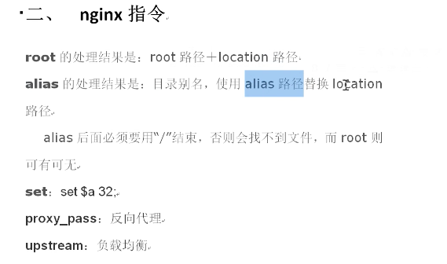
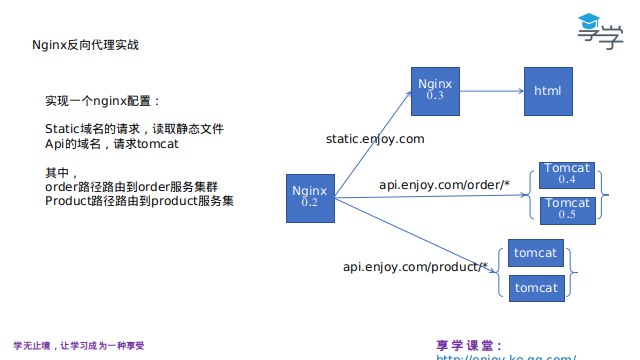

 本次课的内容： 

1、介绍nginx在系统架构中的作用

2、正向代理与反向代理

3、nginx的安装部署方式

4、nginx的运行模式概念，启停命令

5、 核心文件nginx.conf配置介绍

6、日志配置和及切割

## Nginx简介

 Apache 

Apache仍然是时长占用量最高的web服务器，据最新数据统计，市场占有率目前是50%左右。主要优势在于一个是比较早出现的一个Http静态资源服务器，同时又是开源的。所以在技术上的支持以及市面上的各种解决方案都比较成熟。Apache支持的模块非常丰富。

 Nginx 

Nginx是俄罗斯人编写的一款高性能的HTTP和反向代理服务器，在高连接并发的情况下，它能够支持高达50000个并发连接数的响应，但是内存、CPU等系统资源消耗却很低，运行很稳定。目前Nginx在国内很多大型企业都有应用，据最新统计，Nginx的市场占有率已经到33%左右了。而Apache的市场占有率虽然仍然是最高的，但是是呈下降趋势。而Nginx的势头很明显。选择Nginx的理由也很简单：第一，它可以支持5W高并发连接；第二，内存消耗少；第三，成本低，如果采用F5、NetScaler等硬件负载均衡设备的话，需要大几十万。而Nginx是开源的，可以免费使用并且能用于商业用途

 

###  架构中的作用 

 介绍nginx在系统架构（网关入口）中的作用，总结如下： 

1、路由功能（与微服务对应）：域名/路径，进行路由选择后台服务器

2、负载功能（与高并发高可用对应）：对后台服务器集群进行负载

3、静态服务器（比tomcat性能高很多）：在mvvm模式中，充当文件读取职责

总结：实际使用中，这三项功用，会混合使用。比如先分离动静，再路由服务，再负载机器

 

 正向代理与反向代理 

1、代理：客户端自己请求出现困难。客户请了一个代理，来代自己做事，就叫代理。


  比如代理律师，代购，政府机关办事的代理人等等。

2、反向代理，服务端推出的一个代理招牌。

 

### nginx安装：

 源码编译方式： 

安装make：yum -y install autoconf automake make

安装g++: yum -y install gcc gcc-c++ 

\#一般系统中已经装了了make和g++，无须再装

```
yum -y install pcre pcre-devel  
yum -y install zlib zlib-devel
yum install -y openssl openssl-devel
```

\#安装nginx依赖的库

```
wget http://nginx.org/download/nginx-1.9.15.tar.gz
tar -zxvf nginx-1.9.0.tar.gz
cd nginx-1.9.0
./configure  --prefix=/usr/local/nginx --with-http_stub_status_module --with-http_ssl_module 
```

\#配置

\#--prefix指定安装目录

\#--with-http_ssl_module安装https模块

\#creating objs/Makefile 代表编译成功

make && make install 

\#make编译

\#make install安装

 yum方式： 

centos6：yum install epel-release -y  #yum扩展源

yum install nginx -y

 

 

 目录结构： 

· Conf 配置文件

· Html  网页文件

· Logs  日志文件

· Sbin  二进制程序

### 启停命令

进入sbin,执行nginx

./nginx -c nginx.conf的文件。如果不指定，默认为NGINX_HOME/conf/nginx.conf

./nginx -s stop 停止

./nginx -s quit退出

./nginx -s reload 重新加载nginx.conf

 发送信号的方式 

kill -QUIT 进程号 安全停止

kil -TERM 进程号 立即停止

 

 

### nginx模型概念

 Nginx会按需同时运行多个进程： 

一个主进程(master)和几个工作进程(worker)，配置了缓存时还会有缓存加载器进程(cache loader)和缓存管理器进程(cache manager)等。

所有进程均是仅含有一个线程，并主要通过“共享内存”的机制实现进程间通信。

主进程以root用户身份运行，而worker、cache loader和cache manager均应以非特权用户身份（user配置项）运行。

 

 主进程主要完成如下工作： 

1. 读取并验正配置信息；

2. 创建、绑定及关闭套接字；

3. 启动、终止及维护worker进程的个数；

4. 无须中止服务而重新配置工作特性；

5. 重新打开日志文件；

 worker进程主要完成的任务包括： 

1. 接收、传入并处理来自客户端的连接；

2. 提供反向代理及过滤功能；

3. nginx任何能完成的其它任务；

### nginx.conf配置文件结构

 

 

```json
\#user  nobody;  #主模块命令， 指定Nginx的worker进程运行用户以及用户组，默认由nobody账号运行。

worker_processes  1;#指定Nginx要开启的进程数。
worker_rlimit_nofile 100000;  #worker进程的最大打开文件数限制

events {
        use epoll;	
        worker_connections  1024;

}


```

user :主模块命令， 指定Nginx的worker进程运行用户以及用户组，默认由nobody账号运行。    

 worker_processes: 指定Nginx要开启的进程数。

 error log:用来定义全局错设日志文件的路径和日志名称。

​			  日志输出级别有debug，info，notice，warn，error，crit 可供选择，其中debug输出日志最为详细，面crit（严重）输出日志最少。默认是error

 pid: 用来指定进程id的存储文件位置。

 event：设定nginx的工作模式及连接数上限，

​		其中参数use用来指定nginx的工作模式（这里是epoll，epoll是多路复用IO(I/O Multiplexing)中的一种方式）,

​			nginx支持的工作模式有select ,poll,kqueue,epoll,rtsig,/dev/poll。

​			其中select和poll都是标准的工作模式，kqueue和epoll是高效的工作模式，对于linux系统，epoll是首选。

   worker_connection是设置nginx每个进程最大的连接数，默认是1024，所以nginx最大的连接数max_client=worker_processes * worker_connections。

​		进程最大连接数受到系统最大打开文件数的限制，需要设置ulimit。


### 相关属性的设置

下面部分是nginx对http服务器相关属性的设置 

```json
http {

  include    mime.types;        主模块命令，对配置文件所包含文件的设定，减少主配置文件的复杂度，相当于把部分设置放在别的地方，然后在包含进来，保持主配置文件的简洁
  default_type  application/octet-stream; 默认文件类型，当文件类型未定义时候就使用这类设置的。

  \#log_format  main  '$remote_addr - $remote_user [$time_local] "$request" '  指定nginx日志的格式

  \#          '$status $body_bytes_sent "$http_referer" '

  \#          '"$http_user_agent" "$http_x_forwarded_for"';
  \#access_log  logs/access.log  main;
  sendfile     on;  开启高效文件传输模式（zero copy 方式），避免内核缓冲区数据和用户缓冲区数据之间的拷贝。
  \#tcp_nopush   on;  开启TCP_NOPUSH套接字（sendfile开启时有用）
  \#keepalive_timeout  0;  客户端连接超时时间
  keepalive_timeout  65;

  \#gzip  on;       设置是否开启gzip模块
 #下面是server段虚拟主机的配置 
server {
​    listen    80;  虚拟主机的服务端口
​    server_name  localhost;  用来指定ip或者域名，多个域名用逗号分开
​    \#charset koi8-r;
​    location / {     
​        \#地址匹配设置，支持正则匹配，也支持条件匹配，这里是默认请求地址，用户可以location命令对nginx进行动态和静态网页过滤处理
​      root  html;          虚拟主机的网页根目录
​      index  index.html index.htm;  默认访问首页文件
​    }
​    \#error_page  404        /404.html;
​    \# redirect server error pages to the static page /50x.html     
​    error_page  500 502 503 504  /50x.html;
​    location = /50x.html {
​      root  html;
​    }   
}

 
```


### Nginx日志描述

通过访问日志，你可以得到用户地域来源、跳转来源、使用终端、某个URL访问量等相关信息；通过错误日志，你可以得到系统某个服务或server的性能瓶颈等。因此，将日志好好利用，你可以得到很多有价值的信息。 

 日志格式 

打开nginx.conf配置文件：vi /usr/local/nginx/conf/nginx.conf

日志部分内容：

\#access_log logs/access.log main;

日志生成的到Nginx根目录logs/access.log文件，默认使用“main”日志格式，也可以自定义格式。

 默认“main”日志格式：  参数明细表：

| $remote_addr          | 客户端的ip地址(代理服务器，显示代理服务ip)           |
| --------------------- | ---------------------------------------------------- |
| $remote_user          | 用于记录远程客户端的用户名称（一般为“-”）            |
| $time_local           | 用于记录访问时间和时区                               |
| $request              | 用于记录请求的url以及请求方法                        |
| $status               | 响应状态码，例如：200成功、404页面找不到等。         |
| $body_bytes_sent      | 给客户端发送的文件主体内容字节数                     |
| $http_user_agent      | 用户所使用的代理（一般为浏览器）                     |
| $http_x_forwarded_for | 可以记录客户端IP，通过代理服务器来记录客户端的ip地址 |
| $http_referer         | 可以记录用户是从哪个链接访问过来的                   |

 

查看日志命令tail -f /usr/local/nginx/logs/access.log

 

 日志配置和及切割 

/etc/init.d/rsyslog start #系统日志，如不开启，看不到定时任务日志

/etc/rc.d/init.d/crond start	#定时任务开启

 

 编写sh： 

```sh
\#!/bin/bash
\#设置日志文件存放目录
LOG_HOME="/usr/local/nginx/logs/"
\#备分文件名称
LOG_PATH_BAK="$(date -d yesterday +%Y%m%d%H%M)"
\#重命名日志文件
mv ${LOG_HOME}/access.log ${LOG_HOME}/access.${LOG_PATH_BAK}.log
mv ${LOG_HOME}/error.log ${LOG_HOME}/error.${LOG_PATH_BAK}.log
\#向nginx主进程发信号重新打开日志
kill -USR1 `cat ${LOG_HOME}/nginx.pid`
```

 配置cron： 

*/1 * * * * /usr/local/nginx/sbin/logcut.sh

 

 

 

 

kill命令格式：

 kill  是向进程发送信号的命令。

 Nginx的信号 

1）、TERM、INT 快速关闭

2）、QUIT从容关闭

3）、HUP平滑重启，重新加载配置文件

4）、USR1 重新打开日志文件

5）、USR2 平滑升级可执行程序

 KILL 9 强制终止，直接杀 

上课前，回顾下昨天的作业：

```json
location /rout {

        rewrite ^/rout/(.*) /static/$1.html break;

        root  html/;

        index index.html index.htm;

} 
```

curl linux中发http请求，查看返回值


###  Nginx管理虚拟主机

虚拟主机使用的是特殊的软硬件技术，它把一台运行在因特网上的服务器主机分成一台台“虚拟”的主机，每台虚拟主机都可以是一个独立的网站，可以具有独立的域名，具有完整的Intemet服务器功能（WWW、FTP、Email等），同一台主机上的虚拟主机之间是完全独立的。从网站访问者来看，每一台虚拟主机和一台独立的主机完全一样。

利用虚拟主机，不用为每个要运行的网站提供一台单独的Nginx服务器或单独运行一组Nginx进程。虚拟主机提供了在同一台服务器、同一组Nginx进程上运行多个网站的功能。

 基于域名的虚拟主机 

```json
server {
        \#监听端口 80
        listen 80;
        \#监听域名abc.com;
        server_name abc.com;
        location / {
                \# 相对路径，相对nginx根目录。也可写成绝对路径
                root abc;
                \# 默认跳转到index.html页面
                index index.html;
        }
}
```

 基于端口的虚拟主机配置 

```json
server {
        listen 2022;
        server_name abc.com;
        location / {
                root /home;
                index index.html;
        }
}
```

 基于  IP地址虚拟主机配置 

```json
server {
        listen 80;
        server_name 192.168.197.142;
        location / {
                root ip;
                index index.html;
        }
} 	
```


  Location语法规则 

 1.1 Location规则 

语法规则： location [=|~|~*|^~] /uri/ {… }


首先匹配 =，其次匹配^~,其次是按文件中顺序的正则匹配，最后是交给 /通用匹配。当有匹配成功时候，停止匹配，按当前匹配规则处理请求。

| 符号                  | 含义                                                         |
| --------------------- | ------------------------------------------------------------ |
| =                     | = 开头表示精确匹配                                           |
| ^~                    | ^~开头表示uri以某个常规字符串开头，理解为匹配 url路径即可。nginx不对url做编码，因此请求为/static/20%/aa，可以被规则^~ /static/ /aa匹配到（注意是空格）,不用正则 |
| ~                     | ~ 开头表示区分大小写的正则匹配                               |
| ~*                    | ~* 开头表示不区分大小写的正则匹配                            |
| !~和!~*               | !~和!~*分别为区分大小写不匹配及不区分大小写不匹配的正则      |
| /                     | 用户所使用的代理（一般为浏览器）                             |
| $http_x_forwarded_for | 可以记录客户端IP，通过代理服务器来记录客户端的ip地址         |
| $http_referer         | 可以记录用户是从哪个链接访问过来的                           |

 Location  解析过程 

```json
server {
        listen    80;
        server_name location.enjoy.com;
        location /a {
        ​    rewrite ^/ /a.html break;
        ​    root  html/static/;
        }
        location /b/a {
        ​    rewrite ^/ /b.html break;
        ​    root  html/static/;

        }
        location /b/d/a {
        ​    rewrite ^/ /d.html break;
        ​    root  html/static/;
        }
        location ^~/b/c/a {
        ​    rewrite ^/ /d.html break;
        ​    root  html/static/;
        }
        location ~ /b/d {
        ​    rewrite ^/ /c.html break;
        ​    root  html/static/;
        }
        location ~ /b/d/a {
        ​    rewrite ^/ /a.html break;
        ​    root  html/static/;
        }
}
```


 Rewrite的使用 

 rewirte的 语法 

rewrite regex replacement [flag];

rewrite ^/rout/(.*) $1.html break;

rewrite功能就是，使用nginx提供的全局变量或自己设置的变量，
结合正则表达式和标志位实现url重写以及重定向。

rewrite只能放在server{},location{},if{}中，
并且只能对域名后边的除去传递的参数外的字符串起作用，
例如http://seanlook.com/a/we/index.jsp?id=1&u=str 只对/a/we/index.php重写。
语法rewrite regex replacement [flag];





root最后处理的结果就是root路径+location路径，alias是将alias路径替换掉location路径

如

```json
location / a {
    root /home/ubuntu/html/;
}
最后访问localhost/a/b.html，会去/home/ubuntu/html/a目录下寻找b.html
```

```json
location / a {
    alias /home/ubuntu/html/;
}
最后访问localhost/a/b.html，会去/home/ubuntu/html/目录下寻找b.html
```

```json
location / a {
    proxy_pass  http:127.0.0.1:8080/nginx/;
}
最后访问localhost/a/b.html，其实就是访问的127.0.0.1/nginx/b.html
```

```json
location / a {
    proxy_pass  http:127.0.0.1:8080/nginx;
}
最后访问localhost/a/b.html，其实就是访问的127.0.0.1/nginx/a/b.html
```


负载均衡配置 

1、轮询（默认）

```json
upstream nginx {
	server 172.17.0.4:8081;
	server 172.17.0.5:8081;
}
```

每个请求按时间顺序逐一分配到不同的后端服务器，如果后端服务器down掉，能自动剔除。

2、weight

指定轮询几率，weight和访问比率成正比，用于后端服务器性能不均的情况。down 暂时不参与负载

例如：

```json
upstream nginx {
	server 172.17.0.4:8081 weight=2;
	server 172.17.0.5:8081 weight=1;
}
```

2、ip_hash

每个请求按访问ip的hash结果分配，这样同一客户端的请求总是发往同一个后端服务器，可以解决session的问题。将客户端的ip做hash值。

例如：

```json
upstream nginx {
        ip_hash;
        server 172.17.0.4:8081;
        server 172.17.0.5:8081;
}
```

 实战 

 配置： 

 172.17.0.2作为代理nginx 

 172.17.0.3作为静态服务器，读html文件 

 172.17.0.4为后台服务器1，提供web服务 

 172.17.0.5为后台服务器2，提供web服务 



 172.17.0.2作为反向代理，有以下配置： 

 后台代理  ： 

```json
upstream nginx {
        \#    ip_hash;
        server 172.17.0.4:8081 weight=2;
        server 172.17.0.5:8081 weight=1;
}
server {
​    listen    80;
​    server_name  www.enjoy.com;
​    location /proxy {
​        proxy_pass http://172.17.0.4:8081/nginx/;
​    }
​    location /nginx {
​        proxy_pass http://nginx;
​    }
​    error_page  500 502 503 504  /50x.html;
​    location = /50x.html {
​      root  html;
​    }
  }
```

 html代理： 

```json
location /static {
​	proxy_pass http://rewrite.enjoy.com/;
}

```

 location和rewrite进阶： 

 nginx运行阶段：   rewrite   阶段、  access   阶段以及   content   阶段 ；

rewrite指令相当于control，asscess阶段相当于service；content阶段就是把response文本交给浏览器的过程。

 不按代码顺序执行，是按阶段执行，顺序如下： 

 先执行命中的所有rewrite层指令（下面的set），再执行access，再执行content（下面的echo） 

  语法： 

```json
 location = / { 
​     set $a 32; 
​     echo $a; 
​     set $a 64; 
​     echo $a; 
 } 
两次都是64
```

 


## Nginx进阶


