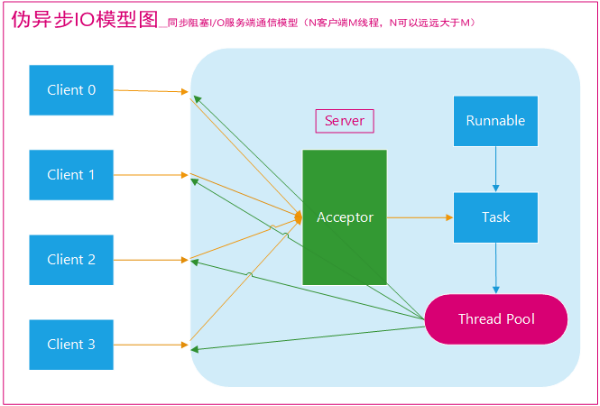
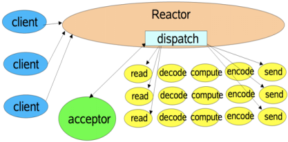
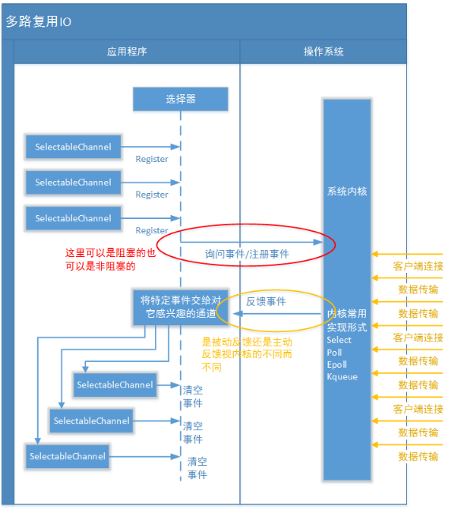
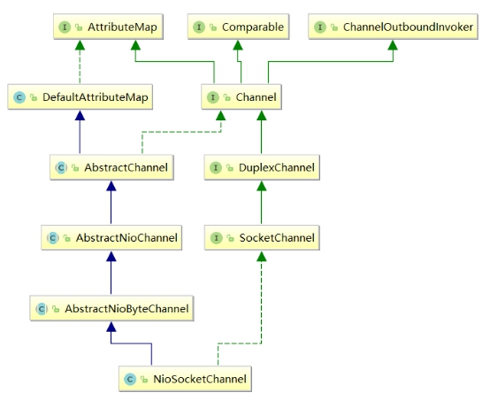

#  计算机网络体系结构   

开放系统互连参考模型 (Open System Interconnect 简称OSI）是国际标准化组织(ISO)和国际电报电话咨询委员会(CCITT)联合制定的开放系统互连参考模型，为开放式互连信息系统提供了一种功能结构的框架。其目的是为异种计算机互连提供一个共同的基础和标准框架，并为保持相关标准的一致性和兼容性提供共同的参考。这里所说的开放系统，实质上指的是遵循OSI参考模型和相关协议能够实现互连的具有各种应用目的的计算机系统。

OSI采用了分层的结构化技术，共分七层，物理层、数据链路层、网络层、传输层、会话层、表示层、应用层。

#  OSI七层模型各层的作用   

 物理层  并不是物理媒体本身，它只是开放系统中利用物理媒体实现物理连接的功能描述和执行连接的规程。

物理层的媒体包括架空明线、平衡电缆、光纤、无线信道等。通信用的互连设备指DTE（Data Terminal Equipment）和DCE（Data Communications Equipment）间的互连设备。DTE即[数据终端设备](https://baike.baidu.com/item/数据终端设备)，又称[物理设备](https://baike.baidu.com/item/物理设备)，如计算机、终端等都包括在内。而DCE则是数据通信设备或电路连接设备，如[调制解调器](https://baike.baidu.com/item/调制解调器)等。数据传输通常是经过DTE-DCE，再经过DCE-DTE的路径。互连设备指将DTE、DCE连接起来的装置，如各种插头、插座。LAN中的各种粗、细同轴电缆、T型接头、插头、接收器、发送器、[中继器](https://baike.baidu.com/item/中继器)等都属物理层的媒体和连接器。

[物理层](https://baike.baidu.com/item/物理层)的主要功能是：

① 为数据端设备提供传送数据的通路，[数据通路](https://baike.baidu.com/item/数据通路)可以是一个[物理媒体](https://baike.baidu.com/item/物理媒体)，也可以是多个物理媒体连接而成。一次完整的数据传输，包括激活物理连接、传送数据和终止物理连接。所谓激活，就是不管有多少[物理媒体](https://baike.baidu.com/item/物理媒体)参与，都要在通信的两个[数据终端设备](https://baike.baidu.com/item/数据终端设备)间连接起来，形成一条通路。

② ②传输数据。[物理层](https://baike.baidu.com/item/物理层)要形成适合数据传输需要的实体，为数据传送服务。一是要保证数据能在其上正确通过，二是要提供足够的[带宽](https://baike.baidu.com/item/带宽)(带宽是指每秒钟内能通过的比特(Bit)数)，以减少信道上的拥塞。传输数据的方式能满足点到点，一点到多点，串行或并行，半双工或全双工，同步或[异步传输](https://baike.baidu.com/item/异步传输)的需要。

 数据链路  可以粗略地理解为数据通道。[物理层](https://baike.baidu.com/item/物理层)要为[终端设备](https://baike.baidu.com/item/终端设备)间的数据通信提供[传输介质](https://baike.baidu.com/item/传输介质)及其连接。介质是长期的，连接是有生存期的。在连接生存期内，收发两端可以进行不等的一次或多次数据通信。每次通信都要经过建立通信联络和拆除通信联络两个过程。这种建立起来的数据收发关系就叫做数据链路。而在[物理媒体](https://baike.baidu.com/item/物理媒体)上传输的数据难免受到各种不可靠因素的影响而产生差错，为了弥补[物理层](https://baike.baidu.com/item/物理层)上的不足，为上层提供无差错的数据传输，就要能对数据进行检错和纠错。[链路层](https://baike.baidu.com/item/链路层)应具备如下功能：

链路连接的建立、拆除和分离；

差错检测和恢复。还有链路标识，[流量控制](https://baike.baidu.com/item/流量控制)等等。

独立的链路产品中最常见的当属网卡，网桥也是链路产品。

 网络层  ，当数据终端增多时。它们之间有中继设备相连，此时会出现一台[终端](https://baike.baidu.com/item/终端)要求不只是与惟一的一台而是能和多台终端通信的情况，这就产生了把任意两台[数据终端设备](https://baike.baidu.com/item/数据终端设备)的数据链接起来的问题，也就是[路由](https://baike.baidu.com/item/路由)或者叫寻径。另外，当一条物理信道建立之后，被一对用户使用，往往有许多空闲时间被浪费掉。人们自然会希望让多对用户共用一条链路，为解决这一问题就出现了逻辑信道技术和[虚拟电路](https://baike.baidu.com/item/虚拟电路)技术。

 传输层  有一个既存事实，即世界上各种[通信子网](https://baike.baidu.com/item/通信子网)在性能上存在着很大差异。例如电话交换网，分组交换网，公用数据交换网，局域网等[通信子网](https://baike.baidu.com/item/通信子网)都可互连，但它们提供的[吞吐量](https://baike.baidu.com/item/吞吐量)，[传输速率](https://baike.baidu.com/item/传输速率)，数据延迟通信费用各不相同。对于会话层来说，却要求有一性能恒定的界面。[传输层](https://baike.baidu.com/item/传输层)就承担了这一功能。

 会话层  会话单位的控制层，其主要功能是按照在应用进程之间约定的原则，按照正确的顺序收、发数据，进行各种形态的对话。会话层规定了会话服务用户间会话连接的建立和拆除规程以及数据传送规程。

会话层提供的服务是应用建立和维持会话，并能使会话获得同步。会话层使用[校验点](https://baike.baidu.com/item/校验点)可使通信会话在通信失效时从校验点继续恢复通信。这种能力对于传送大的文件极为重要。

 表示层  其主要功能是把应用层提供的信息变换为能够共同理解的形式，提供字符代码、数据格式、控制信息格式、加密等的统一表示。表示层的作用之一是为异种机通信提供一种公共语言，以便能进行互操作。这种类型的服务之所以需要，是因为不同的计算机体系结构使用的数据表示法不同。例如，IBM[主机](https://baike.baidu.com/item/主机)使用EBCDIC编码，而大部分PC机使用的是ASCII码。在这种情况下，便需要表示层来完成这种转换。

 应用层  向应用程序提供服务，这些服务按其向应用程序提供的特性分成组，并称为服务元素。有些可为多种应用程序共同使用，有些则为较少的一类应用程序使用。应用层是开放系统的最高层，是直接为应用进程提供服务的。其作用是在实现多个系统应用进程相互通信的同时，完成一系列业务处理所需的服务。

#  TCP/IP协议  

通俗而言：TCP负责发现传输的问题，一有问题就发出信号，要求重新传输，直到所有数据安全正确地传输到目的地。而IP是给因特网的每一台联网设备规定一个地址。

#  TCP 和 UDP  

####  TCP  

TCP是面向连接的通信协议，通过[三次握手](https://baike.baidu.com/item/三次握手)建立连接，通讯完成时要拆除连接，由于TCP是面向连接的所以只能用于端到端的通讯。

TCP提供的是一种可靠的[数据流](https://baike.baidu.com/item/数据流)服务，采用“带重传的肯定确认”技术来实现传输的可靠性。TCP还采用一种称为“滑动窗口”的方式进行流量控制，所谓窗口实际表示接收能力，用以限制发送方的发送速度。

如果IP数据包中有已经封好的TCP数据包，那么IP将把它们向‘上’传送到TCP层。TCP将包排序并进行错误检查，同时实现虚电路间的连接。TCP数据包中包括序号和确认，所以未按照顺序收到的包可以被排序，而损坏的包可以被重传。

TCP将它的信息送到更高层的应用程序，例如Telnet的服务程序和客户程序。应用程序轮流将信息送回TCP层，TCP层便将它们向下传送到IP层，设备驱动程序和物理介质，最后到接收方。

面向连接的服务（例如[Telnet](https://baike.baidu.com/item/Telnet)、[FTP](https://baike.baidu.com/item/FTP/13839)、[rlogin](https://baike.baidu.com/item/rlogin)、[X Windows](https://baike.baidu.com/item/X Windows)和[SMTP](https://baike.baidu.com/item/SMTP)）需要高度的可靠性，所以它们使用了TCP。DNS在某些情况下使用TCP（发送和接收[域名](https://baike.baidu.com/item/域名)数据库），但使用UDP传送有关单个主机的信息。

####  UDP  

[UDP](https://baike.baidu.com/item/UDP)是面向无连接的通讯协议，UDP数据包括目的端口号和源端口号信息，由于通讯不需要连接，所以可以实现广播发送。

[UDP](https://baike.baidu.com/item/UDP)通讯时不需要接收方确认，属于不可靠的传输，可能会出现丢包现象，实际应用中要求程序员编程验证。

[UDP](https://baike.baidu.com/item/UDP)与[TCP](https://baike.baidu.com/item/TCP/5779591)位于同一层，但它不管数据包的顺序、错误或重发。因此，UDP不被应用于那些使用虚电路的面向连接的服务，UDP主要用于那些面向查询---应答的服务，例如NFS。相对于FTP或Telnet，这些服务需要交换的信息量较小。使用UDP的服务包括NTP（网络时间协议）和DNS（DNS也使用TCP），包总量较少的通信（DNS、SNMP等）；2.视频、音频等多媒体通信（即时通信）；3.限定于 LAN 等特定网络中的应用通信；4.广播通信（广播、多播）。

常用QQ，就是一个以UDP为主，TCP为辅的通讯协议。

####  TCP 和 UDP 的优缺点  

无法简单地、绝对地去做比较：TCP 用于在传输层有必要实现可靠传输的情况；而在一方面，UDP 主要用于那些对高速传输和实时性有较高要求的通信或广播通信。TCP 和 UDP 应该根据应用的目的按需使用。

####  端口号  

数据链路和 IP 中的地址，分别指的是 MAC 地址和 IP 地址。前者用来识别同一链路中不同的计算机，后者用来识别 TCP/IP 网络中互连的主机和路由器。在传输层也有这种类似于地址的概念，那就是端口号。端口号用来识别同一台计算机中进行通信的不同应用程序。因此，它也被称为程序地址。

一台计算机上同时可以运行多个程序。传输层协议正是利用这些端口号识别本机中正在进行通信的应用程序，并准确地将数据传输。

 端口号的确定  

· 标准既定的端口号：这种方法也叫静态方法。它是指每个应用程序都有其指定的端口号。但并不是说可以随意使用任何一个端口号。例如 HTTP、FTP、TELNET 等广为使用的应用协议中所使用的端口号就是固定的。这些端口号被称为知名端口号，分布在 0~1023 之间；除知名端口号之外，还有一些端口号被正式注册，它们分布在 1024~49151 之间，不过这些端口号可用于任何通信用途。

· 时序分配法：服务器有必要确定监听端口号，但是接受服务的客户端没必要确定端口号。在这种方法下，客户端应用程序完全可以不用自己设置端口号，而全权交给操作系统进行分配。动态分配的端口号范围在 49152~65535 之间。

 

##  三次握手（重点）  

TCP 提供面向有连接的通信传输。面向有连接是指在数据通信开始之前先做好两端之间的准备工作。

所谓三次握手是指建立一个 TCP 连接时需要客户端和服务器端总共发送三个包以确认连接的建立。在socket编程中，这一过程由客户端执行connect来触发。

第一次握手：客户端将标志位SYN置为1，随机产生一个值seq=J，并将该数据包发送给服务器端，客户端进入SYN_SENT状态，等待服务器端确认。

第二次握手：服务器端收到数据包后由标志位SYN=1知道客户端请求建立连接，服务器端将标志位SYN和ACK都置为1，ack=J+1，随机产生一个值seq=K，并将该数据包发送给客户端以确认连接请求，服务器端进入SYN_RCVD状态。

第三次握手：客户端收到确认后，检查ack是否为J+1，ACK是否为1，如果正确则将标志位ACK置为1，ack=K+1，并将该数据包发送给服务器端，服务器端检查ack是否为K+1，ACK是否为1，如果正确则连接建立成功，客户端和服务器端进入ESTABLISHED状态，完成三次握手，随后客户端与服务器端之间可以开始传输数据了。

>
>
>> 假设有A和B两端要进行通信，
>>  1, 第一次：首先A发送一个(SYN)到B，意思是A要和B建立连接进行通信；
>>
>> > 如果是只有一次握手的话，这样肯定是不行的，A压根都不知道B是不是收到了这个请求。
>
>> 2, 第二次：B收到A要建立连接的请求之后，发送一个确认(SYN+ACK)给A，意思是收到A的消息了，B这里也是通的，表示可以建立连接；
>>
>> > 如果只有两次通信的话，这时候B不确定A是否收到了确认消息，有可能这个确认消息由于某些原因丢了。
>
>> 3, 第三次：A如果收到了B的确认消息之后，再发出一个确认(ACK)消息，意思是告诉B，这边是通的，然后A和B就可以建立连接相互通信了；
>>
>> > 这个时候经过了三次握手，A和B双方确认了两边都是通的，可以相互通信了，已经可以建立一个可靠的连接，并且可以相互发送数据。
>
>> 4, 第四次：这个时候已经不需要B再发送一个确认消息了，两边已经通过前三次建立了一个可靠的连接，如果再发送第四次确认消息的话，就浪费资源了。
>>
>> > 如果第二个报文段B发出的(SYN+ACK)分别发送的话，也是可以理解为四次，但是被优化了，一起发送了。
>
>

##  四次挥手  

四次挥手即终止TCP连接，就是指断开一个TCP连接时，需要客户端和服务端总共发送4个包以确认连接的断开。在socket编程中，这一过程由客户端或服务端任一方执行close来触发。

由于TCP连接是全双工的，因此，每个方向都必须要单独进行关闭，这一原则是当一方完成数据发送任务后，发送一个FIN来终止这一方向的连接，收到一个FIN只是意味着这一方向上没有数据流动了，即不会再收到数据了，但是在这个TCP连接上仍然能够发送数据，直到这一方向也发送了FIN。首先进行关闭的一方将执行主动关闭，而另一方则执行被动关闭。

\1. 客户端进程发出连接释放报文，并且停止发送数据。释放数据报文首部，FIN=1，其序列号为seq=u（等于前面已经传送过来的数据的最后一个字节的序号加1），此时，客户端进入FIN-WAIT-1（终止等待1）状态。 TCP规定，FIN报文段即使不携带数据，也要消耗一个序号。

\2. 服务器收到连接释放报文，发出确认报文，ACK=1，ack=u+1，并且带上自己的序列号seq=v，此时，服务端就进入了CLOSE-WAIT（关闭等待）状态。TCP服务器通知高层的应用进程，客户端向服务器的方向就释放了，这时候处于半关闭状态，即客户端已经没有数据要发送了，但是服务器若发送数据，客户端依然要接受。这个状态还要持续一段时间，也就是整个CLOSE-WAIT状态持续的时间。

\3. 客户端收到服务器的确认请求后，此时，客户端就进入FIN-WAIT-2（终止等待2）状态，等待服务器发送连接释放报文（在这之前还需要接受服务器发送的最后的数据）。

\4. 服务器将最后的数据发送完毕后，就向客户端发送连接释放报文，FIN=1，ack=u+1，由于在半关闭状态，服务器很可能又发送了一些数据，假定此时的序列号为seq=w，此时，服务器就进入了LAST-ACK（最后确认）状态，等待客户端的确认。

\5. 客户端收到服务器的连接释放报文后，必须发出确认，ACK=1，ack=w+1，而自己的序列号是seq=u+1，此时，客户端就进入了TIME-WAIT（时间等待）状态。注意此时TCP连接还没有释放，必须经过2∗∗MSL（最长报文段寿命）的时间后，当客户端撤销相应的TCB后，才进入CLOSED状态。

\6. 服务器只要收到了客户端发出的确认，立即进入CLOSED状态。同样，撤销TCB后，就结束了这次的TCP连接。可以看到，服务器结束TCP连接的时间要比客户端早一些。

#  TCP/IP中的数据包   

每个分层中，都会对所发送的数据附加一个首部，在这个首部中包含了该层必要的信息，如发送的目标地址以及协议相关信息。通常，为协议提供的信息为包首部，所要发送的内容为数据。在下一层的角度看，从上一层收到的包全部都被认为是本层的数据。

网络中传输的数据包由两部分组成：一部分是协议所要用到的首部，另一部分是上一层传过来的数据。首部的结构由协议的具体规范详细定义。在数据包的首部，明确标明了协议应该如何读取数据。反过来说，看到首部，也就能够了解该协议必要的信息以及所要处理的数据。

· ① 应用程序处理
首先应用程序会进行编码处理，这些编码相当于 OSI 的表示层功能；
编码转化后，邮件不一定马上被发送出去，这种何时建立通信连接何时发送数据的管理功能，相当于 OSI 的会话层功能。 

· ② TCP 模块的处理
TCP 根据应用的指示，负责建立连接、发送数据以及断开连接。TCP 提供将应用层发来的数据顺利发送至对端的可靠传输。为了实现这一功能，需要在应用层数据的前端附加一个 TCP 首部。 

· ③ IP 模块的处理
IP 将 TCP 传过来的 TCP 首部和 TCP 数据合起来当做自己的数据，并在 TCP 首部的前端加上自己的 IP 首部。IP 包生成后，参考路由控制表决定接受此 IP 包的路由或主机。 

· ④ 网络接口（以太网驱动）的处理
从 IP 传过来的 IP 包对于以太网来说就是数据。给这些数据附加上以太网首部并进行发送处理，生成的以太网数据包将通过物理层传输给接收端。 

· ⑤ 网络接口（以太网驱动）的处理
主机收到以太网包后，首先从以太网包首部找到 MAC 地址判断是否为发送给自己的包，若不是则丢弃数据。
如果是发送给自己的包，则从以太网包首部中的类型确定数据类型，再传给相应的模块，如 IP、ARP 等。这里的例子则是 IP 。 

· ⑥ IP 模块的处理
IP 模块接收到 数据后也做类似的处理。从包首部中判断此 IP 地址是否与自己的 IP 地址匹配，如果匹配则根据首部的协议类型将数据发送给对应的模块，如 TCP、UDP。这里的例子则是 TCP。
另外吗，对于有路由器的情况，接收端地址往往不是自己的地址，此时，需要借助路由控制表，在调查应该送往的主机或路由器之后再进行转发数据。 

· ⑦ TCP 模块的处理
在 TCP 模块中，首先会计算一下校验和，判断数据是否被破坏。然后检查是否在按照序号接收数据。最后检查端口号，确定具体的应用程序。数据被完整地接收以后，会传给由端口号识别的应用程序。 

· ⑧ 应用程序的处理
接收端应用程序会直接接收发送端发送的数据。通过解析数据，展示相应的内容。

#  TCP 中通过序列号与确认应答提高可靠性  

在 TCP 中，当发送端的数据到达接收主机时，接收端主机会返回一个已收到消息的通知。这个消息叫做确认应答（ACK）。当发送端将数据发出之后会等待对端的确认应答。如果有确认应答，说明数据已经成功到达对端。反之，则数据丢失的可能性很大。

在一定时间内没有等待到确认应答，发送端就可以认为数据已经丢失，并进行重发。由此，即使产生了丢包，仍然能够保证数据能够到达对端，实现可靠传输。

未收到确认应答并不意味着数据一定丢失。也有可能是数据对方已经收到，只是返回的确认应答在途中丢失。这种情况也会导致发送端误以为数据没有到达目的地而重发数据。

此外，也有可能因为一些其他原因导致确认应答延迟到达，在源主机重发数据以后才到达的情况也屡见不鲜。此时，源主机只要按照机制重发数据即可。

对于目标主机来说，反复收到相同的数据是不可取的。为了对上层应用提供可靠的传输，目标主机必须放弃重复的数据包。为此我们引入了序列号。

序列号是按照顺序给发送数据的每一个字节（8位字节）都标上号码的编号。接收端查询接收数据 TCP 首部中的序列号和数据的长度，将自己下一步应该接收的序列号作为确认应答返送回去。通过序列号和确认应答号，TCP 能够识别是否已经接收数据，又能够判断是否需要接收，从而实现可靠传输。

 

#  HTTP请求的传输过程   

首先作为发送端的客户端在应用层（HTTP 协议）发出一个想看某个 Web 页面的 HTTP 请求。

接着，为了传输方便，在传输层（TCP 协议）把从应用层处收到的数据（HTTP 请求报文）进行分割，并在各个报文上打上标记序号及端口号后转发给网络层。

在网络层（IP 协议），增加作为通信目的地的 MAC 地址后转发给链路层。这样一来，发往网络的通信请求就准备齐全了。

接收端的服务器在链路层接收到数据，按序往上层发送，一直到应用层。当传输到应用层，才能算真正接收到由客户端发送过来的 HTTP请求。

#  一次完整http请求的7个过程   

·  建立 TCP 连接  
在HTTP工作开始之前，客户端首先要通过网络与服务器建立连接，该连接是通过 TCP 来完成的，该协议与 IP 协议共同构建 Internet，即著名的 TCP/IP 协议族，因此 Internet 又被称作是 TCP/IP 网络。HTTP 是比 TCP 更高层次的应用层协议，根据规则，只有低层协议建立之后，才能进行高层协议的连接，因此，首先要建立 TCP 连接，一般 TCP 连接的端口号是80； 

·  客户端向服务器发送请求命令  
一旦建立了TCP连接，客户端就会向服务器发送请求命令；
例如：GET/sample/hello.jsp HTTP/1.1 

·  客户端发送请求头信息  
客户端发送其请求命令之后，还要以头信息的形式向服务器发送一些别的信息，之后客户端发送了一空白行来通知服务器，它已经结束了该头信息的发送； 

·  服务器应答  
客户端向服务器发出请求后，服务器会客户端返回响应；
例如： HTTP/1.1 200 OK
响应的第一部分是协议的版本号和响应状态码 

·  服务器返回响应头信息  
正如客户端会随同请求发送关于自身的信息一样，服务器也会随同响应向用户发送关于它自己的数据及被请求的文档； 

·  服务器向客户端发送数据  
服务器向客户端发送头信息后，它会发送一个空白行来表示头信息的发送到此为结束，接着，它就以 Content-Type 响应头信息所描述的格式发送用户所请求的实际数据； 

·  服务器关闭 TCP 连接  
一般情况下，一旦服务器向客户端返回了请求数据，它就要关闭 TCP 连接，然后如果客户端或者服务器在其头信息加入了这行代码 Connection:keep-alive ，TCP 连接在发送后将仍然保持打开状态，于是，客户端可以继续通过相同的连接发送请求。保持连接节省了为每个请求建立新连接所需的时间，还节约了网络带宽。

#  HTTP 协议报文结构  

用于 HTTP 协议交互的信息被称为 HTTP 报文。请求端（客户端）的 HTTP 报文叫做请求报文；响应端（服务器端）的叫做响应报文。HTTP 报文本身是由多行（用 CR+LF 作换行符）数据构成的字符串文本。

HTTP 报文大致可分为报文首部和报文主体两部分。两者由最初出现的空行（CR+LF）来划分。通常，并不一定有报文主体。

#  请求报文结构   

请求报文的首部内容由以下数据组成：

 

请求行 —— 包含用于请求的方法、请求 URI 和 HTTP 版本。

首部字段 —— 包含表示请求的各种条件和属性的各类首部。（通用首部、请求首部、实体首部以及RFC里未定义的首部如 Cookie 等）

#  响应报文结构   

状态行 —— 包含表明响应结果的状态码、原因短语和 HTTP 版本。

首部字段 —— 包含表示请求的各种条件和属性的各类首部。（通用首部、响应首部、实体首部以及RFC里未定义的首部如 Cookie 等）

#  一些常见术语   

 Socket  是应用层与TCP/IP协议族通信的中间软件抽象层，它是一组接口。在设计模式中，Socket其实就是一个门面模式，它把复杂的TCP/IP协议族隐藏在Socket接口后面，对用户来说，一组简单的接口就是全部，让Socket去组织数据，以符合指定的协议。

主机 A 的应用程序要能和主机 B 的应用程序通信，必须通过 Socket 建立连接，而建立 Socket 连接必须需要底层TCP/IP 协议来建立 TCP 连接。建立 TCP 连接需要底层 IP 协议来寻址网络中的主机。我们知道网络层使用的 IP 协议可以帮助我们根据 IP 地址来找到目标主机，但是一台主机上可能运行着多个应用程序，如何才能与指定的应用程序通信就要通过 TCP 或 UPD 的地址也就是端口号来指定。这样就可以通过一个 Socket 实例唯一代表一个主机上的一个应用程序的通信链路了。

 短连接：  

连接->传输数据->关闭连接
  HTTP是无状态的，浏览器和服务器每进行一次HTTP操作，就建立一次连接，但任务结束就中断连接。
  也可以这样说：短连接是指SOCKET连接后发送后接收完数据后马上断开连接。

  长连接：  

连接->传输数据->保持连接 -> 传输数据-> 。。。 ->关闭连接。
  长连接指建立SOCKET连接后不管是否使用都保持连接，但安全性较差。

 什么时候用长连接，短连接？  

  长连接多用于操作频繁，点对点的通讯，而且连接数不能太多情况，。每个TCP连接都需要三步握手，这需要时间，如果每个操作都是先连接，再操作的话那么处理速度会降低很多，所以每个操作完后都不断开，次处理时直接发送数据包就OK了，不用建立TCP连接。例如：数据库的连接用长连接， 如果用短连接频繁的通信会造成socket错误，而且频繁的socket 创建也是对资源的浪费。

 而像WEB网站的http服务一般都用短链接，因为长连接对于服务端来说会耗费一定的资源，而像WEB网站这么频繁的成千上万甚至上亿客户端的连接用短连接会更省一些资源，如果用长连接，而且同时有成千上万的用户，如果每个用户都占用一个连接的话，那可想而知吧。所以并发量大，但每个用户无需频繁操作情况下需用短连好。

 总之，长连接和短连接的选择要视情况而定。

#  Linux网络IO模型   

##  同步和异步，阻塞和非阻塞  

####  同步和异步关注的是结果消息的通信机制  

同步:同步的意思就是调用方需要主动等待结果的返回

异步:异步的意思就是不需要主动等待结果的返回，而是通过其他手段比如，状态通知，回调函数等。

####  阻塞和非阻塞主要关注的是等待结果返回调用方的状态  

阻塞:是指结果返回之前，当前线程被挂起，不做任何事

非阻塞:是指结果在返回之前，线程可以做一些其他事，不会被挂起。

####  组合起来  

 1.同步阻塞:  

同步阻塞基本也是编程中最常见的模型，打个比方你去商店买衣服，你去了之后发现衣服卖完了，那你就在店里面一直等，期间不做任何事(包括看手机)，等着商家进货，直到有货为止，这个效率很低。

 2.同步非阻塞:  
同步非阻塞在编程中可以抽象为一个轮询模式，你去了商店之后，发现衣服卖完了，这个时候不需要傻傻的等着，你可以去其他地方比如奶茶店，买杯水，但是你还是需要时不时的去商店问老板新衣服到了吗。

 3.异步阻塞:  
异步阻塞这个编程里面用的较少，有点类似你写了个线程池,submit然后马上future.get()，这样线程其实还是挂起的。有点像你去商店买衣服，这个时候发现衣服没有了，这个时候你就给老板留给电话，说衣服到了就给我打电话，然后你就守着这个电话，一直等着他响什么事也不做。这样感觉的确有点傻，所以这个模式用得比较少。

 4.异步非阻塞:  
好比你去商店买衣服，衣服没了，你只需要给老板说这是我的电话，衣服到了就打。然后你就随心所欲的去玩，也不用操心衣服什么时候到，衣服一到，电话一响就可以去买衣服了。

####  阻塞I/O模型：  

​       应用程序调用一个IO函数，导致应用程序阻塞，等待数据准备好。 如果数据没有准备好，一直等待….数据准备好了，从内核拷贝到用户空间,IO函数返回成功指示。

 当调用recv()函数时，系统首先查是否有准备好的数据。如果数据没有准备好，那么系统就处于等待状态。当数据准备好后，将数据从系统缓冲区复制到用户空间，然后该函数返回。在套接应用程序中，当调用recv()函数时，未必用户空间就已经存在数据，那么此时recv()函数就会处于等待状态。

####  非阻塞IO模型   

​    我们把一个SOCKET接口设置为非阻塞就是告诉内核，当所请求的I/O操作无法完成时，不要将进程睡眠，而是返回一个错误。这样我们的I/O操作函数将不断的测试数据是否已经准备好，如果没有准备好，继续测试，直到数据准备好为止。在这个不断测试的过程中，会大量的占用CPU的时间。上述模型绝不被推荐。

  把SOCKET设置为非阻塞模式，即通知系统内核：在调用Windows Sockets API时，不要让线程睡眠，而应该让函数立即返回。在返回时，该函数返回一个错误代码。图所示，一个非阻塞模式套接字多次调用recv()函数的过程。前三次调用recv()函数时，内核数据还没有准备好。因此，该函数立即返回WSAEWOULDBLOCK错误代码。第四次调用recv()函数时，数据已经准备好，被复制到应用程序的缓冲区中，recv()函数返回成功指示，应用程序开始处理数据。

####  IO复用模型：  

​       简介：主要是select和epoll；对一个IO端口，两次调用，两次返回，比阻塞IO并没有什么优越性；关键是能实现同时对多个IO端口进行监听；

​    I/O复用模型会用到select、poll、epoll函数，这几个函数也会使进程阻塞，但是和阻塞I/O所不同的的，这两个函数可以同时阻塞多个I/O操作。而且可以同时对多个读操作，多个写操作的I/O函数进行检测，直到有数据可读或可写时，才真正调用I/O操作函数。

当用户进程调用了select，那么整个进程会被block；而同时，kernel会“监视”所有select负责的socket；当任何一个socket中的数据准备好了，select就会返回。这个时候，用户进程再调用read操作，将数据从kernel拷贝到用户进程。
  这个图和blocking IO的图其实并没有太大的不同，事实上还更差一些。因为这里需要使用两个系统调用(select和recvfrom)，而blocking IO只调用了一个系统调用(recvfrom)。但是，用select的优势在于它可以同时处理多个connection。（select/epoll的优势并不是对于单个连接能处理得更快，而是在于能处理更多的连接。）

####  信号驱动IO  

   简介：两次调用，两次返回；

  首先我们允许套接口进行信号驱动I/O,并安装一个信号处理函数，进程继续运行并不阻塞。当数据准备好时，进程会收到一个SIGIO信号，可以在信号处理函数中调用I/O操作函数处理数据。

####  异步IO模型  

​    当一个异步过程调用发出后，调用者不能立刻得到结果。实际处理这个调用的部件在完成后，通过状态、通知和回调来通知调用者的输入输出操作

# 5个I/O模型的比较

##  select、poll、epoll   的区别？    ：  

 1、支持一个进程所能打开的最大连接数

| select | 单个进程所能打开的最大连接数有FD_SETSIZE宏定义，其大小是32个整数的大小（在32位的机器上，大小就是32*32，同理64位机器上FD_SETSIZE为32*64），可以对进行修改，然后重新编译内核，但是性能可能会受到影响。 |
| ------ | ------------------------------------------------------------ |
| poll   | poll本质上和select没有区别，但是它没有最大连接数的限制，原因是它是基于链表来存储的 |
| epoll  | 连接数有上限，但是很大，1G内存的机器上可以打开10万左右的连接，2G内存的机器可以打开20万左右的连接 |

2、FD剧增后带来的IO效率问题

| select | 因为每次调用时都会对连接进行线性遍历，所以随着FD的增加会造成遍历速度慢的“线性下降性能问题”。 |
| ------ | ------------------------------------------------------------ |
| poll   | 同上                                                         |
| epoll  | 因为epoll内核中实现是根据每个fd上的callback函数来实现的，只有活跃的socket才会主动调用callback，所以在活跃socket较少的情况下，使用epoll没有前面两者的线性下降的性能问题，但是所有socket都很活跃的情况下，可能会有性能问题。 |

3、 消息传递方式

| select | 内核需要将消息传递到用户空间，都需要内核拷贝动作 |
| ------ | ------------------------------------------------ |
| poll   | 同上                                             |
| epoll  | epoll通过内核和用户空间共享一块内存来实现的。    |

## select()和poll() IO多路复用模型

**select的缺点：**

单个进程能够监视的文件描述符的数量存在最大限制，通常是1024，当然可以更改数量，但由于select采用轮询的方式扫描文件描述符，文件描述符数量越多，性能越差；

内核/用户空间内存拷贝问题，select需要复制大量的句柄数据结构，产生巨大的开销；

select返回的是含有整个句柄的***数组\***，应用程序需要遍历整个数组才能发现哪些句柄发生了事件；

select的触发方式是水平触发，应用程序如果没有完成对一个已经就绪的文件描述符进行IO，那么之后再次select调用还是会将这些文件描述符通知进程。

相比于select模型，poll使用***链表\***保存文件描述符，因此没有了监视文件数量的限制，但其他三个缺点依然存在。

拿select模型为例，假设我们的服务器需要支持100万的并发连接，则在_FD_SETSIZE为1024的情况下，则我们至少需要开辟1k个进程才能实现100万的并发连接。除了进程间上下文切换的时间消耗外，从内核/用户空间大量的无脑内存拷贝、数组轮询等，是系统难以承受的。因此，基于select模型的服务器程序，要达到10万级别的并发访问，是一个很难完成的任务。

## epoll IO多路复用模型实现机制

由于epoll的实现机制与select/poll机制完全不同，上面所说的select的缺点在epoll上不复存在。

设想一下如下场景：有100万个客户端同时与一个服务器进程保持着TCP连接。而每一时刻，通常只有几百上千个TCP连接是活跃的。如何实现这样的高并发？

在select/poll时代，服务器进程每次都把这100万个连接告诉操作系统（从用户态复制句柄数据结构到内核态），让操作系统内核去查询这些套接字上是否有事件发生，轮询完后，再将句柄数据复制到用户态，让服务器应用程序轮询处理已发生的网络事件，这一过程资源消耗较大，因此，select/poll一般只能处理几千的并发连接。

epoll的设计和实现select完全不同。epoll通过在linux内核中申请一个简易的文件系统（可以理解为有一个共享的内存空间）（文件系统一般用什么数据结构实现？B+树）。把原先的select/poll调用分成了3个部分：

1）调用epoll_create()建立一个epoll对象（在epoll文件系统中为这个句柄对象分配资源）

2）调用epoll_ctl向epoll对象中添加这100万个连接的套接字

3）调用epoll_wait收集发生的事件的连接

如此一来，要实现上面说的场景，只需要在进程启动时建立一个epoll对象，然后在需要的时候向这个epoll对象中添加或者删除连接。同时，epoll_wait的效率也非常高，因为调用epoll_wait时，并没有一股脑的向操作系统复制这100万个连接的句柄数据，内核也不需要去遍历全部的连接。

上面的3个部分非常清晰，首先要调用epoll_create创建一个epoll对象。然后使用epoll_ctl可以操作上面建立的epoll对象，例如，将刚建立的socket加入到epoll中让其监控，或者把epoll正在监控的某个socket句柄移出epoll，不再监控它等等。

epoll_wait在调用时，在给定的timeout时间内，当在监控的所有句柄中有事件发生时，就返回用户态的进程。

从上面的调用方式就可以看到epoll比select/poll的优越之处：因为后者每次调用时都要传递你所要监控的所有socket给select/poll系统调用，这意味着需要将用户态的socket列表copy到内核态，如果以万计的句柄会导致每次都要copy几十几百KB的内存到内核态，非常低效。而我们调用epoll_wait时就相当于以往调用select/poll，但是这时却不用传递socket句柄给内核，因为内核已经在epoll_ctl中拿到了要监控的句柄列表。

所以，实际上在你调用epoll_create后，内核就已经在内核态开始准备帮你存储要监控的句柄了，每次调用epoll_ctl只是在往内核的数据结构里塞入新的socket句柄。

在内核里，一切皆文件。所以，epoll向内核注册了一个文件系统，用于存储上述的被监控socket。当你调用epoll_create时，就会在这个虚拟的epoll文件系统里创建一个file结点。当然这个file不是普通文件，它只服务于epoll。

epoll在被内核初始化时（操作系统启动），同时会开辟出epoll自己的内核高速cache区，用于安置每一个我们想监控的socket，这些socket会以红黑树的形式保存在内核cache里，以支持快速的查找、插入、删除。这个内核高速cache区，就是建立连续的物理内存页，然后在之上建立slab层，简单的说，就是物理上分配好你想要的size的内存对象，每次使用时都是使用空闲的已分配好的对象。

epoll的高效就在于，当我们调用epoll_ctl往里塞入百万个句柄时，epoll_wait仍然可以飞快的返回，并有效的将发生事件的句柄给我们用户。这是由于我们在调用epoll_create时，内核除了帮我们在epoll文件系统里建了个file结点，在内核cache里建了个红黑树用于存储以后epoll_ctl传来的socket外，还会再建立一个list链表，用于存储准备就绪的事件，当epoll_wait调用时，仅仅观察这个list链表里有没有数据即可。有数据就返回，没有数据就sleep，等到timeout时间到后即使链表没数据也返回。所以，epoll_wait非常高效。

而且，通常情况下即使我们要监控百万计的句柄，大多一次也只返回很少量的准备就绪句柄而已，所以，epoll_wait仅需要从内核态copy少量的句柄到用户态而已，如何能不高效？！

那么，这个准备就绪list链表是怎么维护的呢？当我们执行epoll_ctl时，除了把socket放到epoll文件系统里file对象对应的红黑树上之外，还会给内核中断处理程序注册一个回调函数，告诉内核，如果这个句柄的中断到了，就把它放到准备就绪list链表里。所以，当一个socket上有数据到了，内核在把网卡上的数据copy到内核中后就来把socket插入到准备就绪链表里了。

如此，一颗红黑树，一张准备就绪句柄链表，少量的内核cache，就帮我们解决了大并发下的socket处理问题。执行epoll_create时，创建了红黑树和就绪链表，执行epoll_ctl时，如果增加socket句柄，则检查在红黑树中是否存在，存在立即返回，不存在则添加到树干上，然后向内核注册回调函数，用于当中断事件来临时向准备就绪链表中插入数据。执行epoll_wait时立刻返回准备就绪链表里的数据即可。

最后看看epoll独有的两种模式LT和ET。无论是LT和ET模式，都适用于以上所说的流程。区别是，LT模式下，只要一个句柄上的事件一次没有处理完，会在以后调用epoll_wait时次次返回这个句柄，而ET模式仅在第一次返回。

##  补充知识点：  

####  Level_triggered(水平触发)：  

当被监控的文件描述符上有可读写事件发生时，epoll_wait()会通知处理程序去读写。如果这次没有把数据一次性全部读写完(如读写缓冲区太小)，那么下次调用 epoll_wait()时，它还会通知你在上没读写完的文件描述符上继续读写，当然如果你一直不去读写，它会一直通知你！！！如果系统中有大量你不需要读写的就绪文件描述符，而它们每次都会返回，这样会大大降低处理程序检索自己关心的就绪文件描述符的效率！！！

####  Edge_triggered(边缘触发)：  

当被监控的文件描述符上有可读写事件发生时，epoll_wait()会通知处理程序去读写。如果这次没有把数据全部读写完(如读写缓冲区太小)，那么下次调用epoll_wait()时，它不会通知你，也就是它只会通知你一次，直到该文件描述符上出现第二次可读写事件才会通知你！！！这种模式比水平触发效率高，系统不会充斥大量你不关心的就绪文件描述符！！

 select(),poll()模型都是水平触发模式，信号驱动IO是边缘触发模式，epoll()模型即支持水平触发，也支持边缘触发，默认是水平触发。

#  网络编程里通用常识  

既然是通信，那么是肯定是有两个对端的。在通信编程里提供服务的叫 服务端  ，连接服务端使用服务的叫 客户端  。在开发过程中，如果类的名字有Server或者ServerSocket的，表示这个类是给服务端用的，如果类的名字只有Socket的，那么表示这是负责具体的网络读写的。那么对于服务端来说ServerSocket就只是个场所，具体和客户端沟通的还是一个一个的socket，所以在通信编程里， ServerSocket并不负责具体的网络读写，ServerSocket就只是负责接收客户端连接后，新启一个socket来和客户端进行沟通。这一点对所有模式的通信编程都是适用的。  

在通信编程里，我们关注的其实也就是三个事情：连接（客户端连接服务器，服务器等待和接收连接）、读网络数据、写网络数据， 所有模式的通信编程都是围绕着这三件事情进行的  。

#  原生JDK网络编程BIO   

同步阻塞IO

服务端提供IP和监听端口，客户端通过连接操作想服务端监听的地址发起连接请求，通过三次握手连接，如果连接成功建立，双方就可以通过套接字进行通信。

  传统的同步阻塞模型开发中，ServerSocket负责绑定IP地址，启动监听端口；Socket负责发起连接操作。连接成功后，双方通过输入和输出流进行同步阻塞式通信。 

 采用BIO通信模型的服务端，通常由一个独立的Acceptor线程负责监听客户端的连接，它接收到客户端连接请求之后为每个客户端创建一个新的线程进行处理，通过输出流返回应答给客户端，线程销毁。即典型的一请求一应答模型。

该模型最大的问题就是缺乏弹性伸缩能力，当客户端并发访问量增加后，服务端的线程个数和客户端并发访问数呈1:1的正比关系，Java中的线程也是比较宝贵的系统资源，线程数量快速膨胀后，系统的性能将急剧下降，随着访问量的继续增大，系统最终就 死-掉-了  。

为了改进这种一连接一线程的模型，我们可以使用线程池来管理这些线程，实现1个或多个线程处理N个客户端的模型（但是底层还是使用的同步阻塞I/O），通常被称为“伪异步I/O模型“。

我们知道，如果使用CachedThreadPool线程池，其实除了能自动帮我们管理线程（复用），看起来也就像是1:1的客户端：线程数模型，而使用FixedThreadPool我们就有效的控制了线程的最大数量，保证了系统有限的资源的控制，实现了N:M的伪异步I/O模型。

  但是，正因为限制了线程数量，如果发生读取数据较慢时（比如数据量大、网络传输慢等），大量并发的情况下，其他接入的消息，只能一直等待，这就是最大的弊端。

#  原生JDK网络编程- AIO   

异步IO

java从jdk1.7开始支持AIO核心类有AsynchronousSocketChannel 、AsynchronousServerSocketChannel。

异步IO采用“订阅-通知”模式：即应用程序向操作系统注册IO监听，然后继续做自己的事情。当操作系统发生IO事件，并且准备好数据后，在主动通知应用程序，触发相应的函数

>
>
>在IO编程一节中，我们已经知道，CPU的速度远远快于磁盘、网络等IO。在一个线程中，CPU执行代码的速度极快，然而，一旦遇到IO操作，如读写文件、发送网络数据时，就需要等待IO操作完成，才能继续进行下一步操作。这种情况称为同步IO。
>
>在IO操作的过程中，当前线程被挂起，而其他需要CPU执行的代码就无法被当前线程执行了。
>
>因为一个IO操作就阻塞了当前线程，导致其他代码无法执行，所以我们必须使用多线程或者多进程来并发执行代码，为多个用户服务。每个用户都会分配一个线程，如果遇到IO导致线程被挂起，其他用户的线程不受影响。
>
>多线程和多进程的模型虽然解决了并发问题，但是系统不能无上限地增加线程。由于系统切换线程的开销也很大，所以，一旦线程数量过多，CPU的时间就花在线程切换上了，真正运行代码的时间就少了，结果导致性能严重下降。
>
>由于我们要解决的问题是CPU高速执行能力和IO设备的龟速严重不匹配，多线程和多进程只是解决这一问题的一种方法。
>
>另一种解决IO问题的方法是异步IO。当代码需要执行一个耗时的IO操作时，它只发出IO指令，并不等待IO结果，然后就去执行其他代码了。一段时间后，当IO返回结果时，再通知CPU进行处理。

java AIO为TCP通信提供的异步Channel AsynchronousServerSocketChannel创建成功后，类似于ServerSocket，也是调用accept()方法来接受来自客户端的连接，由于异步IO实际的IO操作是交给操作系统来做的，用户进程只负责通知操作系统进行IO和接受操作系统IO完成的通知。所以异步的ServerChannel调用accept()方法后，当前线程不会阻塞，程序也不知道accept()方法什么时候能够接收到客户端请求并且操作系统完成网络IO，为解决这个问题，AIO中accept方法是这样的：

<A> void accept(A attachment ,CompletionHandler<AsynchronousSocketChannel,? super A> handler)：开始接受来自客户端请求，连接成功或失败都会触发CompletionHandler对象的相应方法。

其中AsynchronousSocketChannel就代表该CompletionHandler处理器在处理连接成功时的result，就是一个AsynchronousSocketChannel的实例。? super A代表这个io操作上附加的数据的类型。

而CompletionHandler接口中定义了两个方法，

　completed(V result , A attachment)：当IO完成时触发该方法，该方法的第一个参数代表IO操作返回的对象，第二个参数代表发起IO操作时传入的附加参数。

　faild(Throwable exc, A attachment)：当IO失败时触发该方法，第一个参数代表IO操作失败引发的异常或错误。

AsynchronousSocketChannel(进行异步通信的通道)的的用法与Socket类似，有三个方法：

　connect():用于连接到指定端口，指定IP地址的服务器

　read()、write():完成读写。 

 

  

#  原生JDK网络编程- NIO之Reactor模式   

 NIO即 非阻塞IO

| **IO** | **NIO**  |
| ------ | -------- |
| 面向流 | 面向缓冲 |
| 阻塞IO | 非阻塞IO |
| 无     | 选择器   |

“反应”器名字中”反应“的由来：

“反应”即“倒置”，“控制逆转”,具体事件处理程序不调用反应器，而向反应器注册一个事件处理器，表示自己对某些事件感兴趣，有时间来了，具体事件处理程序通过事件处理器对某个指定的事件发生做出反应；这种控制逆转又称为“好莱坞法则”（不要调用我，让我来调用你）

比如：

james老师去大保健，前台的接待小姐接待了james老师，james老师现在只对10000技师感兴趣，就告诉接待小姐，等10000技师上班了或者是空闲了，通知我。

等james接到通知了，做出了反应，把10000技师占住了，然后，james老师想起上一次的那个10000号房间不错，设备舒适，灯光暧昧，又告诉前台的接待小姐，我对10000号房间很感兴趣，房间空出来了就告诉我，我现在先和10000这个小姐聊下人生。

10000号房间空出来了，james接到通知了，james老师可以做出反应了。

james老师就是具体事件处理程序，前台的接待小姐就是所谓的反应器，10000技师和10000号房间空闲了就是事件，james老师只对这两个事件感兴趣，其他事件，比如10001号技师或者10000号房间空闲了也是事件，但是james老师不感兴趣。

> NIO的最重要的地方是当一个连接创建后，不需要对应一个线程，这个连接会被注册到多路复用器上面，所以所有的连接只需要一个线程就可以搞定，当这个线程中的多路复用器进行轮询的时候，发现连接上有请求的话，才开启一个线程进行处理，也就是一个请求一个线程模式。
>
>      在NIO的处理方式中，当一个请求来的话，开启线程进行处理，可能会等待后端应用的资源(JDBC连接等)，其实这个线程就被阻塞了，当并发上来的话，还是会有BIO一样的问题。
>
>　　HTTP/1.1出现后，有了Http长连接，这样除了超时和指明特定关闭的http header外，这个链接是一直打开的状态的，这样在NIO处理中可以进一步的进化，在后端资源中可以实现资源池或者队列，当请求来的话，开启的线程把请求和请求数据传送给后端资源池或者队列里面就返回，并且在全局的地方保持住这个现场(哪个连接的哪个请求等)，这样前面的线程还是可以去接受其他的请求，而后端的应用的处理只需要执行队列里面的就可以了，这样请求处理和后端应用是异步的.当后端处理完，到全局地方得到现场，产生响应，这个就实现了异步处理。
>
>

##  单线程Reactor模式流程：  

o 服务器端的Reactor是一个线程对象，该线程会启动事件循环，并使用Selector(选择器)来实现IO的多路复用。注册一个Acceptor事件处理器到Reactor中，Acceptor事件处理器所关注的事件是ACCEPT事件，这样Reactor会监听客户端向服务器端发起的连接请求事件(ACCEPT事件)。

② 客户端向服务器端发起一个连接请求，Reactor监听到了该ACCEPT事件的发生并将该ACCEPT事件派发给相应的Acceptor处理器来进行处理。Acceptor处理器通过accept()方法得到与这个客户端对应的连接(SocketChannel)，然后将该连接所关注的READ事件以及对应的READ事件处理器注册到Reactor中，这样一来Reactor就会监听该连接的READ事件了。

③ 当Reactor监听到有读或者写事件发生时，将相关的事件派发给对应的处理器进行处理。比如，读处理器会通过SocketChannel的read()方法读取数据，此时read()操作可以直接读取到数据，而不会堵塞与等待可读的数据到来。

④ 每当处理完所有就绪的感兴趣的I/O事件后，Reactor线程会再次执行select()阻塞等待新的事件就绪并将其分派给对应处理器进行处理。

注意，Reactor的单线程模式的单线程主要是针对于I/O操作而言，也就是所有的I/O的accept()、read()、write()以及connect()操作都在一个线程上完成的。

但在目前的单线程Reactor模式中，不仅I/O操作在该Reactor线程上，连非I/O的业务操作也在该线程上进行处理了，这可能会大大延迟I/O请求的响应。所以我们应该将非I/O的业务逻辑操作从Reactor线程上卸载，以此来加速Reactor线程对I/O请求的响应。

##  单线程Reactor，   工作者线程池  

与单线程Reactor模式不同的是，添加了一个工作者线程池，并将非I/O操作从Reactor线程中移出转交给工作者线程池来执行。这样能够提高Reactor线程的I/O响应，不至于因为一些耗时的业务逻辑而延迟对后面I/O请求的处理。

使用线程池的优势：

① 通过重用现有的线程而不是创建新线程，可以在处理多个请求时分摊在线程创建和销毁过程产生的巨大开销。

② 另一个额外的好处是，当请求到达时，工作线程通常已经存在，因此不会由于等待创建线程而延迟任务的执行，从而提高了响应性。

③ 通过适当调整线程池的大小，可以创建足够多的线程以便使处理器保持忙碌状态。同时还可以防止过多线程相互竞争资源而使应用程序耗尽内存或失败。

改进的版本中，所以的I/O操作依旧由一个Reactor来完成，包括I/O的accept()、read()、write()以及connect()操作。

对于一些小容量应用场景，可以使用单线程模型。但是对于高负载、大并发或大数据量的应用场景却不合适，主要原因如下：

① 一个NIO线程同时处理成百上千的链路，性能上无法支撑，即便NIO线程的CPU负荷达到100%，也无法满足海量消息的读取和发送；

② 当NIO线程负载过重之后，处理速度将变慢，这会导致大量客户端连接超时，超时之后往往会进行重发，这更加重了NIO线程的负载，最终会导致大量消息积压和处理超时，成为系统的性能瓶颈；

##  多Reactor线程模式  

Reactor线程池中的每一Reactor线程都会有自己的Selector、线程和分发的事件循环逻辑。

mainReactor可以只有一个，但subReactor一般会有多个。mainReactor线程主要负责接收客户端的连接请求，然后将接收到的SocketChannel传递给subReactor，由subReactor来完成和客户端的通信。

流程：

① 注册一个Acceptor事件处理器到mainReactor中，Acceptor事件处理器所关注的事件是ACCEPT事件，这样mainReactor会监听客户端向服务器端发起的连接请求事件(ACCEPT事件)。启动mainReactor的事件循环。

② 客户端向服务器端发起一个连接请求，mainReactor监听到了该ACCEPT事件并将该ACCEPT事件派发给Acceptor处理器来进行处理。Acceptor处理器通过accept()方法得到与这个客户端对应的连接(SocketChannel)，然后将这个SocketChannel传递给subReactor线程池。

③ subReactor线程池分配一个subReactor线程给这个SocketChannel，即，将SocketChannel关注的READ事件以及对应的READ事件处理器注册到subReactor线程中。当然你也注册WRITE事件以及WRITE事件处理器到subReactor线程中以完成I/O写操作。Reactor线程池中的每一Reactor线程都会有自己的Selector、线程和分发的循环逻辑。

④ 当有I/O事件就绪时，相关的subReactor就将事件派发给响应的处理器处理。注意，这里subReactor线程只负责完成I/O的read()操作，在读取到数据后将业务逻辑的处理放入到线程池中完成，若完成业务逻辑后需要返回数据给客户端，则相关的I/O的write操作还是会被提交回subReactor线程来完成。

注意，所以的I/O操作(包括，I/O的accept()、read()、write()以及connect()操作)依旧还是在Reactor线程(mainReactor线程 或 subReactor线程)中完成的。Thread Pool(线程池)仅用来处理非I/O操作的逻辑。

多Reactor线程模式将“接受客户端的连接请求”和“与该客户端的通信”分在了两个Reactor线程来完成。mainReactor完成接收客户端连接请求的操作，它不负责与客户端的通信，而是将建立好的连接转交给subReactor线程来完成与客户端的通信，这样一来就不会因为read()数据量太大而导致后面的客户端连接请求得不到即时处理的情况。并且多Reactor线程模式在海量的客户端并发请求的情况下，还可以通过实现subReactor线程池来将海量的连接分发给多个subReactor线程，在多核的操作系统中这能大大提升应用的负载和吞吐量。

 Netty服务端使用了“多Reactor线程模式”  

****

##  和观察者模式的区别  

 观察者模式：  
　　也可以称为为 发布-订阅 模式，主要适用于多个对象依赖某一个对象的状态并，当某对象状态发生改变时，要通知其他依赖对象做出更新。是一种一对多的关系。当然，如果依赖的对象只有一个时，也是一种特殊的一对一关系。通常，观察者模式适用于消息事件处理，监听者监听到事件时通知事件处理者对事件进行处理（这一点上面有点像是回调，容易与反应器模式和前摄器模式的回调搞混淆）。
 Reactor模式：  
　　reactor模式，即反应器模式，是一种高效的异步IO模式，特征是回调，当IO完成时，回调对应的函数进行处理。这种模式并非是真正的异步，而是运用了异步的思想，当IO事件触发时，通知应用程序作出IO处理。模式本身并不调用系统的异步IO函数。

reactor模式与观察者模式有点像。不过，观察者模式与单个事件源关联，而反应器模式则与多个事件源关联 。当一个主体发生改变时，所有依属体都得到通知。

#  原生JDK网络编程- Buffer   

Buffer用于和NIO通道进行交互。数据是从通道读入缓冲区，从缓冲区写入到通道中的。以写为例，应用程序都是将数据写入缓冲，再通过通道把缓冲的数据发送出去，读也是一样，数据总是先从通道读到缓冲，应用程序再读缓冲的数据。

缓冲区本质上是一块可以写入数据，然后可以从中读取数据的内存。这块内存被包装成NIO Buffer对象，并提供了一组方法，用来方便的访问该块内存。

##  重要属性  

####  capacity  

作为一个内存块，Buffer有一个固定的大小值，也叫“capacity”.你只能往里写capacity个byte、long，char等类型。一旦Buffer满了，需要将其清空（通过读数据或者清除数据）才能继续写数据往里写数据。

####  position  

当你写数据到Buffer中时，position表示当前的位置。初始的position值为0.当一个byte、long等数据写到Buffer后， position会向前移动到下一个可插入数据的Buffer单元。position最大可为capacity – 1.

当读取数据时，也是从某个特定位置读。当将Buffer从写模式切换到读模式，position会被重置为0. 当从Buffer的position处读取数据时，position向前移动到下一个可读的位置。

####  limit  

在写模式下，Buffer的limit表示你最多能往Buffer里写多少数据。 写模式下，limit等于Buffer的capacity。

当切换Buffer到读模式时， limit表示你最多能读到多少数据。因此，当切换Buffer到读模式时，limit会被设置成写模式下的position值。换句话说，你能读到之前写入的所有数据（limit被设置成已写数据的数量，这个值在写模式下就是position）

##  Buffer的分配  

要想获得一个Buffer对象首先要进行分配。 每一个Buffer类都有 allocate  方法(可以在堆上分配，也可以在直接内存上分配)。

堆上分配

分配48字节capacity的ByteBuffer的例子:ByteBuffer buf = ByteBuffer.allocate(48);

分配一个可存储1024个字符的CharBuffer：CharBuffer buf = CharBuffer.allocate(1024);

直接内存分配

ByteBuffer buf = ByteBuffer.allocateDirect(48);

 wrap方法  ：把一个byte数组或byte数组的一部分包装成ByteBuffer：

ByteBuffer wrap(byte [] array)
ByteBuffer wrap(byte [] array, int offset, int length) 

##  Buffer的   读写  

####  向Buffer中写数据  

 写数据到Buffer有两种方式：  

· 读取Channel写到Buffer。

· 通过Buffer的put()方法写到Buffer里。

从Channel写到Buffer的例子

 int   bytesRead = inChannel.read(buf); //read into buffer.

通过put方法写Buffer的例子：

buf.put(127);

put方法有很多版本，允许你以不同的方式把数据写入到Buffer中。例如， 写到一个指定的位置，或者把一个字节数组写入到Buffer。 更多Buffer实现的细节参考JavaDoc。

 flip()方法  

flip方法将Buffer从写模式切换到读模式。调用flip()方法会将position设回0，并将limit设置成之前position的值。

换句话说，position现在用于标记读的位置，limit表示之前写进了多少个byte、char等 —— 现在能读取多少个byte、char等。

####  从Buffer中读取数据  

 从Buffer中读取数据有两种方式：  

\1. 从Buffer读取数据写入到Channel。

\2. 使用get()方法从Buffer中读取数据。

从Buffer读取数据到Channel的例子：

 int   bytesWritten = inChannel.write(buf);

使用get()方法从Buffer中读取数据的例子

 byte   aByte = buf.get();

get方法有很多版本，允许你以不同的方式从Buffer中读取数据。例如，从指定position读取，或者从Buffer中读取数据到字节数组。更多Buffer实现的细节参考JavaDoc。

####  使用Buffer读写数据常见步骤：  

\1. 写入数据到Buffer(可能是自己的应用程序，也可能是系统)

\2. 调用flip()方法

\3. 从Buffer中读取数据

\4. 调用clear()方法或者compact()方法

当向buffer写入数据时，buffer会记录下写了多少数据。一旦要读取数据，需要通过flip()方法将Buffer从写模式切换到读模式。在读模式下，可以读取之前写入到buffer的所有数据。

一旦读完了所有的数据，就需要清空缓冲区，让它可以再次被写入。有两种方式能清空缓冲区：调用clear()或compact()方法。clear()方法会清空整个缓冲区。compact()方法只会清除已经读过的数据。任何未读的数据都被移到缓冲区的起始处，新写入的数据将放到缓冲区未读数据的后面。

####  其他常用操作  

 rewind()方法  

Buffer.rewind()将position设回0，所以你可以重读Buffer中的所有数据。limit保持不变，仍然表示能从Buffer中读取多少个元素（byte、char等）。

 clear()与compact()方法  

一旦读完Buffer中的数据，需要让Buffer准备好再次被写入。可以通过clear()或compact()方法来完成。

如果调用的是clear()方法，position将被设回0，limit被设置成 capacity的值。换句话说，Buffer 被清空了。Buffer中的数据并未清除，只是这些标记告诉我们可以从哪里开始往Buffer里写数据。

如果Buffer中有一些未读的数据，调用clear()方法，数据将“被遗忘”，意味着不再有任何标记会告诉你哪些数据被读过，哪些还没有。

如果Buffer中仍有未读的数据，且后续还需要这些数据，但是此时想要先先写些数据，那么使用compact()方法。

compact()方法将所有未读的数据拷贝到Buffer起始处。然后将position设到最后一个未读元素正后面。limit属性依然像clear()方法一样，设置成capacity。现在Buffer准备好写数据了，但是不会覆盖未读的数据。

 mark()与reset()方法  

通过调用Buffer.mark()方法，可以标记Buffer中的一个特定position。之后可以通过调用Buffer.reset()方法恢复到这个position。例如：

buffer.mark();//call buffer.get() a couple of times, e.g. during parsing.

buffer.reset(); //set position back to mark.

 

 equals()与compareTo()方法  

可以使用equals()和compareTo()方法两个Buffer。

 equals()  

当满足下列条件时，表示两个Buffer相等：

\1. 有相同的类型（byte、char、int等）。

\2. Buffer中剩余的byte、char等的个数相等。

\3. Buffer中所有剩余的byte、char等都相同。

如你所见，equals只是比较Buffer的一部分，不是每一个在它里面的元素都比较。实际上，它只比较Buffer中的剩余元素。

 compareTo()方法  

compareTo()方法比较两个Buffer的剩余元素(byte、char等)， 如果满足下列条件，则认为一个Buffer“小于”另一个Buffer：

\1. 第一个不相等的元素小于另一个Buffer中对应的元素 。

\2. 所有元素都相等，但第一个Buffer比另一个先耗尽(第一个Buffer的元素个数比另一个少)。

 

##  Buffer常用   方法   总结  

|  limit(), limit(10)等                      |  其中读取和设置这4个属性的方法的命名和jQuery中的val(),val(10)类似，一个负责get，一个负责set   |
| ------------------------------------------------- | ------------------------------------------------------------ |
|  reset()                                   |  把position设置成mark的值，相当于之前做过一个标记，现在要退回到之前标记的地方   |
|  clear()                                   |  position = 0;limit = capacity;mark = -1;    有点初始化的味道，但是并不影响底层byte数组的内容   |
|  flip()                                    |  limit = position;position = 0;mark = -1;    翻转，也就是让flip之后的position到limit这块区域变成之前的0到position这块，翻转就是将一个处于存数据状态的缓冲区变为一个处于准备取数据的状态   |
|  rewind()                                  |  把position设为0，mark设为-1，不改变limit的值         |
|  remaining()                               |  return limit - position;返回limit和position之间相对位置差   |
|  hasRemaining()                            |  return position < limit返回是否还有未读内容          |
|  compact()                                 |  把从position到limit中的内容移到0到limit-position的区域内，position和limit的取值也分别变成limit-position、capacity。如果先将positon设置到limit，再compact，那么相当于clear()   |
|  get()                                     |  相对读，从position位置读取一个byte，并将position+1，为下次读写作准备   |
|  get(int index)                            |  绝对读，读取byteBuffer底层的bytes中下标为index的byte，不改变position   |
|  get(byte[] dst, int offset, int length)   |  从position位置开始相对读，读length个byte，并写入dst下标从offset到offset+length的区域   |
|  put(byte b)                               |  相对写，向position的位置写入一个byte，并将postion+1，为下次读写作准备   |
|  put(int index, byte b)                    |  绝对写，向byteBuffer底层的bytes中下标为index的位置插入byte b，不改变position   |
|  put(ByteBuffer src)                       |  用相对写，把src中可读的部分（也就是position到limit）写入此byteBuffer   |
|  put(byte[] src, int offset, int length)   |  从src数组中的offset到offset+length区域读取数据并使用相对写写入此byteBuffer   |

 

 

#  原生JDK网络编程- NIO   

##  Selector  

Selector的英文含义是“选择器”，也可以称为为“轮询代理器”、“事件订阅器”、“channel容器管理机”都行。

事件订阅和Channel管理： 

应用程序将向Selector对象注册需要它关注的Channel，以及具体的某一个Channel会对哪些IO事件感兴趣。Selector中也会维护一个“已经注册的Channel”的容器。

##  Channels  

通道，被建立的一个应用程序和操作系统交互事件、传递内容的渠道（注意是连接到操作系统）。那么既然是和操作系统进行内容的传递，那么说明应用程序可以通过通道读取数据，也可以通过通道向操作系统写数据。

· 所有被Selector（选择器）注册的通道，只能是继承了SelectableChannel类的子类。

· ServerSocketChannel：应用服务器程序的监听通道。只有通过这个通道，应用程序才能向操作系统注册支持“多路复用IO”的端口监听。同时支持UDP协议和TCP协议。

· ScoketChannel：TCP Socket套接字的监听通道，一个Socket套接字对应了一个客户端IP：端口 到 服务器IP：端口的通信连接。

· DatagramChannel：UDP 数据报文的监听通道。

通道中的数据总是要先读到一个Buffer，或者总是要从一个Buffer中写入。

##  操作类型   SelectionKey  

JAVA NIO共定义了四种操作类型：OP_READ、OP_WRITE、OP_CONNECT、OP_ACCEPT（定义在SelectionKey中），分别对应读、写、请求连接、接受连接等网络Socket操作。ServerSocketChannel和SocketChannel可以注册自己感兴趣的操作类型，当对应操作类型的就绪条件满足时OS会通知channel，下表描述各种Channel允许注册的操作类型，Y表示允许注册，N表示不允许注册，其中服务器SocketChannel指由服务器ServerSocketChannel.accept()返回的对象。

 

|                           | OP_READ     | OP_WRITE    | OP_CONNECT  | OP_ACCEPT   |
| ------------------------- | ----------- | ----------- | ----------- | ----------- |
| 服务器ServerSocketChannel | N           | N           | N           |  Y   |
| 服务器SocketChannel       |  Y   |  Y   | N           | N           |
| 客户端SocketChannel       |  Y   |  Y   |  Y   | N           |

 

l 服务器启动ServerSocketChannel，关注OP_ACCEPT事件，

l 客户端启动SocketChannel，连接服务器，关注OP_CONNECT事件

l 服务器接受连接，启动一个服务器的SocketChannel，这个SocketChannel可以关注OP_READ、OP_WRITE事件，一般连接建立后会直接关注OP_READ事件

l 客户端这边的客户端SocketChannel发现连接建立后，可以关注OP_READ、OP_WRITE事件，一般是需要客户端需要发送数据了才关注OP_READ事件

l 连接建立后客户端与服务器端开始相互发送消息（读写），根据实际情况来关注OP_READ、OP_WRITE事件。

 

我们可以看看每个操作类型的就绪条件。

|  操作类型   |  就绪条件及说明                                       |
| ------------------ | ------------------------------------------------------------ |
| OP_READ            | 当操作系统读缓冲区有数据可读时就绪。并非时刻都有数据可读，所以一般需要注册该操作，仅当有就绪时才发起读操作，有的放矢，避免浪费CPU。 |
| OP_WRITE           | 当操作系统写缓冲区有空闲空间时就绪。一般情况下写缓冲区都有空闲空间，小块数据直接写入即可，没必要注册该操作类型，否则该条件不断就绪浪费CPU；但如果是写密集型的任务，比如文件下载等，缓冲区很可能满，注册该操作类型就很有必要，同时注意写完后取消注册。 |
| OP_CONNECT         | 当SocketChannel.connect()请求连接成功后就绪。该操作只给客户端使用。 |
| OP_ACCEPT          | 当接收到一个客户端连接请求时就绪。该操作只给服务器使用。     |

 

 

  

#  Netty是什么？为什么要用Netty？  

##  为什么要用Netty  

1、虽然JAVA NIO框架提供了 多路复用IO的支持，但是并没有提供上层“信息格式”的良好封装。例如前两者并没有提供针对 Protocol Buffer、JSON这些信息格式的封装，但是Netty框架提供了这些数据格式封装（基于责任链模式的编码和解码功能）；

2、直接使用NIO需要需要额外的技能，例如Java多线程，网络编程；

3、要编写一个可靠的、易维护的、高性能的NIO服务器应用。除了框架本身要兼容实现各类操作系统的实现外。更重要的是它应该还要处理很多上层特有服务，例如：客户端的权限、还有上面提到的信息格式封装、简单的数据读取，断连重连，半包读写，心跳等等，这些Netty框架都提供了响应的支持。

4、JAVA NIO框架存在一个poll/epoll bug：Selector doesn’t block on Selector.select(timeout)，不能block意味着CPU的使用率会变成100%（这是底层JNI的问题，上层要处理这个异常实际上也好办）。当然这个bug只有在Linux内核上才能重现。

这个问题在JDK 1.7版本中还没有被完全解决，但是Netty已经将这个bug进行了处理。

这个Bug与操作系统机制有关系的，JDK虽然仅仅是一个兼容各个操作系统平台的软件，但在JDK5和JDK6最初的版本中（严格意义上来将，JDK部分版本都是），这个问题并没有解决，而将这个帽子抛给了操作系统方，这也就是这个bug最终一直到2013年才最终修复的原因(JDK7和JDK8之间)。

##  为什么不用Netty5  

\1. netty5 中使用了 ForkJoinPool，增加了代码的复杂度，但是对性能的改善却不明显

\2. 多个分支的代码同步工作量很大

\3. 作者觉得当下还不到发布一个新版本的时候

\4. 在发布版本之前，还有更多问题需要调查一下，比如是否应该废弃 exceptionCaught， 是否暴露EventExecutorChooser等等。

##  为什么Netty使用NIO而不是AIO？  

 

Netty不看重Windows上的使用，在Linux系统上，AIO的底层实现仍使用EPOLL，没有很好实现AIO，因此在性能上没有明显的优势，而且被JDK封装了一层不容易深度优化。

AIO还有个缺点是接收数据需要预先分配缓存, 而不是NIO那种需要接收时才需要分配缓存, 所以对连接数量非常大但流量小的情况, 内存浪费很多。

据说Linux上AIO不够成熟，处理回调结果速度跟不上处理需求，有点像外卖员太少，顾客太多，供不应求，造成处理速度有瓶颈。

作者原话：

Not faster than NIO (epoll) on unix systems (which is true)

There is no daragram suppport

Unnecessary threading model (too much abstraction without usage)

 

#  第一个Netty程序  

##  Channel  

Channel 是Java NIO 的一个基本构造。

它代表一个到实体（如一个硬件设备、一个文件、一个网络套接字或者一个能够执行一个或者多个不同的I/O操作的程序组件）的开放连接，如读操作和写操作

目前，可以把Channel 看作是传入（入站）或者传出（出站）数据的载体。因此，它可以被打开或者被关闭，连接或者断开连接。

##  回调和Future  

一个回调其实就是一个方法，一个指向已经被提供给另外一个方法的引用。这使得后者可以在适当的时候调用前者。回调在广泛的编程场景中都有应用，而且也是在操作完成后通知相关方最常见的方式之一。

>
>
>回调函数就是一个通过[函数指针](https://baike.baidu.com/item/函数指针/2674905)调用的函数。如果你把函数的[指针](https://baike.baidu.com/item/指针/2878304)（地址）作为[参数传递](https://baike.baidu.com/item/参数传递/9019335)给另一个函数，当这个指针被用来调用其所指向的函数时，我们就说这是回调函数。回调函数不是由该函数的实现方直接调用，而是在特定的事件或条件发生时由另外的一方调用的，用于对该事件或条件进行响应。
>
>回调方法 是 任何一个 被 以该回调方法为其第一个参数 的 其它方法 调用 的方法。很多时候，回调是一个当某些事件发生时被调用的方法。

Netty 在内部使用了回调来处理事件；当一个回调被触发时，相关的事件可以被一个interface-ChannelHandler 的实现处理。

Future 提供了另一种在操作完成时通知应用程序的方式。这个对象可以看作是一个异步操

作的结果的占位符；它将在未来的某个时刻完成，并提供对其结果的访问。

JDK 预置了interface java.util.concurrent.Future，但是其所提供的实现，只允许手动检查对应的操作是否已经完成，或者一直阻塞直到它完成。这是非常繁琐的，所以Netty提供了它自己的实现——ChannelFuture，用于在执行异步操作的时候使用。

ChannelFuture提供了几种额外的方法，这些方法使得我们能够注册一个或者多个ChannelFutureListener实例。监听器的回调方法operationComplete()，将会在对应的操作完成时被调用。然后监听器可以判断该操作是成功地完成了还是出错了。如果是后者，我们可以检索产生的Throwable。简而言之，由ChannelFutureListener提供的通知机制消除了手动检查对应的操作是否完成的必要。

每个Netty 的出站I/O 操作都将返回一个ChannelFuture。

##  事件和ChannelHandler  

Netty 使用不同的事件来通知我们状态的改变或者是操作的状态。这使得我们能够基于已经发生的事件来触发适当的动作。

Netty事件是按照它们与入站或出站数据流的相关性进行分类的。

可能由入站数据或者相关的状态更改而触发的事件包括：

n 连接已被激活或者连接失活； 数据读取；n 用户事件；n 错误事件。

出站事件是未来将会触发的某个动作的操作结果，这些动作包括：

n 打开或者关闭到远程节点的连接；n 将数据写到或者冲刷到套接字。

每个事件都可以被分发给ChannelHandler 类中的某个用户实现的方法。

可以认为每个Channel-Handler 的实例都类似于一种为了响应特定事件而被执行的回调。

Netty 提供了大量预定义的可以开箱即用的ChannelHandler 实现，包括用于各种协议（如HTTP 和SSL/TLS）的ChannelHandler。

#  Netty组件再了解  

##  Channel、EventLoop 和ChannelFuture  

Netty 网络抽象的代表

Channel—Socket；

EventLoop—控制流、多线程处理、并发；

ChannelFuture—异步通知。

####  Channel    接口  

基本的I/O 操作（bind()、connect()、read()和write()）依赖于底层网络传输所提供的原语。在基于Java 的网络编程中，其基本的构造是class Socket。Netty 的Channel 接口所提供的API，被用于所有的I/O 操作。大大地降低了直接使用Socket 类的复杂性。此外，Channel 也是拥有许多预定义的、专门化实现的广泛类层次结构的根。

每个Channel 都将会被分配一个ChannelPipeline 和ChannelConfig。ChannelConfig 包含了该Channel 的所有配置设置，并且支持热更新。由于Channel 是独一无二的，所以为了保证顺序将Channel 声明为java.lang.Comparable 的一个子接口。因此，如果两个不同的Channel 实例都返回了相同的散列码，那么AbstractChannel 中的compareTo()方法的实现将会抛出一个Error。

 Channel    的生命周期状态  

ChannelUnregistered :Channel 已经被创建，但还未注册到EventLoop

ChannelRegistered :Channel 已经被注册到了EventLoop

ChannelActive: Channel 处于活动状态（已经连接到它的远程节点）。它现在可以接收和发送数据了

ChannelInactive: Channel 没有连接到远程节点

 最重要   Channel    的方法  

eventLoop :返回分配给Channel 的EventLoop

pipeline :返回分配给Channel 的ChannelPipeline

isActive: 如果Channel 是活动的，则返回true。活动的意义可能依赖于底层的传输。例如，一个Socket 传输一旦连接到了远程节点便是活动的，而一个Datagram 传输一旦被打开便是活动的。

localAddress :返回本地的SokcetAddress

remoteAddress: 返回远程的SocketAddress

write :将数据写到远程节点。这个数据将被传递给ChannelPipeline，并且排队直到它被冲刷

flush :将之前已写的数据冲刷到底层传输，如一个Socket

writeAndFlush: 一个简便的方法，等同于调用write()并接着调用flush()

####  EventLoop和EventLoopGroup  

EventLoop 定义了Netty 的核心抽象，用于处理连接的生命周期中所发生的事件。io.netty.util.concurrent 包构建在JDK 的java.util.concurrent 包上。，一个EventLoop 将由一个永远都不会改变的Thread 驱动，同时任务（Runnable 或者Callable）可以直接提交给EventLoop 实现，以立即执行或者调度执行。可以将EventLoop当做是只有一个线程的线程池.

根据配置和可用核心的不同，可能会创建多个EventLoop 实例用以优化资源的使用，并且单个EventLoop 可能会被指派用于服务多个Channel。

Netty的EventLoop在继承了ScheduledExecutorService(继承它是为了发送心跳)的同时，只定义了一个方法，parent()。在Netty 4 中，所有的I/O操作和事件都由已经被分配给了EventLoop的那个Thread来处理。

 任务调度  

偶尔，你将需要调度一个任务以便稍后（延迟）执行或者周期性地执行。例如，你可能想要注册一个在客户端已经连接了5 分钟之后触发的任务。一个常见的用例是，发送心跳消息到远程节点，以检查连接是否仍然还活着。如果没有响应，你便知道可以关闭该Channel 了。

 在内部，当提交任务到如果（  当前）调用线程正是支撑EventLoop 的线程，那么所提交的代码块将会被（直接）执行。否则，EventLoop 将调度该任务以便稍后执行，并将它放入到内部队列中。当EventLoop下次处理它的事件时，它会执行队列中的那些任务/事件。

 异步传输  

异步传输实现只使用了少量的EventLoop（以及和它们相关联的Thread），而且在当前的线程模型中，它们可能会被多个Channel 所共享。这使得可以通过尽可能少量的Thread 来支撑大量的Channel，而不是每个Channel 分配一个Thread。EventLoopGroup 负责为每个新创建的Channel 分配一个EventLoop。在当前实现中，使用顺序循环（round-robin）的方式进行分配以获取一个均衡的分布，并且相同的EventLoop可能会被分配给多个Channel。

一旦一个Channel 被分配给一个EventLoop，它将在它的整个生命周期中都使用这个EventLoop（以及相关联的Thread）。请牢记这一点，因为它可以使你从担忧你的Channel-

Handler 实现中的线程安全和同步问题中解脱出来。

另外，需要注意的是，EventLoop 的分配方式对ThreadLocal 的使用的影响。因为一个EventLoop 通常会被用于支撑多个Channel，所以对于所有相关联的Channel 来说，ThreadLocal 都将是一样的。这使得它对于实现状态追踪等功能来说是个糟糕的选择。然而，

在一些无状态的上下文中，它仍然可以被用于在多个Channel 之间共享一些重度的或者代价昂贵的对象，甚至是事件。

####  ChannelFuture    接口  

Netty 中所有的I/O 操作都是异步的。因为一个操作可能不会立即返回，所以我们需要一种用于在之后的某个时间点确定其结果的方法。为此，Netty 提供了ChannelFuture 接口，其addListener()方法注册了一个ChannelFutureListener，以便在某个操作完成时（无论是否成功）得到通知。可以将ChannelFuture 看作是将来要执行的操作的结果的占位符。它究竟什么时候被执行则可能取决于若干的因素，因此不可能准确地预测，但是可以肯定的是它将会被执行。

##  ChannelHandler、ChannelPipeline和ChannelHandlerContext  

#### ChannelHandler    接口  

从应用程序开发人员的角度来看，Netty 的主要组件是ChannelHandler，它充当了所有处理入站和出站数据的应用程序逻辑的容器。ChannelHandler 的方法是由网络事件触发的。事实上，ChannelHandler 可专门用于几乎任何类型的动作，例如将数据从一种格式转换为另外一种格式，例如各种编解码，或者处理转换过程中所抛出的异常。

举例来说，ChannelInboundHandler 是一个你将会经常实现的子接口。这种类型的ChannelHandler 接收入站事件和数据，这些数据随后将会被你的应用程序的业务逻辑所处理。当你要给连接的客户端发送响应时，也可以从ChannelInboundHandler 冲刷数据。你的应用程序的业务逻辑通常驻留在一个或者多个ChannelInboundHandler 中。

这种类型的ChannelHandler 接收入站事件和数据，这些数据随后将会被你的应用程序的业务逻辑所处理。

ChannelHandler 的生命周期

下面列出了interface ChannelHandler 定义的生命周期操作，在ChannelHandler被添加到ChannelPipeline 中或者被从ChannelPipeline 中移除时会调用这些操作。这些方法中的每一个都接受一个ChannelHandlerContext 参数。

 handlerAdded   当把ChannelHandler 添加到ChannelPipeline 中时被调用

 handlerRemoved   当从ChannelPipeline 中移除ChannelHandler 时被调用

 exceptionCaught   当处理过程中在ChannelPipeline 中有错误产生时被调用

Netty 定义了下面两个重要的ChannelHandler 子接口：

n ChannelInboundHandler——处理入站数据以及各种状态变化；

n ChannelOutboundHandler——处理出站数据并且允许拦截所有的操作。

#####  ChannelInboundHandler    接口  

下面列出了interface ChannelInboundHandler 的生命周期方法。这些方法将会在数据被接收时或者与其对应的Channel 状态发生改变时被调用。正如我们前面所提到的，这些方法和Channel 的生命周期密切相关。

 channelRegistered   当Channel 已经注册到它的EventLoop 并且能够处理I/O 时被调用

 channelUnregistered   当Channel 从它的EventLoop 注销并且无法处理任何I/O 时被调用

 channelActive   当Channel 处于活动状态时被调用；Channel 已经连接/绑定并且已经就绪

 channelInactive   当Channel 离开活动状态并且不再连接它的远程节点时被调用

 channelReadComplete   当Channel上的一个读操作完成时被调用①

 channelRead   当从Channel 读取数据时被调用

 ChannelWritability-Changed  

当Channel 的可写状态发生改变时被调用。用户可以确保写操作不会完成得太快（以避免发生OutOfMemoryError）或者可以在Channel 变为再次可写时恢复写入。可以通过调用Channel 的isWritable()方法来检测Channel 的可写性。与可写性相关的阈值可以通过Channel.config().setWriteHighWaterMark()和Channel.config().setWriteLowWater-Mark()方法来设置

 userEventTriggered   当ChannelnboundHandler.fireUserEventTriggered()方法被调用时被调用。

 

当某个ChannelInboundHandler 的实现重写channelRead()方法时，它要负责显式地释放与池化的ByteBuf 实例相关的内存。Netty 为此提供了一个实用方法ReferenceCount-Util.release()

Netty 将使用WARN 级别的日志消息记录未释放的资源，使得可以非常简单地在代码中发现违规的实例。但是以这种方式管理资源可能很繁琐。一个更加简单的方式是使用Simple-

ChannelInboundHandler，SimpleChannelInboundHandler 会自动释放资源。

#####  ChannelOutboundHandler    接口  

出站操作和数据将由ChannelOutboundHandler 处理。它的方法将被Channel、Channel-

Pipeline 以及ChannelHandlerContext 调用。

所有由ChannelOutboundHandler 本身所定义的方法：

 bind(ChannelHandlerContext,SocketAddress,ChannelPromise)  

当请求将Channel 绑定到本地地址时被调用

 connect(ChannelHandlerContext,SocketAddress,SocketAddress,ChannelPromise)  

当请求将Channel 连接到远程节点时被调用

 disconnect(ChannelHandlerContext,ChannelPromise)  

当请求将Channel 从远程节点断开时被调用

 close(ChannelHandlerContext,ChannelPromise)   当请求关闭Channel 时被调用

 deregister(ChannelHandlerContext,ChannelPromise)  

当请求将Channel 从它的EventLoop 注销时被调用

 read(ChannelHandlerContext)   当请求从Channel 读取更多的数据时被调用

 flush(ChannelHandlerContext)   当请求通过Channel 将入队数据冲刷到远程节点时被调用

 write(ChannelHandlerContext,Object,ChannelPromise)   当请求通过Channel 将数据写到远程节点时被调用

#####  ChannelHandler的适配器  

有一些适配器类可以将编写自定义的ChannelHandler 所需要的努力降到最低限度，因为它们提供了定义在对应接口中的所有方法的默认实现。因为你有时会忽略那些不感兴趣的事件，所以Netty提供了抽象基类ChannelInboundHandlerAdapter 和ChannelOutboundHandlerAdapter。

你可以使用ChannelInboundHandlerAdapter 和ChannelOutboundHandlerAdapter类作为自己的ChannelHandler 的起始点。这两个适配器分别提供了ChannelInboundHandler和ChannelOutboundHandler 的基本实现。通过扩展抽象类ChannelHandlerAdapter，它们获得了它们共同的超接口ChannelHandler 的方法。

ChannelHandlerAdapter 还提供了实用方法isSharable()。如果其对应的实现被标注为Sharable，那么这个方法将返回true，表示它可以被添加到多个ChannelPipeline。

 

####  ChannelPipeline    接口  

#### 

当Channel 被创建时，它会被自动地分配到它专属的ChannelPipeline。每一个新创建的Channel 都将会被分配一个新的ChannelPipeline。这项关联是永久性的；Channel 既不能附加另外一个ChannelPipeline，也不能分离其当前的。在Netty 组件的生命周期中，这是一项固定的操作，不需要开发人员的任何干预。

使得事件流经ChannelPipeline 是ChannelHandler 的工作，它们是在应用程序的初始化或者引导阶段被安装的。这些对象接收事件、执行它们所实现的处理逻辑，并将数据传递给链中的下一个ChannelHandler。它们的执行顺序是由它们被添加的顺序所决定的。

入站和出站ChannelHandler 可以被安装到同一个ChannelPipeline中。如果一个消息或者任何其他的入站事件被读取，那么它会从ChannelPipeline 的头部开始流动，最终，数据将会到达ChannelPipeline 的尾端，届时，所有处理就都结束了。

数据的出站运动（即正在被写的数据）在概念上也是一样的。在这种情况下，数据将从ChannelOutboundHandler 链的尾端开始流动，直到它到达链的头部为止。在这之后，出站数据将会到达网络传输层，这里显示为Socket。通常情况下，这将触发一个写操作。

如果将两个类别的ChannelHandler都混合添加到同一个ChannelPipeline 中会发生什么。虽然ChannelInboundHandle 和ChannelOutboundHandle 都扩展自ChannelHandler，但是Netty 能区分ChannelInboundHandler实现和ChannelOutboundHandler 实现，并确保数据只会在具有相同定向类型的两个ChannelHandler 之间传递。

#####  ChannelPipeline上的方法  

 a   ddFirst   、   addBefore   、   addAfter   、   addLast  

将一个ChannelHandler 添加到ChannelPipeline 中

 remove   将一个ChannelHandler 从ChannelPipeline 中移除

 replace   将ChannelPipeline 中的一个ChannelHandler 替换为另一个ChannelHandler

 get   通过类型或者名称返回ChannelHandler

 context   返回和ChannelHandler 绑定的ChannelHandlerContext

 names   返回ChannelPipeline 中所有ChannelHandler 的名称

ChannelPipeline 的API 公开了用于调用入站和出站操作的附加方法。

#####  ChannelHandlerContext  

通过使用作为参数传递到每个方法的 ChannelHandlerContext  ，事件可以被传递给当前ChannelHandler 链中的下一个ChannelHandler。虽然这个对象可以被用于获取底层的Channel，但是它主要还是被用于写出站数据。

ChannelHandlerContext 代表了ChannelHandler 和ChannelPipeline 之间的关联，每当有ChannelHandler 添加到ChannelPipeline 中时，都会创建ChannelHandler-Context。ChannelHandlerContext 的主要功能是管理它所关联的ChannelHandler 和在同一个ChannelPipeline 中的其他ChannelHandler 之间的交互。

ChannelHandlerContext 有很多的方法，其中一些方法也存在于Channel 和Channel-Pipeline 本身上， 但是有一点重要的不同。  如果调用Channel 或者ChannelPipeline 上的这些方法，它们将沿着整个ChannelPipeline 进行传播。而调用位于ChannelHandlerContext上的相同方法，则将从当前所关联的ChannelHandler 开始，并且只会传播给位于该ChannelPipeline 中的下一个（入站下一个，出站上一个）能够处理该事件的ChannelHandler。

 ChannelHandlerContext    的   API  

 alloc   返回和这个实例相关联的Channel 所配置的ByteBufAllocator

 bind   绑定到给定的SocketAddress，并返回ChannelFuture

 channel   返回绑定到这个实例的Channel

 close   关闭Channel，并返回ChannelFuture

 connect   连接给定的SocketAddress，并返回ChannelFuture

 deregister   从之前分配的EventExecutor 注销，并返回ChannelFuture

 disconnect   从远程节点断开，并返回ChannelFuture

 executor   返回调度事件的EventExecutor

 fireChannelActive   触发对下一个ChannelInboundHandler 上的channelActive()方法（已连接）的调用

 fireChannelInactive   触发对下一个ChannelInboundHandler 上的channelInactive()方法（已关闭）的调用

 fireChannelRead   触发对下一个ChannelInboundHandler 上的channelRead()方法（已接收的消息）的调用

 fireChannelReadComplete   触发对下一个ChannelInboundHandler 上的channelReadComplete()方法的调用

 fireChannelRegistered   触发对下一个ChannelInboundHandler 上的fireChannelRegistered()方法的调用

 fireChannelUnregistered   触发对下一个ChannelInboundHandler 上的fireChannelUnregistered()方法的调用

 fireChannelWritabilityChanged   触发对下一个ChannelInboundHandler 上的fireChannelWritabilityChanged()方法的调用

 fireExceptionCaught   触发对下一个ChannelInboundHandler 上的fireExceptionCaught(Throwable)方法的调用

 fireUserEventTriggered   触发对下一个ChannelInboundHandler 上的fireUserEventTriggered(Object evt)方法的调用

 handler   返回绑定到这个实例的ChannelHandler

 isRemoved   如果所关联的ChannelHandler 已经被从ChannelPipeline中移除则返回true

 name   返回这个实例的唯一名称

 pipeline   返回这个实例所关联的ChannelPipeline

 read   将数据从Channel读取到第一个入站缓冲区；如果读取成功则触发一个channelRead事件，并（在最后一个消息被读取完成后）通知ChannelInboundHandler 的channelReadComplete

(ChannelHandlerContext)方法

当使用ChannelHandlerContext 的API 的时候，有以下两点：

l n ChannelHandlerContext 和ChannelHandler 之间的关联（绑定）是永远不会改变的，所以缓存对它的引用是安全的；

l n 如同我们在本节开头所解释的一样，相对于其他类的同名方法，ChannelHandler Context的方法将产生更短的事件流，应该尽可能地利用这个特性来获得最大的性能。

 

##  选择合适的内置通信传输模式  

 NIO   io.netty.channel.socket.nio 使用java.nio.channels 包作为基础——基于选择器的方式

 Epoll   io.netty.channel.epoll 由 JNI 驱动的 epoll()和非阻塞 IO。这个传输支持只有在Linux 上可用的多种特性，如SO_REUSEPORT，比NIO 传输更快，而且是完全非阻塞的。将NioEventLoopGroup替换为EpollEventLoopGroup ， 并且将NioServerSocketChannel.class 替换为EpollServerSocketChannel.class 即可。

 OIO   io.netty.channel.socket.oio 使用java.net 包作为基础——使用阻塞流

 Local   io.netty.channel.local 可以在JVM 内部通过管道进行通信的本地传输

 Embedded   io.netty.channel.embedded Embedded 传输，允许使用ChannelHandler 而又不需要一个真正的基于网络的传输。在测试ChannelHandler 实现时非常有用

 

总结一下: 假如有一个水厂,需要给用户供水,还会把废水流进工厂,就需要两个管道,这两个管道有进水管道和出水管道,就相当于channelPipeline,水就相当于channel,管道上的处理水的设备,如过滤网等就是channelHandler,每个设备都有环境,就是channelHandlerContext,水的质检员就是EventLoop,他会负责打开水管或者关闭水管.

##  引导   Bootstrap  

我们把前面的用例称作引导一个服务器，后面的用例称作引导一个客户端。虽然这个术语简单方便，但是它略微掩盖了一个重要的事实，即“服务器”和“客户端”实际上表示了不同的网络行为；换句话说，是监听传入的连接还是建立到一个或者多个进程的连接。

因此，有两种类型的引导：一种用于客户端（简单地称为Bootstrap），而另一种（ServerBootstrap）用于服务器。无论你的应用程序使用哪种协议或者处理哪种类型的数据，

唯一决定它使用哪种引导类的是它是作为一个客户端还是作为一个服务器。

比较 Bootstrap   类

|                       |  Bootstrap    |  ServerBootstrap   |
| --------------------- | -------------------- | ------------------------- |
| 网络编程中的作用      | 连接到远程主机和端口 | 绑定到一个本地端口        |
| EventLoopGroup 的数目 | 1                    | 2                         |

ServerBootstrap 将绑定到一个端口，因为服务器必须要监听连接，而Bootstrap 则是由想要连接到远程节点的客户端应用程序所使用的。

第二个区别可能更加明显。引导一个客户端只需要一个EventLoopGroup，但是一个ServerBootstrap 则需要两个（也可以是同一个实例）。

因为服务器需要两组不同的Channel。第一组将只包含一个ServerChannel，代表服务器自身的已绑定到某个本地端口的正在监听的套接字。而第二组将包含所有已创建的用来处理传

入客户端连接（对于每个服务器已经接受的连接都有一个）的Channel。

与ServerChannel 相关联的EventLoopGroup 将分配一个负责为传入连接请求创建Channel 的EventLoop。一旦连接被接受，第二个EventLoopGroup 就会给它的Channel分配一个EventLoop。

 在引导过程中添加多个   ChannelHandler  

Netty 提供了一个特殊的ChannelInboundHandlerAdapter 子类：

public abstract class ChannelInitializer<C extends Channel> ext ends ChannelInboundHandlerAdapter

它定义了下面的方法：

protect ed abstract void initChannel(C ch) throws Exception;

这个方法提供了一种将多个ChannelHandler 添加到一个ChannelPipeline 中的简便方法。你只需要简单地向Bootstrap 或ServerBootstrap 的实例提供你的ChannelInitializer 实现即可，并且一旦Channel 被注册到了它的EventLoop 之后，就会调用你的initChannel()版本。在该方法返回之后，ChannelInitializer 的实例将会从ChannelPipeline 中移除它自己。

##  ChannelOption  

ChannelOption的各种属性在套接字选项中都有对应。

1、ChannelOption.SO_BACKLOG

ChannelOption.SO_BACKLOG对应的是tcp/ip协议listen函数中的backlog参数，函数listen(int socketfd,int backlog)用来初始化服务端可连接队列，

服务端处理客户端连接请求是顺序处理的，所以同一时间只能处理一个客户端连接，多个客户端来的时候，服务端将不能处理的客户端连接请求放在队列中等待处理，backlog参数指定了队列的大小

2、ChannelOption.SO_REUSEADDR

ChanneOption.SO_REUSEADDR对应于套接字选项中的SO_REUSEADDR，这个参数表示允许重复使用本地地址和端口，

比如，某个服务器进程占用了TCP的80端口进行监听，此时再次监听该端口就会返回错误，使用该参数就可以解决问题，该参数允许共用该端口，这个在服务器程序中比较常使用，比如某个进程非正常退出，该程序占用的端口可能要被占用一段时间才能允许其他进程使用，而且程序死掉以后，内核一需要一定的时间才能够释放此端口，不设置SO_REUSEADDR就无法正常使用该端口。

3、ChannelOption.SO_KEEPALIVE

Channeloption.SO_KEEPALIVE参数对应于套接字选项中的SO_KEEPALIVE，该参数用于设置TCP连接，当设置该选项以后，连接会测试链接的状态，这个选项用于可能长时间没有数据交流的连接。当设置该选项以后，如果在两小时内没有数据的通信时，TCP会自动发送一个活动探测数据报文。

4、ChannelOption.SO_SNDBUF和ChannelOption.SO_RCVBUF

ChannelOption.SO_SNDBUF参数对应于套接字选项中的SO_SNDBUF，ChannelOption.SO_RCVBUF参数对应于套接字选项中的SO_RCVBUF这两个参数用于操作接收缓冲区和发送缓冲区

的大小，接收缓冲区用于保存网络协议站内收到的数据，直到应用程序读取成功，发送缓冲区用于保存发送数据，直到发送成功。

5、ChannelOption.SO_LINGER

ChannelOption.SO_LINGER参数对应于套接字选项中的SO_LINGER,Linux内核默认的处理方式是当用户调用close（）方法的时候，函数返回，在可能的情况下，尽量发送数据，不一定保证会发生剩余的数据，造成了数据的不确定性，使用SO_LINGER可以阻塞close()的调用时间，直到数据完全发送

6、ChannelOption.TCP_NODELAY

ChannelOption.TCP_NODELAY参数对应于套接字选项中的TCP_NODELAY,该参数的使用与Nagle算法有关，Nagle算法是将小的数据包组装为更大的帧然后进行发送，而不是输入一次发送一次,因此在数据包不足的时候会等待其他数据的到了，组装成大的数据包进行发送，虽然该方式有效提高网络的有效负载，但是却造成了延时，而该参数的作用就是禁止使用Nagle算法，使用于小数据即时传输，于TCP_NODELAY相对应的是TCP_CORK，该选项是需要等到发送的数据量最大的时候，一次性发送数据，适用于文件传输。

 

##  ByteBuf  

ByteBuf API 的优点：

n 它可以被用户自定义的缓冲区类型扩展；

n 通过内置的复合缓冲区类型实现了透明的零拷贝；

n 容量可以按需增长（类似于JDK 的StringBuilder）；

n 在读和写这两种模式之间切换不需要调用ByteBuffer 的flip()方法；

n 读和写使用了不同的索引；

n 支持方法的链式调用；

n 支持引用计数；

n 支持池化。

ByteBuf 维护了两个不同的索引，名称以read 或者write 开头的ByteBuf 方法，将会推进其对应的索引，而名称以set 或者get 开头的操作则不会 

如果打算读取字节直到readerIndex 达到和writerIndex 同样的值时会发生什么。在那时，你将会到达“可以读取的”数据的末尾。就如同试图读取超出数组末尾的数据一样，试图读取超出该点的数据将会触发一个IndexOutOf-BoundsException。

可以指定ByteBuf 的最大容量。试图移动写索引（即writerIndex）超过这个值将会触发一个异常。（默认的限制是Integer.MAX_VALUE。）

####  分配   

 堆缓冲区  

最常用的ByteBuf 模式是将数据存储在JVM 的堆空间中。这种模式被称为支撑数组（backing array），它能在没有使用池化的情况下提供快速的分配和释放。可以由hasArray()来判断检查ByteBuf 是否由数组支撑。如果不是，则这是一个直接缓冲区

 直接缓冲区  

直接缓冲区是另外一种ByteBuf 模式。

直接缓冲区的主要缺点是，相对于基于堆的缓冲区，它们的分配和释放都较为昂贵。如果你正在处理遗留代码，你也可能会遇到另外一个缺点：因为数据不是在堆上，所以你不得不进行一次复制。 

显然，与使用支撑数组相比，这涉及的工作更多。因此，如果事先知道容器中的数据将会被作为数组来访问，你可能更愿意使用堆内存。

 ByteBufAllocator   

Netty 通过interface ByteBufAllocator分配我们所描述过的任意类型的ByteBuf 实例。

| 名称              | 描述                                                         |
| ----------------- | ------------------------------------------------------------ |
| buffer()          | 返回一个基于堆或者直接内存存储的ByteBuf                      |
| heapBuffer()      | 返回一个基于堆内存存储的ByteBuf                              |
| directBuffer()    | 返回一个基于直接内存存储的ByteBuf                            |
| compositeBuffer() | 返回一个可以通过添加最大到指定数目的基于堆的或者直接内存存储的缓冲区来扩展的CompositeByteBuf |
| ioBuffer()        | 返回一个用于套接字的I/O 操作的ByteBuf，当所运行的环境具有sun.misc.Unsafe 支持时，返回基于直接内存存储的ByteBuf，否则返回基于堆内存存储的ByteBuf；当指定使用PreferHeapByteBufAllocator 时，则只会返回基于堆内存存储的ByteBuf。 |

可以通过Channel（每个都可以有一个不同的ByteBufAllocator 实例）或者绑定到ChannelHandler 的ChannelHandlerContext 获取一个到ByteBufAllocator 的引用。

 

Netty提供了两种ByteBufAllocator的实现：PooledByteBufAllocator和Unpooled-ByteBufAllocator。前者池化了ByteBuf的实例以提高性能并最大限度地减少内存碎片。后者的实现不池化ByteBuf实例，并且在每次它被调用时都会返回一个新的实例。

Netty4.1默认使用了PooledByteBufAllocator。

 Unpooled    缓冲区  

可能某些情况下，你未能获取一个到ByteBufAllocator 的引用。对于这种情况，Netty 提

供了一个简单的称为Unpooled 的工具类，它提供了静态的辅助方法来创建未池化的ByteBuf

实例。

buffer() 返回一个未池化的基于堆内存存储的ByteBuf

directBuffer()返回一个未池化的基于直接内存存储的ByteBuf

wrappedBuffer() 返回一个包装了给定数据的ByteBuf

copiedBuffer() 返回一个复制了给定数据的ByteBuf

Unpooled 类还使得ByteBuf 同样可用于那些并不需要Netty 的其他组件的非网络项目，使得其能得益于高性能的可扩展的缓冲区API。

####  随机访问索引/顺序访问索引/读写操作  

如同在普通的Java 字节数组中一样，ByteBuf 的索引是从零开始的：第一个字节的索引是0，最后一个字节的索引总是capacity() - 1。使用那些需要一个索引值参数( 随机访问  ,也即是数组下标)的方法（的其中）之一来访问数据既不会改变readerIndex 也不会改变writerIndex。如果有需要，也可以通过调用readerIndex(index)或者writerIndex(index)来手动移动这两者。 顺序访问  通过索引访问

有两种类别的读/写操作：

n get()和set()操作，从给定的索引开始，并且保持索引不变；get+数据字长（bool.byte,int,short,long,bytes）

n read()和write()操作，从给定的索引开始，并且会根据已经访问过的字节数对索引进行调整。

 更多的操作  

isReadable() 如果至少有一个字节可供读取，则返回true

isWritable() 如果至少有一个字节可被写入，则返回true

readableBytes() 返回可被读取的字节数

writableBytes() 返回可被写入的字节数

capacity() 返回ByteBuf 可容纳的字节数。在此之后，它会尝试再次扩展直到达到maxCapacity()

maxCapacity() 返回ByteBuf 可以容纳的最大字节数

hasArray() 如果ByteBuf 由一个字节数组支撑，则返回true

array() 如果 ByteBuf 由一个字节数组支撑则返回该数组；否则，它将抛出一个UnsupportedOperationException 异常

 

 可丢弃字节  

为可丢弃字节的分段包含了已经被读过的字节。通过调用discardRead-Bytes()方法，可以丢弃它们并回收空间。这个分段的初始大小为0，存储在readerIndex 中，会随着read 操作的执行而增加（get*操作不会移动readerIndex）。

缓冲区上调用discardReadBytes()方法后，可丢弃字节分段中的空间已经变为可写的了。频繁地调用discardReadBytes()方法以确保可写分段的最大化，但是请注意，这将极有可能会导致内存复制，因为可读字节必须被移动到缓冲区的开始位置。建议只在有真正需要的时候才这样做，例如，当内存非常宝贵的时候。

 可读字节  

ByteBuf 的可读字节分段存储了实际数据。新分配的、包装的或者复制的缓冲区的默认的readerIndex 值为0。

 可写字节  

可写字节分段是指一个拥有未定义内容的、写入就绪的内存区域。新分配的缓冲区的writerIndex 的默认值为0。任何名称以write 开头的操作都将从当前的writerIndex 处开始写数据，并将它增加已经写入的字节数。

 索引管理  

调用markReaderIndex()、markWriterIndex()、resetWriterIndex()和resetReaderIndex()来标记和重置ByteBuf 的readerIndex 和writerIndex。

也可以通过调用readerIndex(int)或者writerIndex(int)来将索引移动到指定位置。试图将任何一个索引设置到一个无效的位置都将导致一个IndexOutOfBoundsException。

可以通过调用clear()方法来将readerIndex 和writerIndex 都设置为0。注意，这并不会清除内存中的内容。

 查找操作   

在ByteBuf中有多种可以用来确定指定值的索引的方法。最简单的是使用indexOf()方法。

较复杂的查找可以通过调用forEach Byte()。

代码展示了一个查找回车符（\r）的例子。

 

 派生缓冲区   

派生缓冲区为ByteBuf 提供了以专门的方式来呈现其内容的视图。这类视图是通过以下方

法被创建的：

duplicate()；

 slice()； 

slice(int, int)；

Unpooled.unmodifiableBuffer(…)；

order(ByteOrder)；

readSlice(int)。

每个这些方法都将返回一个新的ByteBuf 实例，它具有自己的读索引、写索引和标记索引。其内部存储和JDK 的ByteBuffer 一样也是共享的。

 ByteBuf   复制 如果需要一个现有缓冲区的真实副本，请使用copy()或者copy(int, int)方法。不同于派生缓冲区，由这个调用所返回的ByteBuf 拥有独立的数据副本。

 引用计数   

引用计数是一种通过在某个对象所持有的资源不再被其他对象引用时释放该对象所持有的资源来优化内存使用和性能的技术。Netty 在第4 版中为ByteBuf引入了引用计数技术， interface ReferenceCounted。

 工具类   

 ByteBufUtil   提供了用于操作ByteBuf 的静态的辅助方法。因为这个API 是通用的，并且和池化无关，所以这些方法已然在分配类的外部实现。

这些静态方法中最有价值的可能就是hexdump()方法，它以十六进制的表示形式打印ByteBuf 的内容。这在各种情况下都很有用，例如，出于调试的目的记录ByteBuf 的内容。十六进制的表示通常会提供一个比字节值的直接表示形式更加有用的日志条目，此外，十六进制的版本还可以很容易地转换回实际的字节表示。

另一个有用的方法是boolean equals(ByteBuf, ByteBuf)，它被用来判断两个ByteBuf实例的相等性。

#  解决粘包/半包问题  

##  回顾我们的的Hello,Netty  

再讲解一遍，加上注释

#  什么是TCP粘包半包？  

 改造程序，客户端发送100遍消息  

 

假设客户端分别发送了两个数据包D1和D2给服务端，由于服务端一次读取到的字节数是不确定的，故可能存在以下4种情况。

（1）服务端分两次读取到了两个独立的数据包，分别是D1和D2，没有粘包和拆包；

（2）服务端一次接收到了两个数据包，D1和D2粘合在一起，被称为TCP粘包；

（3）服务端分两次读取到了两个数据包，第一次读取到了完整的D1包和D2包的部分内容，第二次读取到了D2包的剩余内容，这被称为TCP拆包；

（4）服务端分两次读取到了两个数据包，第一次读取到了D1包的部分内容D1_1，第二次读取到了D1包的剩余内容D1_2和D2包的整包。

如果此时服务端TCP接收滑窗非常小，而数据包D1和D2比较大，很有可能会发生第五种可能，即服务端分多次才能将D1和D2包接收完全，期间发生多次拆包。

##  TCP粘包/半包发生的原因  

由于TCP协议本身的机制（面向连接的可靠地协议-三次握手机制）客户端与服务器会维持一个连接（Channel），数据在连接不断开的情况下，可以持续不断地将多个数据包发往服务器，但是如果发送的网络数据包太小，那么他本身会启用Nagle算法（可配置是否启用）对较小的数据包进行合并（基于此，TCP的网络延迟要UDP的高些）然后再发送（超时或者包大小足够）。那么这样的话，服务器在接收到消息（数据流）的时候就无法区分哪些数据包是客户端自己分开发送的，这样产生了粘包；服务器在接收到数据库后，放到缓冲区中，如果消息没有被及时从缓存区取走，下次在取数据的时候可能就会出现一次取出多个数据包的情况，造成粘包现象

UDP：本身作为无连接的不可靠的传输协议（适合频繁发送较小的数据包），他不会对数据包进行合并发送（也就没有Nagle算法之说了），他直接是一端发送什么数据，直接就发出去了，既然他不会对数据合并，每一个数据包都是完整的（数据+UDP头+IP头等等发一次数据封装一次）也就没有粘包一说了。

分包产生的原因就简单的多：可能是IP分片传输导致的，也可能是传输过程中丢失部分包导致出现的半包，还有可能就是一个包可能被分成了两次传输，在取数据的时候，先取到了一部分（还可能与接收的缓冲区大小有关系），总之就是一个数据包被分成了多次接收。

更具体的原因有三个，分别如下。

\1. 应用程序写入数据的字节大小大于套接字发送缓冲区的大小

\2. 进行MSS大小的TCP分段。MSS是最大报文段长度的缩写。MSS是TCP报文段中的数据字段的最大长度。数据字段加上TCP首部才等于整个的TCP报文段。所以MSS并不是TCP报文段的最大长度，而是：MSS=TCP报文段长度-TCP首部长度

\3. 以太网的payload大于MTU进行IP分片。MTU指：一种通信协议的某一层上面所能通过的最[ 大数据  ](http://lib.csdn.net/base/hadoop)包大小。如果IP层有一个数据包要传，而且数据的长度比链路层的MTU大，那么IP层就会进行分片，把数据包分成托干片，让每一片都不超过MTU。注意，IP分片可以发生在原始发送端主机上，也可以发生在中间路由器上。

##  解决粘包半包问题  

由于底层的TCP无法理解上层的业务数据，所以在底层是无法保证数据包不被拆分和重组的，这个问题只能通过上层的应用协议栈设计来解决，根据业界的主流协议的解决方案，可以归纳如下。

（1）在包尾增加分割符，比如回车换行符进行分割，例如FTP协议；linebase包和delimiter包下，分别使用 LineBasedFrameDecoder和DelimiterBasedFrameDecoder

（2）消息定长，例如每个报文的大小为固定长度200字节，如果不够，空位补空格；fixed包下，使用FixedLengthFrameDecoder

（3）将消息分为消息头和消息体，消息头中包含表示消息总长度（或者消息体长度）的字段，通常设计思路为消息头的第一个字段使用int32来表示消息的总长度，LengthFieldBasedFrameDecoder；。

#  编解码器框架  

##  什么是编解码器  

每个网络应用程序都必须定义如何解析在两个节点之间来回传输的原始字节，以及如何将其和目标应用程序的数据格式做相互转换。这种转换逻辑由编解码器处理，编解码器由编码器和解码器组成，它们每种都可以将字节流从一种格式转换为另一种格式。那么它们的区别是什么呢？

如果将消息看作是对于特定的应用程序具有具体含义的结构化的字节序列—它的数据。那么编码器是将消息转换为适合于传输的格式（最有可能的就是字节流）；而对应的解码器则是将网络字节流转换回应用程序的消息格式。因此，编码器操作出站数据，而解码器处理入站数据。我们前面所学的解决粘包半包的其实也是编解码器框架的一部分。

##  解码器  

 将字节解码为消息——ByteToMessageDecoder

n将一种消息类型解码为另一种——MessageToMessageDecoder。

因为解码器是负责将入站数据从一种格式转换到另一种格式的，所以Netty 的解码器实现了ChannelInboundHandler。

什么时候会用到解码器呢？很简单：每当需要为ChannelPipeline 中的下一个Channel-InboundHandler 转换入站数据时会用到。此外，得益于ChannelPipeline 的设计，可以将多个解码器链接在一起，以实现任意复杂的转换逻辑。

####  将字节解码为消息  

 抽象类   ByteToMessageDecoder  

将字节解码为消息（或者另一个字节序列）是一项如此常见的任务，以至于Netty 为它提供了一个抽象的基类：ByteToMessageDecoder。由于你不可能知道远程节点是否会一次性地发送一个完整的消息，所以这个类会对入站数据进行缓冲，直到它准备好处理。

它最重要方法

decode(ChannelHandlerContext ctx,ByteBuf in,List<Object> out)

这是你必须实现的唯一抽象方法。decode()方法被调用时将会传入一个包含了传入数据的ByteBuf，以及一个用来添加解码消息的List。对这个方法的调用将会重复进行，直到确定没有新的元素被添加到该List，或者该ByteBuf 中没有更多可读取的字节时为止。然后，如果该List 不为空，那么它的内容将会被传递给ChannelPipeline 中的下一个ChannelInboundHandler。

 

####  将一种消息类型解码为另一种  

在两个消息格式之间进行转换（例如，从String->Integer）

decode(ChannelHandlerContext ctx,I msg,List<Object> out)

对于每个需要被解码为另一种格式的入站消息来说，该方法都将会被调用。解码消息随后会被传递给ChannelPipeline中的下一个ChannelInboundHandler

MessageToMessageDecoder<T>，T代表源数据的类型

 

####  TooLongFrameException  

由于Netty 是一个异步框架，所以需要在字节可以解码之前在内存中缓冲它们。因此，不能让解码器缓冲大量的数据以至于耗尽可用的内存。为了解除这个常见的顾虑，Netty 提供了TooLongFrameException 类，其将由解码器在帧超出指定的大小限制时抛出。

为了避免这种情况，你可以设置一个最大字节数的阈值，如果超出该阈值，则会导致抛出一个TooLongFrameException（随后会被ChannelHandler.exceptionCaught()方法捕获）。然后，如何处理该异常则完全取决于该解码器的用户。某些协议（如HTTP）可能允许你返回一个特殊的响应。而在其他的情况下，唯一的选择可能就是关闭对应的连接。

 

##  编码器  

解码器的功能正好相反。Netty 提供了一组类，用于帮助你编写具有以下功能的编码器：

n 将消息编码为字节；MessageToByteEncoder

n 将消息编码为消息：MessageToMessageEncoder<T>，T代表源数据的类型

####  将消息编码为字节  

encode(ChannelHandlerContext ctx,I msg,ByteBuf out)

encode()方法是你需要实现的唯一抽象方法。它被调用时将会传入要被该类编码为ByteBuf 的（类型为I 的）出站消息。该ByteBuf 随后将会被转发给ChannelPipeline中的下一个ChannelOutboundHandler

####  将消息编码为消息  

encode(ChannelHandlerContext ctx,I msg,List<Object> out)

这是你需要实现的唯一方法。每个通过write()方法写入的消息都将会被传递给encode()方法，以编码为一个或者多个出站消息。随后，这些出站消息将会被转发给ChannelPipeline中的下一个ChannelOutboundHandler

##  编解码器类  

我们一直将解码器和编码器作为单独的实体讨论，但是你有时将会发现在同一个类中管理入站和出站数据和消息的转换是很有用的。Netty 的抽象编解码器类正好用于这个目的，因为它们每个都将捆绑一个解码器/编码器对，以处理我们一直在学习的这两种类型的操作。这些类同时实现了ChannelInboundHandler 和ChannelOutboundHandler 接口。

为什么我们并没有一直优先于单独的解码器和编码器使用这些复合类呢？因为通过尽可能地将这两种功能分开，最大化了代码的可重用性和可扩展性，这是Netty 设计的一个基本原则。

相关的类：

抽象类ByteToMessageCodec

抽象类MessageToMessageCodec

##  Netty内置的编解码器和ChannelHandler  

Netty 为许多通用协议提供了编解码器和处理器，几乎可以开箱即用，这减少了你在那些相当繁琐的事务上本来会花费的时间与精力。

####  通过   SSL/TLS    保护   Netty    应用程序  

***

SSL和TLS这样的安全协议，它们层叠在其他协议之上，用以实现数据安全。我们在访问安全网站时遇到过这些协议，但是它们也可用于其他不是基于HTTP的应用程序，如安全SMTP（SMTPS）邮件服务器甚至是关系型数据库系统。

为了支持SSL/TLS，Java 提供了javax.net.ssl 包，它的SSLContext 和SSLEngine类使得实现解密和加密相当简单直接。Netty 通过一个名为SslHandler 的ChannelHandler实现利用了这个API，其中SslHandler 在内部使用SSLEngine 来完成实际的工作。

Netty 还提供了使用OpenSSL 工具包（www.openssl.org）的SSLEngine 实现。这个OpenSsl-Engine 类提供了比JDK 提供的SSLEngine 实现更好的性能。

如果OpenSSL库可用，可以将Netty 应用程序（客户端和服务器）配置为默认使用OpenSslEngine。如果不可用，Netty 将会回退到JDK 实现。

在大多数情况下，SslHandler 将是ChannelPipeline 中的第一个ChannelHandler。

####  HTTP    系列  

HTTP 是基于请求/响应模式的：客户端向服务器发送一个HTTP 请求，然后服务器将会返回一个HTTP 响应。Netty 提供了多种编码器和解码器以简化对这个协议的使用。

一个HTTP 请求/响应可能由多个数据部分组成，并且它总是以一个LastHttpContent 部分作为结束。FullHttpRequest 和FullHttpResponse 消息是特殊的子类型，分别代表了完整的请求和响应。所有类型的HTTP 消息（FullHttpRequest、LastHttpContent等等）都实现了HttpObject 接口。

HttpRequestEncoder 将HttpRequest、HttpContent 和LastHttpContent 消息编码为字节

HttpResponseEncoder 将HttpResponse、HttpContent 和LastHttpContent 消息编码为字节

HttpRequestDecoder 将字节解码为HttpRequest、HttpContent 和LastHttpContent 消息

HttpResponseDecoder 将字节解码为HttpResponse、HttpContent 和LastHttpContent 消息

 

 

 聚合   HTTP    消息  

由于HTTP 的请求和响应可能由许多部分组成，因此你需要聚合它们以形成完整的消息。为了消除这项繁琐的任务，Netty 提供了一个聚合器，它可以将多个消息部分合并为FullHttpRequest 或者FullHttpResponse 消息。通过这样的方式，你将总是看到完整的消息内容。

 

 HTTP    压缩  

当使用HTTP 时，建议开启压缩功能以尽可能多地减小传输数据的大小。虽然压缩会带来一些CPU 时钟周期上的开销，但是通常来说它都是一个好主意，特别是对于文本数据来说。Netty 为压缩和解压缩提供了ChannelHandler 实现，它们同时支持gzip 和deflate 编码。

 

 使用   HTTPS  

启用HTTPS 只需要将SslHandler 添加到ChannelPipeline 的ChannelHandler 组合中。

####  WebSocket  

后面的课会细讲，这里略过。

####  空闲的连接和超时  

检测空闲连接以及超时对于及时释放资源来说是至关重要的。由于这是一项常见的任务，Netty 特地为它提供了几个ChannelHandler 实现。

IdleStateHandler 当连接空闲时间太长时，将会触发一个IdleStateEvent 事件。然后，你可以通过在你的ChannelInboundHandler 中重写userEventTriggered()方法来处理该IdleStateEvent 事件。

ReadTimeoutHandler 如果在指定的时间间隔内没有收到任何的入站数据，则抛出一个Read-TimeoutException 并关闭对应的Channel。可以通过重写你的ChannelHandler 中的exceptionCaught()方法来检测该Read-TimeoutException。

WriteTimeoutHandler 如果在指定的时间间隔内没有任何出站数据写入，则抛出一个Write-TimeoutException 并关闭对应的Channel 。可以通过重写你的ChannelHandler 的exceptionCaught()方法检测该WriteTimeout-Exception。

后面的课会细讲如何使用。

# 序列化问题

 

##  Java序列化的缺点  

 jdk的序列化长度大,消耗时间长.

##  序列化 – 内置和第三方的MessagePack实战  

 netty内置的是protoBuf进行序列化

#  如何进行单元测试  

 

##  测试入站消息  

 

##  测试出站消息  

 

##  测试异常处理  

 

  # 第3章

#  实现UDP单播和广播  

UDP 这样的无连接协议中，并没有持久化连接这样的概念，并且每个消息（一个UDP 数据报）都是一个单独的传输单元。此外，UDP 也没有TCP 的纠错机制。

通过类比，TCP 连接就像打电话，其中一系列的有序消息将会在两个方向上流动。相反，UDP 则类似于往邮箱中投入一叠明信片。你无法知道它们将以何种顺序到达它们的目的地，或者它们是否所有的都能够到达它们的目的地。

UDP的这些方面可能会让你感觉到严重的局限性，但是它们也解释了为何它会比TCP快那么多：所有的握手以及消息管理机制的开销都已经被消除了。显然，UDP很适合那些能够处理或者容忍消息丢失的应用程序，但可能不适合那些处理金融交易的应用程序。

本身作为无连接的不可靠的传输协议（适合频繁发送较小的数据包），他不会对数据包进行合并发送（也就没有Nagle算法之说了），他直接是一端发送什么数据，直接就发出去了，既然他不会对数据合并，每一个数据包都是完整的（数据+UDP头+IP头等等发一次数据封装一次）也就 没有粘包  一说了。

单播的传输模式，定义为发送消息给一个由唯一的地址所标识的单一的网络目的地。面向连接的协议和无连接协议都支持这种模式。

广播——传输到网络（或者子网）上的所有主机。

##  Netty    的   UDP    相关类  

interface  AddressedEnvelope  <M, A extends SocketAddress>extends ReferenceCounted

定义一个消息，其包装了另一个消息并带有发送者和接收者地址。其中M 是消息类型；A 是

地址类型

class  DefaultAddressedEnvelope  <M, A extends SocketAddress>implements AddressedEnvelope<M,A>提供了interface AddressedEnvelope的默认实现

class  DatagramPacket   extends DefaultAddressedEnvelope<ByteBuf, InetSocketAddress> implements ByteBufHolder

扩展了DefaultAddressedEnvelope 以使用ByteBuf 作为消息数据容器。DatagramPacket是final类不能被继承，只能被使用。

 通过   content()   来获取消息内容  

 通过   sender();   来获取发送者的消息  

 通过   recipient();   来获取接收者的消息。  

interface  DatagramChannel   extends Channel

扩展了Netty 的Channel 抽象以支持UDP 的多播组管理

class  NioDatagramChannnel   extends AbstractNioMessageChannel implements DatagramChannel

定义了一个能够发送和接收Addressed-Envelope 消息的Channel 类型

Netty 的DatagramPacket 是一个简单的消息容器，DatagramChannel 实现用它来和远程节点通信。类似于在我们先前的类比中的明信片，它包含了接收者（和可选的发送者）的地址

以及消息的有效负载本身。

##  UDP单播   

看代码:udp工程下unicast包

##  UDP广播   

看代码:udp工程下broadcast包

 

#  服务器推送技术-短轮询和Comet  

服务器推送技术干嘛用？就是让用户在使用网络应用的时候，不需要一遍又一遍的去手动刷新就可以及时获得更新的信息。大家平时在上各种视频网站时，对视频节目进行欢乐的吐槽和评论，会看到各种弹幕，当然，他们是用flash技术实现的，对于我们没有用flash的应用，一样可以实现弹幕。又比如在股票网站，往往可以看到，各种股票信息的实时刷新，上面的这些都是基于服务器推送技术。

##  Ajax短轮询  

就是用一个定时器不停的去网站上请求数据。

##  Comet  

“[服务器推](https://baike.baidu.com/item/服务器推)”是一种很早就存在的技术，以前在实现上主要是通过客户端的套接口，或是服务器端的远程调用。因为浏览器技术的发展比较缓慢，没有为“服务器推”的实现提供很好的支持，在纯浏览器的应用中很难有一个完善的方案去实现“服务器推”并用于商业程序。，因为 AJAX 技术的普及，gmail等等在实现中使用了这些新技术；同时“服务器推”在现实应用中确实存在很多需求。称这种基于 HTTP[长连接](https://baike.baidu.com/item/长连接)、无须在浏览器端安装插件的“服务器推”技术为“Comet”。

####  基于 AJAX 的长轮询  

#####  DeferredResult   :  

Spring mvc的控制层接收用户的请求之后，如果要采用异步处理，那么就要返回DeferedResult<>泛型对象。在调用完控制层之后，立即回返回DeferedResult对象，此时驱动控制层的容器主线程，可以处理更多的请求。

可以将DeferedResult对象作为真实响应数据的代理，而真实的数据是该对象的成员变量result，它可以是String类型，或者ModelAndView类型等。

业务处理完毕之后，要执行setResult方法，将真实的响应数据赋值到DeferedResult对象中。此时，异步线程会唤醒容器主线程。那么容器主线程会继续执行getResult方法，将真实数据响应到客户端。

 

####  SSE  

严格地说，[HTTP 协议](http://www.ruanyifeng.com/blog/2016/08/http.html)无法做到服务器主动推送信息。但是，有一种变通方法，就是服务器向客户端声明，接下来要发送的是流信息（streaming）。

也就是说，发送的不是一次性的数据包，而是一个数据流，会连续不断地发送过来。这时，客户端不会关闭连接，会一直等着服务器发过来的新的数据流，视频播放就是这样的例子。本质上，这种通信就是以流信息的方式，完成一次用时很长的下载。

SSE 就是利用这种机制，使用流信息向浏览器推送信息。它基于 HTTP 协议，目前除了 IE/Edge，其他浏览器都支持。

SSE 与 WebSocket 作用相似，都是建立浏览器与服务器之间的通信渠道，然后服务器向浏览器推送信息。

总体来说，WebSocket 更强大和灵活。因为它是全双工通道，可以双向通信；SSE 是单向通道，只能服务器向浏览器发送，因为流信息本质上就是下载。如果浏览器向服务器发送信息，就变成了另一次 HTTP 请求。

SSE 也有自己的优点。

SSE 使用 HTTP 协议，现有的服务器软件都支持。WebSocket 是一个独立协议。

SSE 属于轻量级，使用简单；WebSocket 协议相对复杂。

SSE 默认支持断线重连，WebSocket 需要自己实现。

SSE 一般只用来传送文本，二进制数据需要编码后传送，WebSocket 默认支持传送二进制数据。

SSE 支持自定义发送的消息类型。

#####  HTTP 头信息  

服务器向浏览器发送的 SSE 数据，必须是 UTF-8 编码的文本，具有如下的  HTTP 头信息。  

Content-Type: text/event-stream

Cache-Control: no-cache

Connection: keep-alive

上面三行之中，第一行的Content-Type必须指定 MIME 类型为event-steam。

#####  信息格式  

每一次发送的信息，由若干个message组成，每个message之间用\n\n分隔。每个message内部由若干行组成，每一行都是如下格式。

[field]: value\n

上面的field可以取四个值。

​		data

​		event

​		id

​		retry

此外，还可以有冒号开头的行，表示注释。通常，服务器每隔一段时间就会向浏览器发送一个注释，保持连接不中断。例子 : this is a test stream\n\n

######  data 字段  

数据内容用data字段表示。

data:  message\n\n

如果数据很长，可以分成多行，最后一行用\n\n结尾，前面行都用\n结尾。

data: begin message\n

data: continue message\n\n

下面是一个发送 JSON 数据的例子。

data: {\n

data: "foo": "bar",\n

data: "baz", 555\n

data: }\n\n

######  id 字段  

数据标识符用id字段表示，相当于每一条数据的编号。

id: msg1\n

data: message\n\n

浏览器用lastEventId属性读取这个值。一旦连接断线，浏览器会发送一个 HTTP 头，里面包含一个特殊的Last-Event-ID头信息，将这个值发送回来，用来帮助服务器端重建连接。因此，这个头信息可以被视为一种同步机制。

######  event 字段  

event字段表示自定义的事件类型，默认是message事件。浏览器可以用addEventListener()监听该事件。

event: foo\n

data: a foo event\n\n

data: an unnamed event\n\n

event: bar\n

data: a bar event\n\n

上面的代码创造了三条信息。第一条的名字是foo，触发浏览器的foo事件；第二条未取名，表示默认类型，触发浏览器的message事件；第三条是bar，触发浏览器的bar事件。

######  retry 字段  

服务器可以用retry字段，指定浏览器重新发起连接的时间间隔。

retry: 10000\n

两种情况会导致浏览器重新发起连接：一种是时间间隔到期，二是由于网络错误等原因，导致连接出错。

在spring中封装了SSE,使用的是SseEmitter

##  技术比较  

 京东用的什么？Ajax短轮询，  这说明什么？这些技术并没有什么优劣之分，只有合不合适业务的问题。京东的痛点是什么？要用有限的资源来为千万级甚至上亿的用户提供服务，如果是用长连接，对于接入的服务器，比如说Nginx，是很大的压力，光是为用户维持这个长连接都需要成百上千的Nginx的服务器，这是很划不来的。因为对于京东这类购物网站来说，用户的浏览查询量是远远大于用户下单量的，京东需要注重的是服务更多的用户，而且相对于用户浏览页面的图片等等的流量而言，这点带宽浪费占比是很小的。所以我们看京东的付款后的实现，是用的短轮询机制，而且时长放大到了5秒。

|                |  短轮询   |  Serlvet   异步   |  SSE   |  WebSocket   |
| -------------- | ---------------- | ------------------------------- | ------------- | ------------------- |
| 浏览器支持度   | 最高             | 高                              | 中            | 低                  |
| 实时性         | 最低             | 较高                            | 高            | 最高                |
| 代码实现复杂度 | 最容易           | 较容易                          | 容易          | 最复杂              |

 

SSE和WebSocket相比的优势。最大的优势就是便利：不需要添加任何新组件，用任何你习惯的后端语言和框架就能继续使用。你不用为新建虚拟机、弄一个新的IP或新的端口号而劳神，就像在现有网站中新增一个页面那样简单。可以称为既存基础设施优势。

SSE是建立在http协议上的,但是webSocket是单独的协议,和http没有半毛钱关系,只是借用了http协议来完成一部分握手.

SSE的第二个优势是服务端的简洁。相对而言，WebSocket则很复杂，不借助辅助类库基本搞不定。WebSocket能做的，SSE也能做，反之亦然，但在完成某些任务方面，它们各有千秋。WebSocket是一种更为复杂的服务端实现技术，但它是真正的双向传输技术，既能从服务端向客户端推送数据，也能从客户端向服务端推送数据。

#  WebSocket通信   

 什么是WebSocket？   

WebSocket ——一种在2011 年被互联网工程任务组（IETF）标准化的协议。

WebSocket解决了一个长期存在的问题：既然底层的协议（HTTP）是一个请求/响应模式的交互序列，那么如何实时地发布信息呢？AJAX提供了一定程度上的改善，但是数据流仍然是由客户端所发送的请求驱动的。还有其他的一些或多或少的取巧方式(Comet)

WebSocket规范以及它的实现代表了对一种更加有效的解决方案的尝试。简单地说，WebSocket提供了“在一个单个的TCP连接上提供双向的通信……结合WebSocket API……它为网页和远程服务器之间的双向通信提供了一种替代HTTP轮询的方案。”

，但是最终它们仍然属于扩展性受限的变通之法。也就是说，WebSocket 在客户端和服务器之间提供了真正的双向数据交换。WebSocket 连接允许客户端和服务器之间进行全双工通信，以便任一方都可以通过建立的连接将数据推送到另一端。WebSocket 只需要建立一次连接，就可以一直保持连接状态。这相比于轮询方式的不停建立连接显然效率要大大提高。

Web浏览器和服务器都必须实现 WebSockets 协议来建立和维护连接。

 特点  

l HTML5中的协议，实现与客户端与服务器双向，基于消息的文本或二进制数据通信

l 适合于对数据的实时性要求比较强的场景，如通信、直播、共享桌面，特别适合于客户与服务频繁交互的情况下，如实时共享、多人协作等平台。

l 采用新的协议，后端需要单独实现

l 客户端并不是所有浏览器都支持

#  WebSocket通信握手  

 

客户端的请求：  

Connection 必须设置 Upgrade，表示客户端希望连接升级。

Upgrade 字段必须设置 Websocket，表示希望升级到 Websocket 协议。

Sec-WebSocket-Key 是随机的字符串，服务器端会用这些数据来构造出一个 SHA-1 的信息摘要。把 “Sec-WebSocket-Key” 加上一个特殊字符串 “258EAFA5-E914-47DA-95CA-C5AB0DC85B11”，然后计算 SHA-1 摘要，之后进行 BASE-64 编码，将结果做为 “Sec-WebSocket-Accept” 头的值，返回给客户端。如此操作，可以尽量避免普通 HTTP 请求被误认为 Websocket 协议。

Sec-WebSocket-Version 表示支持的 Websocket 版本。RFC6455 要求使用的版本是 13，之前草案的版本均应当弃用。

 服务器端：  

Upgrade: websocket

Connection: Upgrade

依然是固定的，告诉客户端即将升级的是 Websocket 协议，而不是mozillasocket，lurnarsocket或者shitsocket。

然后， Sec-WebSocket-Accept 这个则是经过服务器确认，并且加密过后的 Sec-WebSocket-Key 。 

后面的， Sec-WebSocket-Protocol 则是表示最终使用的协议。

至此，HTTP已经完成它所有工作了，接下来就是完全按照Websocket协议进行

 

#  WebSocket通信-STOMP   

WebSocket是个规范，在实际的实现中有HTML5规范中的WebSocket API、WebSocket的子协议STOMP。

STOMP(Simple Text Oriented Messaging Protocol)

l 简单(流)文本定向消息协议

l STOMP协议的前身是TTMP协议（一个简单的基于文本的协议），专为消息中间件设计。是属于消息队列的一种协议, 和AMQP, JMS平级. 它的简单性恰巧可以用于定义websocket的消息体格式. STOMP协议很多MQ都已支持, 比如RabbitMq, ActiveMq。

l 生产者（发送消息）、消息代理、消费者（订阅然后收到消息）

l STOMP是基于帧的协议

#  WebSocket通信实现   

##  SpringBoot  

####  基于Stomp的聊天室/IM的实现  

 

具体实现：参考 stomp模块下的代码

和WebSocket的集成

 

##  Netty 

由IETF 发布的WebSocket RFC，定义了6 种帧，Netty 为它们每种都提供了一个POJO 实现。

 

看代码

## 高级通信服务实现-设计自己的协议栈  

##  定义 

通信协议从广义上区分，可以分为公有协议和私有协议。由于私有协议的灵活性，它往往会在某个公司或者组织内部使用，按需定制，也因为如此，升级起来会非常方便，灵活性好。绝大多数的私有协议传输层都基于TCP/IP，所以利用Netty的NIO TCP协议栈可以非常方便地进行私有协议的定制和开发。

私有协议本质上是厂商内部发展和采用的标准，除非授权，其他厂商一般无权使用该协议。私有协议也称非标准协议，就是未经国际或国家标准化组织采纳或批准，由某个企业自己制订，协议实现细节不愿公开，只在企业自己生产的设备之间使用的协议。私有协议具有封闭性、垄断性、排他性等特点。

##  跨节点通信 

在传统的Java应用中，通常使用以下4种方式进行跨节点通信。

（1）通过RMI进行远程服务调用；

（2）通过Java的Socket+Java序列化的方式进行跨节点调用；

（3）利用一些开源的RPC框架进行远程服务调用，例如Facebook的Thrift，Apache的Avro等；

（4）利用标准的公有协议进行跨节点服务调用，例如HTTP+XML、RESTful+JSON或者WebService。

跨节点的远程服务调用，除了链路层的物理连接外，还需要对请求和响应消息进行编解码。在请求和应答消息本身以外，也需要携带一些其他控制和管理类指令，例如链路建立的握手请求和响应消息、链路检测的心跳消息等。当这些功能组合到一起之后，就会形成私有协议。

##  协议栈  功能设计 

####  协议栈功能描述 

Netty协议栈承载了业务内部各模块之间的消息交互和服务调用，它的主要功能如下。

（1）基于Netty的NIO通信框架，提供高性能的异步通信能力；

（2）提供消息的编解码框架，可以实现POJO的序列化和反序列化；

（3）提供基于IP地址的白名单接入认证机制；

（4）链路的有效性校验机制；

（5）链路的断连重连机制。

 

####  通信模型 

 

（1）Netty协议栈客户端发送握手请求消息，携带节点ID等有效身份认证信息；

（2）Netty协议栈服务端对握手请求消息进行合法性校验，包括节点ID有效性校验、节点重复登录校验和IP地址合法性校验，校验通过后，返回登录成功的握手应答消息；

（3）链路建立成功之后，客户端发送业务消息；

（4）链路成功之后，服务端发送心跳消息；

（5）链路建立成功之后，客户端发送心跳消息；

（6）链路建立成功之后，服务端发送业务消息；

（7）服务端退出时，服务端关闭连接，客户端感知对方关闭连接后，被动关闭客户端连接。

备注：需要指出的是，Netty协议通信双方链路建立成功之后，双方可以进行全双工通信，无论客户端还是服务端，都可以主动发送请求消息给对方，通信方式可以是TWO WAY或者ONE WAY。双方之间的心跳采用Ping-Pong机制，当链路处于空闲状态时，客户端主动发送Ping消息给服务端，服务端接收到Ping消息后发送应答消息Pong给客户端，如果客户端连续发送N条Ping消息都没有接收到服务端返回的Pong消息，说明链路已经挂死或者对方处于异常状态，客户端主动关闭连接，间隔周期T后发起重连操作，直到重连成功。

####  消息定义 

Netty协议栈消息定义包含两部分：

消息头；消息体。

Netty消息定义表

| 名称   | 类型   | 长度 | 描述                                                     |
| ------ | ------ | ---- | -------------------------------------------------------- |
| Header | Header | 变长 | 消息头定义                                               |
| Body   | Object | 变长 | 对于请求消息，它只是方法的参数，对于响应消息，它是返回值 |

Netty协议消息头定义（Header）

| 名称       | 类型               | 长度 | 描述                                                         |
| ---------- | ------------------ | ---- | ------------------------------------------------------------ |
| crcCode    | Int                | 32   | Netty消息校验码                                              |
| Length     | Int                | 32   | 整个消息长度                                                 |
| sessionID  | Long               | 64   | 会话ID                                                       |
| Type       | Byte               | 8    | 0:业务请求消息1：业务响应消息2：业务one way消息3握手请求消息4握手应答消息5：心跳请求消息6：心跳应答消息 |
| Priority   | Byte               | 8    | 消息优先级：0~255                                            |
| Attachment | Map<String,Object> | 变长 | 可选字段，由于推展消息头                                     |

####  链路的建立 

Netty协议栈支持服务端和客服端，对于使用Netty协议栈的应用程序而言，不需要刻意区分到底是客户端还是服务器端，在分布式组网环境中，一个节点可能既是客户端也是服务器端，这个依据具体的用户场景而定。

Netty协议栈对客户端的说明如下：如果A节点需要调用B节点的服务，但是A和B之间还没有建立物理链路，则有调用方主动发起连接，此时，调用方为客户端，被调用方为服务端。

考虑到安全，链路建立需要通过基于Ip地址或者号段的黑白名单安全认证机制，作为样例，本协议使用基于IP地址的安全认知，如果有多个Ip，通过逗号进行分割。在实际的商用项目中，安全认证机制会更加严格，例如通过密钥对用户名和密码进行安全认证。

客户端与服务端链路建立成功之后，由客户端发送握手请求消息，握手请求消息的定义如下

（1） 消息头的type字段值为3；

（2） 可选附件数为0；

（3） 消息头为空

（4） 握手消息的长度为22个字节

服务端接收到客户端的握手请求消息之后，如果IP校验通过，返回握手成功应答消息给客户端，应用层链路建立成功。握手应答消息定义如下：

（1）消息头的type字段值为4

（2）可选附件个数为0；

（3）消息体为byte类型的结果，0：认证成功；-1认证失败；

链路建立成功之后，客户端和服务端就可以互相发送业务消息了。

 

####  链路的关闭 

由于采用长连接通信，在正常的业务运行期间，双方通过心跳和业务消息维持链路，任何一方都不需要主动关闭连接。

但是，在以下情况下，客户端和服务端需要关闭连接：

（1）当对方宕机或者重启时，会主动关闭链路，另一方读取到操作系统的通知信号得知对方REST链路，需要关闭连接，释放自身的句柄等资源。由于采用TCP全双工通信，通信双方都需要关闭连接，释放资源；

（2）消息读写过程中，发生了I/O异常，需要主动关闭连接；

（3）心跳消息读写过程发生了I/O异常，需要主动关闭连接；

（4）心跳超时，需要主动关闭连接；

（5）发生编码异常等不可恢复错误时，需要主动关闭连接。

####  可靠性设计 

Netty协议栈可能会运行在非常恶劣的网络环境中，网络超时、闪断、对方进程僵死或者处理缓慢等情况都有可能发生。为了保证在这些极端异常场景下Netty协议栈仍能够正常工作或者自动恢复，需要对他的可靠性进行统一规划和设计。

#####  心跳机制 

在凌晨等业务低谷时段，如果发生网络闪断、连接被Hang住等问题时，由于没有业务消息，应用程序很难发现。到了白天业务高峰期时，会发生大量的网络通信失败，严重的会导致一段时间进程内无法处理业务消息。为了解决这个问题，在网络空闲时采用心跳机制来检测链路的互通性，一旦发现网络故障，立即关闭链路，主动重连。

 

当读或者写心跳消息发生I/O异常的时候，说明已经中断，此时需要立即关闭连接，如果是客户端，需要重新发起连接。如果是服务端，需要清空缓存的半包信息，等到客户端重连。

 

#####  重连机制 

如果链路中断，等到INTEVAL时间后，由客户端发起重连操作，如果重连失败，间隔周期INTERVAL后再次发起重连，直到重连成功。

为了保持服务端能够有充足的时间释放句柄资源，在首次断连时客户端需要等待INTERVAL时间之后再发起重连，而不是失败后立即重连。

为了保证句柄资源能够及时释放，无论什么场景下重连失败，客户端必须保证自身的资源被及时释放，包括但不现居SocketChannel、Socket等。

重连失败后，需要打印异常堆栈信息，方便后续的问题定位。

 

#####  重复登录保护 

当客户端握手成功之后，在链路处于正常状态下，不允许客户端重复登录，以防止客户端在异常状态下反复重连导致句柄资源被耗尽。

服务端接收到客户端的握手请求消息之后，首先对IP地址进行合法性校验，如果校验成功，在缓存的地址表中查看客户端是否已经登录，如果登录，则拒绝重复登录，返回错误码-1，同时关闭TCP链路，并在服务端的日志中打印握手失败的原因。

客户端接收到握手失败的应答消息之后，关闭客户端的TCP连接，等待INTERVAL时间之后，再次发起TCP连接，知道认证成功。

为了防止由服务端和客户端对链路状态理解不一致导致的客户端无法握手成功问题，当服务端连续N次心跳超时之后需要主动关闭链路，清空改客户端的地址缓存信息，以保证后续改客户端可以重连成功，防止被重复登录保护机制拒绝掉。

#####  测试 

1、 正常情况

2、 客户端宕机，服务器应能清除客户端的缓存信息，允许客户端重新登录

3、 服务器宕机，客户端应能发起重连

4、在LoginAuthRespHandler中进行注释，可以模拟当服务器不处理客户端的请求时，客户端在超时后重新进行登录。 

 

NioServerSocketChannel  类关系图 

 

 

 

 NioSocketChannel  类关系图 

 

  NioEventLoop  类关系图 

 

 

NioEventLoopGroup  类关系图 

 

 

 UnSafe系列类关系图 

##  AbstractNioUnsafe 

 

###  方法详表 

 

##  NioSocketChannelUnsafe 

 

 

 

 

 

##  NioMessageUnsafe 

 

 

 

DefaultChannelHandlerContext  类关系图 

 

 