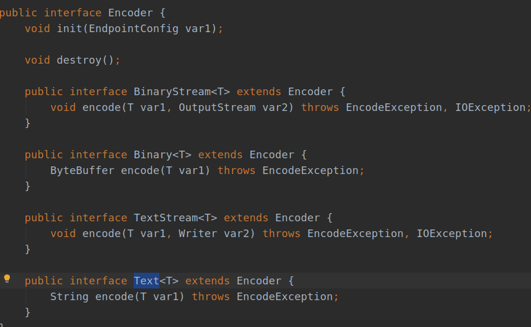

## SpringBoot集成WebSocket实战一


## 1.什么是WebSocket

什么是websocket,百度百科的解释是：＂websocket是一种在单个TCP连接上进行全双工通讯的协议，websocket使得客户端和服务器之间的数据交换变得更加简单，允许服务端主动向客户端推送数据，在websocket中，浏览器和服务器只需要完成一次握手，两者之间就直接可以创建持久性的连接，并进行双向数据传输．＂

## 2.为什么要使用WebSocket

通常我们开发网站的时候，HTTP协议就差不多多满足需求了，可以发送GET,POST,PUT等请求．但是对于需要实时更新的数据，HTTP协议就有些力不从心了，像下图这样的数据大屏，我们在生活中也经常看到，这里面的没一个模块的数据都需要实时的进行更新，才能起到监控的作用，如果还是使用HTTP协议会怎么做呢．


数据大屏在编辑的时候，每一个模块都是一个可以拖动的组件，针对每一个组件都可以设置它获取数据的方式，可以是静态数据，当然这个不太常用，可以设置为动态获取数据，只需要填写上接口地址，接口方式，设置刷新时间，例如下图每５秒刷新一次．


这样有什么弊端呢？我们知道，每发送一次请求，就要进行一次HTTP的连接和断开，包括三次握手和四次挥手，这样轮询，效率是非常低的，HTTP请求还包含较长的头部，也会非常浪费资源．

使用WebSocket可以使客户端和服务器之间的数据交换变得简单，浏览器和服务器只需要一次握手的动作，就可以形成一条快速的通道，两者之间就直接可以进行数据传输了，WebSocket协议能够节省服务器资源和带宽．

## SpringBoot整合WebSocket

SpringBoot项目，首先在pom文件中加入WebSocket的依赖:

```xml
<dependency>
            <groupId>org.springframework.boot</groupId>
            <artifactId>spring-boot-starter-websocket</artifactId>
            <version>1.3.5.RELEASE</version>
        </dependency>
```

编写配置类：

首先要注入ServerEndpointExporter，这个bean会自动注册使用了@ServerEndpoint注解声明的WebsocketEndpoint。

```java
@Configuration
public class WebsocketAutoConfig {

    @Bean
    public ServerEndpointExporter endpointExporter() {
        return new ServerEndpointExporter();
    }
}
```

WebsocketEndpoint具体的实现类如下：

```java
@Slf4j
@Component
@ServerEndpoint(value = "/websocket/{id}")
public class WebsocketServerEndpoint {
     //在线连接数,应该把它设计成线程安全的
    private static int onlineCount = 0;

    //concurrent包的线程安全Set，用来存放每个客户端对应的MyWebSocket对象。
    //虽然@Component默认是单例模式的，但springboot还是会为每个websocket连接初始化一个bean，所以可以用一个静态set保存起来。
    public static CopyOnWriteArraySet<WebsocketServerEndpoint> websocketServerSet
            = new CopyOnWriteArraySet<>();

    //与某个客户端的连接会话，需要通过它来给客户端发送数据
    private Session session;

    //会话窗口的ID标识
    private String id = "";
    
     /**
     * 链接成功调用的方法
     */
     @OnOpen
    public void onOpen(Session session, @PathParam("id") String id) {
        log.info("onOpen >> 链接成功");
        this.session = session;
        //将当前websocket对象存入到Set集合中
        websocketServerSet.add(this);
        //在线人数+1
        addOnlineCount();
        log.info("有新窗口开始监听：" + id + ", 当前在线人数为：" + getOnlineCount());
        this.id = id;
        try {
            sendMessage("有新窗口开始监听：" + id + ", 当前在线人数为：" + getOnlineCount());
        } catch (Exception e) {
            log.error(e.toString());
        }


    }
     /**
     * 链接关闭调用的方法
     */
    @OnClose
    public void onClose() {
        log.info("onClose >> 链接关闭");
        //移除当前Websocket对象
        websocketServerSet.remove(this);
        //在内线人数-1
        subOnLineCount();
        log.info("链接关闭，当前在线人数：" + getOnlineCount());
    }
     /**
     * 收到客户端消息后调用的方法
     *
     * @param message
     * @param session
     */
    @OnMessage
    public void onMessage(String message, Session session) {
        log.info("接收到窗口：" + id + " 的信息：" + message);

        //发送信息
        for (WebsocketServerEndpoint websocketServerEndpoint : websocketServerSet) {
            try {
                websocketServerEndpoint.sendMessage("接收到窗口：" + id + " 的信息：" + message);
            } catch (Exception e) {
                e.printStackTrace();
            }
        }
    }

    @OnError
    public void onError(Session session, Throwable e) {
        e.printStackTrace();
    }
    /**
     * 推送消息
     *
     * @param message
     */
    private void sendMessage(String message) throws IOException {
        this.session.getBasicRemote().sendText(message);
    }
    
    private void subOnLineCount() {
        WebsocketServerEndpoint.onlineCount--;
    }

    public static synchronized int getOnlineCount() {
        return onlineCount;
    }

    private void addOnlineCount() {
        WebsocketServerEndpoint.onlineCount++;
    }
    
    
}

    
```

前端代码如下：

```html
<!DOCTYPE HTML>
<html>
<head>
    <title>My WebSocket</title>
</head>

<body>
Welcome<br/>
    <input id="text" type="text" />
    <button onclick="send()">Send</button>
    <button onclick="closeWebSocket()">Close</button>
<div id="message">
</div>
</body>

<script type="text/javascript">
    var websocket = null;

    //判断当前浏览器是否支持WebSocket
    if('WebSocket' in window){
        websocket = new WebSocket("ws://localhost:8080/websocket/1");
    }
    else{
        alert('Not support websocket')
    }

    //连接发生错误的回调方法
    websocket.onerror = function(){
        setMessageInnerHTML("error");
    };

    //连接成功建立的回调方法
    websocket.onopen = function(event){
        setMessageInnerHTML("open");
    }

    //接收到消息的回调方法
    websocket.onmessage = function(event){
        setMessageInnerHTML(event.data);
    }

    //连接关闭的回调方法
    websocket.onclose = function(){
        setMessageInnerHTML("close");
    }

    //监听窗口关闭事件，当窗口关闭时，主动去关闭websocket连接，防止连接还没断开就关闭窗口，server端会抛异常。
    window.onbeforeunload = function(){
        websocket.close();
    }

    //将消息显示在网页上
    function setMessageInnerHTML(innerHTML){
        document.getElementById('message').innerHTML += innerHTML + '<br/>';
    }

    //关闭连接
    function closeWebSocket(){
        websocket.close();
    }

    //发送消息
    function send(){
        var message = document.getElementById('text').value;
        websocket.send(message);
    }
</script>
</html>
```

OK，现在服务端和前端已经可以建立WebSocket连接，进行通信了，现在还只是一个简单的Demo,浏览器发送数据给后端，后端＠onMessage注解的方法接受到消息，再给浏览器发送消息，是你来我往的形式．

## 服务器主动推送数据给前端

那么像数据大屏那种如何由后端服务器自动推送数据，而不是你来我往交替发送呢？于是我想到了定时任务，设置时间间隔，比如每五秒发送一次数据给前端，当然，只是发送给那些已经建立好WebSocket连接的前端浏览器．发送数据也可以群发或者根据id单独发送，这里数据大屏就选择群发的形式．

定时任务类：

```java
@Slf4j
@Configuration
@EnableScheduling
public class SendMessageToWeb {
 
    //每10秒发送一次
    @Scheduled(cron = "0/10 * * * * ?")
    public void sendTestMessage() {
        if(WebsocketServerEndpoint.websocketServerSet.size()>0){
            log.info("发送数据");
            try{
                //这里省略获取到需要发送数据data的逻辑  
                WebsocketServerEndpoint.sendMessage(null,data);
            }catch (Exception e){
                log.error(e.toString());
            }
        }
    }
}
```

现在，再打开前端已经可以看到每隔10秒都会接收到服务器推送来的数据了，但是还有一个问题，现在发送的数据是字符串格式的，而我们在前后分离开发时，前端通常希望接收到JSON格式或者是List类型的数据，这要怎么发送呢？

在上面sendMessage方法中，我们是调用了Basic的sendText()方法用来发送文本．

我们看到RemoteEndpoint接口中不止有sendText()方法，还有sendObject()方法，用这个方法就可以发送任何对象了．


于是，我便在WebsocketServerEndpoint类中写了两个方法，如下：

```java
　private void sendObject(Object object) throws IOException, EncodeException {
        this.session.getBasicRemote().sendObject(object);
    }
　*　id为null时是群发
     * @param map
     * @param id
     */
    public static void sendData(String id, Object map) {
        for (WebsocketServerEndpoint endpoint : websocketServerSet) {
            try {
                if (id == null) {
                    endpoint.sendObject(map);
                } else if (endpoint.id.equals(id)) {
                    endpoint.sendObject(map);
                }
            } catch (Exception e) {
                e.printStackTrace();
                continue;
            }
        }
    }
```

##　WebSocket发送Object类型的数据

然后我在定时任务代码中调用sendData()方法，发送我从数据库获取到的数据（因为数据大屏前端需要展示很多数据，所以我将每一种数据封装成Map格式，然后再将所有的Map封装到一个List中，就是List<Map<Object,Object>>）格式的．然而，发送的时候却出现了错误，报错信息如下：

```verilog
javax.websocket.EncodeException: No encoder specified for object of class [class java.util.ArrayList]
	at org.apache.tomcat.websocket.WsRemoteEndpointImplBase.sendObject(WsRemoteEndpointImplBase.java:604)
	at org.apache.tomcat.websocket.WsRemoteEndpointBasic.sendObject(WsRemoteEndpointBasic.java:74)
	at com.software.nju.WebSocket.WebsocketServerEndpoint.sendObject(WebsocketServerEndpoint.java:131)
	at com.software.nju.WebSocket.WebsocketServerEndpoint.sendData(WebsocketServerEndpoint.java:170)
	at com.software.nju.Service.SendMessageSercice.sendDataToWeb(SendMessageSercice.java:48)
	at com.software.nju.WebSocket.WebsocketServerEndpoint.onOpen(WebsocketServerEndpoint.java:71)
```

错误信息也很明显，是没有ArrayList类型的编码器，需要自己实现一个编码器并使用，

所以新建一个ServerEncoder类，实现Encoder.Text



我们需要实现的解码器类型是List的，所以将泛型T换成List，实现encode方法时将List先转换成JSON格式，然后再转换成String类型，代码如下：

```java
import com.alibaba.fastjson.JSON;
import javax.websocket.EncodeException;
import javax.websocket.Encoder;
import javax.websocket.EndpointConfig;
import java.util.List;

/**
 * 配置WebSocket编码器，用于发送请求的时候可以发送Object对象，实则是json数据
 * sendObject()
 * @ClassNmae：ServerEncoder
 *
 */
public class ServerEncoder implements Encoder.Text<List> {

    @Override
    public void destroy() {
        // TODO Auto-generated method stub

    }

    @Override
    public void init(EndpointConfig arg0) {
        // TODO Auto-generated method stub

    }

    @Override
    public String encode(List list) throws EncodeException {
        try {
            return JSON.toJSON(list).toString();
        } catch (Exception e) {
            // TODO Auto-generated catch block
            e.printStackTrace();
            return "";
        }
    }

}

```

然后修改WebsocketServerEndpoint类的注解＠ServerEndpoint中指定使用的编码器

```java
@ServerEndpoint(value = "/websocket/{id}",encoders = {ServerEncoder.class})
public class WebsocketServerEndpoint {
    ｝
```

然后前端接收到数据之后需要进行JSON解析，再从List中分离出不同的数据赋值给不同的变量，这里根据自己的业务需求实现．

```js
 //接收到消息的回调方法
    websocket.onmessage = function(event){
        console.log(JSON.parse(event.data))
    ｝
```


至此，使用SpringBoot整合WebSocket推送数据就已经基本实现了．