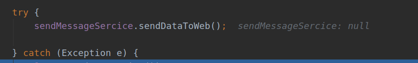

# SpringBoot集成WebSocket实战二：解决＠Autowired为null

在上一篇中已经实现了服务端每隔几秒就会主动推送实时数据给前端的功能，但是现在又有一个问题出现了，由于使用了定时任务，定义了每10秒推送一次，那么也就是说，用户在刚打开网页的时候，会出现0-10秒的等待，才能够获取到数据，例如上一次推送数据刚刚结束，又有一个新的用户打开的网页建立了websocket连接，他的前端页面是没有数据的，需要等到下一次推送才会得到数据，这显然是不合理的，用户体验也会下降．

解决这个问题也很简单，不就是一建立链接就给他推送数据吗，直接在有@OnOpen注解的方法中调用一下发送数据的函数不就可以了吗，这样只要一建立链接，立马就能获取到数据，之后的数据还是通过定时任务推送的．

OK,于是我便在OnOpen方法中调用发送数据的方法，由于我们的数据都是从数据库中获取的，必然要用到很多个service层的类，于是便将发送数据的方法封装到一个类中，如下：

```java
@Service
public class SendMessageSercice {
    @Autowired
    XXXService xxxService;
    @Autowired
    XXXService xxxService;
    public void sendDataToWeb(String id) throws SQLException {
       
        　List<Object> list = new ArrayList<>();
            list.add(o);
        }
        WebsocketServerEndpoint.sendData(id,list);
    }
}
```

也定义一个Service层的类，自动注入很多个service,用来获取各种数据，然后再将这些数据封装到一个list中，直接发送就可以了,id是用来判断给哪个用户发．

所以我们在WebsocketServerEndpoint类中注入SendMessageSercice，在onOpen方法中在调用sendDataToWeb()方法就好了．

```java
@Autowired
 SendMessageSercice sendMessageSercice;
@OnOpen
    public void onOpen(Session session, @PathParam("id") String id) {
        log.info("onOpen >> 链接成功");
        this.session = session;
        //将当前websocket对象存入到Set集合中
        websocketServerSet.add(this);
        //在线人数+1
        addOnlineCount();
        log.info("有新窗口开始监听：" + id + ", 当前在线人数为：" + getOnlineCount());
        try {
//            sendMessage("有新窗口开始监听：" + id + ", 当前在线人数为：" + getOnlineCount());
            sendMessageSercice.sendDataToWeb(id);

        } catch (Exception e) {
            log.error(e.toString());
        }
    }
```

正当我信息满满的启动程序，打开前端，可是一片空白，并没有获取到数据，一看后端，居然报了空指针的异常错误，纳尼，这是怎么回事，于是我debug了一下，发现sendMessageSercice居然是空的



这是怎么回事，不是已经使用@Autowired注入进来了吗，而且SendMessageSercice上也加了@Service注解，在启动的时候应该已经生成了bean放入了IOC容器中了才对，这里怎么会是空的呢？

我还特意通过ApplicationContext的getBeanDefinitionNames获取到所有注册的bean的名字，在里面明明是有SendMessageSercice实例的，而且也有WebsocketServerEndpoint的实例，那会是什么原因导致注入失败呢

原来WebSocket是多实例的，也就是说每来一个建立连接的请求，都会创建一个新的bean,而在Spring中，如果没有特别声明，创建的都是单例的bean.在程序启动，创建IOC容器的时候会对每一个bean完成初始化，包括属性赋值和依赖注入，也就是说第一个WebsocketServerEndpoint实例中是已经注入了SendMessageSercice实例的，但是之后新建立连接时创建的WebsocketServerEndpoint对象，是没有任何bean注入操作的．

既然如此，那我们想办法在新建的WebsocketServerEndpoint对象中获取到SendMessageSercice的单例bean不就可以了吗，而bean是可以通过上下文ApplicationContext获取的，于是我们可以在WebsocketServerEndpoint中维护一个static的ApplicationContext，然后再从中根据更加class来getBean；

WebsocketServerEndpoint类增加下面几行代码：

```java
private static ApplicationContext applicationContext;
private  SendMessageSercice sendMessageSercice;

public static void setApplicationContext(ApplicationContext applicationContext){
        WebsocketServerEndpoint.applicationContext = applicationContext;
    }
 @OnOpen
    public void onOpen(Session session, @PathParam("id") String id) {
        sendMessageSercice = applicationContext.getBean(SendMessageSercice.class);
        ．．．．．．
    ｝
```

然后需要在启动类中获取到ApplicationContext并调用setApplicationContext方法，启动类修改如下：

```java
@SpringBootApplication
public class DataScreenApplication {

    public static void main(String[] args) {
        ConfigurableApplicationContext applicationContext = SpringApplication.run(DataScreenApplication.class,args);
        WebsocketServerEndpoint.setApplicationContext(applicationContext);
    }
}
```

现在就可以正常的使用SendMessageSercice的实例了，哈哈．．．．

等等，既然可以在WebsocketServerEndpoint中持有一个静态的ApplicationContext，然后通过它来获取IOC容器中的单例bean，那我为什么不直接持有一个静态的SendMessageSercice单例bean呢，直接在程序启动的时候创建第一个WebsocketServerEndpoint实例的时候就注入SendMessageSercice的实例，并将该实例由一个静态变量引用．

WebsocketServerEndpoint类修改代码如下：

```java
private static SendMessageSercice sendMessageSercice;
 @Autowired
public void setSendMessageSercice(SendMessageSercice sendMessageSercice){
    this.sendMessageSercice = sendMessageSercice;
}
@OnOpen
public void onOpen(Session session, @PathParam("id") String id) {
    ．．．
    try {
        sendMessageSercice.sendDataToWeb();

    } catch (Exception e) {
        e.printStackTrace();
    }
}
```

果然可行，这样WebSocket就可以通过这种方法注入各种bean完成业务处理了．


